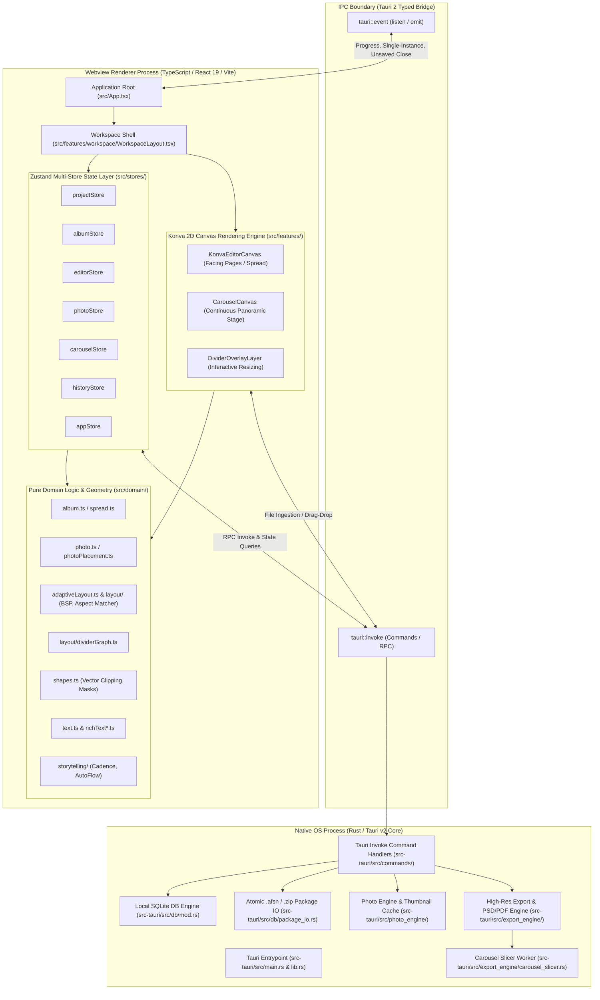
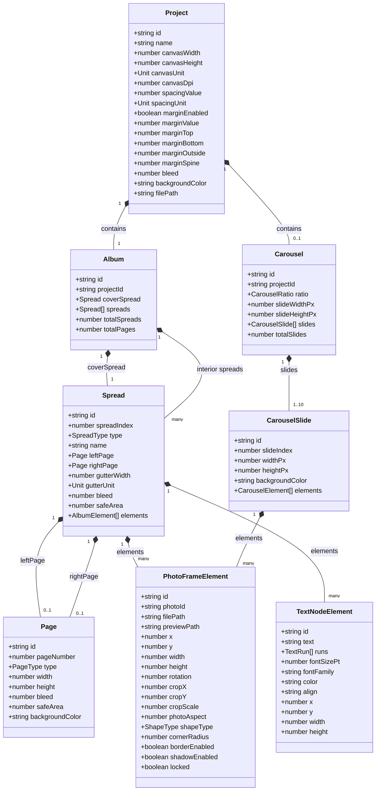
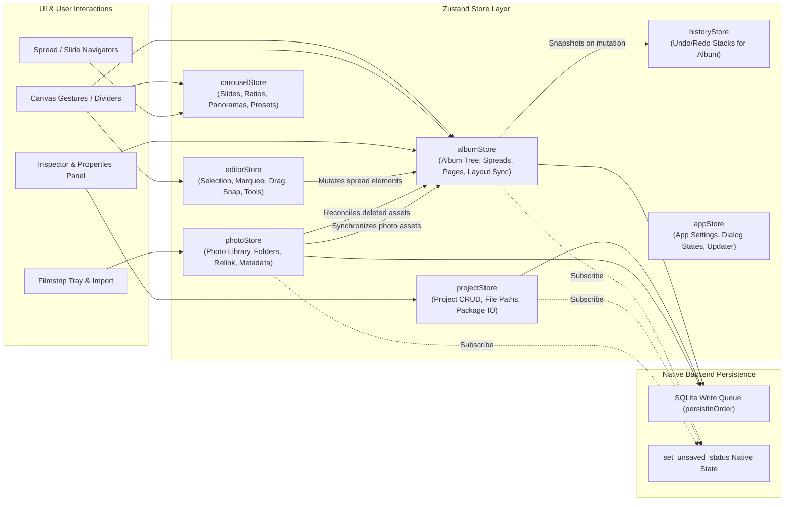
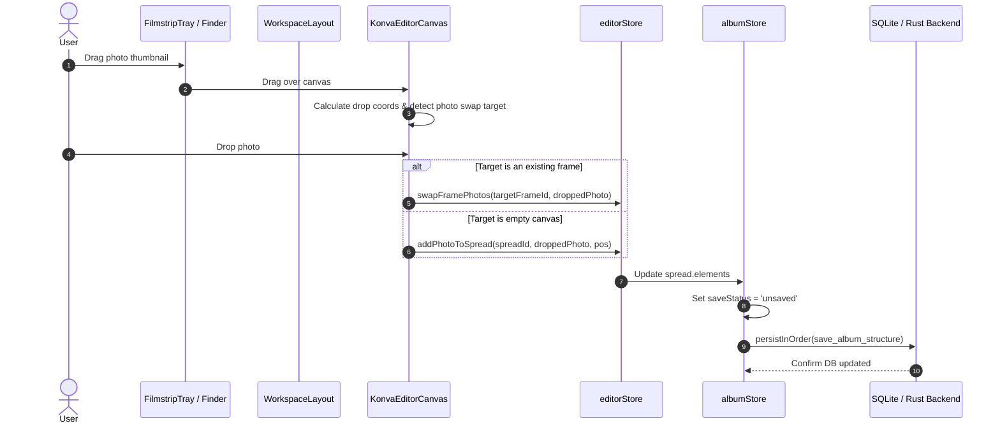
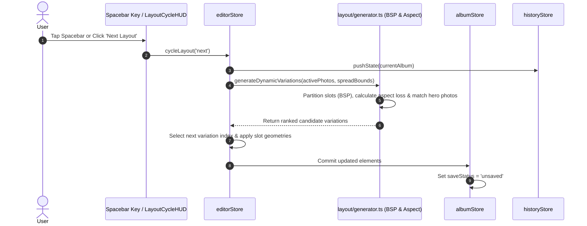

# System Architecture — OpenSmartAlbum (afsn)

**Analysis Date:** 2026-09-28  
**Repository:** `ryandxter/OpenSmartAlbum-MacOS`  
**Application Target:** Native macOS & Windows Professional Photo Album & Social Carousel Designer

---

## 1. High-Level Architectural Pattern

OpenSmartAlbum employs a **Tauri v2 Dual-Process Architecture** combining a high-performance native Rust core with a modern, responsive React 19 UI and an HTML5 2D Canvas rendering engine (powered by Konva / React-Konva).

### Process Isolation & Responsibilities

1. **Frontend (Webview Renderer Process):**
   - Written in TypeScript, React 19, and Vite.
   - Operates strictly in the webview sandbox without direct POSIX / Win32 disk or thread execution.
   - Manages interactive user gestures (marquee selection, multi-touch pinch zoom, smooth panning, divider boundary dragging, inline rich-text editing).
   - Coordinates global application state across segregated **Zustand** stores.
   - Executes fast layout math, bipartite photo-to-slot matching, and geometry calculations using pure, zero-dependency domain algorithms.

2. **Native Core (Rust / Tauri 2 Process):**
   - Compiled to native machine code (`afsn_smart_album_lib`).
   - Manages SQLite schema migrations (v1 through v14) and relational data persistence (`afsn_smart_album.db`).
   - Owns CPU-intensive image pipeline tasks: decoding large RAW and high-resolution JPEG/PNG/TIFF files, calculating perceptual downsamples, generating JPEG/WebP thumbnail caches on disk.
   - Performs production-grade print export: assembling full-spread 300 DPI bitmaps, color compositing, multi-layer PSD generation, font rasterization, and lossless PDF document creation.
   - Executes continuous Instagram carousel slicing into individual slide JPEGs and optional full-width panoramic canvases.
   - Handles macOS-specific integrations: Finder file associations (`.afsn`), single-instance triggers, system color sampling, system font enumeration, and native window close interception when unsaved changes exist.

3. **IPC Bridge:**
   - Asynchronous, typed JSON message passing using Tauri's `invoke()` API.
   - Two-way streaming via Tauri `emit` / `listen` for background task progress updates (photo import batches, thumbnail generation, zip package export, and print rendering progress).

---

## 2. Domain Models (`src/domain/`)

The `src/domain/` directory contains strictly typed, pure TypeScript models and pure business logic with zero framework dependencies.

### Key Domain Modules

| Domain File | Core Entities & Purpose |
|---|---|
| `album.ts` | Defines `Album`, `Spread`, `Page`, `AlbumElement`. Manages spread indexing (Index 0 = Cover Spread, Index 1..N = Interior Facing Spreads). Houses `mergeFramePhotoAsset`, `syncAlbumPhotoAssets`, and equality checkers. |
| `photo.ts` | Represents physical photo assets (`Photo`), metadata (dimensions, orientation, file size, thumbnail/preview paths), collections (`PhotoFolder`), and library filtering (`PhotoFilter`: `all`, `unused`, `used`, `favorites`). |
| `shapes.ts` | Defines `ShapeType` (`rectangle`, `rounded`, `circle`, `oval`, `hexagon`, `octagon`, `star`, `scallop`, `heart`, `custom_svg`). Generates centered SVG clipping paths used by Konva and Rust rasterizers. |
| `carousel.ts` | Implements pixel-based digital multi-slide structure for social media formats (`1:1` 1080x1080, `4:5` 1080x1350, `9:16` 1080x1920). Handles continuous multi-slide coordinate space. |
| `carouselLayout.ts` | Template layouts tailored for carousels (single-slide hero, framed hero, 2-photo split, 3-photo grid, and cross-slide 2-to-3 slide panoramic spans). |
| `adaptiveLayout.ts` | Algorithmic partitioning of page bounding boxes into $K$ rectangular slots. Classifies photo orientations (`landscape`, `portrait`, `square`), calculates crop loss penalties, and performs bipartite mapping. |
| `layout/generator.ts` | Generative layout engine synthesizing valid non-overlapping partitions for $N$ photos ($N \in [1..15]$). Evaluates candidate slot sets using BSP and aspect matching. |
| `layout/dividerGraph.ts` | Geometric analysis graph. Discovers shared vertical and horizontal borders between adjacent photo frames, groups collinear segments into continuous through-lines, and calculates closed-form min/max dragging bounds. |
| `layout/bspEngine.ts` | Recursive Binary Space Partitioning (BSP) tree generator creating balanced and asymmetric rectangular layouts. |
| `layout/aspectMatcher.ts` | Cost-weighted bipartite matching minimizing aspect mismatch and protecting hero photos. |
| `text.ts` & `richText*.ts` | Text node models, rich text styled runs, line-breaking engine, physical-point-to-pixel sizing, and Canvas 2D text measurement. |
| `storytelling/` | Automated photo sequencing: EXIF temporal clustering (`temporalClusterer.ts`), spread rhythm and pacing (`cadenceEngine.ts`), and auto-flow assignment (`autoFlowEngine.ts`). |

---

## 3. State Management Architecture (`src/stores/`)

The application state is partitioned into specialized **Zustand** stores. Stores communicate through targeted imports, direct state subscriptions, and coordinated persistence triggers.

### Store Breakdown

1. **`projectStore.ts`**
   - **Scope:** Active project metadata (dimensions, units, DPI, margins, spacing, bleed cut, background color, destination file path).
   - **Persistence Operations:** `createNewProject`, `openProjectById`, `openProjectFromFile`, `saveProject`, `exportProjectAsAfsn`, `exportCompleteProjectPackageWithPhotos`, `importProjectFromAfsn`.
   - **Recent Projects:** Tracks and stores recent project history in SQLite.

2. **`albumStore.ts`**
   - **Scope:** Complete album tree (`Album`, `Spread[]`), spread selection, active spread pointer, visual guide toggles (bleed, margin, gutter), and persistence status (`'saved' | 'saving' | 'unsaved'`).
   - **Layout Actions:** Spread reordering, deletion, addition, duplication, and dynamic gap/margin refitting.
   - **Sequential Mutex (`persistInOrder`):** Ensures that rapid UI updates to the SQLite database execute sequentially in strict order without concurrency deadlocks or race conditions.

3. **`editorStore.ts`**
   - **Scope:** Interactive canvas manipulation state: active frame selections (`selectedFrameIds`), multi-frame transformation bounds, crop editing target (`editingCropFrameId`), inline text editing target (`editingTextElementId`), active alignment snap lines (`activeSnapLines`), and inter-element gap guides (`activeGapGuides`).
   - **Canvas Tools:** Multi-frame alignment (left, center, right, top, middle, bottom), spacing distribution, fixed-gap resizing, frame locking, and layout cycling (`cycleLayout`).

4. **`photoStore.ts`**
   - **Scope:** Project photo catalog, folder hierarchy (`PhotoFolder[]`), membership mapping, active filter criteria, thumbnail paths, missing asset detection, and background import progress (`ImportProgress`, `ImportNotice`).
   - **Safety Reconciler:** When a photo is removed or purged from the library, `reconcileRemovedPhotos` safely detaches references from active spreads, undo history stacks, and clipboard buffers to prevent broken references.

5. **`carouselStore.ts`**
   - **Scope:** Independent social carousel editor state: slides array, aspect ratio switcher (`1:1`, `4:5`, `9:16`), slide reordering, multi-slide panorama element spanning (2 or 3 slides), dynamic carousel layout variation cycling, and per-slide undo/redo stack.

6. **`historyStore.ts`**
   - **Scope:** Deep-cloned, immutable snapshot undo/redo manager for the Print Album (up to 50 historical states).
   - **Deduplication:** Prevents duplicate snapshots when identical operations occur back-to-back.

7. **`appStore.ts`**
   - **Scope:** Application-wide UI preferences (dark mode, startup behavior, automatic update checks), modal visibilities (Settings, About, New Project, Update, Exit Warning), and background updater state.

---

## 4. Layout & Rendering Pipeline

OpenSmartAlbum supports two distinct rendering pipelines: **Print Spread Mode** (physical units, facing pages, gutter/spine) and **Social Carousel Mode** (pixel units, continuous horizontal stage, slide slicing).

```mermaid
graph TD
    subgraph Print_Spread_Pipeline ["Print Spread Rendering Pipeline (KonvaEditorCanvas.tsx)"]
        PHYS_DIMS["Physical Spread Dimensions (mm / cm / inch)"]
        DPI_CALC["Scale Factor Calculation (DPI & Zoom Matrix)"]
        STAGE_PRINT["Konva Stage (Viewport-Centered Pasteboard)"]

        subgraph Layers_Print ["Konva Canvas Layers"]
            L1_BG["Layer 1: Background Sheet<br/>• Drop Shadow Board<br/>• Left Page Sheet<br/>• Center Gutter Spine<br/>• Right Page Sheet"]
            L2_ELEM["Layer 2: Content & Interactive Elements<br/>• Photo Frames (Clipping Mask, Border, Shadow, Crop)<br/>• Text Nodes (Rich Text Canvas 2D)<br/>• Multi-Selection Group & Transformer<br/>• Alignment Snap Lines & Gap Guides<br/>• Marquee Selection Rect"]
            L3_DIV["Layer 2 Overlay: DividerOverlayLayer<br/>• Collinear Shared Divider Lines<br/>• Invisible Hit Boxes (18px)<br/>• Closed-Form Clamped Drag Bounds"]
        end

        PHYS_DIMS --> DPI_CALC --> STAGE_PRINT
        STAGE_PRINT --> L1_BG
        STAGE_PRINT --> L2_ELEM
        L2_ELEM --> L3_DIV
    end

    subgraph Carousel_Pipeline ["Social Carousel Pipeline (CarouselCanvas.tsx)"]
        CAROUSEL_SPECS["Continuous Dimensions: (N * slideWidthPx) x slideHeightPx"]
        ZOOM_MATRIX["Zoom & Pan Viewport Matrix"]
        STAGE_CAROUSEL["Konva Stage (Continuous Horizontal Stage)"]

        subgraph Layers_Carousel ["Konva Carousel Layers"]
            CL1_BG["Layer 1: Continuous Background Slides"]
            CL2_ELEM["Layer 2: Photo Frames & Panorama Spans"]
            CL3_GUIDES["Layer 3: Instagram Slide Slice Cut Guides"]
            CL4_DIV["Layer 2 Overlay: DividerOverlayLayer (Px Units)"]
        end

        CAROUSEL_SPECS --> ZOOM_MATRIX --> STAGE_CAROUSEL
        STAGE_CAROUSEL --> CL1_BG
        STAGE_CAROUSEL --> CL2_ELEM
        STAGE_CAROUSEL --> CL3_GUIDES
        CL2_ELEM --> CL4_DIV
    end
```

### 1. Print Spread vs. Social Carousel

- **Print Spread:**
  - Coordinates are anchored to physical album dimensions (millimeters or inches).
  - Converted dynamically to screen pixels using `scaleFactor = (dpi / 25.4) * (zoomLevel / 100)`.
  - Implements facing pages separated by an optional physical gutter / spine width.
  - Accommodates print bleed lines, trim boundaries, and safety margin zones.
- **Social Carousel:**
  - Coordinates are fixed in digital device pixels ($1080 \times 1080$, $1080 \times 1350$, or $1080 \times 1920$).
  - Slides ($1$ to $10$) are aligned sequentially on a single **continuous horizontal stage** at `x = slideIndex * slideWidthPx`.
  - Elements can freely cross slide dividing lines to create continuous panoramic experiences across multiple swipeable slides.

### 2. Continuous Stage, Zoom & Pan

- **Pasteboard Coordinate System:** The Stage container calculates outer pasteboard margins around the working document, centering the spread or carousel canvas inside the active window.
- **Pan & Zoom Interaction:**
  - Mouse wheel with pinch gesture or `Alt`/`Ctrl` updates `zoomLevel` smoothly between 5% and 500% with focal point zooming centered under the cursor.
  - Middle-click drag, two-finger swipe, or Spacebar drag navigates the pasteboard.
  - **Spacebar Disambiguation State Machine:** A dedicated state machine disambiguates a quick spacebar tap (duration $< 600\text{ms}$ without mouse translation $\rightarrow$ triggers **Cycle Layout**) from a held spacebar pan gesture (activates pan hand cursor and stage dragging).

### 3. Interactive Divider Dragging Subsystem

- **Adjacency Discovery:** `extractCanvasDividers()` analyzes all frame coordinates, locating adjacent frames separated by a gap $\le 30\text{mm}$ with orthogonal overlap $\ge 2\text{mm}$.
- **Collinear Merging:** Adjacent contact segments that lie along the same line are merged into single continuous through-dividers.
- **Closed-Form Clamping Bounds:** Evaluates minimum frame dimensions (e.g. $25.4\text{mm}$ for print, $120\text{px}$ for carousel) and split ratios ($0.15$ to $0.85$) across all attached frames on both sides of the divider. This yields closed-form `[minCoord, maxCoord]` limits that guarantee frames never invert, collapse below minimum size, or overlap during dragging.
- **Overlay Execution:** `DividerOverlayLayer.tsx` renders an invisible 18px hit target over each divider. Konva's `dragBoundFunc` restricts movement to the single valid axis within the precalculated clamp limits, updating connected frames in real time and committing the change to the store upon mouse release.

---

## 5. Data Flow & Persistence Lifecycles

### 1. Photo Placement Flow

### 2. Layout Cycling Flow

### 3. File Persistence & Project Bundling Architecture

- **Dual-Tier Storage Strategy:**
  1. **Working State (SQLite):** Real-time transactional persistence during editing. Changes to albums, photos, folders, and settings write sequentially via `persistInOrder` into `afsn_smart_album.db`.
  2. **Interchange File (`.afsn`):** Standard standalone document format. Written using atomic file replacement (`.afsn-uuid.tmp` $\rightarrow$ destination file) to eliminate file corruption risks. Encodes project metadata, canvas dimensions, safe margins, and all spreads/elements in clean, portable JSON.
  3. **Transport Package (`.zip`):** Bundled transport format containing `project.afsn` alongside an embedded `photos/` folder containing original high-resolution assets, allowing complete project migration between different computers.
- **Native Close Guard:** When `saveStatus === 'unsaved'`, the frontend registers dirty state with Rust via `invoke('set_unsaved_status', { unsaved: true })`. If the user attempts to close the window, Rust intercepts the OS `CloseRequested` event, cancels close, and emits `request-close-warning` to prompt the user to save.
