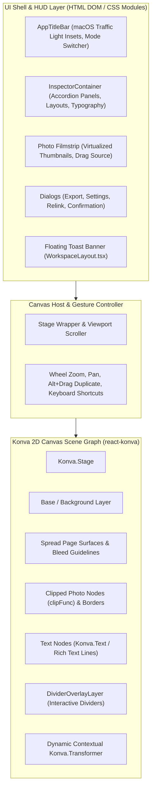

# Codebase Conventions & Quality Standards — OpenSmartAlbum (afsn)

**Analysis Date:** 2026-09-28  
**Repository:** `ryandxter/OpenSmartAlbum-MacOS`  
**Application Scope:** macOS & Windows Desktop Tauri v2 Application (React 19, TypeScript 5, Konva 9, Rust 1.80+)

---

## 1. Code Style & TypeScript Guidelines

OpenSmartAlbum adheres to strict TypeScript standards ensuring cross-platform predictability, structural immutability, and zero-defect canvas rendering.

### 1.1 Compiler Configuration (`tsconfig.json`)

The TypeScript compiler configuration enforces strict type safety, prevents dead code leakage, and requires explicit handling of optional indexing:

| Compiler Option | Setting | Rationale & Code Impact |
|---|---|---|
| `strict` | `true` | Enforces `strictNullChecks`, `noImplicitAny`, and `strictBindCallApply`. |
| `noUncheckedIndexedAccess` | `true` | Array indexing (`arr[i]`) and dictionary lookups produce `T | undefined`. Requires guard checks (`if (!item) return;`) or verified non-null assertions (`arr[i]!`) in domain algorithms. |
| `noUnusedLocals` | `true` | Disallows lingering unused variables; preserves clean ASTs. |
| `noUnusedParameters` | `true` | Function arguments must be used or prefixed with `_` if part of a required signature interface. |
| `noFallthroughCasesInSwitch` | `true` | Guarantees all `switch (action.type)` branches return or break explicitly. |
| `moduleResolution` | `"bundler"` | Vite 6 modern bundler resolution with direct ES module resolution. |
| `paths` | `{"@/*": ["src/*"]}` | Standard path alias for clean root imports across features. |

### 1.2 Typing Standards & Domain Models

- **Discriminated Unions for Domain Variants:**
  Elements on spreads and slides use discriminated unions on the `type` or `shapeType` property:
  ```typescript
  // Photo Frame vs Text Element discrimination
  export type ElementType = 'photo' | 'text';
  export type ShapeType =
    | 'rectangle'
    | 'rounded'
    | 'circle'
    | 'oval'
    | 'hexagon'
    | 'octagon'
    | 'star'
    | 'scallop'
    | 'heart'
    | 'custom_svg';
  export type CarouselRatio = '1:1' | '4:5' | '9:16';
  ```
- **Coordinate Space Typing:**
  Keep units strictly typed: `Unit = 'mm' | 'cm' | 'inch' | 'px'`. Calculations between screen canvas pixels and physical export dimensions always pass through explicit converters (`convertUnit(value, from, to)` or `physicalToScreen(mm, scaleFactor)`).
- **Prohibition of `any`:**
  Avoid `any` except when bridging third-party dynamically attached objects (e.g., exposing `window.__STORES__` in `src/main.tsx` for Playwright testing). Everywhere else, use `unknown` with type narrowing or generic parameterization.

### 1.3 File & Directory Naming Conventions

- **React Components:** PascalCase (`KonvaEditorCanvas.tsx`, `DividerOverlayLayer.tsx`, `InspectorContainer.tsx`).
- **Component Styles:** Component-scoped CSS modules (`[ComponentName].module.css`).
- **Zustand Stores:** camelCase with `Store` suffix (`albumStore.ts`, `editorStore.ts`, `carouselStore.ts`, `photoStore.ts`, `projectStore.ts`).
- **Domain Modules:** camelCase (`adaptiveLayout.ts`, `dividerGraph.ts`, `vectorShapes.ts`, `textRasterizer.ts`).
- **Test Files:** Co-located in `__tests__/` with `*.test.ts` naming, executed via `tsx` or Vitest.
- **Automation / E2E Scripts:** kebab-case or snake_case in `scripts/` (`e2e-headless-suite.ts`, `verify_e2e_layouting.ts`).

---

## 2. React Functional Component Patterns

The UI is built with React 19 functional components utilizing strict hook patterns to maintain clean boundaries between UI shells and the high-performance canvas engine.

### 2.1 Hook Lifecycle & Performance Directives

- **`useLayoutEffect` for Pre-Paint Synchronization:**
  Used when DOM or canvas elements must be measured or synchronized *before* the browser paints to prevent visual popping or coordinate jitter:
  1. Detaching the Konva `Transformer` instantly before entering text inline editing or photo crop mode (`KonvaEditorCanvas.tsx:1740-1747`).
  2. Synchronizing pasteboard scroll coordinates when zooming or fitting to screen (`KonvaEditorCanvas.tsx:1750-1760`).
- **`useEffect` with Precise Dependency Arrays:**
  Avoid missing dependency warnings. Extract store state using selectors (`useAlbumStore((s) => s.activeSpreadId)`) to avoid re-rendering entire layout trees when unrelated slice attributes change.
- **`useMemo` & `useCallback` for Canvas Node Geometry:**
  Canvas node mapping functions are memoized to avoid re-generating Konva node trees when dragging or panning across the pasteboard:
  ```typescript
  const selectedElements = useMemo(() => {
    if (!activeSpread) return [];
    return activeSpread.elements.filter((el) => selectedFrameIds.includes(el.id));
  }, [activeSpread, selectedFrameIds]);
  ```

### 2.2 UI Shell vs. Canvas Separation



### 2.3 Keyboard & Shortcut Architecture

All workspace shortcuts are centralized in `src/features/workspace/WorkspaceLayout.tsx`:

- Platform detection via `isMac()` (`navigator.userAgent.includes('Mac')`).
- Unified modifier checking: `const cmdOrCtrl = isMac() ? e.metaKey : e.ctrlKey`.
- Form field isolation: Check `e.target instanceof HTMLInputElement || e.target instanceof HTMLTextAreaElement` to prevent capturing typing in text boxes as shortcuts.
- Explicit cancellation (`e.preventDefault()`, `e.stopPropagation()`) for reserved editor combinations:
  - `Cmd+Z` / `Cmd+Shift+Z`: Undo / Redo
  - `Cmd+S` / `Cmd+Shift+S`: Save / Save As
  - `Cmd+L` / `Cmd+Shift+L` / `Alt+L`: Lock / Unlock Elements
  - `Cmd+A`: Select All Elements on Active Spread or Slide
  - `Delete` / `Backspace`: Remove selected frames (prompting or preserving photos in photo bin)
  - `Space + Drag`: Pan Pasteboard Canvas

---

## 3. Zustand Store Architecture & Mutation Conventions

OpenSmartAlbum employs 7 focused Zustand stores in `src/stores/`. State mutation follows strict transaction and immutability invariants.

### 3.1 Store Division of Concerns

| Store | File | Core Responsibilities |
|---|---|---|
| `albumStore` | `src/stores/albumStore.ts` | Multi-spread document model, facing pages, physical dimensions, safe areas, layout generation, swap & rearrange. |
| `editorStore` | `src/stores/editorStore.ts` | Active tool, zoom level, multi-selection set (`selectedFrameIds`), crop editing state, text inline editing state. |
| `carouselStore` | `src/stores/carouselStore.ts` | Social media slides, continuous panoramas, aspect ratio switching (`1:1`, `4:5`, `9:16`), slide cycling. |
| `photoStore` | `src/stores/photoStore.ts` | Imported photo records, orientation, thumbnails, used counters, missing asset detection, relinking. |
| `projectStore` | `src/stores/projectStore.ts` | Project metadata, file path, database persistence, package import/export coordination. |
| `historyStore` | `src/stores/historyStore.ts` | Global undo/redo history stacks (`past`, `future`), deep clone snapshotting, stack depth limiting. |
| `appStore` | `src/stores/appStore.ts` | Global application preferences, dark theme settings, system font discovery cache. |

### 3.2 The Fundamental Rule: `pushState` / `pushHistory` Before Mutation

Every user action that alters the spread geometry, element positions, borders, text, or shapes **must** register a snapshot in history *prior* to mutating the current state:

```typescript
// Pattern in albumStore.ts and editorStore.ts
updateFrameGeometry: (spreadId, frameId, updates) => {
  const currentAlbum = get().currentAlbum;
  if (!currentAlbum) return;

  // 1. Snapshot prior state BEFORE mutation
  useHistoryStore.getState().pushState(currentAlbum);

  // 2. Perform immutable state update
  set((state) => ({
    currentAlbum: {
      ...state.currentAlbum!,
      spreads: state.currentAlbum!.spreads.map((spread) =>
        spread.id === spreadId
          ? {
              ...spread,
              elements: spread.elements.map((el) =>
                el.id === frameId ? { ...el, ...updates } : el
              ),
            }
          : spread
      ),
    },
  }));
}
```

In `carouselStore.ts`, the store encapsulates its own undo/redo stacks:

```typescript
pushHistory: () => {
  const { currentCarousel, past } = get();
  if (!currentCarousel) return;
  const snapshot: Carousel = JSON.parse(JSON.stringify(currentCarousel));
  const last = past[past.length - 1];
  // Deduplicate consecutive identical states
  if (last && JSON.stringify(last) === JSON.stringify(snapshot)) return;
  
  const newPast = [...past, snapshot];
  if (newPast.length > 50) newPast.shift(); // Max 50 history steps
  
  set({
    past: newPast,
    future: [], // Clear redo stack on new action
    canUndo: true,
    canRedo: false,
  });
}
```

### 3.3 Snapshot Isolation via Deep Cloning

JavaScript object references must never leak into history entries.

- Snapshots are created with `JSON.parse(JSON.stringify(targetObject))`.
- When `undo()` or `redo()` yields a state, the returned object is also cloned to ensure that subsequent direct manipulations cannot mutate historic frames.

### 3.4 Continuous Input Debouncing (Sliders & Scrubbing)

High-frequency continuous inputs (such as dragging the spread spacing slider, margin scrubbers, or safe area margins) must **not** push a history state on every mouse movement tick.
Instead:

1. Capture the initial state before dragging begins: `initialAlbumBeforeSpacingChange`.
2. Push the history state only once, or debounce the history push:
   ```typescript
   // Debounced history push in albumStore.ts:1219-1230
   if (spacingDebounceTimer) clearTimeout(spacingDebounceTimer);
   spacingDebounceTimer = setTimeout(() => {
     useHistoryStore.getState().pushState(initialAlbumBeforeSpacingChange);
   }, 300);
   ```
3. This guarantees continuous 60fps canvas re-rendering while preserving a clean, single-step `Cmd+Z` reversal.

---

## 4. Konva Rendering & Canvas 2D Conventions

OpenSmartAlbum renders high-resolution album spreads and continuous social carousels using Konva / React-Konva. Strict performance and clipping invariants must be maintained.

### 4.1 Clipping Mask Pattern (`clipFunc`)

The `clipFunc` callback provides direct access to the underlying `CanvasRenderingContext2D`:

```tsx
<Group
  clipFunc={(ctx) => {
    if (frame.shapeType && frame.shapeType !== 'rectangle') {
      // Delegate to pure shape path tracer
      drawShapeToContext(ctx, frame.shapeType, pixelW, pixelH, cornerRadiiArray, frame.customSvgPath);
    } else if (hasRounding && typeof ctx.roundRect === 'function') {
      ctx.beginPath();
      ctx.roundRect(0, 0, pixelW, pixelH, cornerRadiiArray);
    } else if (hasRounding) {
      // Manual arcTo fallback for legacy environments
      ctx.beginPath();
      ctx.moveTo(tlPx, 0);
      ctx.lineTo(pixelW - trPx, 0);
      ctx.arcTo(pixelW, 0, pixelW, trPx, trPx);
      ctx.lineTo(pixelW, pixelH - brPx);
      ctx.arcTo(pixelW, pixelH, pixelW - brPx, pixelH, brPx);
      ctx.lineTo(blPx, pixelH);
      ctx.arcTo(0, pixelH, 0, pixelH - blPx, blPx);
      ctx.lineTo(0, tlPx);
      ctx.arcTo(0, 0, tlPx, 0, tlPx);
      ctx.closePath();
    } else {
      ctx.rect(0, 0, pixelW, pixelH);
    }
  }}
>
  <Rect width={pixelW} height={pixelH} fill="#ffffff" />
  <KonvaImage image={loadedImage} ... />
</Group>
```

#### The Zero-Clip Invariant

> [!CAUTION]
> **NEVER call `ctx.clip()` inside `clipFunc`!**  
> Konva internally applies `ctx.clip()` after your path definition function returns. Invoking `ctx.clip()` manually inside `clipFunc` corrupts the 2D context clipping stack and clips all sibling elements.

### 4.2 RAF Coalescing for Dragging & Gestures

When dragging interactive elements (such as layout dividers or multi-selection boundaries), triggering React state updates on `onDragMove` causes catastrophic frame drops.
The codebase utilizes **RequestAnimationFrame (RAF) Coalescing**:

```typescript
// Pattern in DividerOverlayLayer.tsx:123-174
onDragMove={(e) => {
  e.cancelBubble = true;
  const node = e.target;
  const currentPos = isVertical ? node.x() : node.y();
  const delta = (currentPos / scaleFactor) - divider.coord;
  latestDeltaRef.current = delta;

  if (rafIdRef.current === null) {
    rafIdRef.current = requestAnimationFrame(() => {
      rafIdRef.current = null;
      const d = latestDeltaRef.current;
      const nodes = cachedNodesRef.current;

      // 1. Mutate Konva node coordinates directly (bypassing React)
      for (const fId of divider.firstSideFrameIds) {
        const kNode = nodes.get(fId);
        if (kNode) kNode.width((init.width + d) * scaleFactor);
      }
      for (const fId of divider.secondSideFrameIds) {
        const kNode = nodes.get(fId);
        if (kNode) {
          kNode.x((init.x + d) * scaleFactor);
          kNode.width((init.width - d) * scaleFactor);
        }
      }

      // 2. Request lightweight Konva layer redraw
      e.target.getLayer()?.batchDraw();
    });
  }
}}
onDragEnd={(e) => {
  // 3. Cancel pending RAF and commit final values ONCE to Zustand store
  if (rafIdRef.current !== null) {
    cancelAnimationFrame(rafIdRef.current);
    rafIdRef.current = null;
  }
  commitDividerUpdates(divider, latestDeltaRef.current);
}}
```

### 4.3 Konva Transformer Node Management

1. **Synchronous Detachment via `useLayoutEffect`:**
   When entering text editing mode or crop adjustments, the transformer handles must vanish synchronously before the browser renders the inline DOM textarea:
   ```typescript
   useLayoutEffect(() => {
     if ((editingTextElementId || editingCropFrameId) && trRef.current) {
       trRef.current.nodes([]);
       trRef.current.forceUpdate();
       trRef.current.getLayer()?.batchDraw();
     }
   }, [editingTextElementId, editingCropFrameId]);
   ```
2. **Multi-Selection Proxy Rect:**
   When transforming multiple selected frames simultaneously, do not attach the transformer to multiple disparate rotated nodes directly. Instead, compute the unified bounding box, render an invisible `#multi-selection-proxy` Rect, and attach the Transformer to this proxy node.
3. **Scale Normalization Invariant:**
   Konva Transformer applies transformations via `scaleX` and `scaleY`. In `onTransformEnd`, always convert scale back into physical width/height and reset scale to `1.0`:
   ```typescript
   const node = trRef.current.getNode();
   const newWidth = Math.max(5, node.width() * node.scaleX());
   const newHeight = Math.max(5, node.height() * node.scaleY());
   node.scaleX(1);
   node.scaleY(1);
   ```

---

## 5. Error Handling, User Feedback & Crash Prevention

OpenSmartAlbum employs defense-in-depth error handling across both the frontend webview and the native Rust backend.

### 5.1 Root Error Boundary (`src/components/ErrorBoundary.tsx`)

The entire React application is wrapped in `<ErrorBoundary>`:

- **Crash Interception:** Intercepts unhandled React rendering exceptions via `componentDidCatch`.
- **Diagnostic Logging:** Prints fatal errors with full component stacks to `console.error` and stores crash details in browser local storage (`localStorage.setItem('afsn_last_error', ...)`).
- **User-Facing Recovery UI:** Displays a non-destructive error modal with two recovery mechanisms:
  1. *Try Recovering View:* Invokes `onReset()` and clears local error state without reloading.
  2. *Reload Application:* Invokes `window.location.reload()` while user data remains safe in SQLite/auto-save storage.

### 5.2 User Toast Notification System

Toasts provide non-blocking visual confirmations for user actions:

- **Toast Structure:** Rendered in `src/features/workspace/WorkspaceLayout.tsx` as a floating banner (`.toastBanner`) anchored at the top-center.
- **Convention:** Pass `onToast?: (msg: string) => void` down through container props (`InspectorContainer`, `KonvaEditorCanvas`, `TypographyPanel`).
- **Notification Grammar:**
  - `✓ [Action performed]` for success (e.g. `✓ Project saved to: WeddingAlbum.afsn`, `✓ Fitted frame tightly around text content`).
  - `↺ [Action reset]` for reversals (e.g. `↺ Centered photo and reset crop`).
  - `🔒 / 🔓 [Status]` for lock operations (e.g. `🔒 Locked 3 selected element(s)`).
  - `⚠️ [Warning]` for guidance (e.g. `⚠️ Select photo(s) or text(s) to lock (⌘L)`).
- **Auto-Dismiss & Click-to-Dismiss:** Displayed for 2.5–3 seconds, dismissible instantly via click.

### 5.3 Rust Backend Crash Prevention & Atomic I/O

- **No Panicking in Production IPC:** All Tauri command handlers (`src-tauri/src/commands/`) return `Result<T, String>`:
  ```rust
  #[tauri::command]
  pub async fn save_project(state: State<'_, AppState>, project_id: String) -> Result<SaveResponse, String> {
      state.db.save_project(&project_id).map_err(|e| format!("Failed to save project: {}", e))
  }
  ```
- **Atomic File Writing (`package_io::atomic_write`):**
  When saving `.afsn` project packages or bundles, writes are directed to a temporary file (`.afsn.tmp.<uuid>`). Only after the entire JSON payload and embedded binaries are flushed and fsynced is the file atomically renamed to the destination. If an error or disk-full condition occurs, the temporary file is deleted, leaving the previous valid project intact.
- **Transaction Rollbacks:** Database migrations and batch photo imports use SQLite transactions (`conn.transaction()`). Any failure rolls back cleanly to prevent database corruption.
