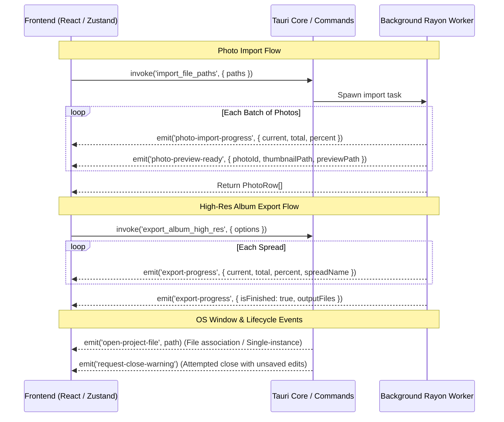
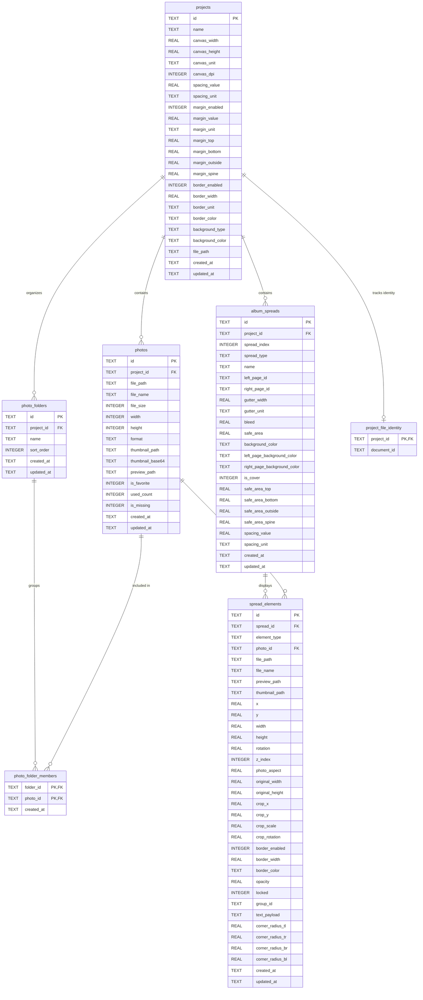

# System Integrations, IPC & Storage Architecture

**Analysis Date:** 2026-09-28  
**Codebase:** OpenSmartAlbum  
**Binary / Crate:** `afsn-smart-album` / `afsn_smart_album_lib`  
**Application ID:** `com.opensmartalbum.app`  

---

## 1. Tauri IPC Command & Event Interface

The Tauri IPC bridge connects the React frontend (`@tauri-apps/api/core`) and native Rust handlers defined in [`src-tauri/src/commands/`](file:///Users/chiio/VSCode/albumaker/src-tauri/src/commands/). All commands and events adhere to strict camelCase serialization matching TypeScript interfaces.

### 1.1 Complete Tauri Invoke Command Catalog

#### Application & System (`app_commands.rs`)

| Command Name | Arguments | Return Type | Description |
|---|---|---|---|
| `get_app_info` | _none_ | `AppInfo` | Returns current package version, platform name, and current SQLite schema version. |
| `get_db_status` | _none_ | `DbStatus` | Checks database connectivity, current migration version, and expected version (15). |
| `get_photo_cache_stats` | _none_ | `PhotoCacheStats` | Scans `$APPCACHE/thumbnails` and `$APPCACHE/previews` returning total file count and disk bytes. |
| `clean_unused_photo_cache` | _none_ | `CacheCleanupReport` | Deletes orphaned thumbnail and preview files no longer referenced by any photo in SQLite. |
| `restart_app` | _none_ | `()` | Restarts the application process (used after in-app updater completes). |
| `exit_app` | _none_ | `()` | Forcefully terminates the application runtime and exits process with code 0. |
| `set_unsaved_status` | `unsaved: bool` | `()` | Synchronizes frontend unsaved changes state to Rust `AppExitState` atomic flag. |
| `sample_screen_color` | `x?: i32, y?: i32` | `Result<String, String>` | Samples screen pixel hex color using OS graphics API (Win32 GDI `GetPixel` on Windows). |
| `get_system_fonts` | _none_ | `Result<Vec<SystemFontInfo>, String>` | Enumerates installed OS system fonts from Windows Registry or macOS font directories via `ttf-parser`. |

#### Project Management (`project_commands.rs`)

| Command Name | Arguments | Return Type | Description |
|---|---|---|---|
| `get_initial_open_path` | _none_ | `Option<String>` | Consumes initial `.afsn` CLI file argument passed during OS application launch. |
| `create_project` | `request: CreateProjectRequest` | `Result<ProjectRow, String>` | Creates a new project in SQLite with specified dimensions, DPI, margins, spacing, and styling. |
| `get_project` | `id: String` | `Result<Option<ProjectRow>, String>` | Reconciles file ownership and fetches project metadata by UUID. |
| `list_recent_projects` | `limit?: i32` | `Result<Vec<ProjectRow>, String>` | Returns most recently updated projects sorted by `updated_at DESC`. |
| `delete_project` | `id: String` | `Result<(), String>` | Deletes project from SQLite (cascading to spreads, photos, folders) and cleans unreferenced cache assets. |
| `clear_recent_projects` | _none_ | `Result<(), String>` | Clears all project records from SQLite and cleans orphaned cache assets. |
| `update_project_spacing` | `id: String, spacingValue: f64, spacingUnit: String` | `Result<(), String>` | Updates default photo frame spacing for project. |
| `update_project_margins` | `id: String, marginValue: f64, marginUnit: String, marginTop: f64, marginBottom: f64, marginOutside: f64, marginSpine: f64` | `Result<(), String>` | Updates multi-side margins (top, bottom, outside, spine) for project. |
| `update_project_name` | `id: String, name: String` | `Result<ProjectRow, String>` | Renames project, optionally renaming the linked `.afsn` file on disk atomically. |
| `update_project_name_and_path` | `id: String, name: String, filePath?: String` | `Result<(), String>` | Updates project name and associated file destination path in SQLite. |
| `save_album_structure` | `album: AlbumPayload` | `Result<(), String>` | Persists complete album hierarchy (cover spread, interior spreads, elements) to SQLite inside a single atomic transaction. |
| `load_album_structure` | `projectId: String` | `Result<Option<AlbumPayload>, String>` | Reads full album hierarchy, spreads, and photo frame elements from SQLite. |
| `export_afsn_package` | `projectId: String, targetPath: String` | `Result<(), String>` | Serializes project, photos, folders, and album into a portable JSON `.afsn` file using atomic write. |
| `import_afsn_package` | `sourcePath: String` | `Result<ProjectPackagePayload, String>` | Imports an extracted `.afsn` project package, resolving relative photo paths. |
| `export_afsn_with_dialog` | `projectId: String, suggestedName?: String` | `Result<Option<String>, String>` | Opens native Save dialog (`rfd`) for `.afsn` project file and writes package. |
| `save_project_as_with_dialog` | `projectId: String, suggestedName?: String` | `Result<Option<ProjectRow>, String>` | Opens native Save As dialog, duplicates project identity, and saves package. |
| `export_bundled_package_with_dialog` | `projectId: String, suggestedName?: String` | `Result<Option<String>, String>` | Opens native Save dialog for `.zip`, compresses project metadata and original photo files, emitting real-time progress. |
| `import_afsn_with_dialog` | _none_ | `Result<Option<ProjectPackagePayload>, String>` | Opens native Open dialog for `.afsn` files and imports project into SQLite. |
| `duplicate_project` | `sourceId: String, newId: String, newName: String, newFilePath: String` | `Result<ProjectRow, String>` | Clones an entire project, remapping UUIDs for all spreads, elements, photos, and folders. |
| `check_path_exists` | `path: String` | `bool` | Checks whether a file or directory path exists on disk. |

#### Photo Library Management (`photo_commands.rs`)

| Command Name | Arguments | Return Type | Description |
|---|---|---|---|
| `select_and_import_files` | `projectId: String, folderId?: String` | `Result<Vec<PhotoRow>, String>` | Prompts native file selection dialog, scans, metadata-extracts, and imports photos. |
| `select_and_import_folder` | `projectId: String, folderId?: String` | `Result<Vec<PhotoRow>, String>` | Prompts native folder picker dialog, recursively scans directories, and imports photos. |
| `pick_photo_files_dialog` | _none_ | `Result<Option<Vec<String>>, String>` | Shows non-blocking file selection dialog returning selected absolute file paths. |
| `pick_photo_folder_dialog` | _none_ | `Result<Option<Vec<String>>, String>` | Shows non-blocking folder selection dialog returning scanned photo file paths. |
| `import_file_paths` | `projectId: String, paths: Vec<String>, folderId?: String` | `Result<Vec<PhotoRow>, String>` | Headless import of raw file paths (e.g. from OS drag-and-drop ingestion). |
| `get_project_photos` | `projectId: String` | `Result<Vec<PhotoRow>, String>` | Retrieves all photo records belonging to a project. |
| `generate_missing_previews`| `projectId: String` | `Result<usize, String>` | Background task generating cached 1500px previews and 320px thumbnails for un-cached photos. |
| `toggle_photo_favorite` | `id: String, isFavorite: bool` | `Result<(), String>` | Toggles favorite status for a single photo in SQLite. |
| `remove_photo` | `projectId: String, photoId: String` | `Result<usize, String>` | Deletes photo from project, cleans cache files if unreferenced, and updates spread frames. |
| `check_missing_photos` | `projectId: String` | `Result<Vec<String>, String>` | Scans project photos verifying physical presence on disk; updates `is_missing` flag. |
| `regenerate_single_thumbnail` | `photoId: String` | `Result<PhotoRow, String>` | Re-extracts EXIF or regenerates preview & thumbnail for a single photo. |
| `relink_photo` | `projectId: String, photoId: String, newPath: String` | `Result<PhotoRow, String>` | Relinks a missing photo to a new file location and regenerates preview. |
| `relink_folder` | `projectId: String, folderPath: String` | `Result<usize, String>` | Batch relinks missing photos by scanning a user-selected directory for matching filenames. |
| `cancel_photo_import` | _none_ | `Result<(), String>` | Signals active background photo import worker to halt immediately. |
| `batch_delete_photos` | `projectId: String, photoIds: Vec<String>` | `Result<usize, String>` | Batch deletes multiple photos from project and cleans orphaned cache assets. |
| `batch_toggle_favorites` | `photoIds: Vec<String>, isFavorite: bool` | `Result<(), String>` | Batch updates favorite status for selected photo IDs. |
| `create_photo_folder` | `projectId: String, name: String` | `Result<PhotoFolderRow, String>` | Creates a photo folder / collection inside project. |
| `get_photo_folders` | `projectId: String` | `Result<Vec<PhotoFolderRow>, String>` | Retrieves all folders and their photo counts for a project. |
| `rename_photo_folder` | `folderId: String, name: String` | `Result<(), String>` | Renames an existing photo folder. |
| `delete_photo_folder` | `folderId: String` | `Result<(), String>` | Deletes a folder record (contained photos remain in project pool). |
| `add_photos_to_folder` | `folderId: String, photoIds: Vec<String>` | `Result<(), String>` | Associates photos with a folder in `photo_folder_members`. |
| `remove_photos_from_folder`| `folderId: String, photoIds: Vec<String>` | `Result<(), String>` | Removes photo associations from a folder. |
| `move_photos_between_folders` | `sourceFolderId: String, targetFolderId: String, photoIds: Vec<String>` | `Result<(), String>` | Moves photo associations from one folder to another. |
| `get_photos_for_folder` | `folderId: String` | `Result<Vec<PhotoRow>, String>` | Retrieves photo records associated with a specific folder. |

#### High-Resolution Export Engine (`export_commands.rs`)

| Command Name | Arguments | Return Type | Description |
|---|---|---|---|
| `export_album_high_res` | `projectId: String, options: ExportOptions` | `Result<ExportProgressEvent, String>` | Multi-threaded rendering of album spreads to high-res JPEG, PNG, TIFF, PSD, or PDF. |
| `export_carousel_slices` | `payload: CarouselPayload, options: CarouselExportOptions` | `Result<CarouselExportResult, String>` | Renders and slices seamless social media carousel slides to Instagram 1:1, 4:5, or 9:16 files. |
| `cancel_export` | _none_ | `Result<(), String>` | Sets cancellation flag for high-res export worker, cleaning up partial output files. |
| `preflight_check_export` | `projectId: String, options: ExportOptions` | `Result<PreflightReport, String>` | Pre-export validation: verifies write permissions, checks for missing photos, and detects file collision. |
| `select_export_directory`| _none_ | `Result<Option<String>, String>` | Prompts native folder picker dialog for selecting export destination. |
| `open_export_directory` | `dirPath: String` | `Result<(), String>` | Opens directory in OS file manager (macOS Finder `open`, Windows `explorer`, Linux `xdg-open`). |

---

### 1.2 Native IPC Events Emitted to Frontend



| Event Name | Payload Type | Description | Listeners |
|---|---|---|---|
| `open-project-file` | `string` (file path) | Emitted when OS launches the app via file association or when another instance opens a `.afsn` file. | [`src/App.tsx`](file:///Users/chiio/VSCode/albumaker/src/App.tsx#L131) |
| `request-close-warning` | `()` | Emitted when user clicks window close button but `AppExitState.is_unsaved` is true. | [`src/App.tsx`](file:///Users/chiio/VSCode/albumaker/src/App.tsx#L144) |
| `photo-import-progress` | `ImportProgressPayload` | Progress feedback during multi-file/folder import (`current`, `total`, `percent`, `currentFile`). | [`photoStore.ts`](file:///Users/chiio/VSCode/albumaker/src/stores/photoStore.ts) |
| `photo-preview-ready` | `PhotoPreviewReadyPayload` | Emitted immediately when an individual 1500px preview and thumbnail are ready on disk. | [`photoStore.ts`](file:///Users/chiio/VSCode/albumaker/src/stores/photoStore.ts), [`albumStore.ts`](file:///Users/chiio/VSCode/albumaker/src/stores/albumStore.ts) |
| `export-progress` | `ExportProgressEvent` | High-res album export status, progress percentage, current spread name, and generated file list. | [`ExportProgressModal.tsx`](file:///Users/chiio/VSCode/albumaker/src/features/export/ExportProgressModal.tsx) |
| `export-zip-progress` | `ExportZipProgressPayload` | Progress feedback during complete project package (`.zip`) compression. | [`WorkspaceLayout.tsx`](file:///Users/chiio/VSCode/albumaker/src/features/workspace/WorkspaceLayout.tsx#L215) |

---

## 2. SQLite Database Schema & Migrations

### 2.1 Database Overview

- **Database Location:** `$APPDATA/afsn_smart_album.db` (resolved via `app.path().app_data_dir()`).
- **Engine:** `rusqlite 0.34` with bundled SQLite 3.
- **Connection Parameters:**
  - WAL Mode enabled: `PRAGMA journal_mode = WAL;`
  - Foreign key constraints enforced: `PRAGMA foreign_keys = ON;`
- **Current Schema Version:** `15` ([`Database::expected_version()`](file:///Users/chiio/VSCode/albumaker/src-tauri/src/db/mod.rs#L299-L301)).

### 2.2 Entity Relationship Diagram



### 2.3 Migration History Summary

- **v1:** Initial schema and application key-value `settings` table.
- **v2:** Core `projects` table with canvas dimensioning, DPI, border, and background attributes.
- **v3:** Added margin support columns (`margin_enabled`, `margin_value`, `margin_unit`) to `projects`.
- **v4:** `photos` table with dimensions, format, thumbnail/preview paths, `is_favorite`, `used_count`, and `is_missing`.
- **v5:** `photo_folders` and `photo_folder_members` tables for collection and album folder management.
- **v6:** `album_spreads` and `spread_elements` tables supporting multi-page layouting, crop geometry, and border definitions.
- **v7:** Added `group_id` to `spread_elements` for grouped elements support.
- **v8:** Added `locked` status column to `spread_elements`.
- **v9:** Added independent `left_page_background_color` and `right_page_background_color` to `album_spreads`.
- **v10:** Added `text_payload` to `spread_elements` storing JSON typography, font family, style, and styled ranges.
- **v11:** Added `crop_rotation` to `spread_elements` for arbitrary crop angle rotation.
- **v12:** Added per-corner radii columns (`corner_radius_tl`, `corner_radius_tr`, `corner_radius_br`, `corner_radius_bl`).
- **v13:** Persisted independent project margins and spread safe-areas (`margin_top`, `margin_bottom`, `margin_outside`, `margin_spine`).
- **v14:** Created `project_file_identity` table to track original document UUIDs across file renames and Save As operations.
- **v15:** Added per-spread `spacing_value` and `spacing_unit` overrides to `album_spreads`.

---

## 3. File System & Asset Management

### 3.1 Directory Topology

```text
~/Library/Application Support/com.opensmartalbum.app/  (macOS)
%LOCALAPPDATA%/com.opensmartalbum.app/                 (Windows)
└── afsn_smart_album.db                               (SQLite Database File)

~/Library/Caches/com.opensmartalbum.app/              (macOS)
%LOCALAPPDATA%/com.opensmartalbum.app/cache/          (Windows)
├── thumbnails/                                       (320px filmstrip JPEG/PNG assets)
│   ├── {photo-uuid}.jpg
│   └── {photo-uuid}.tmp
└── previews/                                         (1500px canvas preview JPEG/PNG assets)
    ├── {photo-uuid}.jpg
    └── {photo-uuid}.tmp
```

### 3.2 Thumbnail & Preview Generation Pipeline

1. **Embedded EXIF Extraction (First Look):**
   - [`extract_embedded_thumbnail`](file:///Users/chiio/VSCode/albumaker/src-tauri/src/photo_engine/mod.rs#L175-L228) reads the first 128 KB of the JPEG header.
   - Parses TIFF IFD1 thumbnail offset and length without decoding original high-res image data.
   - Writes directly to `$APPCACHE/thumbnails/{id}.jpg` for near-instant filmstrip display.
2. **Asynchronous Canvas Preview Generation:**
   - [`generate_photo_preview`](file:///Users/chiio/VSCode/albumaker/src-tauri/src/photo_engine/mod.rs#L232-L329) acquires `ORIGINAL_DECODE` lock to prevent memory spikes.
   - Decodes full image within a strict 512 MB memory limit (`reader.limits(limits)`).
   - Applies EXIF orientation rotation/flip.
   - Resizes to maximum 1500px dimension using triangle filtering.
   - **Immediately drops original full-resolution bitmap from RAM**.
   - Concurrently updates the 320px thumbnail from the 1500px preview buffer.
3. **Atomic Cache File Publication:**
   - Writes preview bytes to `.tmp` file, flushes, syncs, then executes atomic `fs::rename`.
   - Prevents webview rendering broken/partially written image files.
4. **Symlink & Junction Protection:**
   - [`is_link_directory`](file:///Users/chiio/VSCode/albumaker/src-tauri/src/asset_cache.rs#L12-L22) checks for symlinks and Windows reparse points, preventing directory traversal attacks.

### 3.3 Project File Packaging (`.afsn` & `.zip`)

- **`.afsn` Project Package:**
  - Standard JSON manifest (`ProjectPackagePayload`) containing project metadata, photo records (with absolute paths), folders, and full album spread hierarchy.
  - Written via [`atomic_write`](file:///Users/chiio/VSCode/albumaker/src-tauri/src/db/package_io.rs#L29-L59) (`.afsn-{uuid}.tmp` then renamed).
  - Protected by `validate_file_owner` and identity tracking in `project_file_identity`.
- **Complete `.zip` Bundled Package:**
  - Self-contained portable archive containing `project.afsn` and all referenced photo files inside `photos/{index}_{safe_name}`.
  - Exported with progress feedback via `export_bundled_package_with_dialog`.

---

## 4. External OS Integrations

### 4.1 Window Management & Native Styling

- **macOS Transparent Titlebar:**
  - Configured with `titleBarStyle: "Overlay"` and `hiddenTitle: true` in [`tauri.conf.json`](file:///Users/chiio/VSCode/albumaker/src-tauri/tauri.conf.json#L17-L18).
  - Native macOS traffic light window controls (Close, Minimize, Zoom) float over the custom application header.
  - Window drag regions enabled via `data-tauri-drag-region` on [`AppTitleBar.tsx`](file:///Users/chiio/VSCode/albumaker/src/features/workspace/AppTitleBar.tsx#L122).
- **Close Requested Interception:**
  - Handled in [`lib.rs`](file:///Users/chiio/VSCode/albumaker/src-tauri/src/lib.rs#L55-L64) via `on_window_event`.
  - When `AppExitState::is_unsaved` is true, calls `api.prevent_close()` and emits `request-close-warning` to prompt the React modal.

### 4.2 Native File Dialogs (`rfd`)

- Integrated using crate `rfd 0.15` in blocking runtime threads:
  - Single/Multi-file photo selection (`FileDialog::new().pick_files()`).
  - Folder import / Export destination selection (`FileDialog::new().pick_folder()`).
  - Project Save As dialog with extension enforcement (`.afsn` / `.zip`).
  - Concurrency guarded via `IS_FILE_PICKER_OPEN` atomic flag to prevent multiple modal dialog stacking.

### 4.3 Finder / Explorer Drag & Drop Ingestion

- Configured with `dragDropEnabled: true` on the main Tauri window.
- Ingestion handled via `getCurrentWebview().onDragDropEvent`:
  - `enter` & `over`: Maps cursor screen coordinates to HUD target zones (`canvas` vs `filmstrip`).
  - `drop`: Routes dropped file paths:
    - Over Filmstrip: Imports files directly into the project library pool.
    - Over Canvas (Single Photo): Replaces photo in target frame under cursor.
    - Over Canvas (2-6 Photos): Triggers **Smart Auto-Partitioning** onto the active spread/slide.
    - Over Canvas (>6 Photos): Launches **Auto-Flow Multi-Spread Storytelling Engine**.

### 4.4 System Font Discovery

- **macOS:** Recursively scans `/System/Library/Fonts`, `/Library/Fonts`, and `~/Library/Fonts`. Parses `.ttf`, `.otf`, and `.ttc` font tables using `ttf-parser 0.25` to resolve font family and full names ([`app_commands.rs`](file:///Users/chiio/VSCode/albumaker/src-tauri/src/commands/app_commands.rs#L306-L364)).
- **Windows:** Queries Registry keys `HKLM\SOFTWARE\Microsoft\Windows NT\CurrentVersion\Fonts` and `HKCU\...` via Win32 `RegEnumValueW`.

### 4.5 Dual-Flow Application Updater

- **Desktop In-App Updater:** Managed by `tauri-plugin-updater 2` using Minisign public key verification (`pubkey: dW50cnVzdGVkIGNvbW1lbnQ6IG1pbmlzaWdu...`). Queries GitHub release metadata endpoint `latest.json`.
- **Web / Manual Fallback:** If offline or running without updater capabilities, queries GitHub REST API (`https://api.github.com/repos/ryandxter/OpenSmartAlbum-MacOS/releases/latest`) and provides direct `.dmg` / installer download links.
