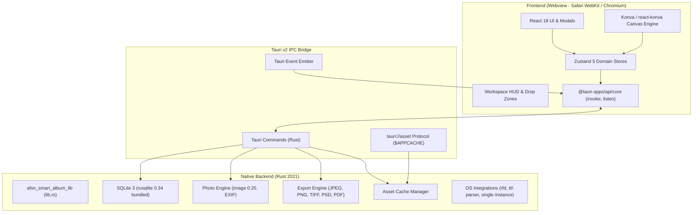

# Tech Stack & Runtime Architecture

**Analysis Date:** 2026-09-28  
**Codebase:** OpenSmartAlbum (Desktop Photo Album Layout & Carousel Authoring Software)  
**Binary/Package Name:** `afsn-smart-album` / `OpenSmartAlbum` (`com.opensmartalbum.app`)  
**Application Version:** 1.2.4  

---

## 1. Core Architecture Overview

OpenSmartAlbum is a cross-platform desktop application built using **Tauri v2** with a native **Rust backend** and a modern **React 18 / TypeScript frontend**. The architecture enforces strict separation between high-performance system operations (disk I/O, SQLite operations, multi-threaded image decoding/encoding, print-ready document rendering) and responsive canvas layout UI.



---

## 2. Frontend Technologies

### 2.1 Core Runtime & UI Framework

| Technology | Version | Purpose / Scope | Configuration / Reference |
|---|---|---|---|
| **React** | `^18.3.0` | UI component tree, hooks, declarative rendering | [`package.json`](file:///Users/chiio/VSCode/albumaker/package.json#L21) |
| **React DOM** | `^18.3.0` | Web DOM mount & portal management | [`package.json`](file:///Users/chiio/VSCode/albumaker/package.json#L22) |
| **TypeScript** | `^5.6.0` | Strict static typing across frontend domain models | [`tsconfig.json`](file:///Users/chiio/VSCode/albumaker/tsconfig.json#L1-L33) |
| **Vite** | `^6.0.0` | Build bundler, HMR dev server (port 1420) | [`vite.config.ts`](file:///Users/chiio/VSCode/albumaker/vite.config.ts#L1-L40) |
| **@vitejs/plugin-react** | `^4.3.0` | Fast Refresh, JSX transform for React | [`vite.config.ts`](file:///Users/chiio/VSCode/albumaker/vite.config.ts#L7) |

### 2.2 Canvas & Graphic Rendering

| Technology | Version | Purpose / Scope | Implementation Details |
|---|---|---|---|
| **Konva** | `^9.3.0` | HTML5 2D Canvas engine with scene graph | Stage, Layer, Group, Rect, Image, Text, Transformer |
| **react-konva** | `^18.2.0` | Declarative React wrapper for Konva nodes | Used in [`KonvaEditorCanvas.tsx`](file:///Users/chiio/VSCode/albumaker/src/features/editor/KonvaEditorCanvas.tsx), [`SpreadCanvas.tsx`](file:///Users/chiio/VSCode/albumaker/src/features/album/SpreadCanvas.tsx), [`CarouselCanvas.tsx`](file:///Users/chiio/VSCode/albumaker/src/features/carousel/CarouselCanvas.tsx) |

### 2.3 State Management & Domain Store Architecture

OpenSmartAlbum utilizes **Zustand `^5.0.0`** with decoupled domain stores. No monolithic global state is used:

| Store Name | Path | Primary Responsibilities |
|---|---|---|
| `useAppStore` | [`src/stores/appStore.ts`](file:///Users/chiio/VSCode/albumaker/src/stores/appStore.ts) | App metadata, preferences (startup behavior, update checks, units), modal visibility, updater progress |
| `useProjectStore` | [`src/stores/projectStore.ts`](file:///Users/chiio/VSCode/albumaker/src/stores/projectStore.ts) | Current project settings (dimensions, DPI, margins, spacing), recent projects, save/load, `.afsn` export/import |
| `useAlbumStore` | [`src/stores/albumStore.ts`](file:///Users/chiio/VSCode/albumaker/src/stores/albumStore.ts) | Full album structure (cover spread, interior spreads, pages), active spread selection, auto-flow, persistence status |
| `useEditorStore` | [`src/stores/editorStore.ts`](file:///Users/chiio/VSCode/albumaker/src/stores/editorStore.ts) | Canvas viewport (pan/zoom), selection state, frame transforms, crop/rotation, text element editing, typography |
| `usePhotoStore` | [`src/stores/photoStore.ts`](file:///Users/chiio/VSCode/albumaker/src/stores/photoStore.ts) | Photo library pool, folders/collections, favorites, used count, missing photo detection, relinking |
| `useCarouselStore` | [`src/stores/carouselStore.ts`](file:///Users/chiio/VSCode/albumaker/src/stores/carouselStore.ts) | Multi-slide seamless social media carousel authoring (aspect ratios, slide partitioning, auto-flow) |
| `useHistoryStore` | [`src/stores/historyStore.ts`](file:///Users/chiio/VSCode/albumaker/src/stores/historyStore.ts) | Undo/Redo command stacks with max stack depth management |

### 2.4 UI Components & Utilities

- **Icons:** `lucide-react` (`^1.47.0`) for clean, responsive vector iconography.
- **QR Code:** `qrcode.react` (`^4.2.0`) for project donation & support QR generation ([`SupportDonationModal.tsx`](file:///Users/chiio/VSCode/albumaker/src/features/support/SupportDonationModal.tsx)).
- **Styles:** Modular CSS (`*.module.css`) alongside strict CSS design tokens in [`tokens.css`](file:///Users/chiio/VSCode/albumaker/src/styles/tokens.css) and [`global.css`](file:///Users/chiio/VSCode/albumaker/src/styles/global.css).
- **Type Checking & Execution:** `tsx` (`^4.23.12`) for standalone TypeScript runner scripts.
- **Testing:** `playwright` (`^1.63.0`) for end-to-end headless verification.

---

## 3. Native Rust Backend Architecture

### 3.1 Rust Environment & Toolchain

- **Rust Edition:** `2021`
- **Minimum Rust Version (MSRV):** `1.77.2` (configured in [`Cargo.toml`](file:///Users/chiio/VSCode/albumaker/src-tauri/Cargo.toml#L8))
- **Crate Type:** `["staticlib", "cdylib", "rlib"]` ([`src-tauri/Cargo.toml`](file:///Users/chiio/VSCode/albumaker/src-tauri/Cargo.toml#L12))
- **Entry Points:**
  - Binary executable: [`src-tauri/src/main.rs`](file:///Users/chiio/VSCode/albumaker/src-tauri/src/main.rs) (`#![cfg_attr(not(debug_assertions), windows_subsystem = "windows")]`)
  - Core application library: [`src-tauri/src/lib.rs`](file:///Users/chiio/VSCode/albumaker/src-tauri/src/lib.rs) (`afsn_smart_album_lib::run()`)

### 3.2 Backend Dependencies & Capabilities

| Crate | Version | Features / Configuration | Primary Role in OpenSmartAlbum |
|---|---|---|---|
| **tauri** | `2.11.3` | `features = ["protocol-asset"]` | Tauri v2 core runtime, window lifecycle, managed state, custom asset protocol |
| **tauri-build** | `2.6.3` | Default build script helper | Compiles Tauri manifest and ACL capabilities during build time |
| **rusqlite** | `0.34` | `features = ["bundled"]` | Bundled C SQLite3 engine; zero external runtime dependencies; WAL mode enabled |
| **image** | `0.25` | `default-features = false`, `["jpeg", "png", "webp", "bmp", "tiff"]` | Decoding, fast dimension inspection, Lanczos/Triangle resampling, color compositing |
| **tiff** | `0.11` | `default-features = false`, `["lzw", "deflate"]` | 8-bit & 16-bit professional print-ready TIFF export with LZW/Deflate compression |
| **kamadak-exif** | `0.6` | Standard EXIF parsing | Non-destructive extraction of camera orientation, metadata without full bitmap decode |
| **rfd** | `0.15` | Native OS File Dialogs | Native macOS NSOpenPanel/NSSavePanel and Windows IFileDialog wrappers |
| **rayon** | `1.10` | Parallel iterators | Multi-threaded batch photo thumbnailing, high-res spread rendering |
| **fontdue** | `0.9` | High-performance font rasterizer | Subpixel font glyph parsing and text rendering for canvas export engine |
| **ttf-parser** | `0.25` | TrueType / OpenType parser | System font extraction, font family/weight discovery across macOS and Windows |
| **zip** | `2.2` | `default-features = false`, `["deflate"]` | Atomic `.zip` project packaging (bundling `.afsn` JSON with photo assets) |
| **uuid** | `1.0` | `features = ["v4"]` | Cryptographically secure UUIDs for projects, spreads, elements, photos, and folders |
| **serde** / **serde_json** | `1.0` | `features = ["derive"]` | CamelCase serialization/deserialization for all IPC payloads and package manifests |
| **base64** | `0.22` | Base64 encoding | Auxiliary thumbnail payloads |
| **log** | `0.4` | Logging facade | Native logging integrated with `tauri-plugin-log` |

### 3.3 Tauri Official Plugins

- `tauri-plugin-log` (`2`): Configured in [`lib.rs`](file:///Users/chiio/VSCode/albumaker/src-tauri/src/lib.rs#L68-L72) for debug logging.
- `tauri-plugin-os` (`2`): Exposes OS platform and platform-specific capabilities to the frontend.
- `tauri-plugin-shell` (`2`): Controlled shell execution and folder opening (`shell:allow-open`).
- `tauri-plugin-single-instance` (`2`): Single instance enforcement; restores existing window and emits `open-project-file` on duplicate launch.
- `tauri-plugin-updater` (`2`): Ed25519 / Minisign cryptographic signature verification for self-updating from GitHub Releases.

---

## 4. Build Configuration & Toolchain

### 4.1 Vite Configuration (`vite.config.ts`)

- **Port:** Fixed at `1420` (`strictPort: true`) as required by Tauri dev server.
- **Path Alias:** `@/` resolves to `./src/` ([`vite.config.ts`](file:///Users/chiio/VSCode/albumaker/vite.config.ts#L10-L12)).
- **Watch Exclusion:** Excludes `**/src-tauri/**` to prevent infinite build loops on Rust edits.
- **Platform Compilation Targets:**
  - macOS / Linux: `safari14` (WebKit)
  - Windows: `chrome105` (WebView2)
- **Minification & Sourcemaps:**
  - Release: `esbuild` minification, sourcemaps disabled.
  - Debug: Minification disabled, sourcemaps generated for debugging.

### 4.2 TypeScript Configuration (`tsconfig.json` & `tsconfig.node.json`)

- **Target:** `ES2021` with `ESNext` modules.
- **Module Resolution:** `bundler` (supports modern Vite import semantics and `allowImportingTsExtensions: true`).
- **Strictness Settings:**
  - `strict: true`
  - `noUnusedLocals: true`
  - `noUnusedParameters: true`
  - `noFallthroughCasesInSwitch: true`
  - `noUncheckedIndexedAccess: true`

### 4.3 Tauri Configuration (`tauri.conf.json`)

- **Identifier:** `com.opensmartalbum.app`
- **Product Name:** `OpenSmartAlbum`
- **Window Specs:**
  - `titleBarStyle: "Overlay"` with `hiddenTitle: true` (creates a modern macOS seamless titlebar).
  - Background color `#18181b` (avoids white flashing during initial window rendering).
  - Default size `1280x800` (min `1024x768`), centered, resizable.
- **Content Security Policy (CSP):**
  ```text
  default-src 'self';
  connect-src 'self' https://api.github.com https://github.com https://objects.githubusercontent.com;
  style-src 'self' 'unsafe-inline';
  img-src 'self' asset: http://asset.localhost https://asset.localhost data: blob: https://avatars.githubusercontent.com;
  ```
- **Asset Protocol Scope:**
  - `$APPCACHE/thumbnails/**`
  - `$APPCACHE/previews/**`
- **File Associations:**
  - Registered extensions: `.afsn`, `.opensmartalbum`
  - Role: `Editor`

### 4.4 Packaging & Release Bundlers

| Target Platform | Package Format | Configuration Highlights |
|---|---|---|
| **macOS** | `.app`, `.dmg` | Minimum system version `13.0` (Ventura); custom [`Entitlements.plist`](file:///Users/chiio/VSCode/albumaker/src-tauri/Entitlements.plist) (`com.apple.security.files.user-selected.read-write`, `com.apple.security.network.client`, `allow-jit`); custom DMG window position and folder placement. |
| **Windows** | `.exe` (NSIS) | `hooks.nsh` installer hook, LZMA compression, custom sidebar and header branding BMPs. |
| **Updater Artifacts** | `createUpdaterArtifacts: true` | Generates `.tar.gz` and `.sig` signatures verified against the Minisign public key. |

---

## 5. Build & Verification Scripts

| Command | Definition | Action |
|---|---|---|
| `npm run dev` | `vite` | Runs local frontend dev server on `http://localhost:1420` |
| `npm run build` | `tsc && vite build` | Type-checks frontend code and produces optimized assets in `dist/` |
| `npm run test` | `tsc --noEmit` | Validates TypeScript types across all source files |
| `npm run preview` | `vite preview` | Previews production build locally in browser |
| `npm run tauri` | `tauri` | Accesses Tauri CLI v2 directly |
| `cargo test` | Run in `src-tauri` | Executes Rust unit tests for `photo_engine`, `export_engine`, `psd_writer`, `db` |
| `npx tsx scripts/verify_e2e_layouting.ts` | Headless E2E runner | Validates album layout generation logic and photo aspect math |
| `npx tsx scripts/e2e-headless-suite.ts` | Headless Playwright test | Exercises full canvas, import, and export lifecycles |
| `pwsh scripts/bundle-album-fonts.ps1` | Font packaging | Bundles and normalizes Open Font License fonts for offline text rasterization |
