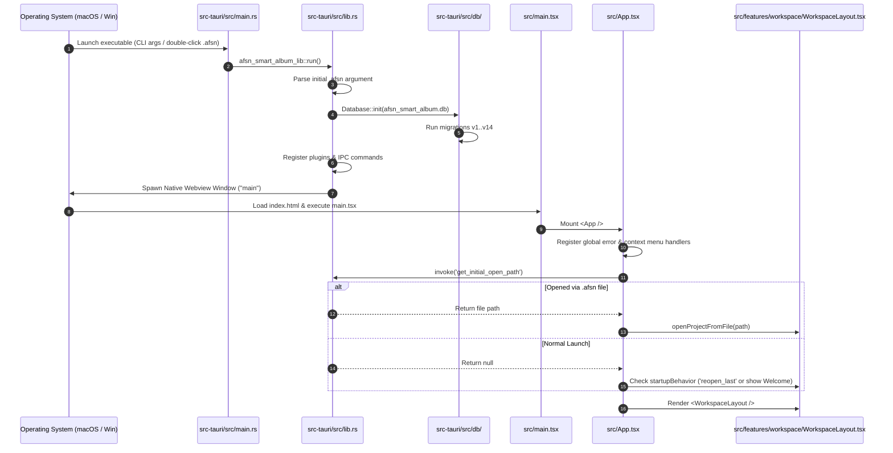

# Codebase Structure & Directory Layout — OpenSmartAlbum (afsn)

**Analysis Date:** 2026-09-28  
**Repository:** `ryandxter/OpenSmartAlbum-MacOS`  
**Application Target:** Native macOS & Windows Professional Photo Album & Social Carousel Designer

---

## 1. Top-Level Repository Directory Layout

```
.
├── .github/                     # GitHub Actions CI/CD workflows (release builds, linting, tests)
├── .planning/                   # Project planning, roadmaps, forensics, state, and codebase maps
│   ├── codebase/                # Deep technical architecture and structural documentation
│   ├── forensics/               # Bug investigation logs and forensic retrospectives
│   ├── milestones/              # Milestone tracking and release goals
│   ├── phases/                  # Phased feature implementation specs
│   ├── research/                # Architecture and technical design research
│   └── todos/                   # Action items and task tracking
├── assets/                      # Application brand assets, logos, and visual references
├── dist/                        # Vite production webview build artifacts
├── public/                      # Static web assets served directly to the webview
├── scripts/                     # Developer utility scripts (build, bundling, asset prep)
├── src/                         # Frontend React 19 / TypeScript application source
│   ├── assets/                  # Frontend bundled SVG icons and image assets
│   ├── components/              # Shared reusable UI component library
│   ├── config/                  # Global application constants and build configurations
│   ├── domain/                  # Pure TypeScript domain models, layout generators, and algorithms
│   ├── features/                # Feature-sliced UI components, canvases, panels, and dialogs
│   ├── hooks/                   # Custom React utility hooks
│   ├── services/                # External and native platform service wrappers
│   ├── stores/                  # Zustand global application state stores
│   ├── styles/                  # CSS tokens, resets, and global themes
│   └── utils/                   # Platform detection and keyboard shortcut utilities
├── src-tauri/                   # Rust native backend process (Tauri v2 core)
│   ├── capabilities/            # Tauri 2 security permissions and capabilities definitions
│   ├── gen/                     # Tauri code generation and schema outputs
│   ├── icons/                   # Multi-platform application icon sets (.icns, .ico, PNGs)
│   ├── src/                     # Rust source code (commands, db, photo_engine, export_engine)
│   │   ├── commands/            # Tauri invoke command handlers exposed to frontend
│   │   ├── db/                  # SQLite database connection, migrations, and package IO
│   │   ├── export_engine/       # Print and carousel export rendering, PSD/PDF/TIFF writer
│   │   └── photo_engine/        # High-performance image decoding and thumbnail generation
│   ├── tests/                   # Native Rust integration and unit tests
│   ├── Cargo.toml               # Rust dependencies and package configuration
│   ├── Cargo.lock               # Deterministic Rust dependency lockfile
│   ├── Entitlements.plist       # macOS code signing entitlements (camera, file access)
│   └── tauri.conf.json          # Tauri application, window, and plugin configuration
├── package.json                 # Node.js project manifest and build scripts
├── package-lock.json            # Deterministic Node dependency lockfile
├── tsconfig.json                # TypeScript compiler configuration for webview source
├── tsconfig.node.json           # TypeScript configuration for Vite tooling
└── vite.config.ts               # Vite bundler configuration and port settings
```

---

## 2. Frontend Structure (`src/`)

The frontend adheres to a modular, feature-oriented structure with clear separation between pure business logic (`src/domain/`), state management (`src/stores/`), reusable UI primitives (`src/components/`), and full-featured workflows (`src/features/`).

### Detailed Folder Breakdown

```
src/
├── App.tsx                      # Top-level application coordinator & global event listeners
├── main.tsx                     # React DOM root entry point
├── vite-env.d.ts                # Vite client environment type declarations
│
├── assets/                      # Bundled SVG icons and illustrations
│
├── components/                  # Shared UI Component Library
│   ├── ErrorBoundary.tsx        # React error boundary catching render crashes
│   └── ui/                      # Atomic design system components
│       ├── Button.tsx           # Primary, secondary, danger, and ghost action buttons
│       ├── ColorPicker.tsx      # Palette and hex color selection popover
│       ├── ConfirmDialog.tsx    # Modal confirmation for destructive actions
│       ├── ContextMenu.tsx      # Native-style custom floating context menus
│       ├── Dialog.tsx           # Base accessible modal wrapper
│       ├── IconButton.tsx       # Compact icon-only button primitive
│       ├── NumberInput.tsx      # Numeric spinbox with unit formatting
│       ├── Panel.tsx            # Floating and docked panel containers
│       ├── PanelHeader.tsx      # Consistent section headers with collapse toggles
│       ├── Select.tsx           # Dropdown selection control
│       ├── StatusBar.tsx        # Common status bar display widget
│       ├── Switch.tsx           # Accessible toggle switch
│       ├── Toolbar.tsx          # Button toolbar container
│       ├── Tooltip.tsx          # Hover tooltip popover
│       ├── UnitInput.tsx        # Value input supporting mm, cm, in, px conversion
│       └── index.ts             # Barrel export for UI components
│
├── config/                      # Global configuration and constants
│   └── appConfig.ts             # Default dimensions, zoom limits, app constants
│
├── domain/                      # Pure Business Models, Math & Algorithms (Zero React Dependency)
│   ├── __tests__/               # Domain logic unit tests (Vitest)
│   ├── adaptiveLayout.ts        # Dynamic layout partitioning & crop penalty math
│   ├── album.ts                 # Album, Spread, Page, and AlbumElement domain types
│   ├── appPreferences.ts        # User preferences schema (startup, theme, updates)
│   ├── bundledFonts.ts          # Curated font family list & font metrics
│   ├── carousel/                # Carousel sub-domain tests and utilities
│   ├── carousel.ts              # Social carousel data structures (1:1, 4:5, 9:16)
│   ├── carouselLayout.ts        # Social media layout presets & multi-slide panoramas
│   ├── editor.ts                # Geometry math, snapping calculations, alignment logic
│   ├── layout/                  # Generative Layout Subsystem
│   │   ├── __tests__/           # Layout generator tests
│   │   ├── aspectMatcher.ts     # Bipartite matching minimizing aspect distortion
│   │   ├── bspEngine.ts         # Binary Space Partitioning tree algorithm
│   │   ├── dividerGraph.ts      # Shared frame edge detection & clamped divider dragging
│   │   ├── generator.ts         # Unified generative layout facade for 1..15 photos
│   │   └── rowColumnNormalizer.ts # Equal-height row & equal-width column solvers
│   ├── photo.ts                 # Photo entity, metadata, folders, and filters
│   ├── photoPlacement.ts        # Smart initial placement geometry on drag-and-drop
│   ├── photoRemoval.ts          # Safe cascade detachment when photos are deleted
│   ├── presets.ts               # Standard album size presets (10x10, 12x12, A4, etc.)
│   ├── previewGeometry.ts       # Viewport zoom and fit-to-screen matrix math
│   ├── project.ts               # Project metadata model and dimension converters
│   ├── richTextParser.ts        # Parser converting styled text into run segments
│   ├── richTextRenderer.ts      # HTML5 Canvas 2D text layout and line wrapper
│   ├── shapes.ts                # Vector clipping mask paths (Hexagon, Heart, Scallop, etc.)
│   ├── storytelling/            # Auto-flow sequencing algorithms
│   │   ├── autoFlowEngine.ts    # Distribution of photos across spreads by rhythm
│   │   ├── cadenceEngine.ts     # Pacing engine alternating dense vs hero spreads
│   │   └── temporalClusterer.ts # EXIF timestamp grouping into narrative clusters
│   ├── styledRanges.ts          # Character-range style mapping for inline formatting
│   ├── templates.ts             # Classical grid templates and usable area solvers
│   ├── text.ts                  # Text node data models and styling defaults
│   ├── units.ts                 # Physical unit converter (mm, cm, inch, point, px)
│   └── viewport.ts              # Screen-to-canvas coordinate transformations
│
├── features/                    # Feature Slices (UI + Stores + Konva Canvas)
│   ├── about/                   # About OpenSmartAlbum dialog and release details
│   │   ├── AboutDialog.tsx      # Modal showcasing software version, OS build, credits
│   │   └── AboutDialog.module.css
│   ├── album/                   # Album Structure & Navigation
│   │   ├── AlbumStructurePanel.tsx # Outline tree of all spreads and pages
│   │   ├── PageNavigator.tsx    # Bottom filmstrip of spread thumbnails
│   │   └── SpreadCanvas.tsx     # Static spread preview wrapper
│   ├── carousel/                # Instagram Social Carousel Feature
│   │   ├── CarouselCanvas.tsx   # Continuous multi-slide horizontal Konva canvas
│   │   ├── PhoneSwipeSimulator.tsx # Interactive mobile device preview mockup
│   │   └── SlideNavigator.tsx   # Slide sequence timeline and slide add/reorder bar
│   ├── editor/                  # Primary 2D Canvas Editor Subsystem
│   │   ├── DividerOverlayLayer.tsx # Interactive shared divider drag lines
│   │   ├── FrameToolbar.tsx     # Contextual floating action bar over selected frames
│   │   ├── KonvaEditorCanvas.tsx # Primary Print Spread Konva rendering engine
│   │   ├── LayoutCycleHUD.tsx   # Floating spacebar layout cycle indicator
│   │   ├── LockedPhotosPanel.tsx # Drawer showing locked photo frames on active spread
│   │   ├── OpacityControl.tsx   # Element opacity slider popup
│   │   ├── photoSwapDrag.ts     # Frame drag swap detection logic
│   │   ├── TextInlineEditor.tsx # In-place contentEditable text entry overlay
│   │   ├── TextNode.tsx         # Konva canvas text node renderer
│   │   ├── TextPreviewCanvas.tsx # Real-time font preview thumbnail canvas
│   │   └── TypographyPanel.tsx  # Detailed font family, weight, size, and color controls
│   ├── export/                  # Export & Production Dialogs
│   │   ├── ExportAlbumDialog.tsx # Master export dialog (JPEG, TIFF, PSD, PDF)
│   │   ├── ExportProgressModal.tsx # Real-time native render progress bar
│   │   ├── ExportSpreadPreview.tsx # Thumbnail preview of spreads being exported
│   │   └── exportUtils.ts       # File naming and export path formatting
│   ├── inspector/               # Right-Hand Properties Inspector
│   │   ├── AccordionSection.tsx # Collapsible accordion container
│   │   ├── InspectorContainer.tsx # Master properties drawer on right edge
│   │   ├── sections/            # Inspector sections
│   │   │   ├── EffectsShadowsSection.tsx # Drop shadow blur, offset, and color controls
│   │   │   ├── LayoutSpacingSection.tsx  # Margin and gap spacing sliders
│   │   │   ├── ShapesBordersSection.tsx  # Vector shapes, corner radii, borders
│   │   │   └── TypographySection.tsx     # Text styling shortcuts
│   │   └── useAccordionState.ts # Accordion collapse state persistence hook
│   ├── persistence/             # Auto-Save Subsystem
│   │   └── useAutoSave.ts       # Debounced background auto-save hook
│   ├── photos/                  # Media Library & Asset Management
│   │   ├── BatchActionBar.tsx   # Floating bulk action bar (Delete, Favorite, Move)
│   │   ├── FilmstripTray.tsx    # Bottom expandable photo library filmstrip
│   │   ├── FolderDialog.tsx     # Create / rename collection modal
│   │   ├── FolderTabs.tsx       # Folder and smart filter navigation tabs
│   │   ├── PhotoContextMenu.tsx # Context menu for photo thumbnails
│   │   └── RelinkDialog.tsx     # Missing photo recovery and directory relinking modal
│   ├── project/                 # Project Creation
│   │   └── NewProjectDialog.tsx # New project setup wizard (size, orientation, units)
│   ├── settings/                # Preferences Dialog
│   │   └── SettingsDialog.tsx   # General, Appearance, Cache, and Advanced settings
│   ├── support/                 # Support & Community
│   │   └── SupportDonationModal.tsx # Developer support and donation modal
│   ├── updates/                 # Software Update System
│   │   ├── BackgroundUpdateIndicator.tsx # Discrete titlebar update notification badge
│   │   └── UpdateModal.tsx      # Changelog and one-click app update installer
│   └── workspace/               # Workspace Architecture Shell
│       ├── AppTitleBar.tsx      # Native-styled titlebar with traffic light inset
│       ├── DropZoneHUD.tsx      # Finder drag-and-drop ingestion overlay
│       ├── ExitWarningModal.tsx # Unsaved changes confirmation on window close
│       ├── StatusBar.tsx        # Bottom application status bar (zoom, spread count)
│       ├── WelcomeScreen.tsx    # Empty state / recent projects launcher
│       └── WorkspaceLayout.tsx  # Central layout orchestrator docking all panels
│
├── hooks/                       # Custom React Hooks
│   └── useTauriInfo.ts          # Hook reading system platform, arch, and Tauri version
│
├── services/                    # Background Services
│   └── updateService.ts         # GitHub Releases & Tauri updater integration
│
├── stores/                      # Zustand State Management Store Layer
│   ├── albumStore.ts            # Complete album document tree, active spread, safe margins
│   ├── appStore.ts              # Window settings, preferences, and modal visibilities
│   ├── carouselStore.ts         # Social carousel slides, ratios, and layout presets
│   ├── editorStore.ts           # Interactive canvas selection, transformer, snapping
│   ├── historyStore.ts          # Immutable undo/redo snapshot stacks for album
│   ├── photoStore.ts            # Media library catalog, folders, filters, relinking
│   └── projectStore.ts          # Project metadata, file paths, and package IO
│
├── styles/                      # Global Design Tokens and Styles
│   ├── global.css               # Global typography, scrollbars, and selection styling
│   ├── reset.css                # CSS box-sizing and layout normalization
│   └── tokens.css               # CSS custom properties (colors, spacing, elevation)
│
└── utils/                       # Utility Functions
    ├── platform.ts              # macOS vs Windows OS runtime detection
    └── shortcuts.ts             # Keyboard shortcut formatting (Cmd vs Ctrl)
```

---

## 3. Native Core Structure (`src-tauri/`)

The native core handles heavy image processing, multi-threaded export rendering, SQLite database persistence, and native OS APIs.

```
src-tauri/
├── build.rs                     # Tauri build script
├── Cargo.toml                   # Crate dependencies (tauri, rusqlite, image, turbojpeg, etc.)
├── Cargo.lock                   # Pinned dependency versions
├── Entitlements.plist           # macOS hardened runtime entitlements
├── hooks.nsh                    # NSIS Windows installer lifecycle hooks
├── tauri.conf.json              # Window dimensions, titlebar style, security bundles
│
├── capabilities/                # Tauri 2 security capability grants
│   └── default.json             # Core permissions (fs, dialog, shell, updater, os)
│
├── icons/                       # Platform application icons
│   ├── 128x128.png
│   ├── 32x32.png
│   ├── icon.icns                # macOS application icon bundle
│   └── icon.ico                 # Windows executable icon bundle
│
├── src/                         # Rust Native Modules
│   ├── main.rs                  # Native application entry point
│   ├── lib.rs                   # Tauri application builder & command router
│   ├── asset_cache.rs           # Thumbnail disk cache management & orphan garbage collection
│   │
│   ├── commands/                # Frontend IPC Command Handlers
│   │   ├── mod.rs               # Module exports
│   │   ├── app_commands.rs      # App metadata, system fonts, screen color sampler, exit state
│   │   ├── export_commands.rs   # High-res export, carousel slice worker, preflight checks
│   │   ├── photo_commands.rs    # File ingestion dialogs, thumbnail generation, folder CRUD
│   │   └── project_commands.rs  # Project creation, load/save, .afsn serialization, zip export
│   │
│   ├── db/                      # Persistence Layer
│   │   ├── mod.rs               # SQLite connection, migration runners v1..v14, schema definitions
│   │   └── package_io.rs        # Atomic file serialization, .afsn bundle parser, UUID remapping
│   │
│   ├── export_engine/           # Production Output Generation
│   │   ├── mod.rs               # High-res canvas renderer, color compositor, TIFF/PNG/JPEG encoder
│   │   ├── bundled_fonts.rs     # Embedded font assets
│   │   ├── carousel_slicer.rs   # Instagram carousel continuous renderer and slice chopper
│   │   ├── psd_writer.rs        # Adobe Photoshop PSD layered file generator
│   │   └── text_rasterizer.rs   # Vector-to-bitmap font rasterizer
│   │
│   └── photo_engine/            # Image Processing Subsystem
│       └── mod.rs               # RAW and JPEG decoder, EXIF orientation parser, fast thumbnailer
│
└── tests/                       # Rust Native Test Suites
    └── db_tests.rs              # Database migration and package IO test cases
```

---

## 4. Key Entry Points & Execution Flow



### 1. `src-tauri/src/main.rs` & `lib.rs`

- **Native Lifecycle Entry:**
  - Evaluates startup arguments for `.afsn` files passed via Finder or Windows Explorer file associations.
  - Initializes the local SQLite database at `~/Library/Application Support/afsn_smart_album.db` (on macOS) and runs migrations up to version 14.
  - Cleans up orphaned cached photo assets on disk.
  - Injects managed state singletons: `Database`, `LaunchState`, `ImportState`, `ExportState`, and `AppExitState`.
  - Attaches `tauri_plugin_single_instance` to handle secondary instances when users open `.afsn` files while the application is already running.
  - Hooks `tauri::WindowEvent::CloseRequested` to block window termination when unpersisted changes exist, emitting `request-close-warning` to the frontend.

### 2. `src/App.tsx`

- **Application Shell Coordinator:**
  - Wraps the visual tree in a root `<ErrorBoundary>`.
  - Suppresses default browser context menus to enforce a desktop native feel.
  - Initiates background auto-update checks after a non-blocking 4-second delay.
  - Listens for native events (`open-project-file`, `request-close-warning`).
  - Subscribes to `albumStore`, `projectStore`, and `photoStore` to synchronize dirty status with native backend via `set_unsaved_status`.
  - Mounts modal dialogs (`AboutDialog`, `SettingsDialog`, `NewProjectDialog`, `UpdateModal`, `ExitWarningModal`, `ConfirmDialog`).

### 3. `src/features/workspace/WorkspaceLayout.tsx`

- **Central Desktop Workspace:**
  - Coordinates layout docking:
    - Top: `AppTitleBar` (custom macOS titlebar with 80px traffic-light clearance, mode toggle, zoom controls).
    - Center: Main editor canvas (`KonvaEditorCanvas` for Print Spreads or `CarouselCanvas` for Social Carousels).
    - Bottom Full-Width: `PageNavigator` (album spreads) or `SlideNavigator` (carousel slides) and `StatusBar`.
    - Bottom Overlay: Collapsible `FilmstripTray` with photo collection tabs.
    - Right Overlay: Collapsible `InspectorContainer` (layout spacing, margins, borders, shadows, typography).
  - Contains the **Spacebar Disambiguation State Machine** for differentiating pan gestures from layout cycling taps.
  - Handles external drag-and-drop ingestion from Finder / Windows File Explorer via `DropZoneHUD`.

---

## 5. Component Hierarchy & Architectural Boundaries

```
<App>
├── <ErrorBoundary>
│   ├── <WorkspaceLayout>
│   │   ├── <AppTitleBar>
│   │   │   ├── Mode Switcher (Print Album vs. Social Carousel)
│   │   │   ├── Zoom Controls & Preset Selector
│   │   │   └── Project Action Buttons (Export, Properties Toggle)
│   │   │
│   │   ├── <main.canvas>
│   │   │   ├── [If No Project]: <WelcomeScreen>
│   │   │   ├── [If Print Mode]:
│   │   │   │   ├── <KonvaEditorCanvas>
│   │   │   │   │   └── <Stage>
│   │   │   │   │       ├── <Layer> (Background sheet, drop shadow, left/right pages)
│   │   │   │   │       └── <Layer> (Photo frames, text nodes, snap lines, transformer)
│   │   │   │   │           └── <DividerOverlayLayer> (Shared collinear dividers)
│   │   │   │   └── <FrameToolbar> (Floating quick-action bar)
│   │   │   └── [If Carousel Mode]:
│   │   │       ├── <CarouselCanvas>
│   │   │       │   └── <Stage>
│   │   │       │       ├── <Layer> (Continuous multi-slide backgrounds)
│   │   │       │       ├── <Layer> (Photo frames, panorama spans, transformer)
│   │   │       │       │   └── <DividerOverlayLayer>
│   │   │       │       └── <Layer> (Instagram slide slice indicators)
│   │   │       ├── <FrameToolbar>
│   │   │       └── [If Simulator Open]: <PhoneSwipeSimulator>
│   │   │
│   │   ├── [Navigation Bar]:
│   │   │   ├── [Print Mode]: <PageNavigator> (Thumbnail strip of spreads)
│   │   │   └── [Carousel Mode]: <SlideNavigator> (Slide timeline & add/reorder)
│   │   │
│   │   ├── <StatusBar> (Document zoom, unit display, element counts)
│   │   │
│   │   ├── [If Open]: <InspectorContainer>
│   │   │   ├── <LayoutSpacingSection> (Page margins & frame gap sliders)
│   │   │   ├── <ShapesBordersSection> (Vector shapes, corner radii, stroke borders)
│   │   │   ├── <EffectsShadowsSection> (Drop shadows, blur, color, offsets)
│   │   │   └── <TypographySection> (Text style overrides)
│   │   │
│   │   ├── [If Open]: <FilmstripTray>
│   │   │   ├── <FolderTabs> (All, Unused, Used, Favorites, Custom Folders)
│   │   │   ├── Photo Thumbnails Grid (Multi-select, Drag-Drop, Relink indicators)
│   │   │   └── <BatchActionBar> (Bulk operations on selected photos)
│   │   │
│   │   ├── <DropZoneHUD> (External file drop target highlighter)
│   │   └── <RelinkDialog> (Missing photo path resolver)
│   │
│   ├── <AboutDialog>
│   ├── <SettingsDialog>
│   ├── <NewProjectDialog>
│   ├── <ExportAlbumDialog>
│   ├── <ExportProgressModal>
│   ├── <UpdateModal>
│   ├── <BackgroundUpdateIndicator>
│   ├── <ExitWarningModal>
│   └── <ConfirmDialog>
```

### Architectural Boundary Rules

1. **Pure Domain Isolation (`src/domain/`):**
   - Must never import from `react`, `react-konva`, `zustand`, or `@tauri-apps/api`.
   - Domain logic must remain 100% unit-testable in isolation using Node or browser test runners.

2. **Store Boundaries (`src/stores/`):**
   - Stores encapsulate domain manipulation and trigger background persistence.
   - UI components should access store state via selectors (`useAlbumStore((s) => s.currentAlbum)`) to minimize unnecessary re-renders.

3. **Rendering Layer Separation (`src/features/editor/` & `src/features/carousel/`):**
   - Konva rendering nodes (`Stage`, `Layer`, `Rect`, `Image`, `Transformer`) must remain confined to canvas feature folders.
   - General UI dialogs, toolbars, and inspectors communicate with canvas elements exclusively through store actions (`editorStore`, `albumStore`, `carouselStore`).

4. **Native Backend Boundary (`src-tauri/`):**
   - Rust code never assumes frontend window state; all operations are idempotent and accept explicit IDs and parameters.
   - Long-running jobs (batch import, high-res export) run on dedicated background thread pools and communicate back to the webview strictly via event channels.
