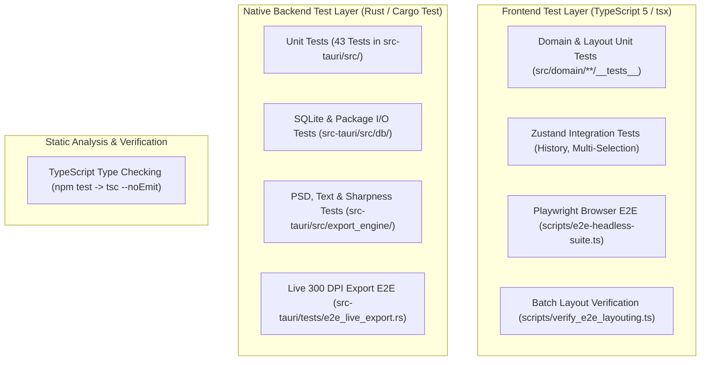

# Testing Architecture & Verification Protocols — OpenSmartAlbum (afsn)

**Analysis Date:** 2026-09-28  
**Repository:** `ryandxter/OpenSmartAlbum-MacOS`  
**Quality Focus:** Multi-Tier Testing Strategy (TypeScript Unit/Integration, Rust Native Unit/E2E, Playwright Headless Browser Automation)

---

## 1. Testing Framework Overview & Ecosystem

OpenSmartAlbum employs a tiered verification strategy designed to test pure geometric algorithms, state mutations, cross-platform SQLite storage, native Rust image rendering, and UI workflow integration:



### Framework Matrix

| Scope | Tool / Runner | Configuration File | Target Source Code |
|---|---|---|---|
| Static Type Verification | `tsc --noEmit` | `tsconfig.json` | All files in `src/` |
| Pure Math & State Tests | `tsx` (Node.js TypeScript runtime) | `tsconfig.json` | `src/domain/**/__tests__/*.test.ts`, `src/features/**/__tests__/*.test.ts` |
| Native Rust Core | `cargo test` | `src-tauri/Cargo.toml` | `src-tauri/src/` & `src-tauri/tests/` |
| Headless Browser & UI E2E | Playwright (`chromium`) + Vite Server | `scripts/e2e-headless-suite.ts` | Complete running Webview app |
| Layout Geometry Benchmark | `tsx` batch script | `scripts/verify_e2e_layouting.ts` | 15+ album presets & 3 carousel aspect ratios |

---

## 2. Test Directory Structure & Conventions

```
OpenSmartAlbum/
├── src/
│   ├── domain/
│   │   ├── __tests__/                      # Cross-domain invariant & layout tests
│   │   │   ├── adaptiveLayoutCache.test.ts # Memoization, WCAG contrast, LRU eviction
│   │   │   ├── carouselAspectCover.test.ts # Zero-stretch cover fit math
│   │   │   ├── carouselGenerativeCycling.test.ts # 50-cycle zero-loss invariant
│   │   │   ├── carouselLayout.test.ts      # 1:1, 4:5, 9:16 proportional scaling
│   │   │   └── vectorShapes.test.ts        # SVG paths, 1:1 centering, Canvas2D tracing
│   │   ├── layout/
│   │   │   └── __tests__/                  # Layout & adjacency algorithms
│   │   │       ├── dividerGraph.test.ts    # Adjacency graph, delta clamping
│   │   │       ├── dividerInteractionIntegration.test.ts # Batch atomic commits, swap
│   │   │       ├── generativeLayout.test.ts# Multi-photo BSP generation
│   │   │       └── heroAndFullBleed.test.ts# Full bleed spreads, hero preservation
│   │   ├── carousel/
│   │   │   └── __tests__/                  # Social carousel domain logic
│   │   │       ├── carouselDynamicCoordsAndPanoramas.test.ts # Dynamic offsets, spans
│   │   │       ├── carouselHistorySelection.test.ts # Multi-select, Cmd+A, undo/redo
│   │   │       └── panoramaSpan.test.ts    # Virtual slicing, auto-append slides
│   │   └── storytelling/
│   │       └── __tests__/                  # Intelligent auto-flow engine
│   │           ├── autoFlowIntegration.test.ts # 25-photo auto-flow, 1-step undo
│   │           └── temporalClusterer.test.ts # EXIF bursts, chapter breaks, cadence
│   └── features/
│       └── workspace/
│           └── __tests__/
│               └── spaceDisambiguation.test.ts # Keyboard space vs canvas pan
├── scripts/
│   ├── e2e-headless-suite.ts               # Programmatic Playwright test harness
│   ├── verify_e2e_layouting.ts             # Geometry verification & SVG artifact generator
│   └── capture-authentic-snapshot.ts       # Visual regression snapshot capture
└── src-tauri/
    ├── src/                                # Co-located unit tests (#[cfg(test)])
    │   ├── db/mod.rs                       # Database CRUD, versioning, duplicate
    │   ├── db/package_io.rs                # Atomic file writes, archive safety
    │   ├── export_engine/mod.rs            # Render parity, bleed, unit conversion
    │   ├── export_engine/text_rasterizer.rs# Text wrap, font metrics, rotation
    │   ├── export_engine/psd_writer.rs     # PSD binary PackBits & vector masks
    │   ├── export_engine/carousel_slicer.rs# High-res slice segmentation
    │   ├── photo_engine/mod.rs             # PNG transparency, metadata extraction
    │   ├── asset_cache.rs                  # Cache cleanup, orphan asset removal
    │   └── commands/photo_commands.rs      # Relinking matching algorithms
    └── tests/
        └── e2e_live_export.rs              # 300 DPI high-res live export integration
```

---

## 3. Existing Test Suites & Invariant Guarantees

### 3.1 Domain & Layout Test Suites

1. **`vectorShapes.test.ts` (Plan 09-01):**
   - *Suite 1: SVG Path Generation:* Asserts all 10 presets (`rectangle`, `rounded`, `circle`, `oval`, `hexagon`, `octagon`, `star`, `scallop`, `heart`, `custom_svg`) generate valid SVG path commands starting with `M` and terminating with `Z`.
   - *Suite 2: Geometric 1:1 Centering (Option A):* Enforces that non-rectangular shapes centered in asymmetrical frames preserve a true 1:1 aspect ratio mask.
   - *Suite 3: Canvas 2D Zero-Clip Invariant:* Validates that `drawShapeToContext` executes path commands onto a mock canvas context without prematurely invoking `ctx.clip()`.
   - *Suite 4: SVG Parser:* Verifies parsing of `M`, `L`, `H`, `V`, `C`, `S`, `Q`, `T`, `A`, `Z` command strings and chained coordinates.
   - *Suite 5: Store Integration:* Tests `carouselStore` frame selection, shape assignments, and border thickness mutations.

2. **`generativeLayout.test.ts` & `carouselGenerativeCycling.test.ts`:**
   - *Non-Destructive Cycle Invariant:* Executes 50 consecutive generative layout cycles across variable photo counts (1–12 photos) without dropping photo references or creating empty/unassigned frames.
   - *Aspect Ratio Cover:* Validates that photo cover calculations (`cropX`, `cropY`, `cropScale`) preserve zero distortion across portrait, landscape, and square frames.

3. **`dividerGraph.test.ts` & `dividerInteractionIntegration.test.ts`:**
   - *Adjacency Extraction:* Discovers shared edges between adjacent frames with configurable gap thresholds.
   - *Delta Clamping:* Calculates mathematical boundary limits (`minDelta`, `maxDelta`) so divider dragging preserves a minimum frame dimension (25.4mm / 1 inch).
   - *Atomic Commit:* Confirms `batchUpdateFrames` updates all affected frames in a single store transaction without geometric drift.
   - *Payload Swap:* Tests frame hit-testing (`findPhotoSwapTarget`) and verifies photo asset swap while maintaining frame geometries.

4. **`storytelling/temporalClusterer.test.ts` & `autoFlowIntegration.test.ts`:**
   - *Burst Detection:* Partitions photo batches into chapters (30-minute gaps) and scenes (5-minute gaps) using EXIF metadata.
   - *Cadence Diversity:* Eliminates monotonous layout repetition by classifying spreads into archetypes (Hero, Split, Grid, Panorama).
   - *Atomic Undo:* Validates that auto-flowing 25+ photos across 10 spreads can be reversed in a single `Cmd+Z` step.

5. **`adaptiveLayoutCache.test.ts`:**
   - *Deterministic LRU Cache:* Tests key generation, memoized layout retrieval, and LRU eviction under memory bounds.
   - *High-Contrast WCAG Compliance:* Asserts studio silhouette rendering passes WCAG 2.1 AA/AAA contrast ratios (4.8:1 active, 17.7:1 text).

### 3.2 Native Rust Backend Test Suites (43 Unit Tests + E2E)

| Module | Key Test Functions | Invariant Tested |
|---|---|---|
| `db::mod.rs` | `test_project_crud`<br>`test_batch_photo_insertion`<br>`test_duplicate_project`<br>`test_corner_radius_payload_deserialization_and_persistence` | Database schema initialization, project replication, JSON corner radius backward compatibility (scalar vs 4-corner tuple), batch photo inserts. |
| `db::package_io.rs` | `failed_write_preserves_existing_file_and_cleans_temporary`<br>`missing_photo_cannot_replace_a_complete_archive`<br>`import_rolls_back_on_invalid_membership_and_rejects_future_formats`<br>`extracted_package_edit_save_preserves_zip_and_photos` | **Atomic file writes** via temporary file rename; transactional rollback on corrupted package metadata; version ceiling check rejecting future unknown formats. |
| `export_engine` | `photo_and_border_share_object_opacity`<br>`pasteboard_photos_stay_outside_export_with_bleed`<br>`test_calculate_export_scale_physical_and_pixels`<br>`test_crop_pan_math_matches_konva`<br>`native_export_preserves_uniform_configured_gaps_across_units_and_dpi` | Pixel-perfect parity between webview Konva canvas and native Rust 300 DPI export renderer; bleed calculation; uniform gap preservation. |
| `export_engine::psd_writer` | `test_packbits_roundtrip_various_patterns`<br>`test_psd_binary_serializer_header_and_resources`<br>`test_shape_mask_circle_and_polygon_generation` | Adobe Photoshop PSD binary specification compliance; PackBits RLE compression roundtrips; vector clipping mask channels. |
| `export_engine::text_rasterizer` | `preview_positions_keep_the_last_word_in_export`<br>`test_user_rotated_scenario`<br>`test_ranges_to_text_runs` | Word wrap boundaries matching browser metrics; font fallbacks; arbitrary rotation angle rendering; rich text formatting spans. |
| `export_engine::carousel_slicer` | `test_export_carousel_slices_worker_generates_files`<br>`test_render_carousel_panorama_dimensions` | Seamless slicing across multi-slide panoramic boundaries without seam gaps. |
| `tests/e2e_live_export.rs` | `test_live_e2e_export_print_album_and_carousel` | End-to-end multi-spread 300 DPI render and carousel slicing using authentic high-resolution camera RAW/JPEG photos. |

---

## 4. How to Execute Tests

### 4.1 Running Frontend TypeScript Tests

- **Run Static Type Checking:**
  ```bash
  npm test
  # Runs: tsc --noEmit
  ```

- **Run an Individual Unit Test:**
  ```bash
  npx tsx src/domain/__tests__/vectorShapes.test.ts
  npx tsx src/domain/layout/__tests__/dividerGraph.test.ts
  npx tsx src/domain/storytelling/__tests__/autoFlowIntegration.test.ts
  ```

- **Run All Frontend Unit & Integration Tests:**
  ```bash
  for f in $(find src -name "*.test.ts"); do
    echo "=== Running $f ==="
    npx tsx "$f"
  done
  ```

### 4.2 Running Native Rust Tests

- **Run All Rust Unit Tests:**
  ```bash
  cd src-tauri
  cargo test --lib -- --nocapture
  ```

- **Run Specific Rust Test Modules:**
  ```bash
  cd src-tauri
  # Run only database package IO tests
  cargo test db::package_io -- --nocapture

  # Run only export engine tests
  cargo test export_engine:: -- --nocapture
  ```

- **Run Full Live High-Resolution Export E2E Test:**
  ```bash
  cd src-tauri
  cargo test --test e2e_live_export -- --nocapture
  ```

### 4.3 Running Playwright Headless Browser Automation

The headless browser suite tests UI interactions, photo drops, selection, keyboard shortcuts, and visual rendering in a real Chromium browser:

```bash

# Runs the full headless Playwright suite on port 5179

npx tsx scripts/e2e-headless-suite.ts
```

- Spawns an internal Vite dev server at `http://127.0.0.1:5179`.
- Boots Playwright Chromium in headless mode.
- Accesses window store handles via `(window as any).__STORES__`.
- Verifies DOM nodes, mode switching (Print Album ↔ Social Carousel), and captures forensic screenshots in `.planning/forensics/e2e-screenshots/`.

---

## 5. Mocking Patterns & Testing Strategies

### 5.1 Canvas 2D Context Mocking

Because Node.js does not provide an HTML5 Canvas environment, TypeScript tests that verify canvas drawing algorithms construct lightweight mock contexts conforming to `CanvasRenderingContext2D`:

```typescript
// Pattern in vectorShapes.test.ts:167-185
function createMockCanvasContext() {
  const operations: string[] = [];
  return {
    operations,
    beginPath: () => operations.push('beginPath'),
    moveTo: (x: number, y: number) => operations.push(`moveTo(${x},${y})`),
    lineTo: (x: number, y: number) => operations.push(`lineTo(${x},${y})`),
    bezierCurveTo: (cp1x, cp1y, cp2x, cp2y, x, y) => operations.push(`bezierCurveTo(...)`),
    quadraticCurveTo: (cpx, cpy, x, y) => operations.push(`quadraticCurveTo(...)`),
    arc: (x, y, r, sa, ea) => operations.push(`arc(${x},${y},${r})`),
    closePath: () => operations.push('closePath'),
    rect: (x, y, w, h) => operations.push(`rect(${x},${y},${w},${h})`),
    clip: () => {
      throw new Error('VIOLATION: ctx.clip() called inside shape tracing!');
    },
  } as unknown as CanvasRenderingContext2D;
}
```

This pattern guarantees:

1. Fast, headless execution in Node without native C++ canvas dependencies (`node-canvas`).
2. Immediate failure if an algorithm violates the zero-clip invariant.
3. Easy inspection of operation sequences.

### 5.2 Isolated SQLite Fixture Pattern in Rust

Rust database tests do not depend on the user's live database. Every test provisions an isolated, unique temporary directory that cleans up after execution:

```rust
// Pattern in src-tauri/src/db/mod.rs & package_io.rs
fn fixture() -> (Database, PathBuf) {
    let root = std::env::temp_dir().join(format!("afsn-test-{}", uuid::Uuid::new_v4()));
    fs::create_dir_all(&root).unwrap();
    let db_path = root.join("test.db");
    let db = Database::init(&db_path).expect("Failed to initialize test DB");
    (db, root)
}
```

- Each test receives a clean schema at the current migration version.
- Simulates crash scenarios, read-only permissions, and disk write errors safely without risking user albums.

### 5.3 Playwright Store Bridge Pattern

In `src/main.tsx`, Zustand stores are attached to `window.__STORES__` when running in browser environments:

```typescript
if (typeof window !== 'undefined') {
  (window as any).__STORES__ = {
    useProjectStore,
    useAlbumStore,
    useCarouselStore,
    usePhotoStore,
    useEditorStore,
  };
}
```

In `scripts/e2e-headless-suite.ts`, tests directly dispatch actions to seed state or verify reactive UI updates:

```typescript
await page.evaluate(() => {
  const { useAlbumStore } = (window as any).__STORES__;
  useAlbumStore.getState().createNewSpread();
});
```

This enables testing complex drag-and-drop and layout operations without relying on brittle DOM selectors or CSS class names.
