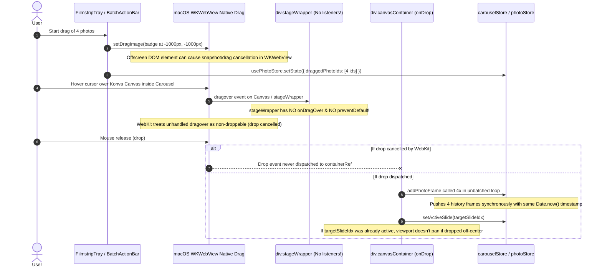

# Forensic Post-Mortem Report: Social Carousel Drag-and-Drop, Mode Isolation & Vector Mask Corner Radii

**Date:** 2026-09-28  
**Investigator:** GSD Forensics Subagent  
**Target Architecture:** OpenSmartAlbum macOS (Tauri v2 + React 18 + Konva + Zustand)  
**Status:** Read-Only Investigation Complete  

---

## Executive Summary

This forensic investigation analyzes four architectural and UX deficiencies reported in OpenSmartAlbum:
1. **Carousel Drag-and-Drop Failure:** Dropping photos (specifically multi-photo drags like 4 photos with the drag ghost badge) onto the Social Carousel canvas frequently leaves the canvas completely blank or fails silently.
2. **Context Menu & Double-Click Misrouting:** Right-clicking filmstrip photos and selecting "Place photos on spread" ([PhotoContextMenu.tsx:125-136](file:///Users/chiio/VSCode/albumaker/src/features/photos/PhotoContextMenu.tsx#L125-L136)) routes photos directly into the Print Album spread even when the user is in Social Carousel mode; filmstrip card double-click also leaks into the print album store.
3. **Workspace Mode & State Bleed:** No strict workspace isolation exists between Print Album (`mm`/`in` physical units at 300 PPI) and Social Carousel (fixed `1080×1080` / `1080×1350` px). `activeMode` is trapped in local React state in [WorkspaceLayout.tsx:101](file:///Users/chiio/VSCode/albumaker/src/features/workspace/WorkspaceLayout.tsx#L101), allowing shared zoom levels, leaking inspector toolbars ([FrameToolbar.tsx](file:///Users/chiio/VSCode/albumaker/src/features/editor/FrameToolbar.tsx#L16-L42)), un-isolated keyboard shortcuts, and missing SQLite persistence.
4. **Vector Shape Mask Corner Radii Artificial Restriction:** [ShapesBordersSection.tsx:303](file:///Users/chiio/VSCode/albumaker/src/features/inspector/sections/ShapesBordersSection.tsx#L303) artificially hides the corner radius slider and inputs for all non-rectangle shapes, while [shapes.ts](file:///Users/chiio/VSCode/albumaker/src/domain/shapes.ts#L42-L63) lacks vertex fillet/tangent rounding logic for polygons and stars.

---

## 1. Issue 1: Carousel Drag-and-Drop from Filmstrip Leaving Canvas Blank

### 1.1 Symptoms & User Context
- User selects multiple photos in the Filmstrip Tray (e.g. 4 photos).
- User initiates a drag gesture from either a selected filmstrip card ([FilmstripTray.tsx:354-393](file:///Users/chiio/VSCode/albumaker/src/features/photos/FilmstripTray.tsx#L354-L393)) or the batch drag handle in [BatchActionBar.tsx:99-132](file:///Users/chiio/VSCode/albumaker/src/features/photos/BatchActionBar.tsx#L99-L132).
- The drag ghost badge displays `📁 4 Photos Selected`.
- User releases the drag over the Social Carousel canvas.
- **Observed Result:** No frames appear on the slide; the canvas remains completely blank or unchanged.

### 1.2 Evidence & Root Causes



#### Root Cause 1A: Missing Drop Listeners on `.stageWrapper` in macOS WKWebView
- In [CarouselCanvas.tsx:853-885](file:///Users/chiio/VSCode/albumaker/src/features/carousel/CarouselCanvas.tsx#L853-L885):
  ```tsx
  <div
    ref={containerRef}
    className={`${styles.canvasContainer} ${isSpacePanning ? styles.panningMode : ''}`}
    onDragOver={handleDragOver}
    onDragLeave={handleDragLeave}
    onDrop={handleDrop}
  >
    <div className={styles.stageWrapper}>
      <Stage ref={stageRef} ...>
  ```
- Contrast this with [KonvaEditorCanvas.tsx:3020-3028](file:///Users/chiio/VSCode/albumaker/src/features/editor/KonvaEditorCanvas.tsx#L3020-L3028):
  ```tsx
  <div
    className={styles.stageWrapper}
    style={{ width: `${pasteboard.width}px`, height: `${pasteboard.height}px` }}
    onDragOver={handleDragOver}
    onDragLeave={handleDragLeave}
    onDrop={handleDrop}
  >
  ```
- In macOS WKWebView (Tauri runtime), `.stageWrapper` is styled with `position: absolute; inset: 0; width: 100%; height: 100%; overflow: hidden;` ([CarouselCanvas.module.css:31-37](file:///Users/chiio/VSCode/albumaker/src/features/carousel/CarouselCanvas.module.css#L31-L37)). When the cursor is over the Konva canvas, drag events hit the canvas inside `.stageWrapper`. Because `.stageWrapper` lacks `onDragOver` with `e.preventDefault()`, WebKit marks the drop target invalid or cancels the native drag session before the drop event bubbles to `containerRef`.

#### Root Cause 1B: Offscreen Ghost Badge Set in `setDragImage`
- In [FilmstripTray.tsx:371-392](file:///Users/chiio/VSCode/albumaker/src/features/photos/FilmstripTray.tsx#L371-L392) and [BatchActionBar.tsx:110-132](file:///Users/chiio/VSCode/albumaker/src/features/photos/BatchActionBar.tsx#L110-L132):
  ```typescript
  let badge = document.getElementById('afsn-drag-ghost-badge');
  if (!badge) {
    badge = document.createElement('div');
    badge.id = 'afsn-drag-ghost-badge';
    badge.style.position = 'fixed';
    badge.style.top = '-1000px';
    badge.style.left = '-1000px';
    ...
    document.body.appendChild(badge);
  }
  badge.textContent = `📁 ${ids.length} Photos Selected`;
  e.dataTransfer.setDragImage(badge, 20, 16);
  ```
- `setDragImage` on an element placed at `-1000px, -1000px` causes WebKit on macOS to attempt rasterizing a frame completely outside the viewport clipping bounds. In certain WKWebView builds, this results in an invalid pasteboard drag image or triggers premature cancellation of the drag session.

#### Root Cause 1C: Coordinate Calculation Mismatch & Viewport Desynchronization
- In [CarouselCanvas.tsx:736-743](file:///Users/chiio/VSCode/albumaker/src/features/carousel/CarouselCanvas.tsx#L736-L743):
  ```typescript
  const box = stageRef.current?.container().getBoundingClientRect() || containerRef.current?.getBoundingClientRect();
  const canvasX = (e.clientX - (box?.left ?? 0) - stagePos.x) / scale;
  const canvasY = (e.clientY - (box?.top ?? 0) - stagePos.y) / scale;
  const targetSlideIdx = getSlideIndexAtX(currentCarousel, canvasX);
  const slideW = currentCarousel.slideWidthPx;
  const slideH = currentCarousel.slideHeightPx;
  const slideStartX = getSlideXOffset(currentCarousel, targetSlideIdx);
  ```
- In [domain/carousel.ts:163-166](file:///Users/chiio/VSCode/albumaker/src/domain/carousel.ts#L163-L166):
  ```typescript
  export function getSlideIndexAtX(carousel: Carousel, x: number): number {
    const index = Math.floor(x / carousel.slideWidthPx);
    return Math.max(0, Math.min(carousel.slides.length - 1, index));
  }
  ```
- If the carousel is zoomed in or panned, dropping near the edge or outside slide bounds clamps `targetSlideIdx` to `0` or `N-1`. The 4 frames are partitioned and placed onto `targetSlideIdx` ([CarouselCanvas.tsx:821-840](file:///Users/chiio/VSCode/albumaker/src/features/carousel/CarouselCanvas.tsx#L821-L840)).
- However, [CarouselCanvas.tsx:382](file:///Users/chiio/VSCode/albumaker/src/features/carousel/CarouselCanvas.tsx#L382) guards:
  ```typescript
  if (prevActiveSlideRef.current === activeSlideIndex) return;
  ```
  If `activeSlideIndex` was already `targetSlideIdx`, the auto-bring-into-view logic exits immediately. The frames are placed on a slide that is scrolled out of the current viewport, making the visible screen appear blank!

#### Root Cause 1D: Non-Atomic Multi-Photo Addition & History Pollution
- In [CarouselCanvas.tsx:821-840](file:///Users/chiio/VSCode/albumaker/src/features/carousel/CarouselCanvas.tsx#L821-L840):
  ```typescript
  photosToPlace.forEach((photo, idx) => {
    ...
    addPhotoFrame(targetSlideIdx, { ... });
  });
  ```
- In [carouselStore.ts:366-385](file:///Users/chiio/VSCode/albumaker/src/stores/carouselStore.ts#L366-L385):
  `addPhotoFrame` calls `pushHistory()` on every single photo. For 4 photos, 4 state transitions and 4 undo snapshots are generated within the same microsecond. A failure during intermediate renders leaves a partially populated or corrupted state.

---

## 2. Issue 2: Right-Click Context Menu & Double-Click Misrouting to Print Album

### 2.1 Symptoms
- In Social Carousel mode, user right-clicks a photo card in the filmstrip.
- The context menu displays "Place on Spread Canvas" or "Place 4 Photos on Spread" instead of "Place on Slide".
- Clicking the option places the photos onto a print album spread in `useAlbumStore`, having zero effect on the active carousel.
- Double-clicking a photo card in the filmstrip under certain conditions also places the photo onto a print spread.

### 2.2 Evidence & Root Causes

#### Root Cause 2A: Context Menu Hardcoded to Album Store
- In [PhotoContextMenu.tsx:125-136](file:///Users/chiio/VSCode/albumaker/src/features/photos/PhotoContextMenu.tsx#L125-L136):
  ```tsx
  <button
    type="button"
    className={styles.menuItem}
    style={{ color: 'var(--color-accent)', fontWeight: 600 }}
    onClick={() => {
      onClose();
      const { currentAlbum, activeSpreadId } = useAlbumStore.getState();
      if (currentAlbum) {
        const allSpreads = getAllAlbumSpreads(currentAlbum);
        const activeSpread = allSpreads.find((s) => s.id === activeSpreadId) || allSpreads[0];
        if (activeSpread) {
          const toPlace = isMulti ? selectedPhotos : [targetPhoto];
          useEditorStore.getState().addPhotosToSpread(activeSpread.id, toPlace);
        }
      }
    }}
  >
    <span className={styles.menuIcon}><Image size={14} strokeWidth={1.5} /></span>
    <span>{isMulti ? `Place ${count} Photos on Spread` : 'Place on Spread Canvas'}</span>
  </button>
  ```
- `PhotoContextMenu` has **zero awareness of the active mode**. It does not accept `activeMode` in its props ([PhotoContextMenu.tsx:23-41](file:///Users/chiio/VSCode/albumaker/src/features/photos/PhotoContextMenu.tsx#L23-L41)) and unconditionally invokes `useEditorStore.getState().addPhotosToSpread(...)`.

#### Root Cause 2B: `FilmstripTray` Does Not Pass `activeMode` to `PhotoContextMenu`
- In [FilmstripTray.tsx:982-995](file:///Users/chiio/VSCode/albumaker/src/features/photos/FilmstripTray.tsx#L982-L995):
  ```tsx
  {contextMenuState.isOpen && contextMenuState.photo && (
    <PhotoContextMenu
      isOpen={contextMenuState.isOpen}
      x={contextMenuState.x}
      y={contextMenuState.y}
      targetPhoto={contextMenuState.photo}
      selectedPhotos={contextMenuState.selectedPhotos}
      folders={folders}
      activeFolderId={activeFolderId}
      onClose={() => setContextMenuState((s) => ({ ...s, isOpen: false }))}
      onToggleFavorite={toggleFavorite}
      onBatchToggleFavorite={batchToggleFavoritesSelected}
      ...
    />
  )}
  ```
  `FilmstripTray` receives `activeMode` from `WorkspaceLayout.tsx:1109`, but completely omits passing it to `PhotoContextMenu`.

#### Root Cause 2C: Double-Click Fallback When `activeMode` Defaults to `'print'`
- In [FilmstripTray.tsx:764-818](file:///Users/chiio/VSCode/albumaker/src/features/photos/FilmstripTray.tsx#L764-L818):
  ```tsx
  onDoubleClick={() => {
    if (activeMode === 'carousel') {
      const { currentCarousel, activeSlideIndex, addPhotoFrame } = useCarouselStore.getState();
      ...
      return;
    }

    const { currentAlbum, activeSpreadId } = useAlbumStore.getState();
    if (currentAlbum) {
      const allSpreads = getAllAlbumSpreads(currentAlbum);
      const activeSpread = allSpreads.find((s) => s.id === activeSpreadId) || allSpreads[0];
      if (activeSpread) {
        useEditorStore.getState().addPhotoToSpread(activeSpread.id, photo);
      }
    }
  }}
  ```
  Because `activeMode` in `WorkspaceLayout.tsx` initializes to `'print'` by default (even for carousel projects, see Section 3), any double-click immediately falls through to line 807, routing photos to `useAlbumStore` and `useEditorStore`. Furthermore, the double-click handler only places a single photo even when multiple are selected.

---

## 3. Issue 3: Lack of Strict Workspace Mode Isolation & Canvas Locking

### 3.1 Architecture Review

```
┌────────────────────────────────────────────────────────────────────────┐
│                        WorkspaceLayout.tsx                             │
│  activeMode: useState<'print'|'carousel'>('print')  <-- LOCAL STATE!   │
│  zoomLevel: useState<number>(100)                   <-- SHARED STATE!  │
├───────────────────────────────────┬────────────────────────────────────┤
│         PRINT WORKSPACE           │         CAROUSEL WORKSPACE         │
│  - Dimension: mm / cm / in / pt   │  - Dimension: Fixed px (1080x1080) │
│  - Resolution: 300 PPI            │  - Resolution: 96 / 72 DPI (web)   │
│  - Storage: SQLite (db.ts)        │  - Storage: In-memory only!        │
│  - Store: useAlbumStore           │  - Store: useCarouselStore         │
│  - Elements: PhotoFrameElement    │  - Elements: CarouselPhotoFrame    │
│  - Canvas: KonvaEditorCanvas      │  - Canvas: CarouselCanvas          │
└───────────────────────────────────┴────────────────────────────────────┘
         ▲                                   ▲
         │                                   │
         └── LEAKAGE: Shortcuts (T, L, G, P) ┘
         └── LEAKAGE: FrameToolbar bound to useEditorStore
         └── LEAKAGE: Inspector Panels bound to useAlbumStore
```

### 3.2 Evidence & Root Causes

#### Root Cause 3A: `activeMode` Trapped in Local Component State
- In [WorkspaceLayout.tsx:101-103](file:///Users/chiio/VSCode/albumaker/src/features/workspace/WorkspaceLayout.tsx#L101-L103):
  ```typescript
  const [activeMode, setActiveMode] = useState<'print' | 'carousel'>('print');
  const activeModeRef = useRef(activeMode);
  activeModeRef.current = activeMode;
  ```
- Neither [appStore.ts](file:///Users/chiio/VSCode/albumaker/src/stores/appStore.ts) nor [editorStore.ts](file:///Users/chiio/VSCode/albumaker/src/stores/editorStore.ts) contains `activeMode`.
- When a user opens an existing project or creates a project via [NewProjectDialog.tsx:381-384](file:///Users/chiio/VSCode/albumaker/src/features/project/NewProjectDialog.tsx#L381-L384):
  Even if the project was created with `canvas.unit === 'px'` (Social Carousel), `WorkspaceLayout.tsx` resets `activeMode` to `'print'` on mount.
- There is no automatic mode detection based on `project.settings.canvas.unit` or `project.projectType`.

#### Root Cause 3B: Shared Zoom Level Across Different Coordinate Systems
- In [WorkspaceLayout.tsx:93](file:///Users/chiio/VSCode/albumaker/src/features/workspace/WorkspaceLayout.tsx#L93):
  ```typescript
  const [zoomLevel, setZoomLevel] = useState<number>(100);
  ```
- Print Album spreads are measured in physical units (`mm`) at 300 PPI (e.g. 400mm spread = 4724 px wide), which typically require a zoom level of 20%–35% to fit on screen.
- Social Carousels are measured in fixed screen pixels (e.g. 1080px per slide).
- Because `zoomLevel` is shared, switching between modes results in extreme over-zoom or microscopic scaling. No per-mode zoom level is retained.

#### Root Cause 3C: `FrameToolbar` Leaking Print Store Actions into Carousel Canvas
- In [WorkspaceLayout.tsx:1057-1067](file:///Users/chiio/VSCode/albumaker/src/features/workspace/WorkspaceLayout.tsx#L1057-L1067):
  ```tsx
  ) : activeMode === 'carousel' ? (
    <>
      <CarouselCanvas
        zoomLevel={zoomLevel}
        fitTrigger={fitTrigger}
        onZoomChange={setZoomLevel}
        onToast={showToast}
      />
      <FrameToolbar />
    </>
  )
  ```
- In [FrameToolbar.tsx:16-42](file:///Users/chiio/VSCode/albumaker/src/features/editor/FrameToolbar.tsx#L16-L42):
  ```typescript
  import { useEditorStore } from '../../stores/editorStore';
  import { useAlbumStore } from '../../stores/albumStore';
  ...
  const { currentAlbum, activeSpreadId } = useAlbumStore();
  const { selectedFrameIds } = useEditorStore();
  if (!currentAlbum || selectedFrameIds.length === 0) return null;
  ```
- `FrameToolbar` does NOT bind to `useCarouselStore`. If an album element was selected before switching to carousel mode, `FrameToolbar` renders floating controls over the carousel canvas and mutates elements on the hidden print spread!

#### Root Cause 3D: Un-isolated Keyboard Shortcuts
- In [WorkspaceLayout.tsx:758-842](file:///Users/chiio/VSCode/albumaker/src/features/workspace/WorkspaceLayout.tsx#L758-L842):
  Key presses for `P` (Properties), `L` (Lock), `G` (Smart Layout), and `T` (Add Text Box) directly execute `useEditorStore` methods (e.g. `addTextToSpread(activeSpreadId)` at line 835) without checking if `activeMode === 'carousel'`.

#### Root Cause 3E: Missing SQLite Persistence for Carousel
- Print albums persist to SQLite via `useAlbumStore.getState().loadAlbumFromDb(currentProject.id)` ([WorkspaceLayout.tsx:711](file:///Users/chiio/VSCode/albumaker/src/features/workspace/WorkspaceLayout.tsx#L711)).
- `carouselStore` has no database table or persistence layer. Reopening a project loses all carousel slides unless re-initialized from scratch.

---

## 4. Issue 4: Vector Shape Masks Lacking Corner Radius & UI Restrictions

### 4.1 Symptoms
- In the Inspector's "Shapes & Borders" section, selecting any shape preset other than "Rectangle" or "Rounded Rect" causes the Corner Radius slider and individual TL/TR/BR/BL inputs to completely disappear.
- Users cannot round the corners of a Hexagon, Octagon, Star, or custom polygon.

### 4.2 Evidence & Root Causes

#### Root Cause 4A: Artificial UI Restriction in Inspector
- In [ShapesBordersSection.tsx:303](file:///Users/chiio/VSCode/albumaker/src/features/inspector/sections/ShapesBordersSection.tsx#L303):
  ```tsx
  {/* 2. Corner Radii (For Rectangle / Rounded) */}
  {(currentShape === 'rectangle' || currentShape === 'rounded') && (
    <>
      <div className={styles.divider} />
      <div className={styles.propGroup}>
        <div className={styles.groupHeader}>
          <span className={styles.label}>Corner Radius</span>
          ...
  ```
- The JSX explicitly gates the entire Corner Radius property group behind `currentShape === 'rectangle' || currentShape === 'rounded'`. For `hexagon`, `octagon`, `star`, `scallop`, `heart`, or `custom_svg`, the controls are completely removed from the DOM.

#### Root Cause 4B: Generator Functions in `shapes.ts` Lack Vertex Fillet / Tangent Logic
- In [shapes.ts:42-63](file:///Users/chiio/VSCode/albumaker/src/domain/shapes.ts#L42-L63):
  ```typescript
  export function createPolygonSvgPath(sides: number, width: number, height: number): string {
    const size = Math.min(width, height);
    const rx = size / 2;
    const ry = size / 2;
    const cx = width / 2;
    const cy = height / 2;

    let path = '';
    for (let i = 0; i < sides; i++) {
      const angle = (i * 2 * Math.PI) / sides - Math.PI / 2;
      const x = cx + rx * Math.cos(angle);
      const y = cy + ry * Math.sin(angle);
      if (i === 0) path += `M ${x.toFixed(2)} ${y.toFixed(2)}`;
      else path += ` L ${x.toFixed(2)} ${y.toFixed(2)}`;
    }
    path += ' Z';
    return path;
  }
  ```
- In [shapes.ts:699-712](file:///Users/chiio/VSCode/albumaker/src/domain/shapes.ts#L699-L712):
  ```typescript
  } else if (shapeType === 'hexagon' || shapeType === 'octagon') {
    const sides = shapeType === 'hexagon' ? 6 : 8;
    ...
    for (let i = 0; i < sides; i++) {
      ...
      if (i === 0) c.moveTo(x, y);
      else c.lineTo(x, y);
    }
  ```
- Neither `createPolygonSvgPath`, `createStarSvgPath`, nor `drawShapeToContext` takes or computes a corner radius fillet. Vertices are connected purely by sharp straight lines (`lineTo`).

### 4.3 Technical Solution for Polygon & Vector Corner Rounding

To achieve Figma-style vertex rounding on polygons and stars:

#### Mathematical Algorithm (Vertex Fillet Arc):
For each vertex $V_i$ of a polygon with $N$ vertices:
1. Identify incoming neighbor $V_{prev} = V_{i-1}$ and outgoing neighbor $V_{next} = V_{i+1}$.
2. Compute normalized edge vectors:
   $$\vec{u}_{in} = \frac{V_i - V_{prev}}{|V_i - V_{prev}|}, \quad \vec{u}_{out} = \frac{V_{next} - V_i}{|V_{next} - V_i|}$$
3. Interior angle $\theta$:
   $$\cos \theta = -\vec{u}_{in} \cdot \vec{u}_{out}$$
4. Tangent setback distance $d$ for target radius $r$:
   $$d = \min\left(d_{max}, \frac{r}{\tan(\theta / 2)}\right), \quad \text{where } d_{max} = \frac{\min(|V_i - V_{prev}|, |V_{next} - V_i|)}{2}$$
5. Tangent points:
   $$P_{start} = V_i - d \cdot \vec{u}_{in}, \quad P_{end} = V_i + d \cdot \vec{u}_{out}$$
6. **Path Command:**
   - Draw straight line to $P_{start}$: `L P_start.x P_start.y`
   - Draw rounding curve to $P_{end}$:
     - Canvas 2D: Native `c.arcTo(V_i.x, V_i.y, V_{next}.x, V_{next}.y, r)` automatically creates the tangent fillet!
     - SVG Path: Quadratic bezier `Q V_i.x V_i.y P_end.x P_end.y` or circular arc `A r r 0 0 1 P_end.x P_end.y`.

---

## 5. Prioritized Remediation Roadmap

| Priority | Issue | Affected Files | Fix Description |
|---|---|---|---|
| **P0** | Carousel Drag Drop Blank Canvas | `CarouselCanvas.tsx`, `FilmstripTray.tsx`, `BatchActionBar.tsx` | 1. Add `onDragOver`, `onDragLeave`, `onDrop` directly to `.stageWrapper`.<br>2. Position drag ghost badge in-bounds (`display: block; opacity: 0.01; pointer-events: none`).<br>3. Batch add photo frames into a single state update with single history commit.<br>4. Ensure viewport auto-scrolls to target slide on drop. |
| **P0** | Context Menu & Double-Click Misrouting | `PhotoContextMenu.tsx`, `FilmstripTray.tsx` | 1. Add `activeMode?: 'print' \| 'carousel'` prop to `PhotoContextMenu`.<br>2. In `PhotoContextMenu:125`, branch on `activeMode`: call `carouselStore.addPhotoFrame` if `'carousel'`, else `editorStore.addPhotosToSpread`.<br>3. Pass `activeMode` from `FilmstripTray` to `PhotoContextMenu`.<br>4. Ensure double-click handles multi-selection batch placement in both modes. |
| **P1** | Workspace Mode Isolation & Persistence | `appStore.ts`, `WorkspaceLayout.tsx`, `carouselStore.ts`, `FrameToolbar.tsx` | 1. Elevate `activeMode` to global `appStore` (or `projectStore`).<br>2. Auto-detect mode on project load (`canvas.unit === 'px'` $\to$ `'carousel'`).<br>3. Isolate zoom levels (`printZoom` vs `carouselZoom`).<br>4. Hide/adapt `FrameToolbar` for carousel frame manipulation.<br>5. Restrict single-key shortcuts when in carousel mode.<br>6. Implement SQLite persistence for carousel projects. |
| **P2** | Vector Shape Mask Corner Radii | `ShapesBordersSection.tsx`, `shapes.ts` | 1. Remove artificial check `currentShape === 'rectangle' \|\| currentShape === 'rounded'` in `ShapesBordersSection.tsx:303` to show Corner Radius for all polygon presets.<br>2. Implement vertex tangent fillet rounding in `createPolygonSvgPath`, `createStarSvgPath`, and `drawShapeToContext`. |

---

## 6. Conclusion
The four reported issues stem from:
1. WebKit-specific drag target isolation gaps (`stageWrapper` missing handlers and offscreen drag badge clipping).
2. Tightly coupled print album assumptions in UI sub-components (`PhotoContextMenu.tsx` hardcoded to `albumStore`).
3. Mode state residing in ephemeral component state (`WorkspaceLayout.tsx:101`) rather than a unified global store.
4. An artificial UI condition in `ShapesBordersSection.tsx` coupled with a lack of fillet rounding in `shapes.ts`.

All findings have been grounded in exact source file paths and line numbers. Implementing the recommendations outlined in Section 5 will fully resolve the issues.
