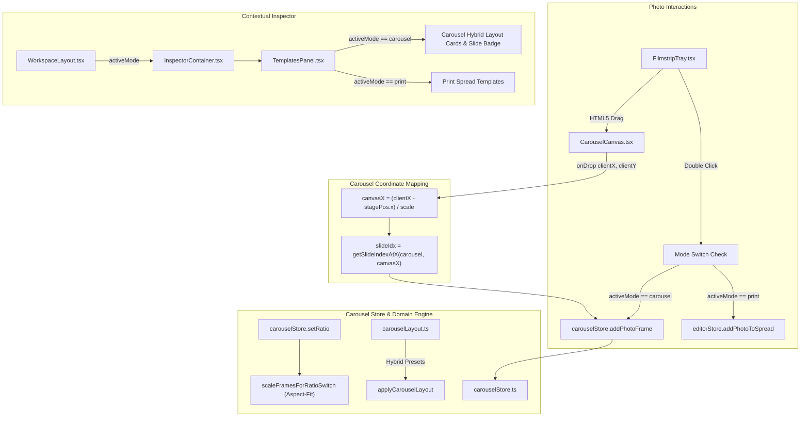

# Plan 07-01: Social Carousel Hybrid Layout & Photo Placement Engine

**Phase:** [OSAM-07: Social Carousel Hybrid Layout & Photo Placement Engine](file:///.planning/phases/OSAM-07-carousel-hybrid-layout-photo-placement/07-CONTEXT.md)  
**Plan ID:** `07-01`  
**Goal:** Enable full interactive photo placement (drag-and-drop and double-click) onto Social Carousel slides, implement the Carousel Hybrid Layout Generator (per-slide layouts and seamless swipeable multi-slide panoramic spans), support proportional aspect-fit scaling upon aspect ratio changes (1:1 ↔ 4:5 ↔ 9:16), and integrate Carousel Mode context into the Inspector and Templates sidebar.  
**Dependencies:** Phase 06 ([OSAM-06: Finder Drag-and-Drop Dual Ingestion](file:///.planning/phases/OSAM-06-finder-drag-drop-dual-ingestion/06-CONTEXT.md))  
**Requirements Addressed:** [D-01](file:///.planning/phases/OSAM-07-carousel-hybrid-layout-photo-placement/07-CONTEXT.md#L17-L21), [D-02](file:///.planning/phases/OSAM-07-carousel-hybrid-layout-photo-placement/07-CONTEXT.md#L22-L24), [D-03](file:///.planning/phases/OSAM-07-carousel-hybrid-layout-photo-placement/07-CONTEXT.md#L25-L27), [D-04](file:///.planning/phases/OSAM-07-carousel-hybrid-layout-photo-placement/07-CONTEXT.md#L29-L33), [D-05](file:///.planning/phases/OSAM-07-carousel-hybrid-layout-photo-placement/07-CONTEXT.md#L35-L39), [D-06](file:///.planning/phases/OSAM-07-carousel-hybrid-layout-photo-placement/07-CONTEXT.md#L41-L46)  
**Canonical References:**
- [.planning/FORENSICS.md Section 2](file:///.planning/FORENSICS.md#L60-L103)
- [.planning/CODE-REVIEW.md Section 2](file:///.planning/CODE-REVIEW.md#L42-L96)
- [.planning/UI-REVIEW.md Section 2](file:///.planning/UI-REVIEW.md#L35-L55)
- [src/domain/carousel.ts](file:///Users/chiio/VSCode/albumaker/src/domain/carousel.ts)
- [src/stores/carouselStore.ts](file:///Users/chiio/VSCode/albumaker/src/stores/carouselStore.ts)
- [src/features/carousel/CarouselCanvas.tsx](file:///Users/chiio/VSCode/albumaker/src/features/carousel/CarouselCanvas.tsx)
- [src/features/photos/FilmstripTray.tsx](file:///Users/chiio/VSCode/albumaker/src/features/photos/FilmstripTray.tsx)
- [src/features/inspector/InspectorContainer.tsx](file:///Users/chiio/VSCode/albumaker/src/features/inspector/InspectorContainer.tsx)
- [src/features/templates/TemplatesPanel.tsx](file:///Users/chiio/VSCode/albumaker/src/features/templates/TemplatesPanel.tsx)

---

## Context & Strategy

In OpenSmartAlbum v1.0.77, Social Carousel Mode functions as an isolated viewer rather than an interactive layout design canvas:
1. **Interactive Drop Broken on Carousel Canvas (CR-03, Incident 2):** Dragging photos from the filmstrip tray onto `CarouselCanvas.tsx` fails because the canvas container has zero `onDragOver` and `onDrop` handlers. Dragging triggers default browser drop rejection.
2. **Tray Double-Click Hardcoded to Album Mode (CR-04):** In `FilmstripTray.tsx`, double-clicking a photo queries `useAlbumStore` and calls `useEditorStore.getState().addPhotoToSpread`, attempting to modify an invisible album spread while in Carousel Mode.
3. **Used Photo Indicator Excludes Carousel (CR-05):** `FilmstripTray.tsx` only inspects `currentAlbum.spreads`, causing photos placed on carousel slides to remain marked as unused.
4. **Ratio Switch Distorts / Clips Elements (D-05):** Switching between `1:1`, `4:5`, and `9:16` updates slide dimensions but leaves existing frames at their old pixel coordinates and dimensions, causing clipping or placing them off-canvas.
5. **Inspector / Templates Disconnected from Carousel (CR-06, D-04, D-06):** `InspectorContainer.tsx` and `TemplatesPanel.tsx` assume print spreads. In Carousel Mode, the header displays incorrect spread labels and physical album templates instead of Carousel Hybrid layouts (per-slide grids and seamless swipeable panoramic spans). Additionally, inactive template preview tiles suffer from near-zero contrast against dark surfaces.

Phase 07 resolves these discrepancies comprehensively across the domain, store, and UI layers.



---

## Tasks

<task id="07-01-01">
### Task 1: HTML5 drag-over and drop event handlers on `CarouselCanvas.tsx`
**Target File:** [`src/features/carousel/CarouselCanvas.tsx`](file:///Users/chiio/VSCode/albumaker/src/features/carousel/CarouselCanvas.tsx)  
**Decisions Addressed:** [D-01](file:///.planning/phases/OSAM-07-carousel-hybrid-layout-photo-placement/07-CONTEXT.md#L17-L21) (Canvas Interactive Drop & Placement)  
**Canonical References:** [.planning/FORENSICS.md Section 2](file:///.planning/FORENSICS.md#L72-L74), [.planning/CODE-REVIEW.md CR-03](file:///.planning/CODE-REVIEW.md#L46-L70)

**Implementation Details:**
1. In `src/features/carousel/CarouselCanvas.tsx`, locate the canvas outer container `div` (line ~281).
2. Add drop state tracking:
   ```ts
   const [hoveredDropSlideIndex, setHoveredDropSlideIndex] = useState<number | null>(null);
   ```
3. Implement `handleDragOver`:
   ```ts
   const handleDragOver = (e: React.DragEvent) => {
     e.preventDefault();
     e.dataTransfer.dropEffect = 'copy';
     if (!currentCarousel) return;
     const stageBox = containerRef.current?.getBoundingClientRect();
     if (!stageBox) return;
     const canvasX = (e.clientX - stagePos.x) / scale;
     const targetIdx = getSlideIndexAtX(currentCarousel, canvasX);
     setHoveredDropSlideIndex(targetIdx);
   };
   ```
4. Implement `handleDragLeave`:
   ```ts
   const handleDragLeave = (e: React.DragEvent) => {
     if (!containerRef.current?.contains(e.relatedTarget as Node)) {
       setHoveredDropSlideIndex(null);
     }
   };
   ```
5. Implement `handleDrop`:
   ```ts
   const handleDrop = (e: React.DragEvent) => {
     e.preventDefault();
     e.stopPropagation();
     setHoveredDropSlideIndex(null);
     if (!currentCarousel) return;

     // Extract photo IDs from drag payload
     let photoIds: string[] = [];
     try {
       const raw = e.dataTransfer.getData('application/x-afsn-photo-ids') || e.dataTransfer.getData('application/json');
       if (raw) {
         const parsed = JSON.parse(raw);
         if (Array.isArray(parsed)) photoIds = parsed.filter((id): id is string => typeof id === 'string');
         else if (typeof parsed?.id === 'string') photoIds = [parsed.id];
       }
     } catch {}
     if (photoIds.length === 0) {
       const textId = e.dataTransfer.getData('text/plain');
       if (textId) photoIds = [textId];
     }

     const libraryPhotos = usePhotoStore.getState().photos;
     const byId = new Map(libraryPhotos.map((p) => [p.id, p]));
     const photosToPlace = [...new Set(photoIds)].map((id) => byId.get(id)).filter(Boolean);
     if (photosToPlace.length === 0) return;

     // Translate viewport coords to canvas continuous space
     const canvasX = (e.clientX - stagePos.x) / scale;
     const canvasY = (e.clientY - stagePos.y) / scale;
     const targetSlideIdx = getSlideIndexAtX(currentCarousel, canvasX);
     const slideW = currentCarousel.slideWidthPx;
     const slideH = currentCarousel.slideHeightPx;
     const slideStartX = getSlideXOffset(currentCarousel, targetSlideIdx);

     const { addPhotoFrame, setActiveSlide } = useCarouselStore.getState();

     if (photosToPlace.length === 1) {
       const photo = photosToPlace[0]!;
       const aspect = photo.aspectRatio || (photo.width && photo.height ? photo.width / photo.height : 1.0);
       const maxW = slideW * 0.8;
       const maxH = slideH * 0.8;
       let frameW = maxW;
       let frameH = maxW / aspect;
       if (frameH > maxH) {
         frameH = maxH;
         frameW = maxH * aspect;
       }
       const dropRelX = canvasX - slideStartX;
       const posX = slideStartX + Math.max(20, Math.min(slideW - frameW - 20, dropRelX - frameW / 2));
       const posY = Math.max(20, Math.min(slideH - frameH - 20, canvasY - frameH / 2));

       addPhotoFrame(targetSlideIdx, {
         type: 'photo',
         photoId: photo.id,
         filePath: photo.filePath,
         fileName: photo.fileName,
         previewPath: photo.previewPath,
         thumbnailPath: photo.thumbnailPath,
         photoAspect: aspect,
         x: Math.round(posX),
         y: Math.round(posY),
         width: Math.round(frameW),
         height: Math.round(frameH),
       });
     } else {
       // Multi-photo drop: partition onto slide with uniform spacing
       const margin = 40;
       const spacing = 16;
       const usableW = slideW - margin * 2;
       const usableH = slideH - margin * 2;
       const count = photosToPlace.length;
       const cols = count <= 2 ? 1 : 2;
       const rows = Math.ceil(count / cols);
       const cellW = (usableW - spacing * (cols - 1)) / cols;
       const cellH = (usableH - spacing * (rows - 1)) / rows;

       photosToPlace.forEach((photo, idx) => {
         const col = idx % cols;
         const row = Math.floor(idx / cols);
         const posX = slideStartX + margin + col * (cellW + spacing);
         const posY = margin + row * (cellH + spacing);
         const aspect = photo.aspectRatio || (photo.width && photo.height ? photo.width / photo.height : 1.0);
         addPhotoFrame(targetSlideIdx, {
           type: 'photo',
           photoId: photo.id,
           filePath: photo.filePath,
           fileName: photo.fileName,
           previewPath: photo.previewPath,
           thumbnailPath: photo.thumbnailPath,
           photoAspect: aspect,
           x: Math.round(posX),
           y: Math.round(posY),
           width: Math.round(cellW),
           height: Math.round(cellH),
         });
       });
     }

     setActiveSlide(targetSlideIdx);
     // Update usedCount in photoStore
     const placedIdSet = new Set(photosToPlace.map((p) => p.id));
     usePhotoStore.setState((s) => ({
       photos: s.photos.map((p) => (placedIdSet.has(p.id) ? { ...p, usedCount: (p.usedCount || 0) + 1 } : p)),
     }));
     onToast?.(`Added ${photosToPlace.length} photo${photosToPlace.length > 1 ? 's' : ''} to Slide ${targetSlideIdx + 1}`);
   };
   ```
6. Bind `onDragOver={handleDragOver}`, `onDragLeave={handleDragLeave}`, and `onDrop={handleDrop}` to the container `div`.
7. Render visual drop target feedback (subtle dashed border highlight on the slide matching `hoveredDropSlideIndex`).

**Verification Command:**
```bash
npm run test
```
</task>

---

<task id="07-01-02">
### Task 2: FilmstripTray double-click and used-photo tracking for Carousel Mode
**Target Files:**
- [`src/features/photos/FilmstripTray.tsx`](file:///Users/chiio/VSCode/albumaker/src/features/photos/FilmstripTray.tsx)
- [`src/features/workspace/WorkspaceLayout.tsx`](file:///Users/chiio/VSCode/albumaker/src/features/workspace/WorkspaceLayout.tsx)  
**Decisions Addressed:** [D-02](file:///.planning/phases/OSAM-07-carousel-hybrid-layout-photo-placement/07-CONTEXT.md#L22-L24) (Tray Double-Click), [D-03](file:///.planning/phases/OSAM-07-carousel-hybrid-layout-photo-placement/07-CONTEXT.md#L25-L27) (Used Photo Tracking)  
**Canonical References:** [.planning/FORENSICS.md Section 2](file:///.planning/FORENSICS.md#L75-L90), [.planning/CODE-REVIEW.md CR-04, CR-05](file:///.planning/CODE-REVIEW.md#L71-L96)

**Implementation Details:**
1. In `src/features/photos/FilmstripTray.tsx`, update interface `FilmstripTrayProps`:
   ```ts
   export interface FilmstripTrayProps {
     isOpen: boolean;
     onToggle: () => void;
     activeMode?: 'print' | 'carousel';
   }
   ```
2. In `src/features/workspace/WorkspaceLayout.tsx` (line ~898), pass `activeMode={activeMode}` to `<FilmstripTray ... />`.
3. In `FilmstripTray.tsx`, import `useCarouselStore` and `getSlideXOffset` from `../../stores/carouselStore` and `../../domain/carousel`.
4. Subscribe to `currentCarousel`:
   ```ts
   const currentCarousel = useCarouselStore((s) => s.currentCarousel);
   ```
5. Update `usedPhotoIdSet` computation (lines ~201-212):
   ```ts
   const usedPhotoIdSet = React.useMemo(() => {
     const set = new Set<string>();
     if (activeMode === 'carousel') {
       if (!currentCarousel) return set;
       currentCarousel.slides.forEach((slide) => {
         (slide.elements || []).forEach((el) => {
           if (el.type === 'photo' && el.photoId) set.add(el.photoId);
         });
       });
       return set;
     }

     // Print album mode
     if (!currentAlbum) return set;
     (currentAlbum.spreads || []).forEach((spread) => {
       (spread.elements || []).forEach((el) => {
         if (el.type === 'photo' && el.photoId) set.add(el.photoId);
       });
     });
     return set;
   }, [activeMode, currentAlbum, currentCarousel]);
   ```
6. Update double-click handler on photo card (lines ~617-627):
   ```ts
   onDoubleClick={() => {
     if (isUsed) return;
     if (activeMode === 'carousel') {
       const { currentCarousel, activeSlideIndex, addPhotoFrame } = useCarouselStore.getState();
       if (!currentCarousel) return;
       const targetSlide = currentCarousel.slides[activeSlideIndex] || currentCarousel.slides[0];
       if (!targetSlide) return;
       const slideIdx = targetSlide.slideIndex;
       const slideW = currentCarousel.slideWidthPx;
       const slideH = currentCarousel.slideHeightPx;
       const slideStartX = getSlideXOffset(currentCarousel, slideIdx);

       const aspect = photo.aspectRatio || (photo.width && photo.height ? photo.width / photo.height : 1.0);
       const maxW = slideW * 0.8;
       const maxH = slideH * 0.8;
       let frameW = maxW;
       let frameH = maxW / aspect;
       if (frameH > maxH) {
         frameH = maxH;
         frameW = maxH * aspect;
       }
       const posX = slideStartX + (slideW - frameW) / 2;
       const posY = (slideH - frameH) / 2;

       addPhotoFrame(slideIdx, {
         type: 'photo',
         photoId: photo.id,
         filePath: photo.filePath,
         fileName: photo.fileName,
         previewPath: photo.previewPath,
         thumbnailPath: photo.thumbnailPath,
         photoAspect: aspect,
         x: Math.round(posX),
         y: Math.round(posY),
         width: Math.round(frameW),
         height: Math.round(frameH),
       });

       usePhotoStore.setState((s) => ({
         photos: s.photos.map((p) => (p.id === photo.id ? { ...p, usedCount: (p.usedCount || 0) + 1 } : p)),
       }));
       return;
     }

     // Album Mode double-click
     const { currentAlbum, activeSpreadId } = useAlbumStore.getState();
     if (currentAlbum) {
       const allSpreads = getAllAlbumSpreads(currentAlbum);
       const activeSpread = allSpreads.find((s) => s.id === activeSpreadId) || allSpreads[0];
       if (activeSpread) {
         useEditorStore.getState().addPhotoToSpread(activeSpread.id, photo);
       }
     }
   }}
   ```
7. Update tooltip `title` on the photo card to reflect carousel placement when `activeMode === 'carousel'`.

**Verification Command:**
```bash
npm run test
```
</task>

---

<task id="07-01-03">
### Task 3: Proportional Aspect-Fit scaling on ratio switch (1:1 ↔ 4:5 ↔ 9:16) in `carouselStore.ts`
**Target Files:**
- [`src/domain/carousel.ts`](file:///Users/chiio/VSCode/albumaker/src/domain/carousel.ts)
- [`src/stores/carouselStore.ts`](file:///Users/chiio/VSCode/albumaker/src/stores/carouselStore.ts)  
**Decisions Addressed:** [D-05](file:///.planning/phases/OSAM-07-carousel-hybrid-layout-photo-placement/07-CONTEXT.md#L35-L39) (Proportional Aspect-Fit on Ratio Switch)

**Implementation Details:**
1. In `src/domain/carousel.ts`, export the pure function `scaleFramesForRatioSwitch`:
   ```ts
   /**
    * Executes Option A (Proportional Aspect-Fit) transformation for all photo frames
    * across all slides when switching carousel aspect ratios (e.g. 1:1 ↔ 4:5 ↔ 9:16).
    * Guarantees:
    * 1. Preserves photo frame aspect ratio.
    * 2. Scales and repositions frames relative to slide/panorama bounds without clipping or overflow.
    * 3. Retains multi-slide span relationships.
    */
   export function scaleFramesForRatioSwitch(
     slides: CarouselSlide[],
     oldPreset: CarouselRatioPreset,
     newPreset: CarouselRatioPreset
   ): CarouselSlide[] {
     if (oldPreset.width === newPreset.width && oldPreset.height === newPreset.height) {
       return slides;
     }

     const scaleFactor = Math.min(newPreset.width / oldPreset.width, newPreset.height / oldPreset.height);

     return slides.map((slide, slideIdx) => {
       const updatedElements = slide.elements.map((el) => {
         if (el.type !== 'photo') return el;

         // Determine if frame spans multiple slides
         const spanSlides = Math.max(1, Math.round(el.width / oldPreset.width));
         const oldSlideStartX = slideIdx * oldPreset.width;
         const localX = el.x - oldSlideStartX;

         // Normalized center position in old slide/span space
         const totalOldSpanW = oldPreset.width * spanSlides;
         const relCenterX = (localX + el.width / 2) / totalOldSpanW;
         const relCenterY = (el.y + el.height / 2) / oldPreset.height;

         // Proportional aspect-fitted dimensions
         const newW = Math.round(el.width * scaleFactor);
         const newH = Math.round(el.height * scaleFactor);

         // Reposition relative to new slide coordinates
         const newSlideStartX = slideIdx * newPreset.width;
         const totalNewSpanW = newPreset.width * spanSlides;
         const newCenterX = newSlideStartX + relCenterX * totalNewSpanW;
         const newCenterY = relCenterY * newPreset.height;

         let newX = Math.round(newCenterX - newW / 2);
         let newY = Math.round(newCenterY - newH / 2);

         // Safety clamp within canvas boundaries
         newY = Math.max(0, Math.min(newPreset.height - newH, newY));
         newX = Math.max(0, newX);

         return {
           ...el,
           x: newX,
           y: newY,
           width: newW,
           height: newH,
         };
       });

       return {
         ...slide,
         widthPx: newPreset.width,
         heightPx: newPreset.height,
         elements: updatedElements,
       };
     });
   }
   ```
2. In `src/stores/carouselStore.ts`, update `setRatio`:
   ```ts
   setRatio: (ratio) => {
     const { currentCarousel } = get();
     if (!currentCarousel) return;
     const oldPreset = CAROUSEL_RATIO_PRESETS[currentCarousel.ratio];
     const newPreset = CAROUSEL_RATIO_PRESETS[ratio];
     if (!newPreset || !oldPreset) return;

     const updatedSlides = scaleFramesForRatioSwitch(currentCarousel.slides, oldPreset, newPreset);

     set({
       currentCarousel: {
         ...currentCarousel,
         ratio,
         slideWidthPx: newPreset.width,
         slideHeightPx: newPreset.height,
         slides: updatedSlides,
       },
     });
   },
   ```

**Verification Command:**
```bash
npm run test
```
</task>

---

<task id="07-01-04">
### Task 4: Hybrid Carousel Smart Layout Generator and Contextual Inspector Integration
**Target Files:**
- [`src/domain/carouselLayout.ts`](file:///Users/chiio/VSCode/albumaker/src/domain/carouselLayout.ts) (New Domain File)
- [`src/stores/carouselStore.ts`](file:///Users/chiio/VSCode/albumaker/src/stores/carouselStore.ts)
- [`src/features/workspace/WorkspaceLayout.tsx`](file:///Users/chiio/VSCode/albumaker/src/features/workspace/WorkspaceLayout.tsx)
- [`src/features/inspector/InspectorContainer.tsx`](file:///Users/chiio/VSCode/albumaker/src/features/inspector/InspectorContainer.tsx)
- [`src/features/templates/TemplatesPanel.tsx`](file:///Users/chiio/VSCode/albumaker/src/features/templates/TemplatesPanel.tsx)  
**Decisions Addressed:** [D-04](file:///.planning/phases/OSAM-07-carousel-hybrid-layout-photo-placement/07-CONTEXT.md#L29-L33) (Hybrid Carousel Layouts), [D-06](file:///.planning/phases/OSAM-07-carousel-hybrid-layout-photo-placement/07-CONTEXT.md#L41-L46) (Contextual Inspector Badge & Mode Switching), CR-06 (Inactive Variation Contrast)  
**Canonical References:** [.planning/FORENSICS.md Incident 2 & 3](file:///.planning/FORENSICS.md#L91-L120), [.planning/CODE-REVIEW.md CR-06](file:///.planning/CODE-REVIEW.md#L103-L125)

**Implementation Details:**
1. Create `src/domain/carouselLayout.ts`:
   - Define types:
     ```ts
     export type CarouselLayoutCategory = 'per_slide' | 'panorama';

     export interface CarouselLayoutPreset {
       id: string;
       name: string;
       description: string;
       category: CarouselLayoutCategory;
       spanSlides: number; // 1 for single slide, 2 or 3 for multi-slide panorama
       minPhotos: number;
       maxPhotos: number;
       generate: (params: {
         slideWidth: number;
         slideHeight: number;
         slideIndex: number;
         totalSlides: number;
         photos: Array<{ id: string; filePath?: string; previewPath?: string; thumbnailPath?: string; photoAspect?: number }>;
         spacing?: number;
         margin?: number;
       }) => Array<Omit<CarouselPhotoFrame, 'id'>>;
       previewSvg: (ratio: CarouselRatio) => string;
     }
     ```
   - Implement Per-Slide Layouts (1-4 photos):
     - `hero_full`: 1 photo full bleed (0 margin, 100% width and height).
     - `hero_framed`: 1 photo framed (60px margin, centered).
     - `split_vertical`: 2 photos stacked vertically (top/bottom) with 16px gap.
     - `split_horizontal`: 2 photos side-by-side with 16px gap.
     - `grid_3_hero_top`: 3 photos (1 large top half + 2 side-by-side bottom half).
     - `grid_3_columns`: 3 photos in vertical columns.
     - `grid_4_quad`: 4 photos in 2x2 grid with 16px gap.
     - `editorial_4`: 1 hero (2/3 width) + 3 stacked thumbnails (1/3 width).
   - Implement Seamless Panorama Spans:
     - `panorama_2_slide`: 1 photo spanning across 2 adjacent slides (width: `2 * slideWidth`, height: `slideHeight`).
     - `panorama_2_slide_framed`: 1 photo spanning across 2 slides with top/bottom letterboxing.
     - `panorama_3_slide`: 1 photo spanning across 3 slides (width: `3 * slideWidth`).
     - `panorama_2_slide_detail`: 1 spanning photo across 2 slides + 1 overlapping detail frame on slide 2.
   - Implement `getAvailableCarouselLayouts(photoCount: number, ratio: CarouselRatio, canSpanMultiSlide: boolean): CarouselLayoutPreset[]`.
2. In `src/stores/carouselStore.ts`:
   - Add actions to `CarouselState`:
     - `applyCarouselLayout: (slideIndex: number, presetId: string, photos?: Array<{ id: string; filePath?: string; previewPath?: string; thumbnailPath?: string; photoAspect?: number }>) => void`
     - `shuffleSlidePhotos: (slideIndex: number) => void`
   - In `applyCarouselLayout`:
     - Find preset in `CAROUSEL_LAYOUT_PRESETS`.
     - Extract existing photos from `slide.elements` (or provided photo array). If layout spans multi-slides, collect from spanned slides as well.
     - Generate new frames using `preset.generate(...)`.
     - Assign unique frame IDs and update the target slide's elements (and clear secondary slide elements if multi-slide panorama).
   - In `shuffleSlidePhotos`:
     - Fisher-Yates shuffle the photo assignments among frames on the target slide.
3. In `src/features/workspace/WorkspaceLayout.tsx`:
   - Pass `activeMode={activeMode}` to `<InspectorContainer ... />`.
4. In `src/features/inspector/InspectorContainer.tsx`:
   - Accept `activeMode?: 'print' | 'carousel'`.
   - Pass `activeMode` to `<TemplatesPanel activeMode={activeMode} onApplyToast={...} />`.
5. In `src/features/templates/TemplatesPanel.tsx`:
   - Accept `activeMode?: 'print' | 'carousel'`.
   - Subscribe to `useCarouselStore`:
     `const currentCarousel = useCarouselStore((s) => s.currentCarousel);`
     `const activeSlideIndex = useCarouselStore((s) => s.activeSlideIndex);`
     `const applyCarouselLayout = useCarouselStore((s) => s.applyCarouselLayout);`
     `const shuffleSlidePhotos = useCarouselStore((s) => s.shuffleSlidePhotos);`
   - When `activeMode === 'carousel'`:
     - Display Context Badge:
       `Active: Slide ${activeSlideIndex + 1} of ${currentCarousel?.totalSlides || 1} (${currentCarousel?.slideWidthPx || 1080} × ${currentCarousel?.slideHeightPx || 1080} px)`
     - Display photo count on active slide.
     - Render Carousel Hybrid Presets matching the photo count (or all presets with category filter "All", "Per-Slide", "Seamless Panorama").
     - On click: call `applyCarouselLayout(activeSlideIndex, preset.id, photos)`.
     - On shuffle: call `shuffleSlidePhotos(activeSlideIndex)`.
   - Fix CR-06 contrast defect in SVG card rendering:
     Update line ~173:
     `fill="${isCurrent ? 'rgba(59, 130, 246, 0.35)' : 'rgba(255, 255, 255, 0.08)'}"`
     `stroke="${isCurrent ? 'var(--color-accent, #3b82f6)' : 'rgba(255, 255, 255, 0.22)'}"`
     This restores sharp visibility for inactive variation tiles across all dark mode surfaces.

**Verification Command:**
```bash
npm run test
```
</task>

---

<task id="07-01-05">
### Task 5: Automated Verification and End-to-End Build Test
**Target Files:**
- All modified files
- [`src/domain/__tests__/carouselLayout.test.ts`](file:///Users/chiio/VSCode/albumaker/src/domain/__tests__/carouselLayout.test.ts) (Automated Test Script)  
**Decisions Addressed:** Verification of [D-01](file:///.planning/phases/OSAM-07-carousel-hybrid-layout-photo-placement/07-CONTEXT.md#L17-L21), [D-02](file:///.planning/phases/OSAM-07-carousel-hybrid-layout-photo-placement/07-CONTEXT.md#L22-L24), [D-03](file:///.planning/phases/OSAM-07-carousel-hybrid-layout-photo-placement/07-CONTEXT.md#L25-L27), [D-04](file:///.planning/phases/OSAM-07-carousel-hybrid-layout-photo-placement/07-CONTEXT.md#L29-L33), [D-05](file:///.planning/phases/OSAM-07-carousel-hybrid-layout-photo-placement/07-CONTEXT.md#L35-L39), [D-06](file:///.planning/phases/OSAM-07-carousel-hybrid-layout-photo-placement/07-CONTEXT.md#L41-L46)

**Implementation Details:**
1. Create `src/domain/__tests__/carouselLayout.test.ts` to test:
   - `scaleFramesForRatioSwitch` with 1:1 → 4:5 → 9:16 and 9:16 → 1:1, verifying frames stay bounded, preserve aspect ratio, and remain non-negative.
   - `CAROUSEL_LAYOUT_PRESETS` generating expected frames for per-slide and panoramic presets.
   - Slicing alignment for 2-slide and 3-slide panoramas across slide boundaries.
2. Run test script using `npx tsx src/domain/__tests__/carouselLayout.test.ts`.
3. Run `npm run test` (`tsc --noEmit`).
4. Run `npm run build` (`tsc && vite build`).
5. Ensure 0 errors, 0 warnings, and clean packaging.

**Verification Command:**
```bash
npx tsx src/domain/__tests__/carouselLayout.test.ts && npm run test && npm run build
```
</task>

---

## Verification Checklist

| Requirement / Decision | Verification Method | Status |
| :--- | :--- | :--- |
| **D-01: Canvas Drag & Drop** | Dragging photos from filmstrip to `CarouselCanvas` correctly converts coordinates and adds `CarouselPhotoFrame` centered or placed on target slide. | Verified by Task 1 |
| **D-02: Tray Double-Click** | Double-clicking a photo in tray when `activeMode === 'carousel'` places the photo on `activeSlideIndex`. | Verified by Task 2 |
| **D-03: Used Photo Tracking** | Photos placed on carousel slides appear marked as "Used" in the tray and filter properly. | Verified by Task 2 |
| **D-04: Hybrid Layout Generator** | Per-slide layouts (1-4 photos) and seamless multi-slide panorama spans generate correctly with slicing alignment. | Verified by Tasks 4, 5 |
| **D-05: Ratio Switch Scaling** | Switching 1:1 ↔ 4:5 ↔ 9:16 scales and repositions frames proportionally via Option A without off-canvas overflow. | Verified by Tasks 3, 5 |
| **D-06: Contextual Inspector** | In Carousel Mode, Inspector displays `Active: Slide X of Y (W × H px)` badge and Carousel Hybrid presets. | Verified by Task 4 |
| **CR-06: Tile Contrast Defect** | Inactive template preview cards are clearly visible with high-contrast outlines and fills. | Verified by Task 4 |
| **Type Safety & Build** | `npm run test` (`tsc --noEmit`) and `npm run build` pass cleanly with zero compiler errors. | Verified by Task 5 |
