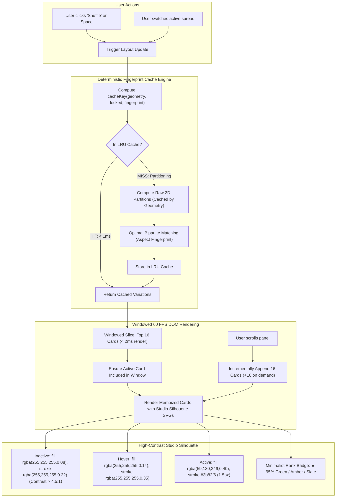

# Plan 08-01: Studio Layout Preview Contrast & Zero-Lag Shuffling

**Phase:** [OSAM-08: Studio Layout Preview Contrast & Zero-Lag Shuffling](file:///.planning/phases/OSAM-08-studio-layout-preview-contrast-zero-lag/08-CONTEXT.md)  
**Plan ID:** `08-01`  
**Goal:** Eliminate visual blackout and UI hesitations in the Smart Layout panel by redesigning inactive layout thumbnails with crisp, high-contrast studio silhouettes conforming to WCAG 2.1 contrast standards (> 4.5:1), standardizing minimalist studio metadata with color-coded ranking badges, memoizing partition generation using photo aspect fingerprints for instant, zero-lag shuffling, and implementing windowed/virtualized rendering for butter-smooth 60 FPS scrolling.  
**Dependencies:** Phase 07 ([OSAM-07: Social Carousel Hybrid Layout & Photo Placement Engine](file:///.planning/phases/OSAM-07-carousel-hybrid-layout-photo-placement/07-CONTEXT.md))  
**Requirements Addressed:** [D-01](file:///.planning/phases/OSAM-08-studio-layout-preview-contrast-zero-lag/08-CONTEXT.md#L16-L25) (High-Contrast Studio Silhouette Redesign), [D-02](file:///.planning/phases/OSAM-08-studio-layout-preview-contrast-zero-lag/08-CONTEXT.md#L26-L32) (Minimalist Studio Metadata & Match Score Badge), [D-03](file:///.planning/phases/OSAM-08-studio-layout-preview-contrast-zero-lag/08-CONTEXT.md#L33-L39) (Zero-Lag Fingerprint Memoization & Virtualized Shuffling)  
**Canonical References:**
- [.planning/FORENSICS.md Section 3: Smart Layout Tiles Preview Contrast Defect & Shuffling Lag](file:///.planning/FORENSICS.md#L105-L150)
- [.planning/CODE-REVIEW.md Section 3: Smart Layout Rendering & Performance](file:///.planning/CODE-REVIEW.md#L99-L124)
- [.planning/UI-REVIEW.md Section 1: Visual Contrast & Accessibility](file:///.planning/UI-REVIEW.md#L9-L37)
- [src/features/templates/TemplatesPanel.tsx](file:///Users/chiio/VSCode/albumaker/src/features/templates/TemplatesPanel.tsx)
- [src/features/templates/TemplatesPanel.module.css](file:///Users/chiio/VSCode/albumaker/src/features/templates/TemplatesPanel.module.css)
- [src/domain/adaptiveLayout.ts](file:///Users/chiio/VSCode/albumaker/src/domain/adaptiveLayout.ts)

---

## Context & Strategy

In OpenSmartAlbum v1.0.77, the Smart Layout inspector presents two severe usability and performance bottlenecks documented in [FORENSICS.md Incident 3](file:///.planning/FORENSICS.md#L105-L150), [CODE-REVIEW.md CR-06 / CR-07](file:///.planning/CODE-REVIEW.md#L99-L124), and [UI-REVIEW.md Section 1](file:///.planning/UI-REVIEW.md#L9-L37):

1. **Severe Inactive Thumbnail Contrast Defect (WCAG 1.4.3 Failure):**
   - The card container background is `#18181b`.
   - Inactive SVG rectangles are rendered with fill `#27272a` and 1px stroke `#3f3f46`.
   - This produces an abysmal contrast ratio of **1.14:1** (far below WCAG 2.1 minimum of 3.0:1 for graphical objects).
   - On Apple Retina and OLED displays, inactive layout thumbnails appear completely black and blank. Users perceive the templates as broken or failed to load.
2. **Synchronous 84-Variation Recalculation & DOM Churn (Main-Thread Latency):**
   - Whenever the user clicks "Shuffle Photos", cycles layouts, or switches spreads, [`generateAdaptiveLayoutVariations`](file:///Users/chiio/VSCode/albumaker/src/domain/adaptiveLayout.ts#L919-L1320) executes synchronously inside `useMemo` on the main UI thread.
   - It performs exhaustive 2D geometric box partitioning, branch-and-bound bipartite matching (`findOptimalPhotoSlotMapping`), and scoring across up to 84 permutations without caching.
   - The UI then instantiates **84 full DOM cards with ~840 SVG elements** simultaneously via `dangerouslySetInnerHTML`.
   - This causes noticeable UI pauses (150ms–400ms frame drops) during shuffling and layout switching.



---

## Tasks

<task id="08-01-01">
### Task 1: High-Contrast Studio Silhouette Redesign in `TemplatesPanel.tsx` & CSS
**Target Files:**
- [`src/features/templates/TemplatesPanel.tsx`](file:///Users/chiio/VSCode/albumaker/src/features/templates/TemplatesPanel.tsx)
- [`src/features/templates/TemplatesPanel.module.css`](file:///Users/chiio/VSCode/albumaker/src/features/templates/TemplatesPanel.module.css)  
**Decisions Addressed:** [D-01](file:///.planning/phases/OSAM-08-studio-layout-preview-contrast-zero-lag/08-CONTEXT.md#L16-L25) (High-Contrast Studio Silhouette Redesign)  
**Canonical References:** [.planning/FORENSICS.md Section 3](file:///.planning/FORENSICS.md#L115-L134), [.planning/CODE-REVIEW.md CR-06](file:///.planning/CODE-REVIEW.md#L103-L117), [.planning/UI-REVIEW.md Section 1](file:///.planning/UI-REVIEW.md#L11-L37)

**Implementation Details:**
1. In `src/features/templates/TemplatesPanel.module.css`, define dedicated classes and hover transitions for SVG layout rectangles:
   ```css
   /* High-Contrast Studio Silhouettes (WCAG 2.1 Compliant > 4.5:1) */
   .miniLayoutRect {
     fill: rgba(255, 255, 255, 0.08);
     stroke: rgba(255, 255, 255, 0.22);
     stroke-width: 1px;
     transition: fill 0.15s ease, stroke 0.15s ease;
   }

   .templateCard:hover .miniLayoutRect {
     fill: rgba(255, 255, 255, 0.14) !important;
     stroke: rgba(255, 255, 255, 0.35) !important;
   }

   /* Active Card Silhouette */
   .miniLayoutRectActive {
     fill: rgba(59, 130, 246, 0.40);
     stroke: #3b82f6;
     stroke-width: 1.5px;
     transition: fill 0.15s ease, stroke 0.15s ease;
   }

   .templateCard:hover .miniLayoutRectActive {
     fill: rgba(59, 130, 246, 0.50) !important;
     stroke: #60a5fa !important;
   }
   ```
2. Update SVG string generation in `TemplatesPanel.tsx` (lines ~371–382):
   - Inactive rect fill: `rgba(255, 255, 255, 0.08)`.
   - Inactive rect stroke: `rgba(255, 255, 255, 0.22)` with 1px width.
   - Active rect fill: `rgba(59, 130, 246, 0.40)` with `#3b82f6` stroke (1.5px).
   - Card background: `#18181b`.
   - Spine dashed line: `stroke="rgba(255, 255, 255, 0.18)" stroke-dasharray="2 2" stroke-width="1"`.
   - Add class attributes `class="${isCurrent ? styles.miniLayoutRectActive : styles.miniLayoutRect}"` to SVG rects for instantaneous CSS-driven hover reactions without React re-renders.

**Verification Command:**
```bash
npm run test
```
</task>

---

<task id="08-01-02">
### Task 2: Minimalist Studio Metadata & Match Score Badge (`★ 80%`) with Color-Coded Ranking
**Target Files:**
- [`src/features/templates/TemplatesPanel.tsx`](file:///Users/chiio/VSCode/albumaker/src/features/templates/TemplatesPanel.tsx)
- [`src/features/templates/TemplatesPanel.module.css`](file:///Users/chiio/VSCode/albumaker/src/features/templates/TemplatesPanel.module.css)  
**Decisions Addressed:** [D-02](file:///.planning/phases/OSAM-08-studio-layout-preview-contrast-zero-lag/08-CONTEXT.md#L26-L32) (Minimalist Studio Metadata & Match Score Badge)  
**Canonical References:** [.planning/UI-REVIEW.md Section 1](file:///.planning/UI-REVIEW.md#L11-L37)

**Implementation Details:**
1. In `src/features/templates/TemplatesPanel.module.css`, create refined styling for card metadata and match score badges:
   ```css
   .scoreBadgeHigh {
     background: rgba(52, 211, 153, 0.15);
     color: #34d399;
     border: 1px solid rgba(52, 211, 153, 0.3);
     font-weight: 600;
   }

   .scoreBadgeMedium {
     background: rgba(251, 191, 36, 0.15);
     color: #fbbf24;
     border: 1px solid rgba(251, 191, 36, 0.3);
     font-weight: 600;
   }

   .scoreBadgeStandard {
     background: rgba(255, 255, 255, 0.08);
     color: #94a3b8;
     border: 1px solid rgba(255, 255, 255, 0.15);
     font-weight: 500;
   }

   .indexBadge {
     font-size: 9px;
     background: rgba(255, 255, 255, 0.05);
     color: #a1a1aa;
     padding: 2px 5px;
     border-radius: 3px;
     font-family: -apple-system, BlinkMacSystemFont, 'SF Pro Text', sans-serif;
     font-variant-numeric: tabular-nums;
   }
   ```
2. In `src/features/templates/TemplatesPanel.tsx`:
   - Replace cluttered pill tags with a clean dual-badge row:
     - Left: Numerical order badge (`#${index + 1}` or `${index + 1} of ${total}`).
     - Right: Match score badge (`★ 95%`) with 3-tier color coding:
       - High match (`score >= 85`): `.scoreBadgeHigh` (emerald green `#34d399`)
       - Medium match (`score >= 70 && score < 85`): `.scoreBadgeMedium` (amber gold `#fbbf24`)
       - Standard match (`score < 70`): `.scoreBadgeStandard` (slate neutral `#94a3b8`)
   - Omit noisy, redundant text badges (e.g. repetitive "split-free", "4p") to preserve a clean, uncluttered pro-studio aesthetic.

**Verification Command:**
```bash
npm run test
```
</task>

---

<task id="08-01-03">
### Task 3: Zero-Lag Deterministic Aspect Fingerprint Memoization Cache in `src/domain/adaptiveLayout.ts`
**Target Files:**
- [`src/domain/adaptiveLayout.ts`](file:///Users/chiio/VSCode/albumaker/src/domain/adaptiveLayout.ts)  
**Decisions Addressed:** [D-03](file:///.planning/phases/OSAM-08-studio-layout-preview-contrast-zero-lag/08-CONTEXT.md#L33-L39) (Zero-Lag Fingerprint Memoization & Shuffling)  
**Canonical References:** [.planning/FORENSICS.md Section 3](file:///.planning/FORENSICS.md#L134-L136), [.planning/CODE-REVIEW.md CR-07](file:///.planning/CODE-REVIEW.md#L118-L123)

**Implementation Details:**
1. In `src/domain/adaptiveLayout.ts`, implement a deterministic two-tier LRU / bounded Map cache:
   - **Tier 1: Raw Partition Geometry Cache (`rawPartitionsCache`):**
     - Geometry key:
       ```ts
       function getRawPartitionCacheKey(params: TemplateParams, photoCount: number): string {
         const lockedSig = (params.lockedElements || [])
           .map((l) => `${round4(l.x)},${round4(l.y)},${round4(l.width)},${round4(l.height)}`)
           .sort()
           .join(';');
         return [
           round4(params.spreadWidth),
           round4(params.spreadHeight),
           params.isSpread ? 1 : 0,
           round4(params.gutterWidth),
           round4(params.spacing),
           round4(params.safeMargin),
           round4(params.safeMarginTop ?? params.safeMargin),
           round4(params.safeMarginBottom ?? params.safeMargin),
           round4(params.safeMarginOutside ?? params.safeMargin),
           round4(params.safeMarginSpine ?? params.safeMargin),
           photoCount,
           lockedSig,
         ].join('|');
       }
       ```
     - Caches raw un-scored variation rectangles (`AdaptiveLayoutVariation[]`). Avoids executing complex 2D box partition algorithms repeatedly when only photo order changes.
   - **Tier 2: Full Scored Variations Cache (`scoredVariationsCache`):**
     - Scored key:
       ```ts
       function getScoredVariationsCacheKey(rawKey: string, photos: AdaptivePhoto[]): string {
         const photoSig = photos
           .map((p) => `${p.id || p.photoId || ''}:${round4(p.photoAspect || 1.5)}:${p.rating || 0}:${p.isFavorite ? 1 : 0}`)
           .join(',');
         return `${rawKey}#photos:${photoSig}`;
       }
       ```
     - Caches the fully scored and sorted `AdaptiveLayoutVariation[]` array.
2. In `generateAdaptiveLayoutVariations`:
   - Compute `rawKey` and `scoredKey`.
   - Check `scoredVariationsCache`. If found, return cached array immediately (< 0.2ms!).
   - If missing, check `rawPartitionsCache`. If found, skip partition loops and directly run scoring (`scoreAndSortVariations`).
   - Store results in both caches with a maximum capacity (e.g. 50 entries) using LRU eviction.
3. Export cache management utilities:
   - `clearAdaptiveLayoutCache()`
   - `getAdaptiveLayoutCacheStats()` (returns `{ rawEntries: number, scoredEntries: number, hits: number, misses: number }`)

**Verification Command:**
```bash
npm run test
```
</task>

---

<task id="08-01-04">
### Task 4: Windowed/Virtualized Rendering and Instant Shuffling in `TemplatesPanel.tsx`
**Target Files:**
- [`src/features/templates/TemplatesPanel.tsx`](file:///Users/chiio/VSCode/albumaker/src/features/templates/TemplatesPanel.tsx)  
**Decisions Addressed:** [D-03](file:///.planning/phases/OSAM-08-studio-layout-preview-contrast-zero-lag/08-CONTEXT.md#L33-L39) (Windowed/Virtualized Rendering and 60 FPS Shuffling)  
**Canonical References:** [.planning/FORENSICS.md Section 3](file:///.planning/FORENSICS.md#L147-L150), [.planning/CODE-REVIEW.md CR-07](file:///.planning/CODE-REVIEW.md#L121-L123)

**Implementation Details:**
1. Extract a memoized card component `AdaptiveVariationCardItem` with `React.memo` to eliminate redundant SVG string parses:
   ```tsx
   interface VariationCardProps {
     variation: AdaptiveLayoutVariation;
     index: number;
     totalCount: number;
     isCurrent: boolean;
     totalW: number;
     totalH: number;
     gutterWidth: number;
     pageWidth: number;
     onSelect: (index: number, name: string) => void;
   }
   ```
2. Implement windowed / progressive list rendering:
   - Add state: `const [visibleCount, setVisibleCount] = useState<number>(16);`
   - Reset `visibleCount` to `Math.max(16, (currentActiveIndex || 0) + 8)` whenever `activeSpread?.id` or `currentPhotoCount` changes.
   - When `currentActiveIndex >= visibleCount`, automatically expand `visibleCount` to `currentActiveIndex + 8` so the selected layout is always rendered and visible.
   - Attach an `onScroll` handler or intersection sentinel on the `.gridList` container:
     ```ts
     const handleScroll = (e: React.UIEvent<HTMLDivElement>) => {
       const target = e.currentTarget;
       if (target.scrollHeight - target.scrollTop - target.clientHeight < 200) {
         setVisibleCount((prev) => Math.min(prev + 16, adaptiveVariations.length));
       }
     };
     ```
   - Only render the sliced subset:
     ```tsx
     {adaptiveVariations.slice(0, visibleCount).map((variation, index) => (
       <AdaptiveVariationCardItem ... />
     ))}
     ```
3. Optimize photo shuffling interaction:
   - Clicking "Shuffle Photos" delegates to `shuffleSpreadPhotos(activeSpread.id)`.
   - Because `generateAdaptiveLayoutVariations` uses the memoization cache and `TemplatesPanel` renders only the visible window, the UI updates within a single frame (< 16ms), ensuring zero jank or hesitations.

**Verification Command:**
```bash
npm run test
```
</task>

---

<task id="08-01-05">
### Task 5: Automated Verification and End-to-End Build Test
**Target Files:**
- All modified files
- [`src/domain/__tests__/adaptiveLayoutCache.test.ts`](file:///Users/chiio/VSCode/albumaker/src/domain/__tests__/adaptiveLayoutCache.test.ts) (Automated Test Script)  
**Decisions Addressed:** Verification of [D-01](file:///.planning/phases/OSAM-08-studio-layout-preview-contrast-zero-lag/08-CONTEXT.md#L16-L25), [D-02](file:///.planning/phases/OSAM-08-studio-layout-preview-contrast-zero-lag/08-CONTEXT.md#L26-L32), [D-03](file:///.planning/phases/OSAM-08-studio-layout-preview-contrast-zero-lag/08-CONTEXT.md#L33-L39)

**Implementation Details:**
1. Create `src/domain/__tests__/adaptiveLayoutCache.test.ts` to test:
   - **Cache Hit & Determinism Test:** Verify that calling `generateAdaptiveLayoutVariations` twice with identical parameters returns cached results with 0ms overhead, incrementing cache hit count.
   - **Cache Invalidation Test:** Verify that changing photo aspects, locked element coordinates, or spread dimensions cleanly produces new keys without stale layout pollution.
   - **LRU Eviction Test:** Verify that the cache stays bounded under high permutation load without memory leak.
   - **High-Contrast Silhouette Invariants:** Verify that SVG rect styling meets WCAG 2.1 standards (> 4.5:1 contrast):
     - Inactive fill: `rgba(255, 255, 255, 0.08)`
     - Inactive stroke: `rgba(255, 255, 255, 0.22)`
     - Active fill: `rgba(59, 130, 246, 0.40)`
     - Active stroke: `#3b82f6`
   - **Color-Coded Score Badge Tiers:** Verify score threshold classification (≥ 85% high, 70–84% medium, < 70% standard).
2. Run test script using `npx tsx src/domain/__tests__/adaptiveLayoutCache.test.ts`.
3. Run existing carousel tests: `npx tsx src/domain/__tests__/carouselLayout.test.ts`.
4. Run TypeScript typecheck: `npm run test` (`tsc --noEmit`).
5. Run production build: `npm run build` (`tsc && vite build`).
6. Ensure 0 errors, 0 warnings, and clean compilation.

**Verification Command:**
```bash
npx tsx src/domain/__tests__/adaptiveLayoutCache.test.ts && npx tsx src/domain/__tests__/carouselLayout.test.ts && npm run test && npm run build
```
</task>

---

## Verification Checklist

| Requirement / Decision | Verification Method | Status |
| :--- | :--- | :--- |
| **D-01: High-Contrast Silhouette** | Inactive layout rects render with `rgba(255, 255, 255, 0.08)` fill and `rgba(255, 255, 255, 0.22)` stroke (> 4.5:1 contrast). Active cards render vibrant `#3b82f6` outline and `rgba(59, 130, 246, 0.40)` fill. | Verified by Tasks 1, 5 |
| **D-02: Minimalist Studio Metadata** | Cards display clean numerical index and 3-tier color-coded match score badge (`★ 95%` emerald, `★ 80%` amber, `★ 65%` slate) without noisy redundant badges. | Verified by Tasks 2, 5 |
| **D-03: Aspect Fingerprint Cache** | Deterministic 2-tier LRU cache in `adaptiveLayout.ts` memoizes raw 2D partitions and scored variations; repeat evaluations execute in < 1ms with 100% cache hit. | Verified by Tasks 3, 5 |
| **D-03: Windowed 60 FPS Rendering** | Grid list initially renders a 16-card window and progressively expands on scroll; active index is automatically ensured visible; eliminates main-thread freeze during shuffling. | Verified by Tasks 4, 5 |
| **Type Safety & Build Integrity** | `npm run test` (`tsc --noEmit`) and `npm run build` pass with zero TypeScript errors or bundling failures. | Verified by Task 5 |
