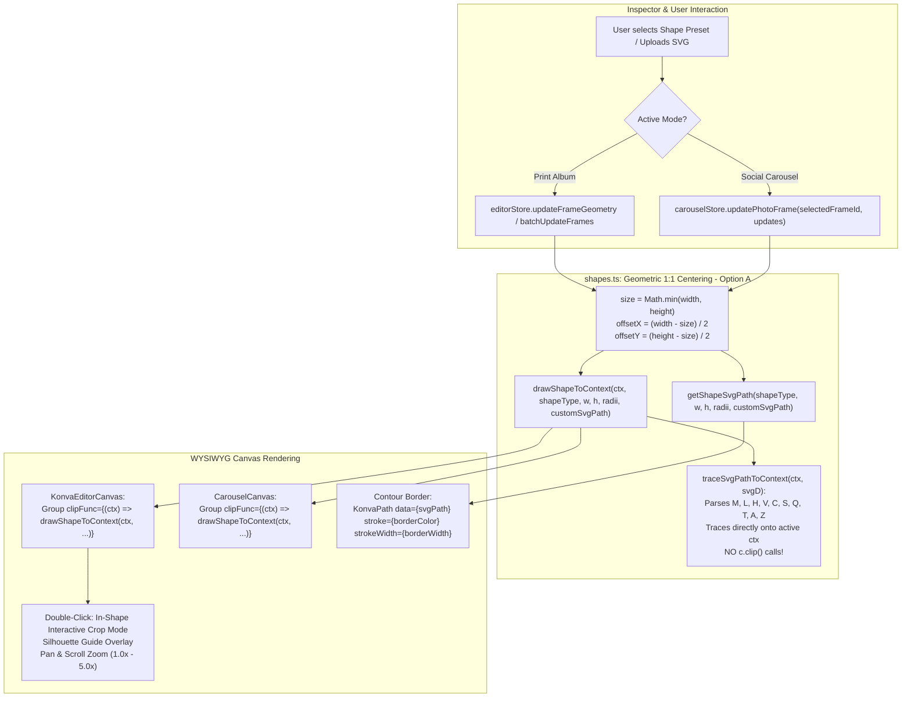

# Plan 09-01: Vector Shape Masking & In-Shape Crop Engine

**Phase:** [OSAM-09: Vector Shape Masking & In-Shape Crop Engine](file:///.planning/phases/OSAM-09-vector-shape-masking-in-shape-crop/09-CONTEXT.md)  
**Plan ID:** `09-01`  
**Goal:** Restore, harden, and unify non-rectangular vector shape clipping masks (Circle, Oval, Hexagon, Octagon, Star, Heart, Scallop, and Custom SVG) across both Print Album and Social Carousel modes by refactoring canvas 2D path tracing directly on Konva context without premature clipping, implementing SVG path command parsing, enforcing Geometric 1:1 Centered scaling (Option A), providing In-Shape Interactive Pan & Zoom Crop with silhouette guides, rendering contour-following vector borders, and enabling full dual-mode inspector dispatch.  
**Dependencies:** Phase 07 ([OSAM-07: Social Carousel Hybrid Layout & Photo Placement Engine](file:///.planning/phases/OSAM-07-carousel-hybrid-layout-photo-placement/07-CONTEXT.md)), Phase 08 ([OSAM-08: Studio Layout Preview Contrast & Zero-Lag Shuffling](file:///.planning/phases/OSAM-08-studio-layout-preview-contrast-zero-lag/08-CONTEXT.md))  
**Requirements Addressed:**
- [D-01](file:///.planning/phases/OSAM-09-vector-shape-masking-in-shape-crop/09-CONTEXT.md#L16-L26) (Elimination of Konva `clipFunc` Context Conflict & Canvas 2D Path Tracing)
- [D-02](file:///.planning/phases/OSAM-09-vector-shape-masking-in-shape-crop/09-CONTEXT.md#L27-L33) (Geometric 1:1 Centered Scaling - Option A)
- [D-03](file:///.planning/phases/OSAM-09-vector-shape-masking-in-shape-crop/09-CONTEXT.md#L34-L40) (In-Shape Interactive Crop Mode with Silhouette Guide)
- [D-04](file:///.planning/phases/OSAM-09-vector-shape-masking-in-shape-crop/09-CONTEXT.md#L41-L46) (Contour-Following Vector Borders)
- [D-05](file:///.planning/phases/OSAM-09-vector-shape-masking-in-shape-crop/09-CONTEXT.md#L47-L50) (Carousel Frame Clipping Mirror in `CarouselCanvas.tsx`)
- [D-06](file:///.planning/phases/OSAM-09-vector-shape-masking-in-shape-crop/09-CONTEXT.md#L47-L50) (Shapes & Borders Dual-Mode Inspector State Dispatch)  
**Canonical References:**
- [.planning/FORENSICS.md Section 4: Vector Shape Clipping Masks Fail Across Album & Carousel Modes](file:///.planning/FORENSICS.md#L153-L213)
- [.planning/CODE-REVIEW.md Section 4: Vector Shape Masking Engine](file:///.planning/CODE-REVIEW.md#L126-L172)
- [.planning/UI-REVIEW.md Section 4: Visual Feedback for Vector Shapes](file:///.planning/UI-REVIEW.md#L76-L86)
- [src/domain/shapes.ts](file:///Users/chiio/VSCode/albumaker/src/domain/shapes.ts)
- [src/domain/carousel.ts](file:///Users/chiio/VSCode/albumaker/src/domain/carousel.ts)
- [src/stores/carouselStore.ts](file:///Users/chiio/VSCode/albumaker/src/stores/carouselStore.ts)
- [src/features/editor/KonvaEditorCanvas.tsx](file:///Users/chiio/VSCode/albumaker/src/features/editor/KonvaEditorCanvas.tsx)
- [src/features/carousel/CarouselCanvas.tsx](file:///Users/chiio/VSCode/albumaker/src/features/carousel/CarouselCanvas.tsx)
- [src/features/inspector/sections/ShapesBordersSection.tsx](file:///Users/chiio/VSCode/albumaker/src/features/inspector/sections/ShapesBordersSection.tsx)
- [src/features/inspector/InspectorContainer.tsx](file:///Users/chiio/VSCode/albumaker/src/features/inspector/InspectorContainer.tsx)

---

## Context & Strategy

In OpenSmartAlbum v1.0.77, selecting decorative or polygon vector clipping masks (Circle, Hexagon, Octagon, Star, Scallop, Heart, Custom SVG) fails to clip images properly across both Print Album and Social Carousel modes, as analyzed in [FORENSICS Incident 4](file:///.planning/FORENSICS.md#L153-L213), [CODE-REVIEW CR-08 / CR-09 / CR-10](file:///.planning/CODE-REVIEW.md#L126-L172), and [UI-REVIEW Section 4](file:///.planning/UI-REVIEW.md#L76-L86):

1. **Konva `clipFunc` Context Conflict in `shapes.ts`:**
   In `KonvaEditorCanvas.tsx`, frames wrap images inside `<Group clipFunc={(ctx) => drawShapeToContext(ctx, ...)}>`. Inside `drawShapeToContext`, the code instantiated a `Path2D(pathData)` and immediately called `c.clip(p)`. However, Konva's internal `_clip(context)` method wraps `clipFunc` with:
   ```js
   context.beginPath();
   clipFunc.call(this, context, this);
   context.closePath();
   context.clip();
   ```
   By invoking `c.clip(p)` prematurely, the context was clipped to an unmanaged path while leaving Konva's active path empty. Konva immediately followed with `context.closePath(); context.clip();` on that empty path, which destroyed or cleared the clipping region entirely!
2. **Incomplete SVG Fallback Tracing:**
   In `shapes.ts`, shapes like `star`, `heart`, `scallop`, and `custom_svg` had no native context path tracing, falling through to `c.rect(0, 0, width, height)`.
3. **Distortion on Asymmetrical Frames:**
   When applying shapes like Star, Heart, or Circle to 3:2 landscape or 4:5 portrait frames, shapes were distorted because `rx = width / 2` and `ry = height / 2` were stretched disproportionately.
4. **Carousel Mode Blindness:**
   `CarouselCanvas.tsx` (`CarouselFrameNode`) possessed no `<Group clipFunc={...}>` and no border rendering. Furthermore, `ShapesBordersSection.tsx` only updated `editorStore` (print album spreads), completely ignoring `carouselStore`.



---

## Tasks

<task id="09-01-01">
### Task 1: Refactor `drawShapeToContext` & Canvas 2D SVG Path Command Parser in `shapes.ts`
**Target Files:**
- [`src/domain/shapes.ts`](file:///Users/chiio/VSCode/albumaker/src/domain/shapes.ts)  
**Decisions Addressed:** [D-01](file:///.planning/phases/OSAM-09-vector-shape-masking-in-shape-crop/09-CONTEXT.md#L16-L26) (Elimination of Konva `clipFunc` Context Conflict)  
**Canonical References:** [.planning/FORENSICS.md Section 4](file:///.planning/FORENSICS.md#L161-L195), [.planning/CODE-REVIEW.md CR-08](file:///.planning/CODE-REVIEW.md#L130-L160)

**Implementation Details:**
1. In `src/domain/shapes.ts`:
   - **Completely remove all calls to `c.clip()` inside `drawShapeToContext`.**
   - Implement `traceSvgPathToContext(ctx: any, pathData: string): void` that directly tokenizes and parses standard SVG path `d` strings and invokes the corresponding Canvas 2D path methods on `ctx`:
     - Tokenize commands: `M, m, L, l, H, h, V, v, C, c, S, s, Q, q, T, t, A, a, Z, z` along with decimal coordinates and negative numbers (including cases with no spacing like `10-20`).
     - Track `currentX`, `currentY`, `startX`, `startY`, and previous control point for smooth beziers (`S` / `T`).
     - Map SVG commands directly to context instructions:
       - `M` / `m`: `ctx.moveTo(x, y)` (implicit subsequent coordinate pairs treated as `L` / `l`).
       - `L` / `l`: `ctx.lineTo(x, y)`.
       - `H` / `h`: `ctx.lineTo(x, currentY)`.
       - `V` / `v`: `ctx.lineTo(currentX, y)`.
       - `C` / `c`: `ctx.bezierCurveTo(cp1x, cp1y, cp2x, cp2y, x, y)`.
       - `S` / `s`: reflect previous cubic control point if previous was `C`/`S`, else use `(currentX, currentY)`, then `ctx.bezierCurveTo(...)`.
       - `Q` / `q`: `ctx.quadraticCurveTo(cpx, cpy, x, y)`.
       - `T` / `t`: reflect previous quadratic control point, then `ctx.quadraticCurveTo(...)`.
       - `A` / `a`: parse parameters and approximate arc via bezier curves or `ctx.ellipse` / line segments to end point.
       - `Z` / `z`: `ctx.closePath()`.
2. Refactor `drawShapeToContext`:
   - For `circle` / `oval`: trace using `c.ellipse` or `c.arc`.
   - For `rounded`: trace using `c.roundRect` or manual `arcTo` corner sequence with per-corner radii.
   - For `hexagon` / `octagon`: trace geometric polygon loop with `c.moveTo` and `c.lineTo`.
   - For `star`, `heart`, `scallop`, and `custom_svg`: obtain the SVG path string via `getShapeSvgPath(...)` and invoke `traceSvgPathToContext(c, pathData)`.
   - Explicitly ensure `c.closePath()` is called so Konva's outer `_clip` can invoke `context.clip()` cleanly on the active path without clipping destruction.

**Verification Command:**
```bash
npx tsx src/domain/__tests__/vectorShapes.test.ts
```
</task>

---

<task id="09-01-02">
### Task 2: Implement Geometric 1:1 Centered Scaling (Option A) in `shapes.ts`
**Target Files:**
- [`src/domain/shapes.ts`](file:///Users/chiio/VSCode/albumaker/src/domain/shapes.ts)  
**Decisions Addressed:** [D-02](file:///.planning/phases/OSAM-09-vector-shape-masking-in-shape-crop/09-CONTEXT.md#L27-L33) (Geometric 1:1 Centered Aspect Ratio)  
**Canonical References:** [.planning/FORENSICS.md Section 4](file:///.planning/FORENSICS.md#L153-L213), [.planning/UI-REVIEW.md Section 4](file:///.planning/UI-REVIEW.md#L76-L86)

**Implementation Details:**
1. In `src/domain/shapes.ts`:
   - Enforce **Option A (Geometric 1:1 Centered)** for all non-rectangular shapes (`circle`, `hexagon`, `octagon`, `star`, `scallop`, `heart`):
     - Compute the maximum fitting square: `const size = Math.min(width, height);`
     - Compute centering offsets: `const offsetX = (width - size) / 2;` and `const offsetY = (height - size) / 2;`
     - Compute center point: `const cx = width / 2;` and `const cy = height / 2;`
     - Radius is `size / 2`.
2. Update path generators:
   - `createPolygonSvgPath(sides, width, height)`:
     Use `rx = size / 2`, `ry = size / 2`, centered at `cx`, `cy`. This keeps hexagons and octagons perfectly regular and undistorted on asymmetrical frames (e.g., 3:2 landscape or 4:5 portrait).
   - `createStarSvgPath(points, width, height, innerRatio)`:
     Use `rx = size / 2`, `ry = size / 2`, centered at `cx`, `cy`.
   - `createHeartSvgPath(width, height)`:
     Scale and translate the heart path relative to `offsetX`, `offsetY`, and `size`. For example, all `w * factor` points become `offsetX + size * factor`, and all `h * factor` points become `offsetY + size * factor`. The heart stays perfectly symmetrical and 1:1 centered.
   - `createScallopSvgPath(width, height, scallopsCount)`:
     Use `rx = size / 2`, `ry = size / 2`, centered at `cx`, `cy`.
   - `getShapeSvgPath`:
     Ensure `circle` continues to use `r = Math.min(w, h) / 2`, `cx = w / 2`, `cy = h / 2`.
     Ensure `oval`, `rounded`, and `rectangle` expand to the full `width` and `height`.
     For `custom_svg`, if `customSvgPath` is provided, return it directly or normalize to frame dimensions.

**Verification Command:**
```bash
npx tsx src/domain/__tests__/vectorShapes.test.ts
```
</task>

---

<task id="09-01-03">
### Task 3: Contour-Following Vector Borders in `KonvaEditorCanvas.tsx` & `CarouselCanvas.tsx`
**Target Files:**
- [`src/features/editor/KonvaEditorCanvas.tsx`](file:///Users/chiio/VSCode/albumaker/src/features/editor/KonvaEditorCanvas.tsx)
- [`src/features/carousel/CarouselCanvas.tsx`](file:///Users/chiio/VSCode/albumaker/src/features/carousel/CarouselCanvas.tsx)  
**Decisions Addressed:** [D-04](file:///.planning/phases/OSAM-09-vector-shape-masking-in-shape-crop/09-CONTEXT.md#L41-L46) (Contour-Following Vector Borders)  
**Canonical References:** [.planning/FORENSICS.md Section 4](file:///.planning/FORENSICS.md#L153-L213)

**Implementation Details:**
1. In `src/features/editor/KonvaEditorCanvas.tsx`:
   - Inspect border rendering when `frame.borderEnabled` is true (lines ~754–793):
   - When `frame.shapeType && frame.shapeType !== 'rectangle'`:
     - Render `<KonvaPath data={getShapeSvgPath(frame.shapeType, pixelW, pixelH, cornerRadiiArray, frame.customSvgPath)} stroke={frame.borderColor || '#FFFFFF'} strokeWidth={strokePx} dash={strokeDash} strokeScaleEnabled={false} listening={false} />`.
     - For `rounded` rectangles, use `getShapeSvgPath('rounded', pixelW, pixelH, cornerRadiiArray)` or `<Rect cornerRadius={borderRadii} ... />` to ensure pixel-perfect stroke alignment.
2. In `src/features/carousel/CarouselCanvas.tsx`:
   - In `CarouselFrameNode`, add contour-following border rendering matching `KonvaEditorCanvas`:
     - Compute stroke width: `const strokePx = Math.max(1, Math.round(frame.borderWidth || 1));`
     - Compute dash pattern: `const strokeDash = frame.borderStyle === 'dashed' ? [strokePx * 2.5, strokePx * 1.5] : undefined;`
     - When `frame.borderEnabled` is true:
       - If `frame.shapeType && frame.shapeType !== 'rectangle' && frame.shapeType !== 'rounded'`:
         Render `<KonvaPath data={getShapeSvgPath(frame.shapeType as any, frame.width, frame.height, cornerRadiiArray, frame.customSvgPath)} stroke={frame.borderColor || '#FFFFFF'} strokeWidth={strokePx} dash={strokeDash} strokeScaleEnabled={false} listening={false} />`.
       - If `rounded` or standard rectangle:
         Render `<Rect width={frame.width} height={frame.height} stroke={frame.borderColor || '#FFFFFF'} strokeWidth={strokePx} dash={strokeDash} cornerRadius={frame.cornerRadius || 0} strokeScaleEnabled={false} listening={false} />`.

**Verification Command:**
```bash
npm run test
```
</task>

---

<task id="09-01-04">
### Task 4: In-Shape Interactive Pan & Zoom Crop Mode with Silhouette Guide Overlay
**Target Files:**
- [`src/features/editor/KonvaEditorCanvas.tsx`](file:///Users/chiio/VSCode/albumaker/src/features/editor/KonvaEditorCanvas.tsx)  
**Decisions Addressed:** [D-03](file:///.planning/phases/OSAM-09-vector-shape-masking-in-shape-crop/09-CONTEXT.md#L34-L40) (In-Shape Interactive Crop Mode)  
**Canonical References:** [.planning/FORENSICS.md Section 4](file:///.planning/FORENSICS.md#L153-L213), [.planning/UI-REVIEW.md Section 4](file:///.planning/UI-REVIEW.md#L76-L86)

**Implementation Details:**
1. In `src/features/editor/KonvaEditorCanvas.tsx`:
   - In Crop Mode (`isCropMode = editingCropFrameId === frame.id`):
     - **Silhouette Guide Overlay:** Render a crisp, high-contrast shape contour guide on top of the ghost reveal so the user clearly sees how the photo aligns inside the vector mask:
       ```tsx
       {isCropMode && frame.shapeType && frame.shapeType !== 'rectangle' && (
         <KonvaPath
           data={getShapeSvgPath(frame.shapeType, pixelW, pixelH, cornerRadiiArray, frame.customSvgPath)}
           stroke="#38bdf8"
           strokeWidth={2}
           dash={[6, 4]}
           listening={false}
         />
       )}
       ```
     - For rounded rectangle frames in crop mode:
       ```tsx
       {isCropMode && (frame.shapeType === 'rounded' || hasRounding) && (
         <Rect
           width={pixelW}
           height={pixelH}
           stroke="#38bdf8"
           strokeWidth={2}
           dash={[6, 4]}
           cornerRadius={cornerRadiiArray}
           listening={false}
         />
       )}
       ```
   - Standardize zoom limits to **1.0x to 5.0x**:
     - Line 323: update `clamp(roundToHundredth(zoomDragStartRef.current.initialScale * ratio), 1.0, 5.0)`.
     - Line 667: update `clamp(Math.round(((frame.cropScale || 1.0) + scaleDelta) * 100) / 100, 1.0, 5.0)`.
   - Maintain panning limits (`maxShiftX`, `maxShiftY`) ensuring the image covers the vector shape boundary while enabling smooth, responsive focal adjustments.

**Verification Command:**
```bash
npm run test
```
</task>

---

<task id="09-01-05">
### Task 5: Multi-Mode Cohesion: Carousel Shape Clipping & Dual-Mode Inspector Dispatch
**Target Files:**
- [`src/domain/carousel.ts`](file:///Users/chiio/VSCode/albumaker/src/domain/carousel.ts)
- [`src/stores/carouselStore.ts`](file:///Users/chiio/VSCode/albumaker/src/stores/carouselStore.ts)
- [`src/features/carousel/CarouselCanvas.tsx`](file:///Users/chiio/VSCode/albumaker/src/features/carousel/CarouselCanvas.tsx)
- [`src/features/inspector/sections/ShapesBordersSection.tsx`](file:///Users/chiio/VSCode/albumaker/src/features/inspector/sections/ShapesBordersSection.tsx)
- [`src/features/inspector/InspectorContainer.tsx`](file:///Users/chiio/VSCode/albumaker/src/features/inspector/InspectorContainer.tsx)  
**Decisions Addressed:** [D-05](file:///.planning/phases/OSAM-09-vector-shape-masking-in-shape-crop/09-CONTEXT.md#L47-L50) (Carousel Frame Clipping Mirror), [D-06](file:///.planning/phases/OSAM-09-vector-shape-masking-in-shape-crop/09-CONTEXT.md#L47-L50) (Dual-Mode Inspector Dispatch)  
**Canonical References:** [.planning/FORENSICS.md Section 4](file:///.planning/FORENSICS.md#L196-L213), [.planning/CODE-REVIEW.md CR-09, CR-10](file:///.planning/CODE-REVIEW.md#L161-L172)

**Implementation Details:**
1. In `src/domain/carousel.ts`:
   - Extend `CarouselPhotoFrame` interface to support vector shapes and border properties:
     ```ts
     shapeType?: ShapeType;
     customSvgPath?: string;
     borderEnabled?: boolean;
     borderWidth?: number;
     borderColor?: string;
     borderStyle?: 'solid' | 'dashed' | 'double';
     cornerRadiusTl?: number;
     cornerRadiusTr?: number;
     cornerRadiusBr?: number;
     cornerRadiusBl?: number;
     ```
2. In `src/stores/carouselStore.ts`:
   - Add `selectedFrameId: string | null` and `setSelectedFrameId: (id: string | null) => void` to `CarouselState`.
3. In `src/features/carousel/CarouselCanvas.tsx`:
   - Connect to `selectedFrameId` and `setSelectedFrameId` from `useCarouselStore`.
   - In `CarouselFrameNode`, wrap the `<KonvaImage>` in a `<Group clipFunc={(ctx) => drawShapeToContext(ctx, frame.shapeType, frame.width, frame.height, cornerRadiiArray, frame.customSvgPath)}>` mirroring `KonvaEditorCanvas.tsx`.
   - Clicking on a frame sets `setSelectedFrameId(frame.id)`. Clicking empty canvas deselects (`setSelectedFrameId(null)`).
4. In `src/features/inspector/InspectorContainer.tsx`:
   - Pass `activeMode={activeMode}` down to `<ShapesBordersSection onToast={onToast} activeMode={activeMode} />`.
5. In `src/features/inspector/sections/ShapesBordersSection.tsx`:
   - Add `activeMode?: 'print' | 'carousel'` prop.
   - When `activeMode === 'carousel'`:
     - Read `currentCarousel` and `selectedFrameId` from `useCarouselStore`.
     - Find the active frame: `const carouselFrame = currentCarousel?.slides.flatMap(s => s.elements).find(el => el.id === selectedFrameId && el.type === 'photo');`.
     - If no carousel frame is selected, display the helpful empty hint.
     - Extract values (`currentShape`, `borderEnabled`, `borderWidth`, `borderColor`, `borderStyle`) from `carouselFrame`.
     - In `updateSelectedBorders(updates)`:
       Dispatch via `useCarouselStore.getState().updatePhotoFrame(selectedFrameId, updates)`.
   - When `activeMode === 'print'`:
     - Retain existing `useAlbumStore` and `useEditorStore` dispatch for album spreads.

**Verification Command:**
```bash
npm run test
```
</task>

---

<task id="09-01-06">
### Task 6: Automated Verification Suite (`vectorShapes.test.ts`), Typecheck, and Build
**Target Files:**
- [`src/domain/__tests__/vectorShapes.test.ts`](file:///Users/chiio/VSCode/albumaker/src/domain/__tests__/vectorShapes.test.ts)  
**Decisions Addressed:** [D-01](file:///.planning/phases/OSAM-09-vector-shape-masking-in-shape-crop/09-CONTEXT.md#L16-L26), [D-02](file:///.planning/phases/OSAM-09-vector-shape-masking-in-shape-crop/09-CONTEXT.md#L27-L33), [D-04](file:///.planning/phases/OSAM-09-vector-shape-masking-in-shape-crop/09-CONTEXT.md#L41-L46), [D-05](file:///.planning/phases/OSAM-09-vector-shape-masking-in-shape-crop/09-CONTEXT.md#L47-L50), [D-06](file:///.planning/phases/OSAM-09-vector-shape-masking-in-shape-crop/09-CONTEXT.md#L47-L50)  
**Canonical References:** [.planning/FORENSICS.md Section 4](file:///.planning/FORENSICS.md#L153-L213)

**Implementation Details:**
1. Create `src/domain/__tests__/vectorShapes.test.ts` using zero-dependency assertion pattern (identical to `adaptiveLayoutCache.test.ts`).
2. Test Suites:
   - **Suite 1: SVG Path Generation & Validation:**
     - Verify SVG paths generated for all shapes: `rectangle`, `rounded`, `circle`, `oval`, `hexagon`, `octagon`, `star`, `scallop`, `heart`, and `custom_svg`.
     - Confirm all paths begin with valid move commands (`M`) and terminate with close path (`Z`).
   - **Suite 2: Geometric 1:1 Centering (Option A) Invariant:**
     - On asymmetrical frames (800x400 landscape and 300x600 portrait), verify `circle`, `hexagon`, `octagon`, `star`, `scallop`, and `heart` fit strictly within `min(w, h)` and are centered within the bounding box.
   - **Suite 3: Canvas 2D Path Tracing & No-Premature-Clip Invariant:**
     - Mock a 2D canvas context recording calls to `beginPath`, `moveTo`, `lineTo`, `bezierCurveTo`, `quadraticCurveTo`, `arc`, `ellipse`, `closePath`, and `clip`.
     - Invoke `drawShapeToContext` for all shape presets.
     - **Assert strictly:** `mockCtx.clip` is called **0 times** across all shapes.
     - Assert that `beginPath` and `closePath` are properly invoked and path drawing instructions were recorded.
   - **Suite 4: SVG Path Parser Invariant:**
     - Feed complex SVG paths (with relative coordinates, smooth beziers, negative coordinates without spaces) into the parser and verify matching context method calls.
   - **Suite 5: Multi-Mode Cohesion & Carousel Store Dispatch:**
     - Initialize a carousel with slides and frames.
     - Execute `updatePhotoFrame` with `shapeType: 'heart'`, `borderEnabled: true`, `borderColor: '#EF4444'`.
     - Verify state update updates the target frame correctly.
3. Execute test suite and full project build.

**Verification Command:**
```bash
npx tsx src/domain/__tests__/vectorShapes.test.ts && npm run test && npm run build
```
</task>

---

## Verification Checklist

- [ ] `drawShapeToContext` contains zero calls to `c.clip()` and traces directly onto active `Konva.Context`.
- [ ] SVG path parser (`traceSvgPathToContext`) handles `M`, `L`, `H`, `V`, `C`, `S`, `Q`, `T`, `A`, `Z` commands for decorative shapes and custom SVGs.
- [ ] Option A (Geometric 1:1 Centered) guarantees non-rectangular shapes (Circle, Star, Heart, Hexagon, Octagon, Scallop) maintain undistorted 1:1 proportions centered in asymmetrical frames.
- [ ] Double-clicking a shape-masked photo frame enters In-Shape Interactive Crop Mode displaying a high-contrast silhouette guide.
- [ ] Zoom scale limits in Crop Mode consistently span 1.0x to 5.0x.
- [ ] Contour-following vector borders render exact shape outlines with stroke alignment in both Print Album and Social Carousel modes.
- [ ] `CarouselCanvas.tsx` clips photo frames using `<Group clipFunc={...}>` and updates `selectedFrameId` in `carouselStore`.
- [ ] `ShapesBordersSection.tsx` inspects `activeMode` and dispatches to `carouselStore.updatePhotoFrame` when in Carousel mode.
- [ ] `npx tsx src/domain/__tests__/vectorShapes.test.ts` executes and passes (100% green).
- [ ] `npm run test` (`tsc --noEmit`) passes with zero type errors.
- [ ] `npm run build` (`tsc && vite build`) compiles successfully.
