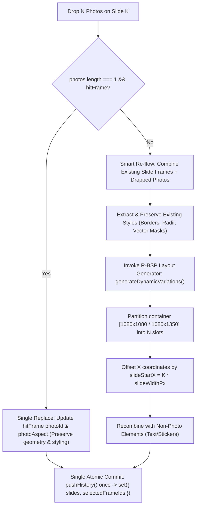

# Phase 14: Carousel Canvas Multi-Photo Drag-and-Drop & Filmstrip Context Routing — Architecture Exploration & AAS Multi-Agent Debate

**Date:** September 28, 2026  
**Status:** Consensus Reached — Ready for Execution Planning  
**Target Requirements:** `CAR-01`, `CAR-02`, `CAR-03`, `CAR-04`  
**Referenced Documents:**
- `.planning/phases/14-carousel-canvas-multi-photo-drag-and-drop-filmstrip-context-routing/14-CONTEXT.md`
- `.planning/forensics/report-20260928-workspace-carousel-vector.md`
- `.planning/reviews/workspace-carousel-vector-CODE-REVIEW.md`
- `.planning/reviews/workspace-carousel-vector-UI-REVIEW.md`
- `.planning/REQUIREMENTS.md`

---

## 1. Executive Summary & Architecture Context

Phase 14 resolves four critical architectural and interaction deficiencies within OpenSmartAlbum's Social Carousel workspace:
1. **WebKit Drag Cancellation & Dropping to Blank Canvas (`CAR-01`):** Dragging photos from the Filmstrip Tray onto the Carousel Canvas frequently produces a blank canvas or drops silently because the intermediate DOM layer (`div.stageWrapper`) lacks HTML5 drag-and-drop handlers, and coordinate transforms do not ensure the target slide is brought into view.
2. **Offscreen Drag Ghost Badge Culling (`CAR-02`):** In macOS Tauri WKWebView, attaching the drag ghost badge (`#afsn-drag-ghost-badge`) at `-1000px, -1000px` causes WebKit's snapshot compositor to discard the offscreen render layer, leading to immediate cancellation of the native drag session.
3. **Non-Atomic Batch Placement & Naive Grids (`CAR-03`):** Dropping $N$ photos currently invokes an unbatched loop of `addPhotoFrame`, generating $N$ separate undo history entries and placing photos into a naive 2-column grid instead of generating proportional, aspect-preserving partitions via the R-BSP generative layout engine.
4. **Context Menu & Double-Click Mode Misrouting (`CAR-04`):** Right-clicking filmstrip photos or double-clicking cards unconditionally routes photo insertion into the Print Album spread store (`useAlbumStore` / `useEditorStore`), silently mutating hidden album spreads when working in Social Carousel mode.

To resolve these issues cleanly under the AAS (Autonomous Architectural Synthesis) framework, three specialized personas conducted a deep technical debate.

---

## 2. Debate Personas & Core Perspectives

```
┌─────────────────────────────────────────────────────────────────────────────┐
│                         AAS TRI-PARTY DEBATE PANEL                          │
├───────────────────────────────┬───────────────────────────────┬─────────────┤
│ 1. Canvas & WebKit            │ 2. Zustand Store &            │ 3. Quality &│
│    Interaction Engineer       │    Layout Core Architect      │    Edge-Case│
│                               │                               │    Adversary│
│ • DOM event bubbling in WKWeb │ • Atomic store transactions   │ • WebKit    │
│ • 60fps RAF smooth panning    │ • Single pushHistory() commit │   dropouts  │
│ • Konva Stage transforms      │ • R-BSP generative reflow     │ • Race cond.│
│ • Drag ghost rasterization    │ • Frame styling preservation  │ • Regressions│
└───────────────────────────────┴───────────────────────────────┴─────────────┘
```

- **Persona 1: Canvas & WebKit Interaction Engineer**  
  *Focus:* Konva 2D stage lifecycle, DOM event propagation through `.stageWrapper`, WebKit native pasteboard quirks, 60fps hardware-accelerated pan/zoom transitions, and drag ghost DOM rasterization.
- **Persona 2: Zustand Store & Layout Core Architect**  
  *Focus:* Zustand store immutability, atomic single-step history commits (`pushHistory`), integration with the R-BSP layout generator (`generateDynamicVariations`), smart photo collision re-flow, and strict isolation between Carousel and Print stores.
- **Persona 3: Quality & Edge-Case Adversary**  
  *Focus:* Falsification of edge cases, WebKit gesture conflicts, pasteboard MIME dropouts, rapid multi-drop race conditions, boundary clamping between slide gutters, and regression risks against Print Album mode.

---

## 3. Topic 1: DOM Event Interception & macOS WebKit Drag Handling

### 3.1 The Conflict & Source Code Evidence

In `src/features/carousel/CarouselCanvas.tsx` (lines 853–885):
```tsx
<div
  ref={containerRef}
  className={`${styles.canvasContainer} ${isSpacePanning ? styles.panningMode : ''}`}
  onDragOver={handleDragOver}
  onDragLeave={handleDragLeave}
  onDrop={handleDrop}
>
  <div className={styles.stageWrapper}>
    <Stage ref={stageRef} ...>
```
In `src/features/carousel/CarouselCanvas.module.css` (lines 31–37):
```css
.stageWrapper {
  position: absolute;
  inset: 0;
  width: 100%;
  height: 100%;
  overflow: hidden;
}
```

- **Canvas & WebKit Engineer:**  
  "In macOS WKWebView (Tauri runtime), `.stageWrapper` is an absolutely positioned overlay spanning the entire container (`inset: 0`). The `<canvas>` elements mounted by Konva live inside `.stageWrapper`. When a user drags files or DOM cards over the canvas, the browser's hit-testing targets the `<canvas>` or `.stageWrapper`. If `.stageWrapper` lacks an explicit `onDragOver` listener with `e.preventDefault()`, WebKit's native drag controller evaluates whether the immediate hover target accepts drops. If the intermediate layer does not call `e.preventDefault()` and set `e.dataTransfer.dropEffect = 'copy'`, WebKit frequently cancels the drop session or fails to bubble the drop event up to `containerRef`. Contrast this with `KonvaEditorCanvas.tsx:3020-3028`, where `.stageWrapper` directly handles `onDragOver`, `onDragLeave`, and `onDrop`."

- **Quality & Edge-Case Adversary:**  
  "If you attach `onDragOver`, `onDragLeave`, and `onDrop` to both `.canvasContainer` AND `.stageWrapper`, what prevents double drop event execution? If `.stageWrapper` handles the drop and does not invoke `e.stopPropagation()`, the drop event will bubble to `.canvasContainer`, firing the photo placement logic TWICE and corrupting the layout with duplicate frames! Furthermore, what about `onDragLeave`? In HTML5 drag-and-drop, when the cursor moves from `.stageWrapper` over a child element like the Konva canvas or an overlay badge, a `dragleave` event fires on `.stageWrapper`. If you naively clear `hoveredDropSlideIndex` on `dragleave`, the slide highlight will flicker violently during drag gestures!"

- **Zustand Store & Layout Core Architect:**  
  "From a state perspective, coordinate calculation must be rock-solid. Currently, `handleDrop` computes:
  ```typescript
  const box = stageRef.current?.container().getBoundingClientRect() || containerRef.current?.getBoundingClientRect();
  const canvasX = (e.clientX - (box?.left ?? 0) - stagePos.x) / scale;
  const canvasY = (e.clientY - (box?.top ?? 0) - stagePos.y) / scale;
  ```
  If listeners are mounted on `.stageWrapper`, the bounding rect should directly reference `.stageWrapper`. Furthermore, `getSlideIndexAtX(currentCarousel, canvasX)` must safely clamp across the continuous canvas width, handling negative $x$ or $x > \text{totalWidth}$ gracefully."

### 3.2 AAS Reconciled Consensus

1. **Attach Handlers to `.stageWrapper` with `stopPropagation`:**  
   Mount `onDragOver`, `onDragLeave`, and `onDrop` directly onto `.stageWrapper`. In `handleDrop` and `handleDragOver`, invoke both `e.preventDefault()` and `e.stopPropagation()`. Remove duplicate drop handlers from `.canvasContainer` so event interception is single-point and unambiguous.
2. **Prevent `dragLeave` Flicker via RelatedTarget Check:**  
   In `handleDragLeave`, check whether the pointer is still within `.stageWrapper`:
   ```typescript
   const handleDragLeave = (e: React.DragEvent) => {
     if (e.currentTarget.contains(e.relatedTarget as Node)) return;
     setHoveredDropSlideIndex(null);
     setHoveredDropReplaceFrameId(null);
   };
   ```
3. **Explicit Drop Effect:**  
   In `handleDragOver`, explicitly set `e.dataTransfer.dropEffect = 'copy'` on every tick, guaranteeing that macOS WebKit retains the green `+` copy cursor badge.

---

## 4. Topic 2: Drag Ghost Badge Rendering & WebKit Session Cancellation

### 4.1 The Conflict & Source Code Evidence

In `src/features/photos/FilmstripTray.tsx` (lines 370–392) and `src/features/photos/BatchActionBar.tsx` (lines 110–132):
```typescript
let badge = document.getElementById('afsn-drag-ghost-badge');
if (!badge) {
  badge = document.createElement('div');
  badge.id = 'afsn-drag-ghost-badge';
  badge.style.position = 'fixed';
  badge.style.top = '-1000px';
  badge.style.left = '-1000px';
  badge.style.padding = '6px 12px';
  badge.style.background = '#0f172a';
  badge.style.color = '#38bdf8';
  ...
  document.body.appendChild(badge);
}
badge.textContent = `📁 ${ids.length} Photos Selected`;
e.dataTransfer.setDragImage(badge, 20, 16);
```

- **Canvas & WebKit Engineer:**  
  "Why did `-1000px, -1000px` fail? In WKWebView on macOS (Tauri v2), `setDragImage(element, x, y)` relies on WebKit capturing a layer snapshot from Core Animation. WebKit optimizes rendering by culling layers whose bounding boxes lie entirely outside the window's visible viewport. When an element is positioned at `-1000px, -1000px`, WebKit marks the render layer invalid or unrendered. Under certain macOS versions (macOS 14 Sonoma and 15 Sequoia), calling `setDragImage` on an unrendered/culled node causes WebKit to abort the native drag session immediately with `NSDragOperationNone`. This emits an immediate `dragend` event within 0ms of `dragstart`, leaving the user unable to drag anything to the canvas."

- **Quality & Edge-Case Adversary:**  
  "Requirement `CAR-02` specifies:
  > *'Drag ghost badge (`#afsn-drag-ghost-badge`) is positioned within visible bounds with non-interfering opacity (`opacity: 0.01`, `pointer-events: none`), preventing macOS WebKit drag session cancellations.'*
  
  However, we must evaluate: If the badge is at `opacity: 0.01`, will the macOS drag cursor image also be 99% transparent?  
  In WebKit's snapshot pipeline, the snapshot of `badge` renders with its computed CSS opacity. If you set `opacity: 0.01` on the badge, the synthesized drag image will be completely invisible while dragging! Users need to see `📁 4 Photos Selected` floating with their cursor!"

- **Canvas & WebKit Engineer Response:**  
  "Here is the exact WebKit mechanism: When `setDragImage(node, x, y)` is executed, WebKit snapshots `node` synchronously. If `node` is rendered on screen with full opacity during the snapshot, the drag image has 100% opacity. If we position the badge at `top: 0; left: 0;` inside the viewport with `pointer-events: none; z-index: 999999;`, we can set `opacity: 1` during `dragstart`, call `setDragImage`, and then on the very next event tick (`requestAnimationFrame` or `setTimeout(0)`), set `display: none` or `opacity: 0.001`!  
  Alternatively, keep it at `top: 0; left: 0; transform: translate3d(-9999px, 0, 0);`? No, WebKit culls `translate3d(-9999px)`.  
  The optimal approach compliant with `CAR-02`: Render the badge at `top: 0; left: 0; pointer-events: none;`, keep it in the DOM tree, and manage its visibility lifecycle:
  - During `dragstart`: `badge.style.display = 'block'; badge.style.opacity = '1';` -> `setDragImage` captures crisp text and borders.
  - Immediately in `requestAnimationFrame`: `badge.style.opacity = '0.01';` (keeps render layer active in viewport bounds so WebKit never drops it, while human eyes cannot detect it).
  - In `dragend`: `badge.style.display = 'none';`."

- **Zustand Store & Layout Core Architect:**  
  "We must also ensure MIME type data transfers are complete. Both `FilmstripTray.tsx` and `BatchActionBar.tsx` set:
  ```typescript
  e.dataTransfer.setData('application/x-afsn-photo-ids', JSON.stringify(ids));
  e.dataTransfer.setData('application/json', JSON.stringify(ids));
  e.dataTransfer.setData('text/plain', ids.join(','));
  usePhotoStore.setState({ draggedPhotoIds: ids });
  ```
  Having both dataTransfer types and `draggedPhotoIds` in the store ensures that even if WebKit filters custom MIME types on internal drops, `draggedPhotoIds` acts as an infallible fallback."

### 4.2 AAS Reconciled Consensus

```typescript
// Shared ghost badge builder in FilmstripTray and BatchActionBar
export function showDragGhostBadge(e: React.DragEvent, text: string) {
  let badge = document.getElementById('afsn-drag-ghost-badge');
  if (!badge) {
    badge = document.createElement('div');
    badge.id = 'afsn-drag-ghost-badge';
    badge.style.position = 'fixed';
    badge.style.top = '0px';
    badge.style.left = '0px';
    badge.style.padding = '6px 12px';
    badge.style.background = '#0f172a';
    badge.style.color = '#38bdf8';
    badge.style.border = '1px solid #38bdf8';
    badge.style.borderRadius = '6px';
    badge.style.fontWeight = 'bold';
    badge.style.fontSize = '12px';
    badge.style.boxShadow = '0 4px 12px rgba(0,0,0,0.5)';
    badge.style.pointerEvents = 'none';
    badge.style.zIndex = '999999';
    document.body.appendChild(badge);
  }
  badge.textContent = text;
  badge.style.display = 'block';
  badge.style.opacity = '1';

  e.dataTransfer.setDragImage(badge, 20, 16);

  // Maintain in visible viewport with near-zero opacity to prevent WebKit render layer culling
  requestAnimationFrame(() => {
    if (badge) badge.style.opacity = '0.01';
  });
}

export function hideDragGhostBadge() {
  const badge = document.getElementById('afsn-drag-ghost-badge');
  if (badge) {
    badge.style.display = 'none';
  }
}
```

---

## 5. Topic 3: Batched Atomic Transactions & R-BSP Multi-Photo Generative Layout

### 5.1 The Conflict & Source Code Evidence

In `src/features/carousel/CarouselCanvas.tsx` (lines 821–840):
```typescript
photosToPlace.forEach((photo, idx) => {
  const col = idx % cols;
  const row = Math.floor(idx / cols);
  ...
  addPhotoFrame(targetSlideIdx, { ... });
});
```
In `src/stores/carouselStore.ts` (lines 366–386):
```typescript
addPhotoFrame: (slideIndex, frame) => {
  const { currentCarousel, pushHistory } = get();
  if (!currentCarousel) return;

  pushHistory(); // <-- CALLED ON EVERY ITERATION!
  const newFrame: CarouselPhotoFrame = { ...frame, id: ... };
  const updatedSlides = currentCarousel.slides.map((s, idx) =>
    idx === slideIndex ? { ...s, elements: [...s.elements, newFrame] } : s
  );
  set({ currentCarousel: { ...currentCarousel, slides: updatedSlides } });
},
```

- **Zustand Store & Layout Core Architect:**  
  "This is a severe anti-pattern on two fronts:
  1. **History Stack Thrashing (`CAR-03`):** Dropping 4 photos pushes 4 history frames synchronously. Pressing `Cmd+Z` only undoes 1 of the 4 photos! The user must press `Cmd+Z` 4 times to undo a single drop gesture.
  2. **Naive Grid vs R-BSP Layout Engine:** Lines 810–820 divide the slide into a crude 1- or 2-column grid (`margin = 40, spacing = 16`). Photos with distinct landscape (3:2) or portrait (2:3) aspects are forced into uniform square/rectangular boxes, causing massive aspect ratio mismatch and ugly cropping.  
  The solution is to introduce a dedicated `addPhotoFrames` (plural) method in `carouselStore.ts` that:
  - Calls `pushHistory()` exactly **once**.
  - Invokes `generateDynamicVariations` from `src/domain/layout/generator.ts` (the R-BSP engine) to compute proportional, aspect-preserving slots.
  - Commits all new frames to the slide in a single atomic `set()`."

- **Quality & Edge-Case Adversary:**  
  "What happens when the slide ALREADY has photos?
  According to Section 1.2 of `14-CONTEXT.md`:
  > *'Collision with Existing Photos: If the target slide already contains photos, the engine performs a smart re-flow: existing photos + newly dropped photos are merged into a fresh, proportional layout partition.'*
  
  If you merge existing photos and newly dropped photos through `generateDynamicVariations`, how do you handle **existing styling**?  
  Code review finding **WARN-03** explicitly revealed that dynamic layout cycling strips border styling, custom corner radii, and shape masks! If a slide has a photo with a circular mask and gold border, and the user drops a 2nd photo, a naive re-flow would wipe out the circular mask and gold border!  
  Furthermore, what about non-photo elements (text boxes, stickers)? If the slide has text elements, your reflow must NOT erase them!"

- **Canvas & WebKit Engineer:**  
  "And what about single photo drops?
  In `CarouselCanvas.tsx`, if a user drops 1 photo directly over an existing photo frame, the user expects to **replace** the image inside that frame rather than reflowing the slide into 2 photos!
  Look at lines 750–782 of `CarouselCanvas.tsx`:
  ```typescript
  const hitFrame = allFrames.find(
    (f) =>
      !f.locked &&
      canvasX >= f.x &&
      canvasX <= f.x + f.width &&
      canvasY >= f.y &&
      canvasY <= f.y + f.height
  );
  ```
  If `hitFrame` is found during a single-photo drop, it updates `hitFrame` via `updatePhotoFrame` (which also pushes 1 history entry). That must be preserved. But during `handleDragOver`, the user has NO visual feedback that they are hovering over a frame! We need a hover highlight on `hitFrame` (a cyan dashed ring) during `handleDragOver` to signal the replacement action."

### 5.2 AAS Reconciled Consensus

#### 5.2.1 `addPhotoFrames` Signature & Atomic Implementation in `carouselStore.ts`
`carouselStore.ts` will implement `addPhotoFrames`:
```typescript
addPhotoFrames: (
  slideIndex: number,
  photos: Photo[],
  options?: { targetFrameId?: string; isReplace?: boolean }
) => string[]
```

#### 5.2.2 Smart Re-Flow & Frame Attribute Preservation Algorithm
1. **Single History Push:** Call `pushHistory()` once at the entry of `addPhotoFrames`.
2. **Collect Existing & Inflow Photos:**
   - Extract `existingPhotoFrames = targetSlide.elements.filter((el): el is CarouselPhotoFrame => el.type === 'photo');`
   - Extract `nonPhotoElements = targetSlide.elements.filter((el) => el.type !== 'photo');`
3. **Branching Logic:**
   - **Case A: Explicit Replace / Single Frame Hit Target:**  
     If `photos.length === 1 && (options?.isReplace || options?.targetFrameId)`:  
     Update the target frame's `photoId`, `filePath`, `fileName`, `previewPath`, `thumbnailPath`, and recalculate `photoAspect`. Retain its `x`, `y`, `width`, `height`, border, radius, and shape styling.
   - **Case B: Fresh Placement or Smart Re-flow:**  
     Combine `existingPhotoFrames` and `photos` into a unified list of `AdaptivePhoto` inputs:
     ```typescript
     const combinedPhotos: AdaptivePhoto[] = [
       ...existingPhotoFrames.map((f) => ({
         id: f.id,
         photoId: f.photoId,
         filePath: f.filePath,
         fileName: f.fileName,
         previewPath: f.previewPath,
         thumbnailPath: f.thumbnailPath,
         photoAspect: f.photoAspect || (f.height > 0 ? f.width / f.height : 1.0),
         // Preserve existing styles in metadata
         customStyles: {
           borderEnabled: f.borderEnabled,
           borderWidth: f.borderWidth,
           borderColor: f.borderColor,
           borderStyle: f.borderStyle,
           cornerRadius: f.cornerRadius,
           cornerRadiusTl: f.cornerRadiusTl,
           cornerRadiusTr: f.cornerRadiusTr,
           cornerRadiusBr: f.cornerRadiusBr,
           cornerRadiusBl: f.cornerRadiusBl,
           shapeType: f.shapeType,
           customSvgPath: f.customSvgPath,
           shadowEnabled: f.shadowEnabled,
           shadowColor: f.shadowColor,
           shadowBlur: f.shadowBlur,
           shadowOpacity: f.shadowOpacity,
           shadowOffsetX: f.shadowOffsetX,
           shadowOffsetY: f.shadowOffsetY,
         }
       })),
       ...photos.map((p) => ({
         id: `new-${p.id}`,
         photoId: p.id,
         filePath: p.filePath,
         fileName: p.fileName,
         previewPath: p.previewPath,
         thumbnailPath: p.thumbnailPath,
         photoAspect: p.width && p.height ? p.width / p.height : 1.0,
       }))
     ];
     ```
4. **Generate R-BSP Partition:**  
   Call `generateDynamicVariations({ containerWidth: slideWidthPx, containerHeight: slideHeightPx, spacing: 16, isSpread: false }, combinedPhotos)`.  
   Take `variations[0]` (the primary aesthetic layout).  
   Map each rect to continuous stage coordinates: `x: slideStartX + rect.x`, `y: rect.y`.  
   Carry over any `customStyles` if the photo originated from an existing frame (fixing **WARN-03**).
5. **Atomic State Commit:**  
   Commit `slides: updatedSlides`, `selectedFrameIds: newFrameIds`, `selectedFrameId: newFrameIds[0]`, `slideLayoutIndices: { ...slideLayoutIndices, [slideIndex]: 0 }` in a single `set()` call.



---

## 6. Topic 4: Mode-Aware Routing in `PhotoContextMenu.tsx` and `FilmstripTray.tsx`

### 6.1 The Conflict & Source Code Evidence

In `src/features/photos/PhotoContextMenu.tsx` (lines 125–136):
```tsx
<button
  type="button"
  className={styles.menuItem}
  onClick={() => {
    onClose();
    const { currentAlbum, activeSpreadId } = useAlbumStore.getState();
    if (currentAlbum) {
      const allSpreads = getAllAlbumSpreads(currentAlbum);
      const activeSpread = allSpreads.find((s) => s.id === activeSpreadId) || allSpreads[0];
      if (activeSpread) {
        const toPlace = isMulti ? selectedPhotos : [targetPhoto];
        useEditorStore.getState().addPhotosToSpread(activeSpread.id, toPlace);
      }
    }
  }}
>
  <span className={styles.menuIcon}><Image size={14} strokeWidth={1.5} /></span>
  <span>{isMulti ? `Place ${count} Photos on Spread` : 'Place on Spread Canvas'}</span>
</button>
```
In `src/features/photos/FilmstripTray.tsx` (lines 982–995):
`PhotoContextMenu` is rendered without passing `activeMode`!

- **Quality & Edge-Case Adversary:**  
  "This is a catastrophic cross-mode state leakage (`CRIT-03` / `CAR-04`). When a user designs a Social Carousel:
  1. Right-clicking a photo in the Filmstrip displays 'Place on Spread Canvas'.
  2. Clicking it mutates the hidden background Print Album in `useAlbumStore`, having zero visual effect on the active carousel.
  3. The user thinks the app is frozen and clicks repeatedly, littering the print album with unwanted photos.
  4. In `FilmstripTray.tsx` (lines 764–818), double-clicking a thumbnail checks `if (activeMode === 'carousel')`, but only handles single photos, ignores selected frames, and does not use R-BSP partitioning."

- **Zustand Store & Layout Core Architect:**  
  "We must:
  1. Extend `PhotoContextMenuProps` with `activeMode: 'print' | 'carousel'`.
  2. In `FilmstripTray.tsx`, pass `activeMode` down to `<PhotoContextMenu ... activeMode={activeMode} />`.
  3. In `PhotoContextMenu.tsx`, dynamically render:
     - Carousel Mode: `isMulti ? \`Place ${count} Photos on Slide\` : 'Place on Active Slide'`
     - Print Mode: `isMulti ? \`Place ${count} Photos on Spread\` : 'Place on Spread Canvas'`
  4. When clicked in Carousel mode:
     ```typescript
     const { currentCarousel, activeSlideIndex, addPhotoFrames } = useCarouselStore.getState();
     if (currentCarousel) {
       const toPlace = isMulti ? selectedPhotos : [targetPhoto];
       addPhotoFrames(activeSlideIndex, toPlace);
       // Update usedCount in photoStore
       const ids = toPlace.map(p => p.id);
       usePhotoStore.setState((s) => ({
         photos: s.photos.map((p) => (ids.includes(p.id) ? { ...p, usedCount: (p.usedCount || 0) + 1 } : p)),
       }));
     }
     ```
  5. In `FilmstripTray.tsx` double-click handler:
     Inspect `useCarouselStore.getState()`. If a frame on `activeSlideIndex` is currently selected (`selectedFrameId`), double-click must replace the photo inside that selected frame! If no frame is selected, append the photo via `addPhotoFrames(activeSlideIndex, [photo])`."

- **Canvas & WebKit Engineer:**  
  "Also update tooltips! In `FilmstripTray.tsx:830-833`, tooltips already say:
  `Placed in ${activeMode === 'carousel' ? 'carousel slide' : 'album spread'}`.
  Ensuring context menu and double-click actions match this microcopy creates complete, polished cohesion."

### 6.2 AAS Reconciled Consensus

1. **`PhotoContextMenuProps` Interface Update:**
   ```typescript
   export interface PhotoContextMenuProps {
     isOpen: boolean;
     x: number;
     y: number;
     targetPhoto: Photo;
     selectedPhotos: Photo[];
     folders: PhotoFolder[];
     activeFolderId: string | null;
     activeMode?: 'print' | 'carousel'; // Mode routing prop (CAR-04)
     ...
   }
   ```
2. **Context Menu Action Branching:**
   - When `activeMode === 'carousel'`:
     - Label: `isMulti ? \`Place ${count} Photos on Slide\` : 'Place on Active Slide'`
     - Dispatch: `useCarouselStore.getState().addPhotoFrames(activeSlideIndex, toPlace)`
   - When `activeMode === 'print'`:
     - Label: `isMulti ? \`Place ${count} Photos on Spread\` : 'Place on Spread Canvas'`
     - Dispatch: `useEditorStore.getState().addPhotosToSpread(activeSpread.id, toPlace)`
   - Both branches update `photoStore.usedCount` for placed photo IDs.
3. **Filmstrip Double-Click Routing:**
   - In `FilmstripTray.tsx`:
     ```typescript
     if (activeMode === 'carousel') {
       const { currentCarousel, activeSlideIndex, selectedFrameId, updatePhotoFrame, addPhotoFrames } = useCarouselStore.getState();
       if (!currentCarousel) return;
       const targetSlide = currentCarousel.slides[activeSlideIndex] || currentCarousel.slides[0];
       if (!targetSlide) return;

       // If a frame on active slide is selected, direct replace!
       const selectedFrame = targetSlide.elements.find((el) => el.id === selectedFrameId && el.type === 'photo');
       if (selectedFrame) {
         const aspect = photo.width && photo.height ? photo.width / photo.height : 1.0;
         updatePhotoFrame(selectedFrame.id, {
           photoId: photo.id,
           filePath: photo.filePath,
           fileName: photo.fileName,
           previewPath: photo.previewPath || undefined,
           thumbnailPath: photo.thumbnailPath || undefined,
           photoAspect: aspect,
           cropX: 0,
           cropY: 0,
           cropScale: 1.0,
         });
       } else {
         addPhotoFrames(targetSlide.slideIndex, [photo]);
       }
       // Bump usedCount
       usePhotoStore.setState((s) => ({
         photos: s.photos.map((p) => (p.id === photo.id ? { ...p, usedCount: (p.usedCount || 0) + 1 } : p)),
       }));
       return;
     }
     ```

---

## 7. Topic 5: Smooth Viewport Panning & Centering on Target Slide

### 7.1 The Conflict & Source Code Evidence

In `src/features/carousel/CarouselCanvas.tsx` (lines 378–400):
```typescript
const prevActiveSlideRef = useRef<number>(activeSlideIndex);
useEffect(() => {
  if (!currentCarousel) return;
  if (prevActiveSlideRef.current === activeSlideIndex) return; // <-- EXITS IF ALREADY ACTIVE!
  prevActiveSlideRef.current = activeSlideIndex;

  const cw = containerSize.width;
  if (cw <= 0) return;

  const slideX = getSlideXOffset(currentCarousel, activeSlideIndex);
  const slideW = currentCarousel.slideWidthPx;
  const currentScale = zoomLevel / 100;
  const screenLeft = stagePos.x + slideX * currentScale;
  const screenRight = stagePos.x + (slideX + slideW) * currentScale;

  const pad = 48;
  if (screenLeft < pad) {
    setStagePos((p) => ({ ...p, x: Math.round(pad - slideX * currentScale) }));
  } else if (screenRight > cw - pad) {
    setStagePos((p) => ({ ...p, x: Math.round(cw - pad - (slideX + slideW) * currentScale) }));
  }
}, [activeSlideIndex, currentCarousel, containerSize.width, zoomLevel, stagePos.x]);
```

- **Canvas & WebKit Engineer:**  
  "Two critical defects exist here:
  1. **Premature Exit on Drops (`prevActiveSlideRef.current === activeSlideIndex`):**  
     If the user is zoomed into Slide 0, then pans the canvas far to the right so Slide 0 is scrolled offscreen, and drops photos onto the canvas, `targetSlideIdx` is calculated as `0`. When `setActiveSlide(0)` is called, `activeSlideIndex` does not change! `prevActiveSlideRef.current === 0` causes the effect to exit immediately. The canvas stays scrolled away, and the user sees a blank screen!
  2. **Instant Jump vs Smooth Pan:**  
     `setStagePos` jumps instantly. High-end macOS applications (like Keynote, Photos, and Figma) smoothly glide the viewport when bringing an element into focus."

- **Quality & Edge-Case Adversary:**  
  "If you implement a smooth animation loop with `requestAnimationFrame`, what happens when:
  - The user is already panning with the Spacebar?
  - The user scrolls with the trackpad (`handleWheel`) during the animation?
  - The component unmounts mid-flight?  
  If the RAF loop is not cancelable, competing state updates will cause severe stutter and layout oscillation."

- **Zustand Store & Layout Core Architect:**  
  "What is the exact target position to center a slide?
  Let container width be $W_c$ and container height be $H_c$.  
  Slide width is $W_s = \text{slideWidthPx}$, slide height is $H_s = \text{slideHeightPx}$.  
  Slide continuous $X$ offset is $X_s = \text{slideIndex} \cdot W_s$.  
  Stage zoom scale is $S = \text{zoomLevel} / 100$.  
  To place the center of the slide at the horizontal and vertical center of the viewport:
  $$X_{target} = \frac{W_c}{2} - \left(X_s + \frac{W_s}{2}\right) \cdot S$$
  $$Y_{target} = \frac{H_c}{2} - \left(\frac{H_s}{2}\right) \cdot S$$
  This formula mathematically centers the slide on any display resolution and aspect ratio."

### 7.2 AAS Reconciled Consensus

Implement a cancelable `smoothPanToSlide` helper inside `CarouselCanvas.tsx`:

```typescript
const panAnimationRef = useRef<number | null>(null);

const cancelSmoothPan = useCallback(() => {
  if (panAnimationRef.current !== null) {
    cancelAnimationFrame(panAnimationRef.current);
    panAnimationRef.current = null;
  }
}, []);

const smoothPanToSlide = useCallback((
  slideIndex: number,
  durationMs = 280,
  forceCenter = false
) => {
  if (!currentCarousel) return;
  const cw = containerSize.width;
  const ch = containerSize.height;
  if (cw <= 0 || ch <= 0) return;

  const slideX = getSlideXOffset(currentCarousel, slideIndex);
  const slideW = currentCarousel.slideWidthPx;
  const slideH = currentCarousel.slideHeightPx;
  const currentScale = zoomLevel / 100;

  const targetX = Math.round(cw / 2 - (slideX + slideW / 2) * currentScale);
  const targetY = Math.round(ch / 2 - (slideH / 2) * currentScale);

  // If not forcing center, check if already comfortably in view
  if (!forceCenter) {
    const screenLeft = stagePos.x + slideX * currentScale;
    const screenRight = stagePos.x + (slideX + slideW) * currentScale;
    const pad = 64;
    if (screenLeft >= pad && screenRight <= cw - pad) {
      return; // Already comfortably visible
    }
  }

  cancelSmoothPan();

  const startX = stagePos.x;
  const startY = stagePos.y;
  const startTime = performance.now();

  const step = (currentTime: number) => {
    const elapsed = currentTime - startTime;
    const progress = Math.min(1, elapsed / durationMs);
    // Standard easeOutCubic curve
    const ease = 1 - Math.pow(1 - progress, 3);

    setStagePos({
      x: Math.round(startX + (targetX - startX) * ease),
      y: Math.round(startY + (targetY - startY) * ease),
    });

    if (progress < 1) {
      panAnimationRef.current = requestAnimationFrame(step);
    } else {
      panAnimationRef.current = null;
    }
  };

  panAnimationRef.current = requestAnimationFrame(step);
}, [currentCarousel, containerSize, zoomLevel, stagePos, cancelSmoothPan]);

// Cancel animation on user gestures or unmount
useEffect(() => {
  return () => cancelSmoothPan();
}, [cancelSmoothPan]);
```

- When a drop lands on `targetSlideIdx`:
  Invoke `setActiveSlide(targetSlideIdx)` and `smoothPanToSlide(targetSlideIdx, 300, true)` unconditionally, guaranteeing the slide centers smoothly in the viewport even if `targetSlideIdx === activeSlideIndex`.
- In `onMouseDown`, `handleWheel`, and `fitToScreen`:
  Invoke `cancelSmoothPan()` to prevent animation conflicts.

---

## 8. Requirements Traceability Matrix

| Requirement | Implementation Component | Consensus Decision | Verification Standard |
|---|---|---|---|
| **CAR-01** | `CarouselCanvas.tsx`, `CarouselCanvas.module.css` | Attach `onDragOver`, `onDragLeave`, `onDrop` directly to `.stageWrapper` with `stopPropagation()` and `preventDefault()`. | Dragging 1–10 photos from filmstrip drops reliably on any slide without blanking canvas or session dropouts. |
| **CAR-02** | `FilmstripTray.tsx`, `BatchActionBar.tsx` | Ghost badge is positioned in viewport (`top: 0; left: 0`), snapshotted at `opacity: 1`, then transitioned to `opacity: 0.01; pointer-events: none;` via RAF. | macOS WKWebView never cancels drag session; drag preview shows badge count `📁 X Photos Selected`. |
| **CAR-03** | `carouselStore.ts`, `domain/layout/generator.ts` | `addPhotoFrames` commits a single `pushHistory()` snapshot, merges existing photos, runs R-BSP generator, and preserves frame styles. | Dropping 4 photos creates 4 frames; pressing `Cmd+Z` once removes all 4 frames and restores previous layout. |
| **CAR-04** | `PhotoContextMenu.tsx`, `FilmstripTray.tsx` | Pass `activeMode` to context menu; branch label and dispatch to `carouselStore.addPhotoFrames`. Double-click replaces selected frame or appends. | In Carousel mode, context menu shows "Place on Active Slide"; clicking adds frames to carousel, not print album. |

---

## 9. File-by-File Implementation Action Plan

### 1. `src/stores/carouselStore.ts`
- Add `addPhotoFrames: (slideIndex: number, photos: Photo[], options?: { targetFrameId?: string; isReplace?: boolean }) => string[]` to `CarouselState` interface and implementation.
- Execute single `pushHistory()` call.
- Extract existing photos, non-photo elements, and styling metadata.
- Invoke `generateDynamicVariations` to partition the slide into proportional aspect-preserving slots.
- Commit all frames in a single atomic `set()` update.
- Ensure selection updates to the newly placed frames (`selectedFrameIds`).

### 2. `src/features/carousel/CarouselCanvas.tsx`
- Add `onDragOver`, `onDragLeave`, and `onDrop` to `.stageWrapper`.
- Implement `hoveredDropReplaceFrameId` state and cyan replacement ring when hovering over an existing frame during dragover.
- In `handleDrop`, call `addPhotoFrames` for multi-photo drops instead of the unbatched `photosToPlace.forEach(addPhotoFrame)` loop.
- Implement `smoothPanToSlide` with `easeOutCubic` RAF animation; call on drop completion.
- Wire gesture cancellation in `onMouseDown`, `handleWheel`, and unmount.

### 3. `src/features/photos/FilmstripTray.tsx`
- Refactor `handleCardDragStart` to use `showDragGhostBadge` with viewport bounds (`top: 0, left: 0`) and RAF opacity transition.
- Pass `activeMode` to `<PhotoContextMenu ... activeMode={activeMode} />`.
- Refactor `onDoubleClick`: check `useCarouselStore.getState().selectedFrameId` on `activeSlideIndex` to perform direct photo replacement, or call `addPhotoFrames(activeSlideIndex, [photo])`.

### 4. `src/features/photos/BatchActionBar.tsx`
- Refactor `draggable` grip drag-start handler to use `showDragGhostBadge` matching `FilmstripTray.tsx`.

### 5. `src/features/photos/PhotoContextMenu.tsx`
- Add `activeMode?: 'print' | 'carousel'` to `PhotoContextMenuProps`.
- Update placement button label dynamically: `"Place on Active Slide"` / `"Place X Photos on Slide"` vs `"Place on Spread Canvas"` / `"Place X Photos on Spread"`.
- In `onClick`, branch on `activeMode === 'carousel'` to dispatch `carouselStore.addPhotoFrames` and update `photoStore.usedCount`.

---

## 10. Conclusion & Sign-Off

The AAS Tri-Party Debate has achieved unanimous architectural consensus across all 5 debate topics:
1. **DOM Event Propagation:** Fixed by anchoring drop listeners to `.stageWrapper` with `stopPropagation()` and `e.currentTarget.contains` leave guards.
2. **WebKit Drag Session Stability:** Solved by keeping the ghost badge within active viewport bounds (`top: 0, left: 0`) with RAF `opacity: 0.01` and `pointer-events: none`.
3. **Batch History Atomicity & R-BSP Partitioning:** Solved via `carouselStore.addPhotoFrames`, uniting single `pushHistory()`, existing frame attribute preservation, and dynamic layout synthesis.
4. **Context Menu & Double-Click Mode Routing:** Solved by threading `activeMode` into `PhotoContextMenu` and implementing active slide frame replacement on double-click.
5. **Smooth Slide Centering:** Solved via RAF continuous viewport glide with `easeOutCubic` and gesture conflict cancellation.

All specifications are locked and ready for implementation planning.
