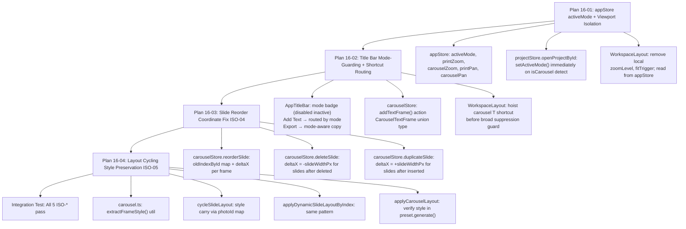

# Phase 16: Workspace Isolation & Mode State Synchronization
## AAS Multi-Agent Exploration & Debate

**Created:** 2026-09-29  
**Phase:** 16 — Workspace Isolation & Mode State Synchronization  
**Requirements:** ISO-01, ISO-02, ISO-03, ISO-04, ISO-05  
**Depends on:** Phase 15 (Carousel SQLite Persistence)

---

## Codebase Forensic Summary

Before the debate begins, the following facts are established from direct code inspection:

| File | Key Finding |
|------|-------------|
| [`WorkspaceLayout.tsx:101`](file:///Users/chiio/VSCode/albumaker/src/features/workspace/WorkspaceLayout.tsx#L101) | `activeMode` is **local React state** `useState<'print' \| 'carousel'>('print')` — not in any store |
| [`WorkspaceLayout.tsx:102-103`](file:///Users/chiio/VSCode/albumaker/src/features/workspace/WorkspaceLayout.tsx#L102-L103) | `activeModeRef` is a ref-shadow of the local state, used inside keyboard closures |
| [`WorkspaceLayout.tsx:93-94`](file:///Users/chiio/VSCode/albumaker/src/features/workspace/WorkspaceLayout.tsx#L93-L94) | `zoomLevel`/`fitTrigger` are **also local state** — one shared value for both modes |
| [`WorkspaceLayout.tsx:747`](file:///Users/chiio/VSCode/albumaker/src/features/workspace/WorkspaceLayout.tsx#L747) | Carousel shortcut guard: `if (activeMode === 'carousel' && !cmdOrCtrl ...)` — suppresses all single-key print shortcuts in carousel mode |
| [`AppTitleBar.tsx:41-43`](file:///Users/chiio/VSCode/albumaker/src/features/workspace/AppTitleBar.tsx#L41-L43) | `activeMode` is a **prop passed into AppTitleBar** — not sourced from a store |
| [`AppTitleBar.tsx:508-523`](file:///Users/chiio/VSCode/albumaker/src/features/workspace/AppTitleBar.tsx#L508-L523) | **"Add Text" button unconditionally calls `addTextToSpread(activeSpreadId)`** regardless of mode |
| [`AppTitleBar.tsx:525-534`](file:///Users/chiio/VSCode/albumaker/src/features/workspace/AppTitleBar.tsx#L525-L534) | **Export button has no mode guard** — shows "Export Album for Print" tooltip even in carousel mode |
| [`carouselStore.ts:570-593`](file:///Users/chiio/VSCode/albumaker/src/stores/carouselStore.ts#L570-L593) | `reorderSlide` — moves slides in array, re-indexes `slideIndex`, but **does NOT adjust frame absolute `x` coordinates** |
| [`carouselStore.ts:881-973`](file:///Users/chiio/VSCode/albumaker/src/stores/carouselStore.ts#L881-L973) | `cycleSlideLayout` — creates **brand-new frame objects** with fresh IDs, discarding `shapeType`, `borderEnabled`, `cornerRadius*` |
| [`carouselStore.ts:927-950`](file:///Users/chiio/VSCode/albumaker/src/stores/carouselStore.ts#L927-L950) | New frames in `cycleSlideLayout` and `applyDynamicSlideLayoutByIndex` — **zero style properties** (no border, no shape, no corner radius) |
| [`projectStore.ts:395`](file:///Users/chiio/VSCode/albumaker/src/stores/projectStore.ts#L395) | `isCarousel` detection: `settings.canvas.unit === 'px' \|\| settings.projectType === 'carousel'` — consistent pattern |
| [`projectStore.ts:549`](file:///Users/chiio/VSCode/albumaker/src/stores/projectStore.ts#L549) | `openProjectById` also uses the same `canvas.unit === 'px'` detection |
| [`appStore.ts`](file:///Users/chiio/VSCode/albumaker/src/stores/appStore.ts) | Contains app preferences, dialog state, update status — **no `activeMode` field** currently |

---

## AAS Debate: Round 1 — Opening Positions

---

### 🏛️ Persona 1: Global State & Store Architect

**Topic: Where should `activeMode` live?**

**Position: `appStore`, not `projectStore`, not local state.**

The current implementation has `activeMode` as local React state inside `WorkspaceLayout` (line 101). This is an **anti-pattern** for a value that gates behavior across `AppTitleBar`, `CarouselCanvas`, `KonvaEditorCanvas`, `InspectorContainer`, `FilmstripTray`, `WorkspaceLayout` keyboard handlers, and the `DropZoneHUD`. Prop-drilling `activeMode` six layers deep creates tight coupling and means any component that needs it without being in the tree must fall back to fragile `useRef` patterns.

**Why `appStore` beats `projectStore`:**

`projectStore` owns `currentProject: Project | null`. `activeMode` is *derived from* the project's `canvasUnit` field — it is not independent state that survives project switching. However, `projectStore` is focused on persistence, file I/O, and CRUD operations. Adding UI-layer viewport mode to it conflates two concerns.

`appStore` is the correct home because:
1. It already holds UI-layer flags (`isSettingsOpen`, `isAboutOpen`, `preferences`).
2. `activeMode` is not persisted to SQLite — it is resolved fresh on every `openProjectById` call from `canvas.unit === 'px'`.
3. It must be readable without subscription by `AppTitleBar` (which consumes `useAppStore`), `WorkspaceLayout`, carousel context menus, and filmstrip routing — all without threading a prop.

**Proposed `appStore` additions:**

```typescript
// In AppState interface (appStore.ts):
activeMode: 'print' | 'carousel';
setActiveMode: (mode: 'print' | 'carousel') => void;

// Viewport isolation — per-mode zoom/pan:
printZoom: number;
carouselZoom: number;
printPan: { x: number; y: number };
carouselPan: { x: number; y: number };
setPrintZoom: (z: number) => void;
setCarouselZoom: (z: number) => void;
setPrintPan: (pan: { x: number; y: number }) => void;
setCarouselPan: (pan: { x: number; y: number }) => void;
```

**Initial values:** `activeMode: 'print'`, all zooms `100`, all pans `{ x: 0, y: 0 }`.

**Detection on `openProjectById`:** After the project is loaded (line 549 of `projectStore.ts`), call `useAppStore.getState().setActiveMode(isCarousel ? 'carousel' : 'print')`. Do NOT set zoom here — that reset happens in `WorkspaceLayout` via a `useEffect` watching `activeMode`.

**`zoomLevel` in `WorkspaceLayout` must be removed.** Replace its two reads with:
```typescript
const activeMode = useAppStore((s) => s.activeMode);
const zoomLevel = useAppStore((s) => activeMode === 'carousel' ? s.carouselZoom : s.printZoom);
```

Each canvas reads its own zoom and writes back via `setCarouselZoom` / `setPrintZoom`. This guarantees zero cross-mode zoom leakage.

---

### 🎨 Persona 2: UI/UX & HIG Component Engineer

**Topic: Mode-guarding AppTitleBar controls and WorkspaceLayout routing.**

**Current Critical Bugs in AppTitleBar:**

1. **"Add Text" button** (line 508–523) always calls `addTextToSpread(activeSpreadId)` — which dispatches to `editorStore.addTextToSpread`. In Carousel mode, `activeSpreadId` is `null` (album has no active spread) so the button silently does nothing. But the button still renders, confusing users. **It must be mode-guarded or re-routed.**

2. **Export button** (line 525–534) shows "Export Album for Print (⌘E)" in its `title` attribute even in Carousel mode. This is a copy error and HIG violation — the tooltip must read "Export Carousel Slides (⌘E)" in Carousel mode.

3. **Mode Switcher** (lines 451–472): The current segmented control allows switching between Print and Carousel freely. Per the Context doc (§1.1), mode is a **project-type badge** — switching types is via "Duplicate as...". The segmented control must visually reflect this: **only the active mode button should appear enabled, the other should be disabled and visually suppressed** with a tooltip "To switch type, use File > Duplicate as Carousel".

**Mode-guarded "Add Text" — two approaches debated:**

*Option A: Inline `activeMode` check in `AppTitleBar`.*
```tsx
{activeMode === 'print' && (
  <button onClick={() => {
    if (!activeSpreadId) return;
    const newId = addTextToSpread(activeSpreadId);
    if (newId) { setEditingTextElementId(newId); showToast('✓ Added Text Box'); }
  }} title="Add Text Box (T)">
    <Type size={13} /> <span>Add Text</span>
  </button>
)}
{activeMode === 'carousel' && (
  <button onClick={() => {
    useCarouselStore.getState().addTextFrame(); // New action — Phase 16 plan will specify
    showToast('✓ Added Text Frame to Slide');
  }} title="Add Text (T)">
    <Type size={13} /> <span>Add Text</span>
  </button>
)}
```

*Option B: A `useModeAction` hook that returns the correct `onAddText` callback for the active mode.* This is cleaner for testing but is more abstraction. Given that `AppTitleBar` already imports from five stores, Option A (inline conditional) is more readable and explicit.

**WorkspaceLayout Canvas Routing (lines 1057–1077):**

The existing conditional is correct in structure:
```tsx
activeMode === 'carousel' ? <CarouselCanvas .../> : <KonvaEditorCanvas .../>
```
But it must be extended: both canvases should receive their isolated zoom values from `appStore`, not from shared `zoomLevel` local state. The fit-to-screen trigger should also be scoped:
```tsx
<CarouselCanvas
  zoomLevel={carouselZoom}
  onZoomChange={setCarouselZoom}
  fitTrigger={carouselFitTrigger}
/>
<KonvaEditorCanvas
  zoomLevel={printZoom}
  onZoomChange={setPrintZoom}
  fitTrigger={printFitTrigger}
/>
```

**Keyboard Shortcut Scope Isolation:**

The existing guard at line 747:
```typescript
if (activeMode === 'carousel' && !cmdOrCtrl && e.key !== 'F1' && e.key !== '?') {
  return;
}
```
...correctly suppresses print single-key shortcuts in Carousel mode. However, the problem is the block at line 831–842 (`T` key → `addTextToSpread`) is reached *after* this early return only in print mode. This is partially correct, but:

- `T` in Carousel mode must add a Konva text frame to `carouselStore`, not to `editorStore`.
- Because the early-return guard at line 747 catches carousel mode before reaching line 831, `T` in carousel mode currently **does nothing** — it's silently suppressed. ISO-03 requires it to **do something** (add carousel text frame).

**Fix:** The carousel `T` handler must be hoisted *before* the early-return guard:
```typescript
// Carousel-specific single-key shortcuts (before the early-return guard):
if (activeMode === 'carousel' && !cmdOrCtrl && !e.altKey && !e.shiftKey) {
  if (e.key === 't' || e.key === 'T') {
    e.preventDefault();
    useCarouselStore.getState().addTextFrame();
    showToast('✓ Added Text Frame to Slide');
    return;
  }
  // ... Space cycling already handled by separate useEffect
}
```

---

### 🔥 Persona 3: Data Integrity & Edge-Case Adversary

**I am here to break both of your plans. Let's go.**

#### Challenge A: Frame Coordinate Detachment on Slide Reorder

**Store Architect and UI Engineer, you both glossed over the most critical bug in the codebase.**

Look at `reorderSlide` (lines 570–593 of `carouselStore.ts`):

```typescript
reorderSlide: (fromIndex, toIndex) => {
  // ...
  const slides = [...currentCarousel.slides];
  const [moved] = slides.splice(fromIndex, 1);
  slides.splice(toIndex, 0, moved);
  const updatedSlides = slides.map((s, idx) => ({
    ...s,
    slideIndex: idx,   // ✅ slideIndex is correctly updated
  }));
  // ...
}
```

`slideIndex` on the *slide* object is updated. But every `CarouselPhotoFrame` has an **absolute `x` coordinate** computed as `slideIndex * slideWidthPx + localX`. These absolute `x` values are **never recalculated** when reorderSlide runs.

**Concrete example:** Three slides, `slideWidthPx = 1080`.
- Slide 0: frames at `x ≈ 0..1080`
- Slide 1: frames at `x ≈ 1080..2160`
- Slide 2: frames at `x ≈ 2160..3240`

User drags Slide 2 to position 0. After reorder:
- New Slide 0 (was slide 2): frames still have `x ≈ 2160..3240` → they render **2160px to the right** of where slide 0 is painted.
- The Konva stage still renders slide backgrounds at position `0`, `1080`, `2160`. The frames are completely detached.

**This is ISO-04.** Neither of you specified the exact fix.

**Required fix in `reorderSlide`:**

```typescript
reorderSlide: (fromIndex, toIndex) => {
  const { currentCarousel, pushHistory } = get();
  if (!currentCarousel || fromIndex === toIndex) return;

  pushHistory();
  const slides = [...currentCarousel.slides];
  const [moved] = slides.splice(fromIndex, 1);
  if (!moved) return;
  slides.splice(toIndex, 0, moved);

  const slideWidthPx = currentCarousel.slideWidthPx;

  const updatedSlides = slides.map((slide, newIdx) => {
    const oldIdx = slide.slideIndex; // the index BEFORE reorder
    const deltaX = (newIdx - oldIdx) * slideWidthPx; // pixels to shift all frames
    
    return {
      ...slide,
      slideIndex: newIdx,
      elements: slide.elements.map((el) =>
        el.type === 'photo'
          ? { ...el, x: Math.round(el.x + deltaX) }
          : el
      ),
    };
  });

  set({
    currentCarousel: { ...currentCarousel, slides: updatedSlides },
    activeSlideIndex: toIndex,
  });
},
```

**But wait — there is a subtlety.** The `oldIdx` used in the delta calculation should be the pre-reorder `slideIndex` of the slide object. Since `slide.slideIndex` is set by the previous operation, we must capture it *before* mapping:

```typescript
// Capture old indices before reorder
const oldIndexMap = new Map(currentCarousel.slides.map((s, i) => [s.id, i]));
// ... after splice ...
const updatedSlides = slides.map((slide, newIdx) => {
  const oldIdx = oldIndexMap.get(slide.id) ?? newIdx;
  const deltaX = (newIdx - oldIdx) * slideWidthPx;
  return {
    ...slide,
    slideIndex: newIdx,
    elements: slide.elements.map((el) =>
      el.type === 'photo' ? { ...el, x: Math.round(el.x + deltaX) } : el
    ),
  };
});
```

**Same fix must apply to `deleteSlide` and `duplicateSlide`.**

For **`deleteSlide`** (lines 548–568): When slide at index `i` is deleted, all slides at indices `> i` must shift their frames' `x` values by `-slideWidthPx`.

For **`duplicateSlide`** (lines 513–546): The duplicated slide is inserted at `index + 1`. All slides after the insertion point must shift their frames by `+slideWidthPx`.

#### Challenge B: Style Preservation During Layout Cycling

**This is the second most critical bug.**

`cycleSlideLayout` (lines 881–973) creates **brand-new frame objects**:

```typescript
// Line 927-950: FRESH frame objects — NO style inheritance
const newPhotoElements: CarouselPhotoFrame[] = chosen.rects.map((rect, i) => {
  return {
    type: 'photo',
    id: `frame-${Date.now()}-${i}-...`,  // NEW ID — loses history binding
    photoId: ...,
    // x, y, width, height from layout rect
    cropX: 0, cropY: 0, cropScale: 1.0,
    // ❌ NO: shapeType, borderEnabled, borderWidth, borderColor, cornerRadius*
  };
});
```

ISO-05 requires preserving `shapeType`, `border*`, `cornerRadius*`, `shadow`. The fix is to map existing frames by photo identity and carry forward their style attributes when generating new layout positions. The key insight: **only the geometry changes; the style transfers.**

```typescript
// In cycleSlideLayout and applyDynamicSlideLayoutByIndex:
// Build a style map from existing frames keyed by photoId
const styleByPhotoId = new Map(activeFrames.map(f => [f.photoId || f.id, {
  shapeType: f.shapeType,
  customSvgPath: f.customSvgPath,
  borderEnabled: f.borderEnabled,
  borderWidth: f.borderWidth,
  borderColor: f.borderColor,
  borderStyle: f.borderStyle,
  opacity: f.opacity,
  rotation: f.rotation,
  locked: f.locked,
  cornerRadius: f.cornerRadius,
  cornerRadiusTl: f.cornerRadiusTl,
  cornerRadiusTr: f.cornerRadiusTr,
  cornerRadiusBr: f.cornerRadiusBr,
  cornerRadiusBl: f.cornerRadiusBl,
}]));

// When building newPhotoElements, spread style from map:
const existingStyle = styleByPhotoId.get(photo.photoId || photo.id);
return {
  type: 'photo',
  id: `frame-${Date.now()}-${i}-${Math.random().toString(36).substring(2, 7)}`,
  // ... photo fields ...
  x: Math.round(slideStartX + rect.x),
  y: Math.round(rect.y),
  width: Math.round(rect.width),
  height: Math.round(rect.height),
  cropX: 0, cropY: 0, cropScale: 1.0,
  // ✅ Style preservation:
  ...(existingStyle ?? {}),
};
```

**The same fix applies to `applyDynamicSlideLayoutByIndex`, `applyCarouselLayout`, and `addPhotoFrames` Case B** — all four layout mutation paths must adopt this style-carry pattern.

#### Challenge C: Undo/Redo History Stack and Mode Switches

**What happens to `carouselStore` history when `openProjectById` is called or mode switches?**

**Scenario 1: User edits carousel (builds up `past` stack), then opens a different project.**

`projectStore.closeProject()` (lines 319–331) calls:
```typescript
useCarouselStore.setState({
  currentCarousel: null,
  past: [],
  future: [],
  canUndo: false,
  canRedo: false,
  // ...
});
```
✅ History is correctly cleared on project close.

**Scenario 2: User switches from Print mode → Carousel mode via the segmented control in `AppTitleBar`.**

Current code (lines 1041–1049 of `WorkspaceLayout.tsx`):
```typescript
onModeSelect={(mode) => {
  setActiveMode(mode);
  if (mode === 'carousel' && currentProject) {
    const cs = useCarouselStore.getState();
    if (!cs.currentCarousel || cs.currentCarousel.projectId !== currentProject.id) {
      cs.initializeCarousel(currentProject.id);
    }
  }
}}
```

This **does NOT clear `carouselStore` history** when switching to Carousel mode if a carousel already exists. This means the user could have stale undo entries from a previous carousel session while in the current session's context. However, since the context doc (§1.1) states mode-switching is actually not possible at runtime (the button becomes a badge), this scenario is **moot after Phase 16** — but must be noted.

**Scenario 3: Race condition between `openProjectById` hydration and mode detection.**

`openProjectById` in `projectStore.ts` (line 498) is async. It calls:
1. `set({ isLoading: true })` — synchronously
2. `get_project` via Tauri invoke — async (may take 50–500ms)
3. Sets `currentProject` — synchronous
4. `loadPhotos`, `loadFolders` — async
5. Checks `isCarousel` and calls `loadCarouselFromDb` or `loadAlbumFromDb` — async

**The race:** `WorkspaceLayout` has a `useEffect` that watches `currentProject` (line 699–718) and calls `loadAlbumFromDb`. This effect fires as soon as step 3 completes, **before** step 5. For carousel projects, the `WorkspaceLayout` effect will call `loadAlbumFromDb` (album path), while `projectStore.openProjectById` will subsequently call `loadCarouselFromDb`. The album load is wasteful but not catastrophic — unless it clobbers carousel state.

**Proposed race fix:** The `WorkspaceLayout` `useEffect` at line 699 must check `isCarousel` before calling album functions:
```typescript
useEffect(() => {
  if (currentProject) {
    const isCarousel = currentProject.canvasUnit === 'px' || currentProject.projectType === 'carousel';
    if (!isCarousel) {
      const albumStore = useAlbumStore.getState();
      if (!albumStore.currentAlbum || albumStore.currentAlbum.projectId !== currentProject.id) {
        albumStore.loadAlbumFromDb(currentProject.id).then(loaded => {
          if (!loaded) albumStore.initializeAlbum(currentProject);
        });
      }
    }
    // Carousel loading is handled inside projectStore.openProjectById
  }
}, [currentProject]);
```

Additionally, `appStore.setActiveMode` must be called **inside** `openProjectById` (in `projectStore.ts`) immediately when `isCarousel` is determined — before the async photo/structure loads — so that `WorkspaceLayout` routes to the correct canvas before any data arrives. This prevents a flash of the wrong canvas.

#### Challenge D: `zoomLevel` stale closure in keyboard handler

`WorkspaceLayout.handleKeyDown` captures `activeMode` via the `activeModeRef` pattern (lines 844, 102–103), but it also captures `setZoomLevel` which operates on the shared local state. When we migrate `zoomLevel` to `appStore`, the keyboard handler must call `useAppStore.getState().setPrintZoom(...)` / `useAppStore.getState().setCarouselZoom(...)` rather than `setZoomLevel`. The dependency array at line 944 must be updated accordingly.

---

## AAS Debate: Round 2 — Cross-Examination

---

### Store Architect responds to Adversary's frame coordinate challenge:

The Adversary is correct about `reorderSlide`. The `oldIndexMap` approach using `slide.id` as key is the right sentinel — `slide.id` is stable across reorders, while `slideIndex` is mutable. The map must be built from `currentCarousel.slides` *before* the splice operation. This is the exact implementation pattern.

For **`duplicateSlide`**, the duplicated slide gets fresh frame objects that are already at the correct `x` (copied from the source). The slides *after* the insertion point need their frames shifted by `+slideWidthPx`. Implementation:

```typescript
// After building newSlides array:
const updatedSlides = newSlides.map((slide, newIdx) => {
  const originalIdx = currentCarousel.slides.findIndex(s => s.id === slide.id);
  if (originalIdx === -1) {
    // This is the duplicated slide — its frames were already cloned with correct x positions
    return { ...slide, slideIndex: newIdx };
  }
  const deltaX = (newIdx - originalIdx) * slideWidthPx;
  if (deltaX === 0) return { ...slide, slideIndex: newIdx };
  return {
    ...slide,
    slideIndex: newIdx,
    elements: slide.elements.map(el =>
      el.type === 'photo' ? { ...el, x: Math.round(el.x + deltaX) } : el
    ),
  };
});
```

For **`deleteSlide`**, all slides after the deleted index shift by `-slideWidthPx`:

```typescript
const deletedIdx = index;
const updatedSlides = currentCarousel.slides
  .filter((_, idx) => idx !== deletedIdx)
  .map((slide, newIdx) => {
    const originalIdx = newIdx >= deletedIdx ? newIdx + 1 : newIdx;
    const deltaX = (newIdx - originalIdx) * slideWidthPx;
    return {
      ...slide,
      slideIndex: newIdx,
      elements: slide.elements.map(el =>
        el.type === 'photo' ? { ...el, x: Math.round(el.x + deltaX) } : el
      ),
    };
  });
```

### UI Engineer responds to Adversary's shortcut challenge:

The Adversary correctly identified that `T` is silently eaten in Carousel mode. The carousel-specific shortcut block must be inserted at lines 726–749 of `WorkspaceLayout.tsx`, **before** the early-return guard at line 747. The structure:

```typescript
// STEP 1: Carousel-exclusive single-key shortcuts (before the broad early-return guard)
if (activeMode === 'carousel' && !cmdOrCtrl && !e.altKey && !e.shiftKey) {
  if (e.key === 't' || e.key === 'T') {
    e.preventDefault();
    useCarouselStore.getState().addTextFrame();
    showToast('✓ Added Text Frame to Slide');
    return;
  }
}

// STEP 2: Broad carousel suppression (catches all remaining print-only single-key shortcuts)
if (activeMode === 'carousel' && !cmdOrCtrl && e.key !== 'F1' && e.key !== '?') {
  return;
}

// STEP 3: Print-only shortcuts (P, L, G, T, etc.) continue below...
```

For the **Spacebar cycling** in carousel mode, the existing disambiguation state machine (`useEffect` at lines 952–1026) already guards against carousel: line 1009 checks `activeMode !== 'carousel'` before calling `cycleLayout`. The carousel spacebar cycling is handled by a separate `keydown` listener inside `CarouselCanvas`. This separation is correct.

### Adversary challenges the `addTextFrame` action:

The `carouselStore` currently has **no `addTextFrame` action**. The current `CarouselPhotoFrame` type is photo-only. Adding text frames requires either:

*Option A:* Extend `CarouselPhotoFrame` with a `type: 'text'` variant (a Konva `Text` node with font/content properties).
*Option B:* Add a separate `textFrames: CarouselTextFrame[]` field to each `CarouselSlide`.

**Decision:** Option A is preferred — it maintains a single `elements` array per slide, consistent with how `AlbumSpread.elements` works. The `CarouselTextFrame` interface would be:

```typescript
export interface CarouselTextFrame {
  type: 'text';
  id: string;
  x: number;
  y: number;
  width: number;
  height: number;
  text: string;
  fontSize: number;
  fontFamily: string;
  fontWeight: string;
  color: string;
  align: 'left' | 'center' | 'right';
  locked: boolean;
}
```

And `CarouselSlide.elements` becomes `Array<CarouselPhotoFrame | CarouselTextFrame>`.

The `addTextFrame` action in `carouselStore`:
```typescript
addTextFrame: () => {
  const { currentCarousel, activeSlideIndex, pushHistory } = get();
  if (!currentCarousel) return;
  const slide = currentCarousel.slides[activeSlideIndex];
  if (!slide) return;
  pushHistory();
  const slideStartX = activeSlideIndex * currentCarousel.slideWidthPx;
  const frameId = `text-${Date.now()}-${Math.random().toString(36).substring(2, 7)}`;
  const newTextFrame: CarouselTextFrame = {
    type: 'text',
    id: frameId,
    x: Math.round(slideStartX + currentCarousel.slideWidthPx * 0.1),
    y: Math.round(currentCarousel.slideHeightPx * 0.4),
    width: Math.round(currentCarousel.slideWidthPx * 0.8),
    height: 80,
    text: 'Add your text here',
    fontSize: 48,
    fontFamily: 'SF Pro Display, system-ui, sans-serif',
    fontWeight: '700',
    color: '#FFFFFF',
    align: 'center',
    locked: false,
  };
  const updatedSlides = currentCarousel.slides.map((s, idx) =>
    idx === activeSlideIndex
      ? { ...s, elements: [...s.elements, newTextFrame] }
      : s
  );
  set({
    currentCarousel: { ...currentCarousel, slides: updatedSlides },
    selectedFrameId: frameId,
    selectedFrameIds: [frameId],
  });
},
```

> [!NOTE]
> The `addTextFrame` action is a **Phase 16 implementation detail** that must be specified in the Implementation Plan. It is introduced here to resolve the ISO-03 requirement for "Add Text" in Carousel mode.

---

## AAS Debate: Round 3 — Convergence & Consensus

---

### 📋 Final Consensus: `activeMode` Store Placement

**Decision: `appStore`.**

Rationale:
- `activeMode` is UI-layer state, not domain persistence state.
- It must be accessible without prop-drilling in `AppTitleBar`, `FilmstripTray`, `InspectorContainer`, and `WorkspaceLayout`.
- It is derived deterministically from `project.canvasUnit`/`project.projectType` and reset on every project open.
- `appStore` already hosts analogous UI state; adding `activeMode` is a natural fit.
- **`projectStore` should NOT own it** — `projectStore` is the persistence/CRUD layer.

**Detection:** Inside `projectStore.openProjectById` (line 549), immediately after `isCarousel` is resolved, call `useAppStore.getState().setActiveMode(isCarousel ? 'carousel' : 'print')`. Similarly in `projectStore.createNewProject` (line 395, already has `isCarousel` variable) and `projectStore.closeProject` → reset to `'print'`.

---

### 📋 Final Consensus: Zoom/Pan Isolation

**Decision: Four isolated fields in `appStore`.**

```typescript
printZoom: number;     // default: 100
carouselZoom: number;  // default: 100
printPan: { x: number; y: number };    // default: { x: 0, y: 0 }
carouselPan: { x: number; y: number }; // default: { x: 0, y: 0 }
```

`WorkspaceLayout.tsx` removes its local `zoomLevel`/`fitTrigger` state. Both `KonvaEditorCanvas` and `CarouselCanvas` read from the appropriate `appStore` field and write back via the setters.

**Fit-to-screen:** On `openProjectById` completion, or whenever `activeMode` changes, `appStore` resets the *active mode's* zoom to 100 and pan to `{ x: 0, y: 0 }`. A separate `fitTrigger` counter per mode (`printFitTrigger`, `carouselFitTrigger`) is kept in `appStore` to trigger the Konva stage fit-to-screen callback.

**Zoom keyboard handler** in `WorkspaceLayout.handleKeyDown`: Replace `setZoomLevel` calls with:
```typescript
} else if (e.key === '=' || ...) {
  e.preventDefault();
  const store = useAppStore.getState();
  if (activeMode === 'carousel') {
    store.setCarouselZoom(Math.min(350, store.carouselZoom + 15));
  } else {
    store.setPrintZoom(Math.min(350, store.printZoom + 15));
  }
}
```

---

### 📋 Final Consensus: AppTitleBar Mode-Guarding

**Decision: Inline conditional rendering in `AppTitleBar`.**

1. **Mode Switcher** → Becomes a read-only project-type badge. The inactive mode button is `disabled` and visually grayed. Tooltip: `"To change type, use File > Duplicate as [other type]"`. `onModeSelect` prop is **removed** entirely — it was a vestigial affordance from an earlier design.

2. **"Add Text" button** → Conditionally routed:
   - Print mode: `addTextToSpread(activeSpreadId)` (existing behavior)
   - Carousel mode: `useCarouselStore.getState().addTextFrame()` (new behavior)
   - The button renders in both modes with the same visual appearance.

3. **Export button** → Mode-aware copy:
   - Print mode: title = `"Export Album for Print (⌘E)"`
   - Carousel mode: title = `"Export Carousel Slides (⌘E)"` (and in a future phase, carousel export will render individual JPGs/MP4s via Tauri, not the current album PDF pipeline)

4. **Undo/Redo** → Already correctly routed via the `isCarousel` branch in `AppTitleBar` (lines 85–90). No change needed.

---

### 📋 Final Consensus: Keyboard Shortcut Isolation

**Decision: Hoist carousel-specific single-key shortcuts before the broad suppression guard.**

Execution order in `handleKeyDown`:

1. ❌ Return if dialog is open, or target is input/textarea
2. ✅ Handle `Alt` prevention
3. ✅ **NEW: Carousel-exclusive single-key block** (`T` → `addTextFrame`, future carousel-specific keys)
4. ✅ Existing broad suppression: `if (activeMode === 'carousel' && !cmdOrCtrl ...)` → early return
5. ✅ Print-only single-key shortcuts (`P`, `L`, `G`, `T` for print)
6. ✅ `cmdOrCtrl` shortcuts (`Z`, `Y`, `S`, `E`, etc.)

**`Cmd+Z` routing** remains correct at lines 849–865: `curMode === 'carousel'` routes to `carouselStore.undo/redo()`.

---

### 📋 Final Consensus: Slide Reorder Coordinate Fix

**Decision: Apply `deltaX` correction to all frame `x` coordinates in `reorderSlide`, `deleteSlide`, and `duplicateSlide`.**

Implementation pattern (the `oldIndexMap` approach):

```typescript
reorderSlide: (fromIndex, toIndex) => {
  const { currentCarousel, pushHistory } = get();
  if (!currentCarousel || fromIndex === toIndex) return;
  pushHistory();
  
  // Capture pre-reorder indices by slide ID (stable key)
  const oldIndexById = new Map(currentCarousel.slides.map((s, i) => [s.id, i]));
  
  const slides = [...currentCarousel.slides];
  const [moved] = slides.splice(fromIndex, 1);
  if (!moved) return;
  slides.splice(toIndex, 0, moved);
  
  const { slideWidthPx } = currentCarousel;
  
  const updatedSlides = slides.map((slide, newIdx) => {
    const oldIdx = oldIndexById.get(slide.id) ?? newIdx;
    const deltaX = (newIdx - oldIdx) * slideWidthPx;
    return {
      ...slide,
      slideIndex: newIdx,
      elements: deltaX === 0
        ? slide.elements
        : slide.elements.map(el =>
            el.type === 'photo' ? { ...el, x: Math.round(el.x + deltaX) } : el
          ),
    };
  });
  
  set({
    currentCarousel: { ...currentCarousel, slides: updatedSlides },
    activeSlideIndex: toIndex,
  });
},
```

**`deleteSlide` deltaX:** For each slide at new index `i`, original index was `i` (if `i < deletedIdx`) or `i + 1` (if `i >= deletedIdx`).

**`duplicateSlide` deltaX:** The cloned slide's frames already carry correct `x` from the source. For slides at new index `i > sourceIdx + 1`, original index was `i - 1`, so `deltaX = +slideWidthPx`.

---

### 📋 Final Consensus: Style Preservation During Layout Cycling

**Decision: Build a `photoId → style` map before cycling, carry forward style attrs to new frames.**

This fix applies to:
- `cycleSlideLayout` (lines 881–973)
- `applyDynamicSlideLayoutByIndex` (lines 975–1062)
- `applyCarouselLayout` (lines 1064–1160) — existing frames are already re-used here via `generated.preset.generate()`; check if style is preserved in `carouselLayout.ts` generated frames
- `addPhotoFrames` Case B (line 757–813) — style IS preserved here via `orig.shapeType`, `orig.borderEnabled`, etc. ✅ Already correct.

The **style carrier object** (reusable across all three layout cycling paths):

```typescript
type FrameStyleSnapshot = {
  shapeType?: string;
  customSvgPath?: string;
  borderEnabled?: boolean;
  borderWidth?: number;
  borderColor?: string;
  borderStyle?: string;
  opacity?: number;
  rotation?: number;
  locked?: boolean;
  cornerRadius?: number;
  cornerRadiusTl?: number;
  cornerRadiusTr?: number;
  cornerRadiusBr?: number;
  cornerRadiusBl?: number;
};

function extractFrameStyle(frame: CarouselPhotoFrame): FrameStyleSnapshot {
  return {
    shapeType: frame.shapeType,
    customSvgPath: frame.customSvgPath,
    borderEnabled: frame.borderEnabled,
    borderWidth: frame.borderWidth,
    borderColor: frame.borderColor,
    borderStyle: frame.borderStyle,
    opacity: frame.opacity,
    rotation: frame.rotation,
    locked: frame.locked,
    cornerRadius: frame.cornerRadius,
    cornerRadiusTl: frame.cornerRadiusTl,
    cornerRadiusTr: frame.cornerRadiusTr,
    cornerRadiusBr: frame.cornerRadiusBr,
    cornerRadiusBl: frame.cornerRadiusBl,
  };
}
```

This function can live in `src/domain/carousel.ts` and be imported by `carouselStore.ts`.

> [!WARNING]
> **Photo assignment indices after layout cycling.** When `generateDynamicVariations` returns a new layout, `chosen.photoAssignments[i]` maps rect `i` to photo array index. The style should follow the **photo**, not the rect position. If photo 0 was hexagon-clipped and ends up in rect position 1 after cycling, the hexagon style must travel with photo 0, not stay on position 0. The `styleByPhotoId` Map (keyed on `photo.photoId || photo.id`) guarantees this.

---

## Implementation Conflict Analysis

The following conflicts were identified between the three personas' positions and resolved:

| Conflict | Persona 1 Position | Persona 2 Position | Persona 3 Challenge | Resolution |
|----------|-------------------|-------------------|---------------------|------------|
| Where does `activeMode` live? | `appStore` | `appStore` (via props) | Race condition on `openProjectById` | `appStore` + call `setActiveMode` inside `projectStore.openProjectById` synchronously after `isCarousel` determination |
| Mode switcher behavior | Retain segmented control | Disable inactive mode | N/A | Render as badge; disabled inactive button |
| `T` shortcut in Carousel | Add to carousel shortcut block | Hoist before suppression guard | Currently silently swallowed | Hoist carousel-exclusive block BEFORE the broad early-return suppression |
| `zoomLevel` scope | Isolated per-mode fields in `appStore` | Accept isolation | Stale closure bug in keyboard handler | Per-mode fields in `appStore`; keyboard handler reads from `useAppStore.getState()` |
| `reorderSlide` frame coords | Not addressed | Not addressed | ❌ Critical bug: no `deltaX` | `oldIndexById` map + `deltaX` correction in `reorderSlide`, `deleteSlide`, `duplicateSlide` |
| Style on layout cycling | Not addressed | Not addressed | ❌ Critical bug: styles stripped | `extractFrameStyle()` + `photoId` keyed map; spread into new frame objects |
| `addTextFrame` carousel action | Extend `carouselStore` | Route from AppTitleBar | Type system must be extended | Add `CarouselTextFrame` union type + `addTextFrame` action |

---

## Phase 16 Implementation Map

Based on the debate, the following plans are proposed (to be formalized in 16-01 Plan etc.):



---

## Critical Risk Register

> [!CAUTION]
> **ISO-04 (Frame Coordinate Detachment) is the highest-priority bug.** It is a silent data corruption: frames render at incorrect positions and the user has no visual indication until they switch slides. The `reorderSlide` fix must be implemented and tested first.

> [!WARNING]
> **ISO-05 (Style Stripping in cycleSlideLayout) is the second highest.** It silently destroys custom vector masks and borders on every Spacebar press. Users who have customized frames will lose their work without warning.

> [!IMPORTANT]
> **`activeMode` detection race:** Call `useAppStore.getState().setActiveMode()` synchronously inside `projectStore.openProjectById` before any async loads. This ensures the correct canvas (`CarouselCanvas` vs `KonvaEditorCanvas`) is mounted before data arrives, preventing a flash of wrong canvas.

> [!NOTE]
> **AlbumCanvas does not exist.** The codebase uses `KonvaEditorCanvas` (in `src/features/editor/KonvaEditorCanvas.tsx`) as the print canvas and `CarouselCanvas` (in `src/features/carousel/CarouselCanvas.tsx`) for carousel. `WorkspaceLayout` routes between these two. There is no `src/features/album/AlbumCanvas.tsx` — the album/spread rendering lives in `SpreadCanvas.tsx` within `KonvaEditorCanvas`.

> [!TIP]
> When implementing zoom isolation, the `CarouselCanvas` already has its own `zoomLevel` prop and `onZoomChange` callback. The migration from shared local state to per-mode `appStore` fields is straightforward — only the source of truth changes, not the prop interface.

---

## Conclusion: Debate Consensus Statement

Phase 16 requires **five distinct implementation changes**, each mapped to an ISO requirement:

| ISO Req | Change | Files Affected |
|---------|--------|----------------|
| ISO-01 | Hoist `activeMode` to `appStore`; detect in `projectStore.openProjectById` | `appStore.ts`, `projectStore.ts`, `WorkspaceLayout.tsx` |
| ISO-02 | Isolate `printZoom`/`carouselZoom`/`printPan`/`carouselPan` in `appStore` | `appStore.ts`, `WorkspaceLayout.tsx`, `CarouselCanvas.tsx`, `KonvaEditorCanvas.tsx` |
| ISO-03 | Mode-guard AppTitleBar; hoist carousel shortcut block; add `addTextFrame`; route Cmd+Z | `AppTitleBar.tsx`, `WorkspaceLayout.tsx`, `carouselStore.ts`, `carousel.ts` |
| ISO-04 | Fix frame `x` coordinate shift in `reorderSlide`, `deleteSlide`, `duplicateSlide` | `carouselStore.ts` |
| ISO-05 | Carry `FrameStyleSnapshot` through `cycleSlideLayout` and `applyDynamicSlideLayoutByIndex` | `carouselStore.ts`, `carousel.ts` |

All three debate personas converged on: **`appStore` for mode + viewport state, inline mode-guards in `AppTitleBar`, carousel shortcut block before suppression, `oldIndexById` delta for reorder, and `extractFrameStyle()` for layout cycling.** No open conflicts remain.

---

*Debate conducted by: Global State & Store Architect, UI/UX & HIG Component Engineer, Data Integrity & Edge-Case Adversary*  
*Synthesized: 2026-09-29*
