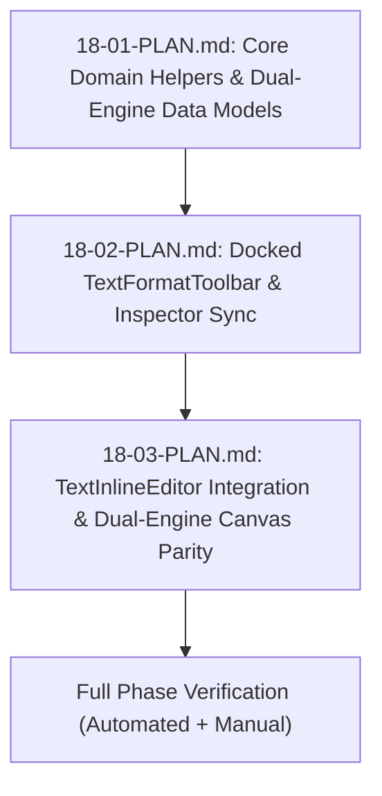

# Phase 18 Master Execution Plan: Direct-Canvas Rich Text Color Bar & Inline Hex Editor

## Executive Summary
Phase 18 equips OpenSmartAlbum with a Figma-grade direct-canvas rich text editing experience across both Print Album and Social Carousel engines. Users can format text with a docked Mac dark studio toolbar, type `#RGB` or `#RRGGBB` hex colors directly with live preview, apply text background highlights with 1-click transparent clear, inspect mixed selections, and interact with color popovers without dropping active canvas text selections.

---

## Sub-Plan Roadmap & Dependency Graph



| Plan ID | Title | Core Deliverables | Test Target |
|---|---|---|---|
| **[18-01-PLAN.md](./18-01-PLAN.md)** | Core Rich Text Domain Helpers & Selection Formatting Engine | • `normalizeHexColor`<br>• `getActiveSelectionFormat`<br>• `normalizeStyledRanges`<br>• `applyHighlightToRange`<br>• `CarouselTextFrame` rich text model upgrade | `src/domain/__tests__/styledRangesFormatting.test.ts` |
| **[18-02-PLAN.md](./18-02-PLAN.md)** | Docked TextFormatToolbar Component, Hex Popovers & Inspector Sync | • Mac Dark Studio `TextFormatToolbar.tsx`<br>• Zero-blur buttons & controls<br>• Text background highlight picker & 1-click clear<br>• Popover color picker<br>• `TypographyPanel.tsx` highlight controls | `src/features/editor/__tests__/TextFormatToolbar.test.tsx` |
| **[18-03-PLAN.md](./18-03-PLAN.md)** | TextInlineEditor Integration, Dual-Engine Parity & Verification | • `TextInlineEditor.tsx` docked toolbar anchor & collision auto-flip<br>• Focus stealing protection in `useLayoutEffect`<br>• Eyedropper backdrop lock<br>• `CarouselTextNode.tsx` & `CarouselCanvas.tsx` double-click inline editor<br>• Full verification | `src/features/editor/__tests__/TextInlineEditorParity.test.ts` |

---

## Key Invariants & Architectural Contracts

1. **Dual-Engine 1:1 Parity:**
   - Both Print Album (`KonvaEditorCanvas.tsx`) and Social Carousel (`CarouselCanvas.tsx`) use identical rich text formatting models (`styledRanges`, `highlight`, `fill`, `fontWeight`, `fontStyle`, `textDecoration`).
   - `TextFormatToolbar` is fully decoupled from canvas type and operates on a pure interface (`activeFormat`, `onApplyRangeFormat`, `onApplyBaseStyle`, `onClearHighlight`).

2. **Zero-Blur Selection Preservation:**
   - Interactive toolbar elements (buttons, swatches, sliders, preset pills) use `onMouseDown={(e) => e.preventDefault()}` and `onPointerDown={(e) => e.stopPropagation()}` to prevent DOM focus shift.
   - `TextInlineEditor.tsx` guards `restoreSelection` to avoid stealing DOM focus when the user is typing in the Hex `<input>`.

3. **Safe Hex Normalization:**
   - Deferred 3-digit `#RGB` expansion on blur/Enter to eliminate lime-green color flashing during keystrokes 1–3 of a 6-digit hex.
   - Live 6-digit `#RRGGBB` preview.
   - Clear input value on focusing `"Mixed"` placeholder.

4. **Undo/Redo Isolation:**
   - Keystrokes and toolbar tweaks are isolated inside `TextInlineEditor` local past/future history stacks during active editing.
   - Pushes a single album snapshot to global `historyStore` upon commit.

---

## Global Verification Suite

```bash
# 1. Run all unit & integration tests
npx vitest run src/domain/__tests__/styledRangesFormatting.test.ts
npx vitest run src/features/editor/__tests__/TextFormatToolbar.test.tsx
npx vitest run src/features/editor/__tests__/TextInlineEditorParity.test.ts
npx vitest run src/stores/__tests__/carouselStore-addTextFrame.test.ts

# 2. Project Typecheck
npm test
```
