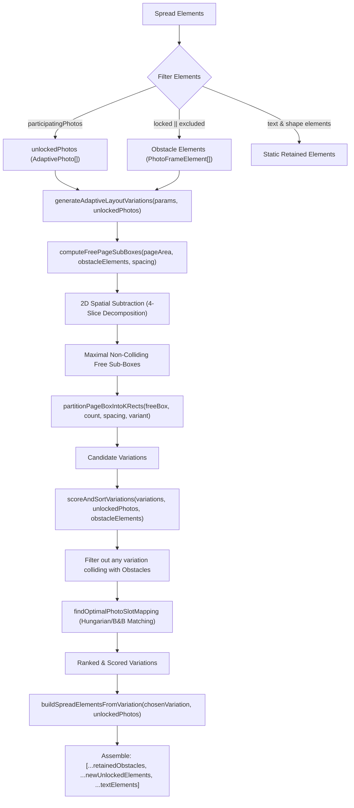

# Phase 19 Research: Adaptive Layout Decorative Exclusion & Photo Swap Shortcut

## Executive Summary
This research investigates the complete architectural implementation for Phase 19:
1. **Decorative & Overlay Exclusion (`excludeFromAdaptiveLayout`)**: Enabling logos, watermarks, stamps, and decorative frames to stay fixed in place during adaptive layout generation, Spacebar layout cycling, and photo shuffling while treating them as geometric obstacles via 2D Spatial Subtraction (Maximal Empty Rectangles).
2. **Dual-Engine Photo Swap Shortcut (`S`)**: Enhancing shortcut `S` across both **Print Album Canvas** (`KonvaEditorCanvas.tsx`) and **Social Media Carousel Canvas** (`CarouselCanvas.tsx`) so that:
   - Selecting **1 photo frame** and pressing `S` reveals / focuses the cyan photo swap handle with visual feedback.
   - Selecting **2 photo frames** and pressing `S` immediately executes an instant 2-frame photo swap with atomic undo history.
3. **1:1 Dual-Engine Parity**: Guaranteeing identical data structures, inspector controls, and layout partition behaviors across Print and Carousel canvas engines.

---

## 1. Adaptive Layout Engine Analysis (`src/domain/adaptiveLayout.ts`)

### 1.1 Current Architecture & Obstacle Partition Pipeline
`src/domain/adaptiveLayout.ts` generates dynamic, aspect-aware collage variations for $N$ photos across single-page covers and 2-page spreads.



### 1.2 Mathematical Details of Spatial Subtraction (`computeFreePageSubBoxes`)
Inside `computeFreePageSubBoxes(pageArea: RectBounds, lockedFrames: PhotoFrameElement[], spacing: number)`:
1. **Initial State**: Starts with candidate box list `[pageArea]`.
2. **Obstacle Slicing**: For each intersecting obstacle $O$, each candidate box $B$ intersecting $O$ is sliced into up to 4 maximal empty sub-rectangles:
   - **Top Slice**: $y = B.y, h = \text{round4}(O.y - \text{spacing} - B.y)$
   - **Bottom Slice**: $y = \text{round4}(O.y + O.height + \text{spacing}), h = \text{round4}(B.y + B.height - y)$
   - **Left Slice**: $x = B.x, w = \text{round4}(O.x - \text{spacing} - B.x)$
   - **Right Slice**: $x = \text{round4}(O.x + O.width + \text{spacing}), w = \text{round4}(B.x + B.width - x)$
3. **Threshold Filtering**: Any slice with dimension $< \text{minDimension} = \max(\text{spacing} \times 1.5, \min(\text{pageArea.width}, \text{pageArea.height}) \times 0.05)$ is discarded.
4. **Subsumption Elimination**: If a box $A$ is geometrically covered by a larger box $B$, $A$ is pruned.
5. **Area Sorting**: Resulting maximal empty boxes are sorted descending by area ($\text{width} \times \text{height}$).

### 1.3 Collision Guarantee in `scoreAndSortVariations`
`scoreAndSortVariations` performs strict invariant filtering:
```ts
const nonColliding = locked.length > 0
  ? rawVariations.filter((v) =>
      v.rects.every((r) => locked.every((l) => !rectsIntersect(r, l)))
    )
  : rawVariations;
```
When `obstacleElements` (combining `locked` and `excludeFromAdaptiveLayout` elements) are passed as the `locked` parameter, every generated frame slot is mathematically guaranteed never to collide with or cover an excluded element.

### 1.4 Cache Key Sensitivity & LRU Invalidation
Cache keys are constructed via `getRawPartitionCacheKey(params, photoCount)`.
The signature includes:
`const lockedSig = (params.lockedElements || []).map((l) => `${round4(l.x)},${round4(l.y)},${round4(l.width)},${round4(l.height)}`).sort().join(';');`
By passing all obstacles (`locked` + `excludeFromAdaptiveLayout`) into `params.lockedElements`, the LRU memoization cache automatically indexes by obstacle geometry, ensuring zero cache-poisoning when exclusion toggles change.

### 1.5 Photo Content Shuffling (`shuffleElementsPhotos`)
In `shuffleElementsPhotos(elements: PhotoFrameElement[])`:
```ts
elements.forEach((el, idx) => {
  if (!el.locked && !el.excludeFromAdaptiveLayout) {
    unlockedIndices.push(idx);
    unlockedPayloads.push({ ...photoPayload });
  }
});
```
This ensures decorative logos, stamps, and watermarks never have their photos swapped out when users press Spacebar to shuffle photo assignments.

---

## 2. Domain Data Model Updates

### 2.1 Print Domain (`src/domain/editor.ts`)
Add `excludeFromAdaptiveLayout?: boolean` to [`PhotoFrameElement`](file:///Users/chiio/VSCode/albumaker/src/domain/editor.ts#L4-L60):
```ts
export interface PhotoFrameElement {
  id: string;
  type: 'photo';
  photoId: string | null;
  filePath: string;
  previewPath: string;
  thumbnailPath: string;
  fileName: string;
  // ...
  locked?: boolean;
  isMissing?: boolean;
  excludeFromAdaptiveLayout?: boolean; // When true, element remains stationary during auto-layout/shuffling
}
```

### 2.2 Carousel Domain (`src/domain/carousel.ts`)
Add `excludeFromAdaptiveLayout?: boolean` to [`CarouselPhotoFrame`](file:///Users/chiio/VSCode/albumaker/src/domain/carousel.ts#L49-L83):
```ts
export interface CarouselPhotoFrame {
  type: 'photo';
  id: string;
  // ...
  locked?: boolean;
  excludeFromAdaptiveLayout?: boolean; // When true, element remains stationary during auto-layout/shuffling
}
```

---

## 3. Inspector UI Implementation (`LayoutSpacingSection.tsx` & `InspectorContainer.tsx`)

### 3.1 Inspector Toggle UI
In [`src/features/inspector/sections/LayoutSpacingSection.tsx`](file:///Users/chiio/VSCode/albumaker/src/features/inspector/sections/LayoutSpacingSection.tsx):
- Place the toggle inside the **Transform** or **Crop & Layout** prop group when 1 or more photo frames are selected.
- Use `Shield` / `ShieldOff` or `Pin` icon from `lucide-react`.
- UI Toggle specification:
  - **Label**: "Exclude from Adaptive Layout"
  - **Tooltip**: "Keep this frame stationary at its current position during Spacebar layout cycling and smart templates (ideal for logos, stamps, and watermarks)."
  - **Interaction**:
    - Print Mode: calls `updateFrameGeometry(activeSpreadId, el.id, { excludeFromAdaptiveLayout: !el.excludeFromAdaptiveLayout })` or `batchUpdateFrames` for multi-selection.
    - Carousel Mode: calls `updateCarouselPhotoFrame(f.id, { excludeFromAdaptiveLayout: !f.excludeFromAdaptiveLayout })` or `batchUpdateFrames`.
  - **Visual Indicator**: Active badge / button highlight when enabled (`styles.iconBtnActive` / `styles.actionBtnActive`).

```tsx
<div className={styles.propGroup}>
  <div className={styles.groupHeader}>
    <span className={styles.label}>Layout Constraints</span>
  </div>
  <button
    type="button"
    className={`${styles.actionBtn} ${el.excludeFromAdaptiveLayout ? styles.iconBtnActive : ''}`}
    onClick={() => {
      const nextState = !el.excludeFromAdaptiveLayout;
      updateFrameGeometry(activeSpreadId, el.id, { excludeFromAdaptiveLayout: nextState });
      onToast?.(nextState ? '🛡️ Excluded from adaptive layout cycling' : '✓ Included in adaptive layout cycling');
    }}
    title="Keep this frame stationary during auto-layout (ideal for logos, stamps, watermarks)"
  >
    <Shield size={13} strokeWidth={1.5} />
    <span>{el.excludeFromAdaptiveLayout ? 'Excluded from Auto-Layout' : 'Exclude from Auto-Layout'}</span>
  </button>
</div>
```

---

## 4. Dual-Engine Photo Swap Shortcut (`S`) & Canvas Interaction

### 4.1 Specification for Shortcut `S`
| Selection State | Action on `S` Keypress | Visual / Audio Feedback | Transaction |
| :--- | :--- | :--- | :--- |
| **0 frames selected** | Ignored | None | No-op |
| **1 photo frame selected** | Reveal & highlight cyan swap handle | Glowing pulse animation on swap handle, Toast: `⇄ Drag swap handle or select another photo and press S` | No history mutation |
| **2 photo frames selected** | Instantly swap photo contents between frames | Cyan flash on both frames, Toast: `✓ Swapped 2 photos` | 1 atomic undo snapshot |
| **>2 frames selected** | Ignored | Toast: `⚠️ Select 2 photo frames to swap` | No-op |

### 4.2 Print Canvas (`KonvaEditorCanvas.tsx`) Implementation
1. **Shortcut `S` Handler**:
```ts
} else if (e.key.toLowerCase() === 's' && !e.ctrlKey && !e.metaKey && !e.altKey) {
  if (selectedFrameIds.length === 2 && selectedFrameIds[0] && selectedFrameIds[1]) {
    e.preventDefault();
    swapFrames(activeSpread.id, selectedFrameIds[0], selectedFrameIds[1]);
    onToast?.('✓ Swapped 2 photos');
  } else if (selectedFrameIds.length === 1 && selectedFrameIds[0]) {
    e.preventDefault();
    setIsSwapHandleFocused(true);
    onToast?.('⇄ Photo swap handle active — drag to another photo to swap');
  }
}
```
2. **Swap Handle Appearance**:
Ensure the center swap handle has high-contrast cyan glow `#38bdf8` styling matching the drag-over target ring, making the swap handle immediately recognizable on photos of any brightness.

### 4.3 Carousel Canvas (`CarouselCanvas.tsx`) Implementation
1. **Center Draggable Swap Handle**:
Render the same center swap handle group on the selected carousel photo frame:
```tsx
{swapHandleFrame && !isDragging && (
  <Group
    x={swapHandleFrame.x + swapHandleFrame.width / 2}
    y={swapHandleFrame.y + swapHandleFrame.height / 2}
    draggable
    dragDistance={3}
    onDragStart={handlePhotoSwapDragStart}
    onDragMove={handlePhotoSwapDragMove}
    onDragEnd={handlePhotoSwapDragEnd}
  >
    <Circle radius={12} fill="rgba(18, 20, 26, 0.9)" stroke="#38bdf8" strokeWidth={1.5} />
    <KonvaText x={-12} y={-8} width={24} height={16} text="⇄" align="center" fill="#38bdf8" fontSize={15} />
  </Group>
)}
```
2. **Shortcut `S` Listener in `CarouselCanvas.tsx`**:
Add `e.key.toLowerCase() === 's'` listener to `handleKeyDown` in `CarouselCanvas.tsx`:
- When 1 frame selected: pulse swap handle + toast.
- When 2 frames selected: `useCarouselStore.getState().swapFrames(selectedIds[0], selectedIds[1])` + toast.

---

## 5. Store & Layout Integration Points

### 5.1 Print Store (`src/stores/albumStore.ts`)
Update `cycleSpreadLayout` and `applyAdaptiveLayoutByIndex`:
1. Partition elements:
```ts
const participatingElements = targetSpread.elements.filter(
  (el): el is PhotoFrameElement => el.type === 'photo' && !el.locked && !el.excludeFromAdaptiveLayout
);
const excludedElements = targetSpread.elements.filter(
  (el): el is PhotoFrameElement => el.type === 'photo' && !el.locked && Boolean(el.excludeFromAdaptiveLayout)
);
const lockedElements = targetSpread.elements.filter(
  (el): el is PhotoFrameElement => el.type === 'photo' && Boolean(el.locked)
);
const obstacleElements = [...lockedElements, ...excludedElements];
const textElements = targetSpread.elements.filter((el) => el.type === 'text');
```
2. Pass `obstacleElements` into `lockedElements` in `generateAdaptiveLayoutVariations` / `generateDynamicVariations`.
3. Assemble new spread elements:
```ts
const newElements = [...lockedElements, ...excludedElements, ...newUnlockedElements, ...textElements];
```

### 5.2 Carousel Store (`src/stores/carouselStore.ts`)
Update `cycleSlideLayout` and `applyDynamicSlideLayoutByIndex`:
1. Partition slide elements into `participatingFrames` vs `retainedFrames` (`locked` or `excludeFromAdaptiveLayout`).
2. Generate dynamic variations for `participatingPhotos`.
3. Preserve all `retainedFrames` at their exact coordinates and z-index.

### 5.3 Generator Engine (`src/domain/layout/generator.ts`)
Ensure `generateDynamicVariations` checks `options.lockedElements` and filters candidates that intersect any obstacle frame.

---

## 6. Edge Cases & Risk Analysis

| Edge Case | Risk | Mitigation |
| :--- | :--- | :--- |
| **All photos on spread are excluded or locked** | Division by zero or empty variation list | Guard `if (participatingElements.length === 0) return;` with friendly toast notification |
| **1 photo unlocked + multiple excluded** | Single photo placement failure | `computeFreePageSubBoxes` returns largest free zone; single photo fills it cleanly without crossing obstacles |
| **Excluded frame moved manually** | Cache key mismatch | `getRawPartitionCacheKey` incorporates obstacle $(x, y, w, h)$ coordinates, automatically invalidating stale cache entries |
| **Swap 2 frames with different aspect ratios** | Image stretching or distortion | `swapFrames` swaps photo metadata while recalculating cover dimensions and resetting crop offset $(0,0)$ and zoom $1.0\times$ |
| **Photo swap with locked frame** | Accidental mutation of locked element | `swapFrames` verifies `!elA.locked && !elB.locked` before proceeding |
| **Undo / Redo after swap or exclusion** | Fragmented history | Every swap or layout operation commits exactly 1 complete snapshot to `historyStore` |

---

## 7. Verification Plan & Test Strategy

1. **Unit & Domain Tests**:
   - `adaptiveLayout.test.ts`: Verify `computeFreePageSubBoxes` and `generateAdaptiveLayoutVariations` generate non-colliding partitions around excluded frames.
   - `shuffleElementsPhotos`: Verify excluded elements preserve their assigned photos during shuffle.
   - `editorStore.test.ts` & `carouselStore.test.ts`: Verify `swapFrames` swaps photo payloads and preserves frame geometry in 1 history transaction.
2. **Interactive UI Verification**:
   - Inspector toggle switches `excludeFromAdaptiveLayout` state with toast feedback.
   - Pressing Spacebar cycles layout around excluded frames without moving them.
   - Pressing `S` with 1 photo frame selected reveals the cyan swap handle.
   - Pressing `S` with 2 photo frames selected instantly swaps photos between the two frames.
   - Dual-engine parity verified across both Print (`KonvaEditorCanvas`) and Carousel (`CarouselCanvas`) canvases.
