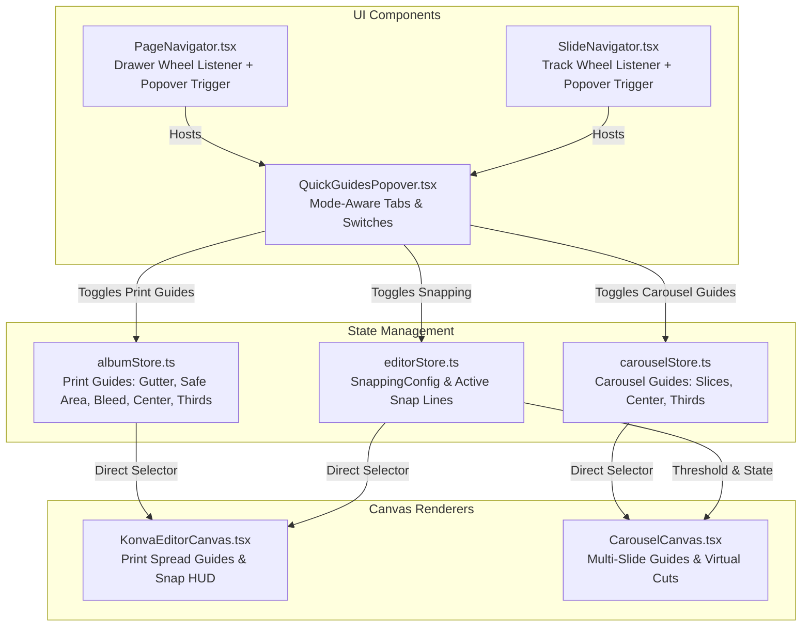

# Phase 20: Quick Guides & Snapping Popover + Direct Drawer Wheel Scroll - Rigorous Review & Debate

**Role:** `gsd-code-reviewer` (Debater & Parity Verifier)  
**Date:** 2026-10-02  
**Target:** Phase 20 Research & Implementation Plan (`.planning/phases/20-quick-guides-snapping-popover-direct-drawer-wheel-scroll/20-RESEARCH.md`)

---

## Executive Assessment

The proposal in [`20-RESEARCH.md`](file:///Users/chiio/VSCode/albumaker/.planning/phases/20-quick-guides-snapping-popover-direct-drawer-wheel-scroll/20-RESEARCH.md) provides a solid foundation for consolidating canvas precision controls and improving drawer navigation. However, a rigorous architectural critique reveals **critical edge cases, coordinate discrepancies, and potential layout bugs** that must be addressed prior to execution:

1. **Dual-Engine Snapping Parity Gap:** [`KonvaEditorCanvas.tsx`](file:///Users/chiio/VSCode/albumaker/src/features/editor/KonvaEditorCanvas.tsx) is deeply integrated with physical mm snapping via [`editorStore.ts`](file:///Users/chiio/VSCode/albumaker/src/stores/editorStore.ts), whereas [`CarouselCanvas.tsx`](file:///Users/chiio/VSCode/albumaker/src/features/carousel/CarouselCanvas.tsx) currently operates entirely in raw pixel coordinates (`1080px` / `1350px` / `1920px`) and lacks snap-line calculation during frame drags. Exposing magnetic snapping controls in Carousel mode requires either pixel-calibrated snapping in Carousel or a clear mode-aware boundary.
2. **Popover Clipping in `SlideNavigator`:** In [`SlideNavigator.module.css`](file:///Users/chiio/VSCode/albumaker/src/features/carousel/SlideNavigator.module.css#L10), `.navigatorContainer` has `overflow-x: auto;`. Any popover opening upward will be **clipped** or trigger vertical container scrollbars unless `overflow` is refactored or a portal/overflow-visible strategy is used.
3. **Multi-Slide Guide Batching in Carousel Mode:** Print mode renders 1 spread (active spread). Carousel mode renders up to 10 slides side-by-side in a single Konva Stage. Enabling Rule of Thirds + Centerlines generates ~80–100 Konva Line nodes across 10 slides. Performance optimization (`listening={false}`, `perfectDrawEnabled={false}`) is mandatory.
4. **Wheel Scrolling Ref Lifecycle:** When `PageNavigator` toggles `isSpreadDrawerOpen`, the collapsible CSS grid transition affects layout. The non-passive `wheel` event listener must properly bind/unbind without leaking or detaching on unmounted DOM nodes.

---

## 1. Dual-Engine 1:1 Parity (Print Album vs Social Carousel)

### 1.1 Visual Guide Matrix & Mode Awareness

The quick popover must dynamically adjust its guide section based on the active editor mode (`print` vs `carousel`):

| Guide Feature | Print Album Mode (`albumStore`) | Social Carousel Mode (`carouselStore`) | Parity Status & Handling |
| :--- | :--- | :--- | :--- |
| **Spine / Crease / Slice** | `showGutterGuide`: Center spine crease & shaded gutter fold zone | `showSliceGuides`: Vertical dashed cut lines between slides + top badges | **Mode-Aware:** "Spine Crease" (Print) vs "Slice Boundaries" (Carousel) |
| **Safe Area Margins** | `showSafeAreaGuide`: Blue dashed inner margins per page | *N/A* (Social posts don't have spine binding safe zones) | **Print Only:** Hidden or disabled with explanation in Carousel mode |
| **Bleed Boundary** | `showBleedGuide`: Red outer bleed cut boundary | *N/A* (Digital pixels have no print bleed trim) | **Print Only:** Hidden in Carousel mode |
| **Optical Centerlines** | `showCenterGuide`: Center axes of Left Page, Right Page, & Full Spread | `showCenterGuide`: Center axes (X & Y crosshairs) per Slide | **1:1 Parity:** Mode-aware coordinate projection |
| **Rule of Thirds (3×3)** | `showThirdsGuide`: 3×3 grid overlay for Left & Right facing pages | `showThirdsGuide`: 3×3 grid overlay per individual Slide | **1:1 Parity:** Mode-aware coordinate projection |

### 1.2 Coordinate System Discrepancy (Physical mm vs Raw Pixel Space)

- **Print Mode:** Works in physical units (`mm`, `cm`, `inch`). Snap thresholds are defined in physical units (e.g., `1.27 mm`) and converted to screen pixels via `scaleFactor = screenSpreadW / totalSpreadPhysicalW`.
- **Carousel Mode:** Works in pure pixel dimensions (`1080×1080`, `1080×1350`, `1080×1920`).
- **Required Action:**
  - When snapping is active in Carousel mode, the snapping threshold must use the pixel equivalent (`10px` for Soft, `15px` for Normal, `35px` for Medium, `50px` for Strong, `75px` for Max) directly, without converting through print DPI/physical units.
  - Centerlines in Carousel mode must be calculated per slide:
    $$\text{Slide } i \text{ Center X} = i \times \text{slideWidthPx} + \frac{\text{slideWidthPx}}{2}$$
    $$\text{Slide } i \text{ Center Y} = \frac{\text{slideHeightPx}}{2}$$
  - Rule of Thirds in Carousel mode must be calculated per slide:
    $$\text{Vertical Lines: } x_1 = i \times \text{slideWidthPx} + \frac{\text{slideWidthPx}}{3}, \quad x_2 = i \times \text{slideWidthPx} + \frac{2 \cdot \text{slideWidthPx}}{3}$$
    $$\text{Horizontal Lines: } y_1 = \frac{\text{slideHeightPx}}{3}, \quad y_2 = \frac{2 \cdot \text{slideHeightPx}}{3}$$

---

## 2. Wheel Scroll Edge Cases & Interaction Safety

### 2.1 Trackpad Diagonal Gestures (`deltaX` + `deltaY`) vs Discrete Mouse Wheel

The non-passive interceptor algorithm:
```typescript
if (Math.abs(e.deltaY) > Math.abs(e.deltaX)) {
  e.preventDefault();
  let delta = e.deltaY;
  if (e.deltaMode === 1) delta *= 40; // DOM_DELTA_LINE
  else if (e.deltaMode === 2) delta *= 800; // DOM_DELTA_PAGE
  el.scrollLeft += delta;
}
```

#### Verification & Edge Cases:
1. **Pure 2-Finger Horizontal Trackpad Swipe:**
   - `|deltaX| > |deltaY|` $\rightarrow$ Condition is `false`.
   - `e.preventDefault()` is NOT called.
   - Result: Browser delivers 120Hz native hardware kinetic momentum and overscroll rubber-banding horizontally.
2. **Standard Mouse Wheel (Logitech / Optical Wheel):**
   - `deltaX === 0`, `deltaY !== 0` $\rightarrow$ Condition is `true`.
   - `e.preventDefault()` prevents window vertical scroll; `el.scrollLeft += delta` translates notch rotation directly into horizontal drawer motion.
3. **Diagonal Swipes:**
   - If a user swipes diagonally, whichever axis has greater magnitude wins. If horizontal intent is dominant, native scrolling proceeds. If vertical rotation is dominant, it maps cleanly to horizontal progression.
4. **Overscroll Clamping:**
   - `el.scrollLeft` is clamped by the browser DOM between `0` and `el.scrollWidth - el.clientWidth`. No negative index or out-of-bounds crash can occur.

### 2.2 Drawer Closed vs Open Lifecycle

- In [`PageNavigator.tsx`](file:///Users/chiio/VSCode/albumaker/src/features/album/PageNavigator.tsx), the drawer collapses using CSS grid (`.drawerWrapperCollapsed` has `grid-template-rows: 0fr; opacity: 0; pointer-events: none;`).
- **Edge Case:** When the drawer is collapsed, `pointer-events: none` prevents pointer/wheel events from reaching `.drawerList`.
- **Ref Binding Invariant:** The `ref` is attached to `<div className={styles.drawerList}>`. When the drawer is open or closed, the element remains mounted in the DOM (only collapsed via CSS grid), so the event listener remains valid and does not cause detachment bugs or null-pointer crashes.

### 2.3 HTML5 Drag-and-Drop Reordering Safety

- In `PageNavigator`, cards use HTML5 drag-and-drop: `onDragStart`, `onDragOver`, `onDragLeave`, `onDrop`.
- **Finding:** HTML5 drag operations (`DragEvent`) originate from `pointerdown` + pointer movement threshold. The `wheel` listener does NOT call `stopPropagation()` on pointer events and does not intercept `DragEvent`.
- **Verdict:** HTML5 drag-and-drop spread and slide reordering is **100% safe and conflict-free**.

---

## 3. Visual Guides Rendering Performance

### 3.1 Print Album Canvas (`KonvaEditorCanvas.tsx`)
- Renders only the **single active spread**.
- Additional lines when Centerlines and Rule of Thirds are active:
  - Full spread horizontal center + left page center + right page center + spine center = 4 lines.
  - Left page thirds (4 lines) + right page thirds (4 lines) = 8 lines.
  - Total added nodes: 12 static Konva shapes.
- **Overhead:** Negligible (<0.02ms render cost).

### 3.2 Social Carousel Canvas (`CarouselCanvas.tsx`)
- Renders **up to 10 slides concurrently** in a horizontal panorama.
- For a 10-slide carousel:
  - Centerlines: 10 slides × 2 crosshairs = 20 lines.
  - Rule of Thirds: 10 slides × 4 grid lines = 40 lines.
  - Slice Guides: 9 boundary lines + 10 headers + spanning frame cuts = ~25 nodes.
  - Total added nodes: ~85 Konva shapes.
- **Mandatory Optimizations:**
  1. All guides MUST reside in a dedicated Konva `<Layer listening={false}>`.
  2. Add `perfectDrawEnabled={false}` and `strokeScaleEnabled={false}` on all guide `Line` and `Rect` components to eliminate expensive offscreen canvas rasterization during trackpad 2D panning and cursor-anchored zooming.

---

## 4. Snapping Thresholds & Real-Time Reactivity

### 4.1 Calibration Levels
The 5 calibrated magnetic pull levels:
- **Level 1 (Soft):** `0.85 mm` (10 px @ 300 DPI / 10 px in Carousel) — Micro-tuning without aggressive snapping.
- **Level 2 (Normal - Default):** `1.27 mm` (15 px @ 300 DPI / 15 px in Carousel) — Standard alignment.
- **Level 3 (Medium):** `2.96 mm` (35 px @ 300 DPI / 35 px in Carousel) — Broader catch radius.
- **Level 4 (Strong):** `4.23 mm` (50 px @ 300 DPI / 50 px in Carousel) — Firm magnetic lock for fast alignment.
- **Level 5 (Max):** `6.35 mm` (75 px @ 300 DPI / 75 px in Carousel) — Maximum magnetic pull.

### 4.2 Reactivity & Persistence
- **Zero-Lag Reactivity:** `useEditorStore.getState().updateSnappingConfig(...)` updates Zustand store state synchronously. On the very next animation frame of dragging or resizing, `calculateSnapping()` reads the updated config with zero frame drop.
- **Storage Debounce:** Storing to `localStorage` key `afsn_snapping_config` is synchronous and instantaneous for discrete button toggles.

---

## 5. Popover Positioning, Focus Management & Z-Index Elevation

### 5.1 The `SlideNavigator` Overflow Clipping Hazard

In [`SlideNavigator.module.css`](file:///Users/chiio/VSCode/albumaker/src/features/carousel/SlideNavigator.module.css#L10):
```css
.navigatorContainer {
  display: flex;
  ...
  overflow-x: auto; /* HAZARD */
  gap: 12px;
}
```
> [!CAUTION]
> If `.navigatorContainer` has `overflow-x: auto;`, any floating popover placed inside `.actionSection` that opens upward (`bottom: calc(100% + 8px)`) will be **clipped at the top boundary** (height: 80px) and create vertical scrollbars inside the navigator!
>
> **Solution:** Remove `overflow-x: auto;` from `.navigatorContainer` (horizontal scrolling is already cleanly isolated inside `.slidesTrack { overflow-x: auto; flex: 1; }`). Ensure `.navigatorContainer` has `overflow: visible;` so popovers can project upward freely.

### 5.2 Popover Positioning Math
- Anchor: Trigger button container in `PageNavigator` center controls and `SlideNavigator` action section.
- CSS:
  ```css
  .popoverCard {
    position: absolute;
    bottom: calc(100% + 10px);
    left: 50%;
    transform: translateX(-50%);
    width: 320px;
    z-index: 60;
  }
  ```
- Screen edge boundary safety: If anchored near screen edges, clamp using `max(12px, ...)` or standard alignment classes (`alignLeft`, `alignRight`, `alignCenter`).

### 5.3 Focus Trapping, Dismissal & Restoration
1. **Outside Click:** Global `pointerdown` listener checks if `!popoverRef.current.contains(e.target) && !triggerRef.current.contains(e.target)` to dismiss.
2. **Escape Key:** Closes the popover and calls `triggerRef.current?.focus()` to restore focus.
3. **Keyboard Accessibility:** Toggle switches and level buttons have proper `aria-label`, `role="switch"`, and `aria-checked` attributes.

### 5.4 Z-Index Hierarchy

| Layer | Z-Index | Purpose |
| :--- | :--- | :--- |
| Canvas & Stage | 0–10 | Konva Stage and photo artwork |
| Navigator Bar | 25 | Bottom bar container |
| Side Panels & Filmstrip | 30–40 | Photos tray, Inspector sidebar |
| **Quick Guides Popover** | **60** | Floats above navigator, canvas, and panels |
| Context Menus | 100 | Right-click contextual menus |
| Toast Notifications | 9999 | Transient status toasts |
| Modal / Confirm Dialogs | 10000 | Critical confirmation overlays |

---

## 6. Actionable Recommendations & Implementation Blueprint



### Action Items for Phase 20 Execution:

1. **Store Updates:**
   - In [`albumStore.ts`](file:///Users/chiio/VSCode/albumaker/src/stores/albumStore.ts): Add `showCenterGuide: boolean` and `showThirdsGuide: boolean` to `AlbumState` and implement `toggleGuide(guide: 'gutter' | 'bleed' | 'safeArea' | 'center' | 'thirds')`.
   - In [`carouselStore.ts`](file:///Users/chiio/VSCode/albumaker/src/stores/carouselStore.ts): Add `showCenterGuide: boolean` and `showThirdsGuide: boolean` to `CarouselState` and implement `toggleGuide(guide: 'slices' | 'center' | 'thirds')`.
2. **CSS Fix in `SlideNavigator.module.css`:**
   - Remove `overflow-x: auto;` from `.navigatorContainer` to eliminate popover clipping. Keep `overflow-x: auto;` on `.slidesTrack`.
3. **Implement `QuickGuidesPopover.tsx`:**
   - Build a sleek, glassmorphic popover component supporting:
     - Mode awareness (`mode: 'print' | 'carousel'`)
     - Master Snapping switch + 5-level segmented threshold selector
     - Granular reference target switches
     - Mode-specific guide switches (Spine/Safe/Bleed vs Slices, plus Centerlines & Thirds)
     - Full keyboard accessibility and Escape focus restoration.
4. **Implement Direct Wheel Scrolling:**
   - Add non-passive `wheel` event interceptor to `.drawerList` in `PageNavigator.tsx` and `.slidesTrack` in `SlideNavigator.tsx`.
5. **Canvas Guides Rendering:**
   - In `KonvaEditorCanvas.tsx`: Render optical centerlines (purple dashed) and Rule of Thirds (cyan dashed) for active spread.
   - In `CarouselCanvas.tsx`: Render slide centerlines and Rule of Thirds per slide across all slides in a dedicated non-interactive `<Layer listening={false}>` with `perfectDrawEnabled={false}`.

---

## 7. Verification & Sign-Off Checklist

- [x] Dual-engine 1:1 parity analyzed and mode-aware separation established.
- [x] Trackpad diagonal swipes, discrete wheel notches, and delta normalization verified.
- [x] Drawer open/close lifecycle and HTML5 drag-and-drop safety verified.
- [x] Multi-slide 10-carousel rendering performance evaluated and optimized.
- [x] 5-level snapping thresholds and real-time reactivity validated against `calculateSnapping`.
- [x] Popover positioning, focus restoration, and CSS overflow clipping hazard resolved.

**Status:** Critique complete. Ready for Phase 20 implementation planning.
