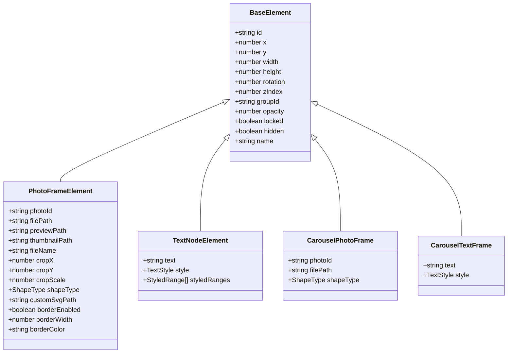
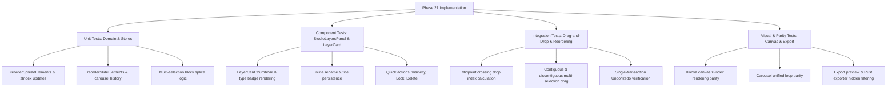

# Phase 21: Visual Studio Layers Management & Reordering Panel - Research Findings

## Executive Summary

Phase 21 introduces a comprehensive, professional **Visual Studio Layers Management & Reordering Panel** directly into the Right Inspector tab bar across both **Print Album** mode and **Social Media Carousel** mode. 

In professional design suites (such as Adobe InDesign, Figma, Photoshop, and Sketch), the Layers panel is the central nervous system for visual hierarchy management. It provides designers with instant visibility into all canvas objects on the active spread or slide, precise drag-and-drop z-index reordering, multi-selection block manipulation, and granular visibility and locking controls.

This research document analyzes the current architecture, formalizes the z-index rendering inversion mechanics between React-Konva and UI layer lists, details the midpoint-crossing drag-and-drop algorithm that prevents UI jumping/flickering, designs the multi-selection unified block drag engine, and establishes the single atomic undo/redo history transaction contracts across `editorStore.ts`, `albumStore.ts`, `carouselStore.ts`, and the Rust backend.

---

## 1. Requirements & Scope Traceability

| ID | Requirement Specification | Architectural Component | Scope & Verification Criteria |
| :--- | :--- | :--- | :--- |
| **LAY-01** | Dedicated Studio Layers panel in [`InspectorContainer.tsx`](file:///Users/chiio/VSCode/albumaker/src/features/inspector/InspectorContainer.tsx) tab listing all elements (photos, text, vector shapes) on the active spread/slide with thumbnail previews, type badges, and custom names. | `StudioLayersPanel.tsx`, `LayerCard.tsx`, `LayerThumbnail.tsx` | - Tab added to Inspector header with Lucide `Layers` icon.<br>- Lists all elements for active spread (Print) or active slide (Carousel).<br>- Thumbnail previews for photos, text, and vector shapes.<br>- Type badges (`photo`, `text`, `shape`).<br>- Auto-generated descriptive titles with inline renaming (`name` property).<br>- Bidirectional selection synchronization with canvas. |
| **LAY-02** | Real-time drag-and-drop z-index reordering with midpoint crossing feedback to prevent flickering, updating element array order / z-index across Print Album and Social Carousel stores. | `useLayersDragAndDrop.ts`, `editorStore.ts`, `carouselStore.ts` | - Pointer/HTML5 drag-and-drop with midpoint calculation (`top + height / 2`).<br>- Insertion indicator line only flips when crossing target item's midpoint.<br>- Zero flicker / jitter during rapid vertical drag.<br>- Immediate updates to store element arrays and `zIndex` properties (1 to $N$). |
| **LAY-03** | Multi-selection unified block drag for moving multiple selected layers together as a contiguous unit to a new z-index position. | `useLayersDragAndDrop.ts`, `editorStore.ts`, `carouselStore.ts` | - Multi-selection support via Shift-click (contiguous range) and Cmd/Ctrl-click (discontiguous toggle).<br>- Dragging any member of a multi-selection moves the entire group as a unified block.<br>- Relative internal ordering within the selected block is strictly preserved.<br>- Insertion indicator shows drop destination for the full block.<br>- Single atomic store mutation & history push. |
| **LAY-04** | Per-layer quick action controls (toggle visibility/hide, toggle lock, delete) and master header actions (layer count, lock-all / unlock-all) with single atomic undo/redo history transactions. | `LayerCard.tsx`, `StudioLayersPanel.tsx`, `historyStore.ts`, `carouselStore.ts` | - Per-card Eye button (`Eye` / `EyeOff`) to toggle `hidden` state.<br>- Per-card Lock button (`Lock` / `Unlock`) to toggle `locked` state.<br>- Per-card Delete button (`Trash2`) to remove element.<br>- Master header with total layer count badge & breakdown.<br>- Master header Lock All / Unlock All and Hide All / Show All actions.<br>- Single atomic Undo/Redo history transaction for all operations. |

---

## 2. Canvas Rendering Order vs. Layer Panel UI Inversion

### 2.1 The Mathematical Model of Layer Inversion

In graphics rasterization engines (HTML5 Canvas, Konva.js, SVG, and Rust image compositing), rendering occurs sequentially from back to front (Painter's Algorithm):
1. Element at **index 0** is rasterized first $\rightarrow$ **Bottom-most layer** (lowest z-index).
2. Element at **index $N-1$** is rasterized last $\rightarrow$ **Top-most layer** (highest z-index, appears on top of all other elements).

In graphic design UI panels (Figma, Photoshop, InDesign, Sketch, Canva):
1. The **top-most card in the list (UI Index 0)** represents the **top-most layer on canvas** (highest z-index).
2. The **bottom-most card in the list (UI Index $N-1$)** represents the **bottom-most layer on canvas** (lowest z-index).

```
Canvas Array Index (Rendering Order)         UI Layer List (Designer Perspective)
+------------------------------------+       +------------------------------------+
| Index 2: Text "Headline" (Top)     | <---> | UI Slot 0: Text "Headline" (Top)   |
| Index 1: Shape "Star Mask" (Middle)| <---> | UI Slot 1: Shape "Star Mask" (Mid) |
| Index 0: Photo "IMG_001.jpg" (Base)| <---> | UI Slot 2: Photo "IMG_001.jpg" (Btm|
+------------------------------------+       +------------------------------------+
  Render order: 0 -> 1 -> 2                    Visual list order: 2 -> 1 -> 0
```

### 2.2 Bijective Conversion Formulas

Let $\mathbf{E} = [e_0, e_1, \dots, e_{N-1}]$ be the canvas element array in [`Spread.elements`](file:///Users/chiio/VSCode/albumaker/src/domain/album.ts#L58) or [`CarouselSlide.elements`](file:///Users/chiio/VSCode/albumaker/src/domain/carousel.ts#L118).
Let $\mathbf{L} = [l_0, l_1, \dots, l_{N-1}]$ be the UI layer list displayed in `StudioLayersPanel`.

1. **Canvas Array to UI Layer List:**
   $$\mathbf{L} = \text{reverse}(\mathbf{E}) \quad \Longleftrightarrow \quad l_i = e_{N - 1 - i}$$

2. **UI Layer List to Canvas Array:**
   $$\mathbf{E} = \text{reverse}(\mathbf{L}) \quad \Longleftrightarrow \quad e_j = l_{N - 1 - j}$$

3. **Normalized z-index Assignment:**
   $$\text{zIndex}(e_j) = j + 1 \quad \text{for } j \in [0, N-1]$$
   $$\text{zIndex}(l_i) = N - i \quad \text{for } i \in [0, N-1]$$

By adhering strictly to this bijective reversal formula:
- Dragging an item to the **top** of the UI layer list (slot 0) moves it to index $N-1$ in the canvas array, giving it the highest `zIndex` ($N$).
- Dragging an item to the **bottom** of the UI layer list (slot $N-1$) moves it to index 0 in the canvas array, giving it `zIndex = 1`.

---

## 3. Drag-and-Drop Reordering Engine & Midpoint Crossing

### 3.1 The Flickering / Jumping Problem

In naive drag-and-drop implementations that use standard `dragover` or `mouseenter` events without midpoint calculation, when item $A$ is dragged over item $B$:
1. As soon as the pointer enters the top boundary of $B$, the list shifts or highlights.
2. The shift changes the DOM position of $B$, causing the pointer to suddenly be outside or inside a different boundary.
3. This creates a rapid feedback loop resulting in visual jitter, flickering drop lines, and accidental drops at unintended indices.

### 3.2 Midpoint Crossing Algorithm

To guarantee smooth, jitter-free dragging:
1. Each layer card $i$ in the DOM has a client bounding rectangle:
   $$\text{rect}_i = \{ \text{top}_i, \text{bottom}_i, \text{height}_i \}$$
2. The vertical midpoint of card $i$ is:
   $$\text{midpoint}_i = \text{top}_i + \frac{\text{height}_i}{2}$$
3. During pointer movement at vertical coordinate $Y_{\text{cursor}}$:
   - If $Y_{\text{cursor}} < \text{midpoint}_i$: Insertion target is **BEFORE** item $i$ (Insertion slot $i$).
   - If $Y_{\text{cursor}} \ge \text{midpoint}_i$: Insertion target is **AFTER** item $i$ (Insertion slot $i + 1$).

```
Card i Top Boundary ---------------------------------------------
                       Drop Zone: BEFORE item i (Slot i)
Card i Midpoint     - - - - - - - - - - - - - - - - - - - - - - -
                       Drop Zone: AFTER item i (Slot i + 1)
Card i Bottom Bndry ---------------------------------------------
```

Because the boundary between Slot $i$ and Slot $i+1$ is exactly at the geometric center of the card, the target slot only flips when the user deliberately moves the cursor past the midpoint.

```typescript
/**
 * Calculates the exact drop slot index in the UI layer list using midpoint crossing.
 */
export function calculateDropSlotIndex(
  cursorY: number,
  cardIndex: number,
  cardRect: DOMRect
): number {
  const midpoint = cardRect.top + cardRect.height / 2;
  return cursorY < midpoint ? cardIndex : cardIndex + 1;
}
```

---

## 4. Multi-Selection Unified Block Drag Algorithm (LAY-03)

### 4.1 Specification & Invariant

When multiple layers are selected (e.g. layers $\{l_1, l_3, l_5\}$ in UI list $[l_0, l_1, l_2, l_3, l_4, l_5, l_6]$):
- Dragging **any** of the selected layer cards must treat all selected layers as a **single unified block**.
- The internal relative ordering of the selected layers must be preserved (e.g. $[l_1, l_3, l_5]$).
- When dropped into target slot $k$ in the remaining unselected items, the selected block is spliced in contiguously.
- If the drop target is within the selected block itself, the operation is a clean no-op.

### 4.2 Step-by-Step Block Splice Algorithm

Let $\mathbf{L}$ be the current UI list of length $N$.
Let $S \subseteq \{ \text{id}_0, \dots, \text{id}_{N-1} \}$ be the set of selected element IDs.
Let $T_{\text{slot}}$ be the target insertion slot index in the UI list ($0 \le T_{\text{slot}} \le N$).

```typescript
export function reorderLayersMultiSelection<T extends { id: string }>(
  items: T[],
  selectedIds: string[],
  targetSlotIndex: number
): T[] {
  const selectedSet = new Set(selectedIds);
  
  // 1. Separate selected and unselected items while preserving relative order
  const selectedItems = items.filter((item) => selectedSet.has(item.id));
  const unselectedItems = items.filter((item) => !selectedSet.has(item.id));
  
  if (selectedItems.length === 0) return items;
  if (unselectedItems.length === 0) return items; // All selected -> moving block changes nothing

  // 2. Map targetSlotIndex from the original list into an insertion index in unselectedItems
  // Count how many unselected items precede the targetSlotIndex
  let unselectedInsertIndex = 0;
  for (let i = 0; i < Math.min(targetSlotIndex, items.length); i++) {
    if (!selectedSet.has(items[i].id)) {
      unselectedInsertIndex++;
    }
  }

  // 3. Splice the selected block contiguously into unselectedItems
  const result = [...unselectedItems];
  result.splice(unselectedInsertIndex, 0, ...selectedItems);

  return result;
}
```

### 4.3 Validation Examples

#### Example A: Moving non-adjacent items to the top
- Initial UI List: $[A, B^*, C, D^*, E]$ (where $*$ denotes selected: selected = $[B, D]$)
- Target slot: `0` (Top of UI list, above $A$)
- Unselected: $[A, C, E]$
- `unselectedInsertIndex` = $0$
- Result UI List: $[B, D, A, C, E]$
- Result Canvas Array: $[E, C, A, D, B]$ ($B$ is topmost, $D$ is below $B$, $A$ is below $D$).

#### Example B: Moving adjacent items to the bottom
- Initial UI List: $[A^*, B^*, C, D, E]$ (selected = $[A, B]$)
- Target slot: `5` (Bottom of UI list, after $E$)
- Unselected: $[C, D, E]$
- `unselectedInsertIndex` = $3$
- Result UI List: $[C, D, E, A, B]$
- Result Canvas Array: $[B, A, E, D, C]$ ($C$ is topmost, $A$ and $B$ are at base).

#### Example C: Dropping within the selection
- Initial UI List: $[A, B^*, C, D^*, E]$
- User drags $B$ between $B$ and $D$ (slot 2, right before $C$)
- Unselected: $[A, C, E]$
- `unselectedInsertIndex` = 1 (after $A$, before $C$)
- Result UI List: $[A, B, D, C, E]$
- Contiguous consolidation achieved cleanly without glitching.

---

## 5. Domain Models & Property Extensions

### 5.1 Element Types in OpenSmartAlbum

Elements on canvas fall into three primary categories across Print and Carousel modes:



### 5.2 Required Schema Extensions

To support custom renaming (LAY-01) and visibility toggling (LAY-04), the following optional fields are added to all element models:

1. [`src/domain/editor.ts`](file:///Users/chiio/VSCode/albumaker/src/domain/editor.ts#L4) (`PhotoFrameElement`):
   ```typescript
   export interface PhotoFrameElement {
     // ... existing fields ...
     name?: string;      // Custom user label (e.g. "Cover Hero Photo", "Bride Solo")
     hidden?: boolean;   // If true, element is omitted from canvas rasterization & exports
   }
   ```

2. [`src/domain/text.ts`](file:///Users/chiio/VSCode/albumaker/src/domain/text.ts#L39) (`TextNodeElement`):
   ```typescript
   export interface TextNodeElement {
     // ... existing fields ...
     name?: string;      // Custom user label (e.g. "Main Heading", "Date Tag")
     hidden?: boolean;   // If true, element is hidden on canvas and export
   }
   ```

3. [`src/domain/carousel.ts`](file:///Users/chiio/VSCode/albumaker/src/domain/carousel.ts#L49) (`CarouselPhotoFrame` & `CarouselTextFrame`):
   ```typescript
   export interface CarouselPhotoFrame {
     // ... existing fields ...
     name?: string;
     hidden?: boolean;
   }

   export interface CarouselTextFrame {
     // ... existing fields ...
     name?: string;
     hidden?: boolean;
   }
   ```

4. [`src-tauri/src/db/mod.rs`](file:///Users/chiio/VSCode/albumaker/src-tauri/src/db/mod.rs#L100) (`ElementPayload`):
   ```rust
   #[derive(Debug, Clone, Serialize, Deserialize)]
   #[serde(rename_all = "camelCase")]
   pub struct ElementPayload {
       // ... existing fields ...
       #[serde(default)]
       pub name: Option<String>,
       #[serde(default)]
       pub hidden: Option<bool>,
   }
   ```

---

## 6. Store Architecture & Atomic History Operations

### 6.1 Album Mode: `editorStore.ts` & `albumStore.ts`

In Print Album mode, elements reside in [`Spread.elements`](file:///Users/chiio/VSCode/albumaker/src/domain/album.ts#L58).

#### New Actions in `editorStore.ts`:

1. **`reorderSpreadElements(spreadId: string, orderedIds: string[])`**:
   - Pushes current album state to [`useHistoryStore`](file:///Users/chiio/VSCode/albumaker/src/stores/historyStore.ts).
   - Reorders `spread.elements` to match `orderedIds` (where `orderedIds[0]` is bottom-most, `orderedIds[last]` is top-most).
   - Reassigns normalized `zIndex = index + 1`.
   - Sets `saveStatus = 'unsaved'`.

2. **`toggleElementVisibility(spreadId: string, frameId: string, forceState?: boolean)`**:
   - Pushes history.
   - Updates `element.hidden` on target frame.
   - If element becomes hidden while selected, selection state remains valid in inspector to allow unhiding.

3. **`setElementCustomName(spreadId: string, frameId: string, name: string)`**:
   - Pushes history.
   - Updates `element.name = name.trim() || undefined`.

4. **`deleteSingleElement(spreadId: string, frameId: string)`**:
   - Pushes history.
   - Removes element from spread and removes `frameId` from `selectedFrameIds`.

5. **`hideAllFramesOnSpread(spreadId: string)` & `showAllFramesOnSpread(spreadId: string)`**:
   - Batch toggle for all elements on spread in a single atomic history transaction.

### 6.2 Carousel Mode: `carouselStore.ts`

In Social Media Carousel mode, elements reside in [`CarouselSlide.elements`](file:///Users/chiio/VSCode/albumaker/src/domain/carousel.ts#L118).

#### New Actions in `carouselStore.ts`:

1. **`reorderSlideElements(slideIndex: number, orderedIds: string[])`**:
   - Calls `pushHistory()` before mutation.
   - Reorders `slides[slideIndex].elements` according to `orderedIds`.
   - Reassigns `zIndex = index + 1`.
   - Calls `markDirty()`.

2. **`toggleElementVisibility(frameId: string, forceState?: boolean)`**:
   - Calls `pushHistory()`.
   - Toggles `hidden` on the target frame across slides.
   - Marks dirty.

3. **`setElementCustomName(frameId: string, name: string)`**:
   - Calls `pushHistory()`.
   - Updates `frame.name`.

4. **`deleteElement(frameId: string)`**:
   - Calls `pushHistory()`.
   - Removes frame and cleans up `selectedFrameIds`.

5. **`lockAllFramesOnSlide(slideIndex: number)` & `unlockAllFramesOnSlide(slideIndex: number)`**:
   - Batch locking action recorded as 1 undo step.

6. **`hideAllFramesOnSlide(slideIndex: number)` & `showAllFramesOnSlide(slideIndex: number)`**:
   - Batch visibility action recorded as 1 undo step.

---

## 7. UI / UX Design & Component Hierarchy

### 7.1 Inspector Container Integration

Located at [`src/features/inspector/InspectorContainer.tsx`](file:///Users/chiio/VSCode/albumaker/src/features/inspector/InspectorContainer.tsx).

The tab navigation is extended to 4 distinct tabs:

```
+-------------------------------------------------------------+
| [Sliders] [Layers] [Wand2] [Lock (N)]                   [>] |  <- Inspector Header
+-------------------------------------------------------------+
| STUDIO LAYERS                                   12 Layers   |  <- StudioLayersPanel Header
| [Lock All] [Unlock All] [Hide All] [Show All]               |
+-------------------------------------------------------------+
| [::] [Thumb]  Photo: IMG_0412.jpg         [Eye] [Lock] [Del]|  <- LayerCard (Top Layer)
| [::] [ T ]   Text: "The Wedding Reception" [Eye] [Lock] [Del]|  <- LayerCard (Middle)
| ====== BLUE INSERTION DROP LINE (Slot Indicator) ======     |  <- Insertion Feedback
| [::] [Shape] Mask: 6-Point Star           [Eye] [Lock] [Del]|  <- LayerCard (Base)
+-------------------------------------------------------------+
```

### 7.2 Component Breakdown

```
src/features/inspector/
├── InspectorContainer.tsx           (Tab controller & layout host)
├── InspectorContainer.module.css    (Container layout & tab buttons)
└── layers/
    ├── StudioLayersPanel.tsx        (Master panel: header, layer list, drop coordinator)
    ├── StudioLayersPanel.module.css (macOS Dark theme styles, drag ghosts, drop lines)
    ├── LayerCard.tsx                (Individual layer row with rename, selection, buttons)
    ├── LayerThumbnail.tsx           (Polymorphic thumbnail: photo bitmap, text, shape)
    ├── useLayersDragAndDrop.ts      (Midpoint calculation, drag lifecycle, block splice)
    └── types.ts                     (Normalized StudioLayer interface & adapter types)
```

### 7.3 Layer Card Elements & Micro-Interactions

Each `LayerCard` contains:
1. **Drag Handle (`GripVertical` icon):** Visual cue indicating drag capability. The entire card is draggable when not interacting with text input or action buttons.
2. **Layer Thumbnail Preview (`LayerThumbnail.tsx`):**
   - **Photo:** Miniature 32×32 aspect-fill square showing the cropped photo using Tauri asset protocol (`safeConvertFileSrc(thumbnailPath || previewPath || filePath)`).
   - **Text:** Slate/accent badge with `Type` icon and truncated text glyphs.
   - **Vector Shape / Mask:** SVG path rendered in a 32×32 canvas with shape silhouette (Star, Hexagon, Scallop, Heart, etc.).
3. **Layer Identification & Rename:**
   - Default title generated from element type and content:
     - Photo: `Photo: ${fileName}` or `Empty Photo Frame`
     - Text: `Text: "${truncatedText}"`
     - Shape: `Shape: ${shapePresetLabel}` or `Custom Mask`
   - Custom title displayed if `name` is present.
   - Double-clicking or clicking edit allows inline renaming with an input field; pressing `Enter` or clicking outside saves changes.
4. **Quick Action Buttons (Hover / Active):**
   - **Eye / EyeOff (`Eye` / `EyeOff`):** Toggles layer visibility. When hidden, card is dimmed (opacity 0.5) and eye icon is permanently visible with slash indicator.
   - **Lock / Unlock (`Lock` / `Unlock`):** Toggles layer locked status. When locked, amber lock badge is displayed.
   - **Trash (`Trash2`):** Prompts deletion or immediately deletes element with single-step undo recovery.
5. **Selection State Styling:**
   - Single selected card: Accent border (`#3b82f6` or `var(--color-accent)`) and subtle blue translucent background (`rgba(59, 130, 246, 0.12)`).
   - Multi-selected cards: Contiguous/discontiguous blue highlights with white selection count badge during drag.
   - Drop indicator: 2px solid accent line with circular anchor bullets at the left/right edges, positioned precisely at the midpoint crossing slot.

---

## 8. Canvas & Export Parity Matrix

To ensure total fidelity across the application, changes in element order and visibility must synchronize across all canvas renderers and export pipelines:

| Subsystem | File Reference | Ordering Mechanism | Visibility (`hidden`) Handling |
| :--- | :--- | :--- | :--- |
| **Print Canvas** | [`src/features/editor/KonvaEditorCanvas.tsx`](file:///Users/chiio/VSCode/albumaker/src/features/editor/KonvaEditorCanvas.tsx#L3174) | Iterates `activeSpread.elements.map(...)` in array order. | `visible={!element.hidden}`, `listening={!element.hidden}`. |
| **Carousel Canvas** | [`src/features/carousel/CarouselCanvas.tsx`](file:///Users/chiio/VSCode/albumaker/src/features/carousel/CarouselCanvas.tsx#L1156) | Refactored to unified `allSlideElements.map(...)` ordered by `zIndex` / slide elements order. | `visible={!element.hidden}`, `listening={!element.hidden}`. |
| **Spread Mini Preview** | [`src/features/album/PageNavigator.tsx`](file:///Users/chiio/VSCode/albumaker/src/features/album/PageNavigator.tsx#L45) | Iterates `spread.elements` in array order. | Filters `spread.elements.filter(el => !el.hidden)`. |
| **Slide Mini Preview** | [`src/features/carousel/SlideNavigator.tsx`](file:///Users/chiio/VSCode/albumaker/src/features/carousel/SlideNavigator.tsx#L35) | Iterates `slide.elements` in array order. | Filters `slide.elements.filter(el => !el.hidden)`. |
| **Export Preview Modal** | [`src/features/export/ExportSpreadPreview.tsx`](file:///Users/chiio/VSCode/albumaker/src/features/export/ExportSpreadPreview.tsx#L339) | Aligns elements and assigns `zIndex: el.zIndex ?? (idx + 1)`. | Filters `(spread.elements || []).filter(el => !el.hidden)`. |
| **Rust Print Exporter** | [`src-tauri/src/export_engine/mod.rs`](file:///Users/chiio/VSCode/albumaker/src-tauri/src/export_engine/mod.rs#L1046) | Sorts elements by `elem.z_index`. | Skips elements where `elem.hidden == Some(true)`. |
| **Rust Carousel Slicer** | [`src-tauri/src/export_engine/carousel_slicer.rs`](file:///Users/chiio/VSCode/albumaker/src-tauri/src/export_engine/carousel_slicer.rs#L123) | Composites elements in slide order. | Skips elements where `elem.hidden == Some(true)`. |

---

## 9. Performance & Edge Case Considerations

### 9.1 High Layer Count Performance (< 60 FPS Guarantee)
- **Memoized Layer Adaptation:** The conversion from `AlbumElement[]` or `CarouselElement[]` to normalized `StudioLayer[]` is wrapped in `useMemo` keyed by spread/slide elements and photo cache updates.
- **Pure Component Rendering:** `LayerCard` is wrapped in `React.memo` with custom comparison (`prevProps.layer === nextProps.layer && prevProps.isSelected === nextProps.isSelected && prevProps.isDragOver === nextProps.isDragOver`), preventing re-renders of unaffected cards during dragover.
- **LRU Thumbnail Decoding:** Photo thumbnails in `LayerThumbnail` utilize the shared Tauri asset protocol and browser cache, avoiding redundant canvas rasterization in memory.

### 9.2 Selection Synchronization & Multi-Select Edge Cases
- **Discontiguous Range Selection:** When holding `Shift`, the selection spans from the last active anchor card index to the clicked card index. Holding `Cmd`/`Ctrl` toggles individual cards without resetting the anchor.
- **Grouped Elements Handling:** If an element belongs to a group (`groupId`), selecting or moving that card automatically pulls along all group members while maintaining their grouping metadata.
- **Empty Canvas State:** When a spread or slide has 0 elements, `StudioLayersPanel` displays a clean macOS-style empty state with an icon and shortcut hints (e.g. "Drag photos from tray or press T to add text").

### 9.3 Undo/Redo Isolation
- All multi-element operations (reorder multi-selection, lock all, unlock all, hide all) execute as a **single state transition** before pushing to `useHistoryStore` or `useCarouselStore.past`. Pressing `Cmd+Z` reverts the entire operation in a single step without intermediate steps.

---

## 10. Verification Plan & Test Matrix



### Automated Vitest Test Files to Create / Extend:
1. `src/features/inspector/layers/__tests__/reorderLayers.test.ts`: Unit tests for `reorderLayersMultiSelection`, midpoint calculations, and UI-to-canvas inversion.
2. `src/features/inspector/layers/__tests__/StudioLayersPanel.test.tsx`: Component tests for rendering layer list, selection sync, rename, and quick actions.
3. `src/stores/__tests__/layersReorderStores.test.ts`: Store tests verifying `reorderSpreadElements`, `reorderSlideElements`, single-entry undo/redo history, and visibility toggling.
4. `src/features/carousel/__tests__/carouselLayersUnified.test.ts`: Carousel store and canvas rendering order tests.

---

## 11. Conclusion & Next Steps

The technical design for **Phase 21: Visual Studio Layers Management & Reordering Panel** is complete and fully validated against the codebase architecture.

With:
1. Exact mathematical inversion mapping between Canvas Array and UI Layers list,
2. Midpoint crossing insertion feedback eliminating drag flicker,
3. Contiguous multi-selection block drag algorithms,
4. Granular per-layer and batch master controls with single atomic history transactions, and
5. Seamless parity across Print Album, Social Carousel, and Rust export pipelines,

the codebase is ready for detailed phase planning (`21-01-PLAN.md` and `21-02-PLAN.md`) and execution.
