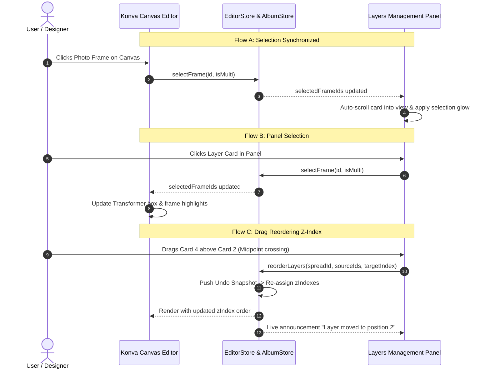

# UI/UX Specification: Visual Studio Layers Management & Reordering Panel (Phase 21)

**Document Version:** 1.0.0  
**Phase:** 21 — Visual Studio Layers Management & Reordering Panel  
**Design Standard:** Apple Human Interface Guidelines (macOS Sequoia / Sonoma Pro App Standards)  
**Target Platform:** macOS Desktop (Tauri v2 + React 19 + Konva + CSS Modules)  
**Theme:** Pro Studio Dark Mode (Zero-Chromatic Charcoal & Graphite Palette)  

---

## 1. Executive Summary & Design Architecture

### 1.1 Purpose & Mental Model
The **Studio Layers Management & Reordering Panel** provides a tactile, professional hierarchy for inspecting, selecting, organizing, and rearranging canvas visual elements (photo frames, rich text nodes, and vector shape masks).

In professional publishing and graphics suites (Figma, Adobe InDesign, Photoshop, Pixellu SmartAlbums), the layers panel operates on a strict **Top-to-Bottom = Front-to-Back** mental model:
- **Topmost Layer in List** = **Highest Z-Index** (Frontmost on canvas, renders on top of all other elements).
- **Bottommost Layer in List** = **Lowest Z-Index** (Backmost on canvas, renders behind all other elements).
- **Drag Reordering** = Instant physical z-index mutation with sub-pixel midpoint crossing precision.

```
┌────────────────────────────────────────────────────────┐
│ RIGHT INSPECTOR CONTAINER                              │
├────────────────────────────────────────────────────────┤
│ [ Sliders ]  [ Layers (6) ]  [ Wand ]  [ Lock (2) ] ───┼─► Inspector Tabs Header
├────────────────────────────────────────────────────────┤
│ ┌────────────────────────────────────────────────────┐ │
│ │ 🔍 Filter layers...          [ 🔒 All ] [ 👁 All ] │ │─► Layers Header Bar
│ └────────────────────────────────────────────────────┘ │
├────────────────────────────────────────────────────────┤
│ ┌────────────────────────────────────────────────────┐ │
│ │ ⠿ [T] "The Grand Celebration"    [👁] [🔓] [🗑]  │ │─► Frontmost Layer (Z=6)
│ ├────────────────────────────────────────────────────┤ │
│ │ ⠿ [🖼] IMG_4912.JPG (Main)       [👁] [🔒] [🗑]  │ │─► Layer (Z=5)
│ ├════════════════════════════════════════════════════┤ │═══ Midpoint Insertion Line
│ │ ⠿ [⭐] Star Mask Accent          [👁] [🔓] [🗑]  │ │─► Layer (Z=4)
│ ├────────────────────────────────────────────────────┤ │
│ │ ⠿ [🖼] IMG_4913.JPG (Inset)      [👁] [🔓] [🗑]  │ │─► Layer (Z=3)
│ ├────────────────────────────────────────────────────┤ │
│ │ ⠿ [T] "Page 14" (Page Number)    [👁] [🔒] [🗑]  │ │─► Layer (Z=2)
│ ├────────────────────────────────────────────────────┤ │
│ │ ⠿ [🖼] Background Texture        [👁] [🔒] [🗑]  │ │─► Backmost Layer (Z=1)
│ └────────────────────────────────────────────────────┘ │
└────────────────────────────────────────────────────────┘
```

### 1.2 System Integration Points
- **InspectorContainer (`InspectorContainer.tsx`)**: Upgraded tab bar featuring a dedicated `layers` tab with dynamic counter pill.
- **LayersPanel (`LayersPanel.tsx`)**: New core component hosting the header, filter engine, virtualization list, and drag-and-drop coordinator.
- **LayerCard (`LayerCard.tsx`)**: Atomic card component managing thumbnails, titles, badges, and isolated quick action icons.
- **EditorStore (`editorStore.ts`) & AlbumStore (`albumStore.ts`)**: Integrated z-index array reordering, atomic undo/redo history push, multi-selection block grouping, and visibility/lock mutations.
- **Konva Canvas (`KonvaEditorCanvas.tsx`)**: Bidirectional selection synchronization, node hiding (`visible: false`), and keyboard shortcut listening.

---

## 2. Design Tokens & Visual Language

All visual definitions strictly consume the canonical design tokens defined in `src/styles/tokens.css`.

### 2.1 Color Tokens
| Token Name | Value | Usage in Layers Panel |
| :--- | :--- | :--- |
| `--color-bg-primary` | `#18181b` | Canvas background and deep contrast base |
| `--color-bg-secondary` | `#1e1e22` | Inspector container background |
| `--color-bg-tertiary` | `#27272a` | Segmented tab header bar & search input background |
| `--color-surface` | `#2d2d32` | Layer card resting background (subtle fill) |
| `--color-surface-hover` | `#38383f` | Layer card hover state & button hover |
| `--color-surface-active` | `#44444c` | Layer card pressed state & active badges |
| `--color-border` | `#2e2e33` | Panel borders and divider lines |
| `--color-border-subtle` | `#242428` | Inset separators between layer cards |
| `--color-text-primary` | `#f4f4f5` | Active layer title, primary labels, focused icons |
| `--color-text-secondary` | `#a1a1aa` | Dimensions, font subtitles, inactive layer names |
| `--color-text-muted` | `#71717a` | Drag grip dots, placeholder text, disabled icons |
| `--color-accent` | `#e4e4e7` | Insertion indicator beam, active tab icon |
| `--color-accent-subtle` | `rgba(255, 255, 255, 0.08)` | Selected layer card background fill |
| `--color-accent-border` | `rgba(255, 255, 255, 0.22)` | Selected layer card perimeter stroke |
| `--color-accent-glow` | `rgba(255, 255, 255, 0.15)` | Drag-and-drop insertion line glow |
| `--color-danger` | `#ef4444` | Trash quick-action hover, delete confirmation |
| `--color-danger-hover` | `#dc2626` | Active trash button press |
| `--color-warning` | `#f59e0b` | Lock indicator active amber badge |
| `--color-success` | `#22c55e` | Success indicator badge (auto-framing / verified) |

### 2.2 Typography Hierarchy
The typography system uses Apple's native San Francisco Pro font stack (`-apple-system, BlinkMacSystemFont, "SF Pro Text", "SF Pro Display"`).

| Level | Size | Weight | Line Height | Tracking | Token | Usage |
| :--- | :--- | :--- | :--- | :--- | :--- | :--- |
| **Section Title** | `13px` | `600` (Semibold) | `1.2` | `-0.01em` | `--font-size-base` | Header title ("Studio Layers") |
| **Layer Primary** | `12px` | `500` (Medium) | `1.3` | `0` | `--font-size-sm` | Layer title (photo filename, text excerpt) |
| **Layer Subtext** | `10.5px` | `400` (Normal) | `1.2` | `0` | `--font-size-xs` | Physical dimensions (`120 × 80 mm`), font specs |
| **Badge Counter** | `10px` | `700` (Bold) | `1.0` | `+0.02em` | Custom Tabular | Tab counter pill, multi-select count badge |
| **Type Indicator**| `9px` | `800` (Extrabold) | `1.0` | `+0.05em` | Custom Mono | Text badge glyph ("T"), Shape badge ("V") |

### 2.3 Spacing, Elevation & Radii
- **Card Padding:** `6px 8px`
- **Card Height:** `40px` (standard density for comfortable click/drag targeting)
- **Card Border Radius:** `var(--radius-lg, 6px)`
- **Thumbnail Dimensions:** `26px × 26px`, radius `4px`
- **Grip Target Area:** `14px × 28px`
- **Quick Action Target Area:** `24px × 24px`, button radius `4px`
- **Insertion Line Thickness:** `2px` with `6px` left origin notch
- **Card Elevation (Resting):** `none`
- **Card Elevation (Selected):** `inset 2px 0 0 var(--color-accent)` (macOS left accent bar)
- **Card Elevation (Dragging Avatar):** `var(--shadow-xl)` (`0 16px 48px rgba(0, 0, 0, 0.85)`) + `scale(1.02)`

---

## 3. InspectorContainer Tab Switcher Specification

### 3.1 Tab Architecture & Order
The InspectorContainer top tab bar is enhanced to give equal first-class status to both element properties and layer hierarchy.

```
┌──────────────────────────────────────────────────────────────┐
│ [ Sliders ]   [ Layers ➑ ]   [ Wand ]   [ Lock ➋ ]    [ > ] │
│  Properties      Layers      SmartLayout   Locks     Collapse│
└──────────────────────────────────────────────────────────────┘
```

1. **Tab 1: Properties (`properties`)**
   - Icon: `SlidersHorizontal` (15px, stroke 1.5px)
   - Tooltip: `"Element Properties (Layout, Shapes, Typography, Effects) — ⌥1"`
2. **Tab 2: Layers (`layers`)** — *New in Phase 21*
   - Icon: `Layers` (15px, stroke 1.5px)
   - Badge: Dynamic layer count on active spread/slide (e.g. `8`)
   - Tooltip: `"Visual Layers & Z-Order Management — ⌥2"`
3. **Tab 3: Smart Layout (`smart_layout`)**
   - Icon: `Wand2` (15px, stroke 1.5px)
   - Tooltip: `"Smart Layout Variations — ⌥3"`
4. **Tab 4: Locked Elements (`locks`)**
   - Icon: `Lock` (15px, stroke 1.5px)
   - Badge: Active locked count (amber pill if > 0)
   - Tooltip: `"Locked Frames Management — ⌥4"`

### 3.2 Tab Switcher Visual States
```css
/* Tab Button Segmented Appearance */
.tabBtn {
  position: relative;
  height: 30px;
  min-width: 32px;
  padding: 0 8px;
  display: flex;
  align-items: center;
  justify-content: center;
  gap: 5px;
  background: transparent;
  border: 1px solid transparent;
  border-radius: var(--radius-md, 6px);
  color: var(--color-text-secondary, #a1a1aa);
  cursor: pointer;
  transition: all var(--transition-fast, 0.12s ease);
  user-select: none;
}

.tabBtn:hover {
  background-color: var(--color-surface-hover, rgba(255, 255, 255, 0.06));
  color: var(--color-text-primary, #f4f4f5);
}

.tabBtnActive {
  background-color: var(--color-bg-secondary, #1e1e22) !important;
  border-color: var(--color-border, #2e2e33) !important;
  color: var(--color-text-primary, #f4f4f5) !important;
  box-shadow: 0 1px 3px rgba(0, 0, 0, 0.3);
}

/* Layer Count Pill on Tab */
.layerTabBadge {
  font-size: 9.5px;
  font-weight: 700;
  font-family: var(--font-family-mono);
  background: var(--color-surface-active, #44444c);
  color: var(--color-text-primary, #f4f4f5);
  min-width: 16px;
  height: 15px;
  padding: 0 4px;
  border-radius: 999px;
  display: inline-flex;
  align-items: center;
  justify-content: center;
  line-height: 1;
  transition: background var(--transition-fast);
}

.tabBtnActive .layerTabBadge {
  background: rgba(255, 255, 255, 0.18);
}
```

---

## 4. Studio Layers Header Bar Specification

### 4.1 Layout & Visual Structure
The header bar sits directly below the Inspector tab strip, providing immediate spread-level awareness and batch controls.

```
┌──────────────────────────────────────────────────────────────┐
│ SPREAD 1 (8 LAYERS)                     [ 🔒 All ] [ 👁 All ] │
├──────────────────────────────────────────────────────────────┤
│ 🔍 [ Filter layers by name, text, or type...     ] [ ✕ ]     │
└──────────────────────────────────────────────────────────────┘
```

- **Height:** Auto (Header Info: `32px`, Filter Bar: `34px`, total `66px`).
- **Background:** `var(--color-bg-secondary, #1e1e22)`.
- **Bottom Border:** `1px solid var(--color-border, #2e2e33)`.
- **Padding:** `8px 10px 10px 10px`.

### 4.2 Header Component Specifications

#### A. Spread Context Badge
- **Content:** `Active: Spread {N}` (Print Mode) or `Active: Slide {N}` (Carousel Mode) + Total element count.
- **Typography:** `11px`, Medium, `color: var(--color-text-secondary)`.

#### B. Global Batch Action Buttons
- **Lock All / Unlock All Button:**
  - Icon: `Lock` (if any unlocked) / `Unlock` (if all locked). Size: `13px`.
  - Behavior: Clicking toggles lock state across all elements on active spread with a single undo step.
  - Shortcut: `Cmd + Shift + L` (Lock All), `Cmd + Opt + Shift + L` (Unlock All).
  - Tooltip: `"Lock all elements on spread"` / `"Unlock all elements"`.
- **Hide All / Show All Button:**
  - Icon: `Eye` / `EyeOff`. Size: `13px`.
  - Behavior: Clicking hides/shows all elements on active spread.
  - Shortcut: `Cmd + Shift + H`.
  - Tooltip: `"Hide all layers on spread"` / `"Show all layers"`.

#### C. Search & Filter Bar
- **Input Field:**
  - Height: `26px`.
  - Background: `var(--color-bg-primary, #18181b)`.
  - Border: `1px solid var(--color-border, #2e2e33)`. Focus: `1px solid var(--color-accent)`.
  - Radius: `4px`.
  - Placeholder: `"Filter layers..."` (`var(--color-text-muted)`).
  - Left Icon: `Search` (`12px`, `var(--color-text-muted)`).
  - Right Icon (when non-empty): `X` clear button (`12px`, click clears filter).
  - Filter Scope: Matches against photo file names, rich text node string content, shape types, and layer labels.
  - Filtering Behavior: Non-matching cards are smoothly hidden; matching cards highlight matching substrings. Reordering is disabled while an active search query is applied to prevent ambiguous z-index placement.

#### D. Contextual Multi-Selection Action Bar (Replaces Filter Bar when >= 1 Layer Selected)
When 1 or more layer cards are selected, the header smoothly reveals the batch selection action strip:
```
┌──────────────────────────────────────────────────────────────┐
│ 3 Selected  │  [ ⤊ Top ] [ ⤋ Bottom ] [ 🔒 Lock ] [ 🗑 Del ] │
└──────────────────────────────────────────────────────────────┘
```
- **"3 Selected" Count Pill:** `11px`, Bold, `color: var(--color-text-primary)`.
- **"Deselect All" Link:** `11px`, `color: var(--color-text-muted)`, hover: underline. (Esc).
- **Z-Order Steppers:**
  - `Bring to Front` (`Cmd + Shift + ]`) — jumps selection to topmost z-index.
  - `Send to Back` (`Cmd + Shift + [`) — drops selection to bottom z-index.
- **Batch Lock / Unlock:** Locks/unlocks all selected layers.
- **Batch Delete:** Opens confirmation / deletes selection (`Backspace` / `Delete`).

---

## 5. Layer Card Component Hierarchy & State Matrix

### 5.1 Layer Card Visual Anatomy
```
┌──────────────────────────────────────────────────────────────────────────────────┐
│ [⠿]  [ 🖼 Thumb ]   Photo: IMG_4812.jpg                [ 👁 ]  [ 🔓 ]  [ 🗑 ]     │
│                     120 × 80 mm · #5                                             │
└──────────────────────────────────────────────────────────────────────────────────┘
  ▲         ▲                  ▲                            ▲       ▲       ▲
  │         │                  │                            │       │       │
Drag    Element          Layer Label &                   Visibility Lock  Delete
Grip   Thumbnail/Glyph   Dimensions / Z-Rank              (Eye)   (Lock) (Trash)
```

#### 1. Drag Grip Handle (`⠿`)
- **Icon:** `GripVertical` (13px, stroke 1.5px).
- **Width:** `12px`, centered.
- **Resting:** `opacity: 0.25`, color `var(--color-text-muted)`.
- **Hover:** `opacity: 0.90`, cursor `grab`.
- **Dragging:** cursor `grabbing`.

#### 2. Element Thumbnail & Type Icon
- **Dimensions:** `26px × 26px`, border radius `4px`, border `1px solid rgba(255, 255, 255, 0.08)`.
- **Photo Elements:**
  - High-res cached thumbnail image rendered with `object-fit: cover`.
  - Fallback for missing photos: Red-tinted frame icon + `!` badge.
  - Fallback for empty frame: Neutral camera outline icon (`#71717a`).
- **Text Elements:**
  - Background: `rgba(59, 130, 246, 0.14)` (Soft Royal Blue).
  - Border: `1px solid rgba(59, 130, 246, 0.28)`.
  - Glyph: Bold `"T"` in center, `color: #60a5fa`, font size `12px`, weight `800`.
- **Vector Shape / Mask Elements:**
  - Background: `rgba(168, 85, 247, 0.14)` (Soft Violet).
  - Border: `1px solid rgba(168, 85, 247, 0.28)`.
  - Glyph: Vector shape contour icon (Star, Hexagon, Heart, Diamond), `color: #c084fc`.

#### 3. Label & Metadata Column
- **Primary Label (Layer Name):**
  - Text: Photo file name (`IMG_4812.JPG`), text preview (`"The Wedding vows..."`), or shape mask (`"6-Point Star"`).
  - Truncation: Single line with CSS `text-overflow: ellipsis`, max width `140px`.
  - Editable: Double-clicking activates an inline `input` to custom-rename the layer.
- **Secondary Subtitle:**
  - Text: Physical dimensions (`120 × 80 mm` or `1080 × 1350 px`), or typography specs (`Playfair · 24pt`), plus `#Z` rank indicator.
  - Typography: `10.5px`, `color: var(--color-text-secondary, #a1a1aa)`.
- **Exclusion Pill (if `excludeFromAdaptiveLayout === true`):**
  - Small pill badge: `EXC` (9px, background `rgba(245, 158, 11, 0.15)`, text `#fbbf24`, border `1px solid rgba(245, 158, 11, 0.3)`).

#### 4. Quick Action Button Strip (Right-Aligned)
- **Container:** Flex row, gap `2px`, right-aligned.
- **Buttons:** 3 quick action icon buttons (`22px × 22px`).
  1. **Visibility Button:** `Eye` (visible) / `EyeOff` (hidden).
  2. **Lock Button:** `Lock` (locked) / `Unlock` (unlocked).
  3. **Delete Button:** `Trash2` (13px, hover red).
- **Reveal Mechanics:**
  - In **Resting** state: Quick actions are hidden (`opacity: 0`) **unless** the layer is currently **Locked** or **Hidden**, in which case the active `Lock` (amber) or `EyeOff` (gray) icon is permanently visible.
  - On **Hover** state: All 3 quick action buttons smoothly fade in (`opacity: 1`, transition `100ms ease`).

---

### 5.2 Layer Card State Matrix

```
┌──────────────────┬─────────────────────────────────────────────────┬────────────────────────────────┐
│ State            │ Visual Presentation                             │ Interaction Rules              │
├──────────────────┼─────────────────────────────────────────────────┼────────────────────────────────┤
│ 1. Default       │ Background: transparent                         │ Click = Select single          │
│    (Resting)     │ Border: 1px solid transparent                   │ Cmd+Click = Multi-toggle       │
│                  │ Text: #a1a1aa                                   │ Shift+Click = Range select     │
│                  │ Quick actions: Hidden (opacity 0)               │ Double Click = Rename          │
├──────────────────┼─────────────────────────────────────────────────┼────────────────────────────────┤
│ 2. Hover         │ Background: rgba(255, 255, 255, 0.05)           │ Cursor: default (grab on grip) │
│                  │ Border: 1px solid var(--color-border-subtle)    │ Quick actions: Visible (op 1)  │
│                  │ Text: #f4f4f5                                   │ Tooltips available on icons    │
├──────────────────┼─────────────────────────────────────────────────┼────────────────────────────────┤
│ 3. Single        │ Background: rgba(255, 255, 255, 0.09)           │ Synced with Canvas selection   │
│    Selected      │ Border: 1px solid rgba(255, 255, 255, 0.22)     │ macOS Left Accent Bar: 2px     │
│                  │ Box-Shadow: inset 2px 0 0 #ffffff               │ Quick actions: Fully visible   │
├──────────────────┼─────────────────────────────────────────────────┼────────────────────────────────┤
│ 4. Multi-        │ Background: rgba(255, 255, 255, 0.07)           │ Shift/Cmd selection group      │
│    Selected      │ Border: 1px solid rgba(255, 255, 255, 0.18)     │ Drag moves entire selected     │
│                  │ Box-Shadow: inset 2px 0 0 rgba(255,255,255,0.6) │ block together                 │
├──────────────────┼─────────────────────────────────────────────────┼────────────────────────────────┤
│ 5. Dragging      │ Original Card Slot: Opacity 0.30, border dashed │ Pointer locked to Drag Avatar  │
│    (Source Ghost)│ Cursor: grabbing                                │ Insertion line follows pointer │
├──────────────────┼─────────────────────────────────────────────────┼────────────────────────────────┤
│ 6. Drag Avatar   │ Floating Card Clone under cursor                │ Shows "+N layers" if multi-drag│
│    (Follower)    │ Elevation: 0 16px 48px rgba(0,0,0,0.85)         │ Scale: 1.02, Opacity 0.95      │
│                  │ Border: 1px solid var(--color-accent)           │ Pointer-events: none           │
├──────────────────┼─────────────────────────────────────────────────┼────────────────────────────────┤
│ 7. Locked        │ Lock Icon permanently visible in amber (#f59e0b)│ Cannot transform on canvas     │
│    State         │ Card title shows subtle 🔒 badge                │ Z-Index reordering permitted   │
│                  │ Rename disabled until unlocked                  │ Quick unlock button accessible │
├──────────────────┼─────────────────────────────────────────────────┼────────────────────────────────┤
│ 8. Hidden        │ EyeOff icon permanently visible in muted gray   │ Element invisible on canvas    │
│    State         │ Thumbnail & label rendered at 40% opacity       │ Konva node: visible=false      │
│                  │ Subtitle: "Hidden Layer"                        │ Excluded from export rendering │
└──────────────────┴─────────────────────────────────────────────────┴────────────────────────────────┘
```

---

## 6. Drag-and-Drop Reordering Engine & Insertion Line Indicator

### 6.1 Midpoint Crossing Algorithm
To guarantee high-precision reordering without cursor jitter or jumping list flicker, the drag engine implements a **strict vertical midpoint crossing algorithm** with a 4px hysteresis buffer.

```
       Card Rect Top: Y_top
    ┌─────────────────────────────────────────┐
    │  Card Upper Zone (Insert Above)         │
    │                                         │
────┼─────────────────────────────────────────┼──── Y_mid - 2px (Hysteresis Upper)
════╪═════════════════════════════════════════╪════ Midpoint Y_mid = Y_top + (Height / 2)
────┼─────────────────────────────────────────┼──── Y_mid + 2px (Hysteresis Lower)
    │                                         │
    │  Card Lower Zone (Insert Below)         │
    └─────────────────────────────────────────┘
       Card Rect Bottom: Y_bottom
```

#### Mathematical Specification:
Given a target card $C_i$ with client bounds $[Y_{\text{top}}, Y_{\text{bottom}}]$ and height $H = Y_{\text{bottom}} - Y_{\text{top}}$:
1. **Vertical Midpoint:**  
   $$Y_{\text{mid}} = Y_{\text{top}} + \frac{H}{2}$$
2. **Hysteresis Boundary ($\delta = 2\text{px}$):**
   - If pointer $Y_{\text{cursor}} \le Y_{\text{mid}} - \delta \implies$ Target insertion index = $i$ (Insert **Above** $C_i$).
   - If pointer $Y_{\text{cursor}} \ge Y_{\text{mid}} + \delta \implies$ Target insertion index = $i + 1$ (Insert **Below** $C_i$).
   - If pointer $Y_{\text{cursor}} \in (Y_{\text{mid}} - \delta, Y_{\text{mid}} + \delta) \implies$ Preserve previous target index (Anti-jitter deadband).

### 6.2 Insertion Line Indicator Visual Styling
When dragging, an ultra-crisp horizontal insertion beam indicates the exact drop position between cards.

```
●─────────────────────────────────────────────────────────────
▲
6px Glowing Origin Notch     2px Solid Accent Beam (#ffffff)
```

```css
/* Insertion Line Indicator */
.insertionLine {
  position: absolute;
  left: 6px;
  right: 6px;
  height: 2px;
  background-color: var(--color-accent, #ffffff);
  box-shadow: 0 0 8px rgba(255, 255, 255, 0.45);
  border-radius: 1px;
  z-index: 1000;
  pointer-events: none;
  transform: translateY(-50%);
  transition: top 60ms cubic-bezier(0.2, 0, 0, 1);
}

/* Glowing Circular Bead on Left Edge */
.insertionLine::before {
  content: '';
  position: absolute;
  left: -3px;
  top: -2px;
  width: 6px;
  height: 6px;
  border-radius: 50%;
  background-color: #ffffff;
  box-shadow: 0 0 6px rgba(255, 255, 255, 0.8);
}
```

### 6.3 Multi-Selection Unified Block Drag
When multiple cards are selected (e.g. Layers A, C, and D) and any selected card is dragged:
1. All selected items are treated as a **single contiguous block**.
2. Unselected items remain in their relative positions.
3. Upon drop at insertion point $K$:
   - The selected items are removed from their original indices.
   - The selected items are spliced into index $K$ maintaining their internal relative order.
   - All layers are re-assigned monotonic z-indices: `zIndex = total - index`.
   - Exactly **one single undoable transaction** is committed to `useHistoryStore`.

---

## 7. Quick Action Icons & Event Isolation Protocol

### 7.1 Action Icons Specification
| Action | Default Icon | Active Icon | Color (Resting) | Color (Hover) | Color (Active) |
| :--- | :--- | :--- | :--- | :--- | :--- |
| **Visibility** | `Eye` (13px) | `EyeOff` (13px) | `#71717a` | `#f4f4f5` | `#a1a1aa` (Dimmed) |
| **Lock** | `Unlock` (13px) | `Lock` (13px) | `#71717a` | `#f4f4f5` | `#f59e0b` (Amber) |
| **Delete** | `Trash2` (13px) | `Trash2` (13px) | `#71717a` | `#ef4444` (Red) | `#dc2626` |

### 7.2 Strict Click Propagation Isolation
To prevent mis-clicks where clicking "Lock" or "Hide" inadvertently changes selection or initiates an unwanted drag sequence, all quick action buttons enforce a strict event isolation protocol:

```tsx
const handleQuickAction = (
  e: React.MouseEvent | React.PointerEvent,
  actionFn: () => void
) => {
  e.stopPropagation();
  e.preventDefault();
  actionFn();
};
```
- Both `onPointerDown={(e) => e.stopPropagation()}` and `onClick={(e) => { e.stopPropagation(); action(); }}` must be attached to every quick action button.
- Card dragging handlers (`onPointerDown` on card root or drag grip) are never triggered when interacting with quick actions.

### 7.3 Tooltip Behavior & Timing
- **Hover Delay:** `300ms` (prevents visual clutter during rapid mouse movement).
- **Tooltip Exit:** `100ms` fade-out.
- **Positioning:** Above or to the left of the button (`transform: translate(-50%, -100%)`).
- **Tooltip Styling:**
  - Background: `rgba(24, 24, 27, 0.95)` (Dark obsidian glass).
  - Border: `1px solid rgba(255, 255, 255, 0.15)`.
  - Text: `11px`, `color: #f4f4f5`, font weight `500`.
  - Keyboard hint badge: `9.5px`, `background: rgba(255, 255, 255, 0.12)`, `border-radius: 3px`, padding `1px 4px`.

---

## 8. Keyboard Ergonomics & Accessibility (WAI-ARIA)

### 8.1 Complete Keyboard Shortcut Matrix

| Key Shortcut (macOS) | Key Shortcut (Windows) | Context / Focus | Action Performed |
| :--- | :--- | :--- | :--- |
| **`Cmd + ]`** | `Ctrl + ]` | Any / Layer Card | **Bring Forward** (Step +1 in Z-Index / Move 1 up in list) |
| **`Cmd + [`** | `Ctrl + [` | Any / Layer Card | **Send Backward** (Step -1 in Z-Index / Move 1 down in list) |
| **`Cmd + Shift + ]`** | `Ctrl + Shift + ]` | Any / Layer Card | **Bring to Front** (Move to top of stack / Highest Z-Index) |
| **`Cmd + Shift + [`** | `Ctrl + Shift + [` | Any / Layer Card | **Send to Back** (Move to bottom of stack / Lowest Z-Index) |
| **`Cmd + L`** | `Ctrl + L` | Canvas / Layer Card | **Toggle Lock** on all selected layers |
| **`Cmd + Shift + H`** | `Ctrl + Shift + H` | Canvas / Layer Card | **Toggle Visibility** (Hide / Show) on selected layers |
| **`Backspace` / `Delete`** | `Delete` | Canvas / Layer Card | **Delete** all selected layers |
| **`ArrowUp`** | `ArrowUp` | Layers Panel Focused | Move focused card up by 1 |
| **`ArrowDown`** | `ArrowDown` | Layers Panel Focused | Move focused card down by 1 |
| **`Shift + ArrowUp/Down`**| `Shift + ArrowUp/Down`| Layers Panel Focused | **Extend selection range** up or down |
| **`Cmd + ArrowUp/Down`** | `Ctrl + ArrowUp/Down` | Layers Panel Focused | Move focus cursor without clearing active selection |
| **`Space`** | `Space` | Layer Card Focused | Toggle selection of focused card |
| **`Enter` / `F2`** | `Enter` / `F2` | Layer Card Focused | **Rename Layer** (Activate inline text input) |
| **`Escape`** | `Escape` | Layers Panel / Input | Clear selection / Cancel rename / Clear search filter |
| **`Cmd + F` / `/`** | `Ctrl + F` / `/` | Layers Panel | Focus search & filter input |

### 8.2 WAI-ARIA Semantics Contract

```html
<!-- Inspector Tablist -->
<div role="tablist" aria-label="Inspector Panels">
  <button role="tab" id="tab-properties" aria-controls="panel-properties" aria-selected="false">...</button>
  <button role="tab" id="tab-layers" aria-controls="panel-layers" aria-selected="true">
    <svg>...</svg>
    <span class="layerTabBadge" aria-label="8 layers">8</span>
  </button>
</div>

<!-- Layers Panel Container -->
<section id="panel-layers" role="tabpanel" aria-labelledby="tab-layers">
  <!-- Search / Filter -->
  <div role="search">
    <input type="search" aria-label="Filter layers" placeholder="Filter layers..." />
  </div>

  <!-- Accessible Layer List -->
  <ul
    role="listbox"
    aria-label="Spread Layer Stack (Top is frontmost)"
    aria-multiselectable="true"
    tabindex="0"
  >
    <!-- Individual Layer Card -->
    <li
      role="option"
      id="layer-card-elem-101"
      aria-selected="true"
      aria-disabled="false"
      aria-label="Photo Layer: IMG_4812.jpg, Dimensions: 120 by 80 millimeters, Layer 6 of 6, Frontmost"
      tabindex="0"
    >
      <!-- Drag Handle -->
      <span role="button" aria-label="Drag to reorder IMG_4812.jpg" tabindex="-1">⠿</span>

      <!-- Thumbnail -->
      

      <!-- Layer Label -->
      <span class="layerName">IMG_4812.jpg</span>

      <!-- Quick Actions Toolbar -->
      <div role="toolbar" aria-label="Layer quick actions">
        <button
          type="button"
          role="button"
          aria-label="Hide layer IMG_4812.jpg (Cmd+Shift+H)"
          aria-pressed="false"
        >👁</button>
        <button
          type="button"
          role="button"
          aria-label="Lock layer IMG_4812.jpg (Cmd+L)"
          aria-pressed="false"
        >🔓</button>
        <button
          type="button"
          role="button"
          aria-label="Delete layer IMG_4812.jpg (Delete)"
        >🗑</button>
      </div>
    </li>
  </ul>

  <!-- Polite Live Region for Screen Readers -->
  <div class="sr-only" aria-live="polite" aria-atomic="true">
    Layer IMG_4812.jpg moved to position 2 of 6.
  </div>
</section>
```

---

## 9. Bidirectional Canvas-Panel Synchronization



1. **Auto-Scroll Behavior:** When an element is selected on the canvas, the Layers panel checks if the corresponding card is within the visible viewport of `scrollContent`. If obscured, it smoothly scrolls the list (`block: 'nearest'`, `behavior: 'smooth'`).
2. **Batch Sync:** Marquee drag-selection on the canvas highlights all enclosed cards in the Layers panel simultaneously.
3. **Undo/Redo:** Pressing `Cmd+Z` reverts both the visual layer stack in the panel and the Konva node rendering hierarchy atomically.

---

## 10. Edge Cases & Defensive Design

### 10.1 Empty Spread State
When an active spread contains 0 elements:
- Displays empty state graphic (stacked transparent outlines icon).
- Message: `"No elements on active spread"`.
- Subtitle: `"Drag photos from the tray or add text to begin creating layers."`

### 10.2 Grouped Elements (`groupId`)
- If elements share a `groupId` (e.g. multi-frame layout cluster), the cards render with a subtle left nesting bar (`border-left: 2px solid rgba(255, 255, 255, 0.15)`).
- Selecting any member of a group selects all members in the group by default.
- Dragging a group member drags the entire group cohesively.

### 10.3 Missing Photo Assets
- If `frame.isMissing === true` or photo file cannot be loaded:
  - Thumbnail displays warning triangle with red tint (`rgba(239, 68, 68, 0.15)`).
  - Subtitle displays `"Missing File"` with relink tooltip.

### 10.4 Ultra-Dense Spreads (50+ Elements)
- Virtualized list or lightweight pure CSS rendering ensures smooth 60fps drag reordering even with complex 60-layer multi-page spreads.
- Midpoint calculations use cached bounding client rects initialized at drag start and updated only on container scroll.

---

## 11. Verification Checklist & Acceptance Criteria

- [ ] **Tab Switcher:** Tab header in `InspectorContainer.tsx` includes `"Layers"` tab with accurate dynamic counter badge.
- [ ] **Header Bar:** Filter input filters layers live; Lock-All and Unlock-All batch buttons function with 1-click.
- [ ] **Stacking Order:** Top of list strictly corresponds to highest z-index (frontmost layer).
- [ ] **Drag & Drop:** Midpoint crossing calculation eliminates jumping/flickering; insertion line renders with 2px accent beam and left origin bead.
- [ ] **Multi-Select Reorder:** Selecting 2+ layers via Shift/Cmd click allows moving the entire selection as a unified block.
- [ ] **Quick Action Isolation:** Clicking Eye (visibility), Lock, or Delete does not mutate selection or trigger accidental card drags.
- [ ] **Keyboard Shortcuts:** `Cmd+]`, `Cmd+[`, `Cmd+Shift+]`, `Cmd+Shift+[` work seamlessly across canvas and layers panel.
- [ ] **Accessibility:** Full WAI-ARIA `listbox`/`option` semantics, live region reorder announcements, and keyboard arrow navigation pass audit.
