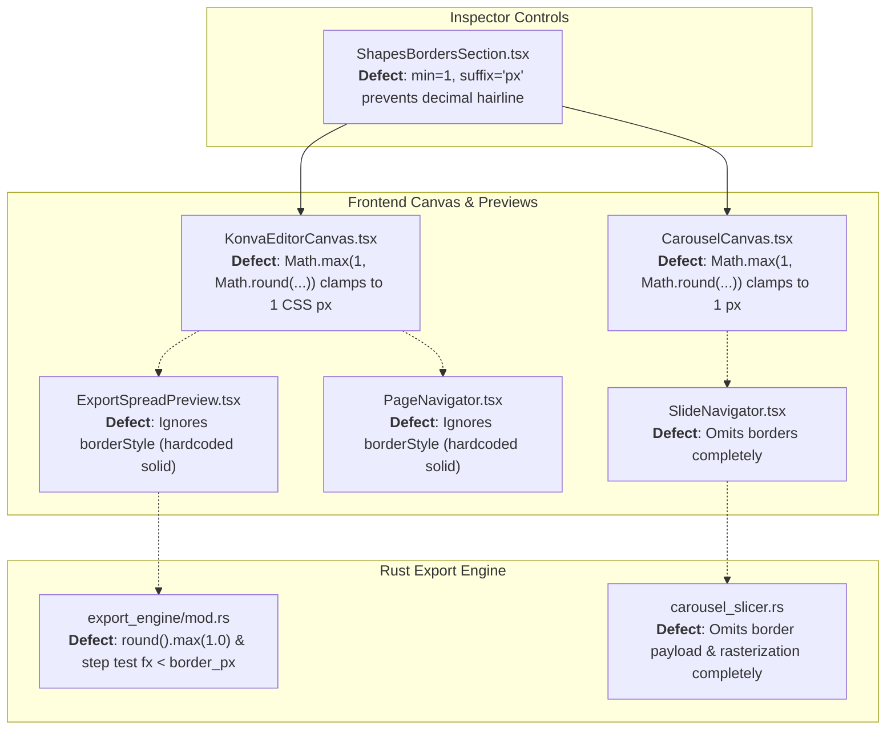
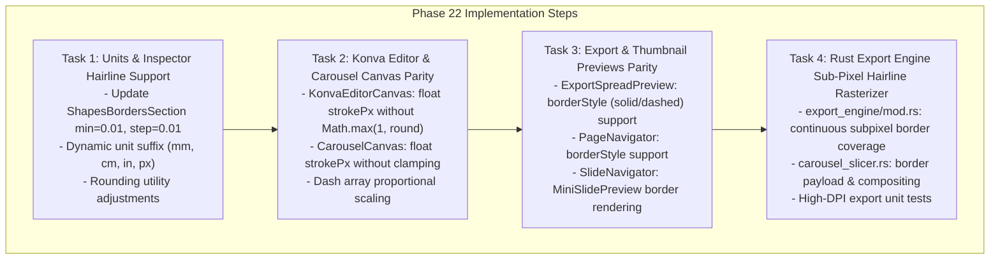

# Phase 22: Sub-Pixel Hairline Border Scaling Parity - Technical Research Findings

## Executive Summary

Phase 22 focuses on achieving mathematical precision, high-DPI sub-pixel anti-aliasing, and strict visual parity for photo frame borders across all rendering contexts in OpenSmartAlbum:
1. **Interactive Editor Canvas** (`KonvaEditorCanvas.tsx`)
2. **Spread Thumbnail Navigator** (`PageNavigator.tsx`)
3. **Carousel Slide Canvas & Navigator** (`CarouselCanvas.tsx`, `SlideNavigator.tsx`)
4. **Native Print & Export Spread Preview** (`ExportSpreadPreview.tsx`)
5. **Rust High-Resolution Export Engine** (`export_engine/mod.rs`, `carousel_slicer.rs`)
6. **Studio Inspector Border Controls** (`ShapesBordersSection.tsx`)

In fine-art print albums and luxury editorial photobooks, photographers and layout artists frequently utilize **ultra-thin hairline borders** (ranging from **0.02 mm to 0.1 mm**, or **0.05 pt to 0.28 pt**). Currently, the codebase contains artificial minimum clamping constraints (such as `Math.max(1, Math.round(...))` in Konva canvases, `max(1.0)` in Rust export rasterization, and hardcoded `min={1} suffix="px"` in the Inspector), which artificially inflate sub-pixel hairline borders into thick 1–2 pixel lines (representing 0.35–0.70 mm—over 7x to 35x thicker than configured). Furthermore, Carousel slice export and SlideNavigator omit borders entirely, and dashed border styles are dropped in Export Preview and Rust export.

This research document provides the complete mathematical framework, anti-aliasing formulas, defect inventory, and implementation architecture to achieve 100% proportional sub-pixel scaling parity across all platforms and resolutions.

---

## 1. Requirements & Scope Traceability

| Requirement ID | Specification | Architectural Component | Scope & Verification Criteria |
| :--- | :--- | :--- | :--- |
| **BOR-01** | Ultra-thin photo borders (0.02 - 0.1 mm / pt) render with exact proportional sub-pixel scaling in Export Preview, eliminating artificial 2-device-pixel minimum constraints. | `ExportSpreadPreview.tsx`, `previewGeometry.ts`, `units.ts` | - Sub-pixel floating-point stroke widths (`borderWidth * scale`) rendered without integer rounding or artificial pixel floors.<br>- Support for `borderStyle` (`solid`, `dashed`) and accurate corner radii.<br>- Crisp anti-aliasing on Retina / high-DPI and standard displays. |
| **BOR-02** | Border rendering logic maintains strict visual parity across Editor Canvas, Page Navigator thumbnails, and Native Print/Export Preview. | `KonvaEditorCanvas.tsx`, `PageNavigator.tsx`, `CarouselCanvas.tsx`, `SlideNavigator.tsx`, `ShapesBordersSection.tsx`, `export_engine/mod.rs`, `carousel_slicer.rs` | - Editor Canvas removes `Math.max(1, Math.round(...))` to support continuous sub-pixel Konva stroke widths.<br>- Rust rasterizer implements continuous sub-pixel coverage alpha calculation instead of hard integer thresholding.<br>- Carousel slice export & SlideNavigator incorporate full border rendering parity.<br>- Inspector allows decimal input with project unit awareness. |

---

## 2. Mathematical Foundations & Unit Conversions

### 2.1 Physical Unit to Raster Pixel Conversion

Let $w_{\text{border}}$ be the configured border width in the project's physical unit $U \in \{\text{mm}, \text{cm}, \text{inch}, \text{pt}, \text{px}\}$.

| Unit $U$ | Millimeter Conversion | Point (pt) Conversion | Pixel Conversion at Export DPI ($D$) |
| :--- | :--- | :--- | :--- |
| **mm** | $w_{\text{mm}} = w$ | $w_{\text{pt}} = w \cdot \frac{72}{25.4}$ | $w_{\text{px}} = w \cdot \frac{D}{25.4}$ |
| **cm** | $w_{\text{mm}} = w \cdot 10$ | $w_{\text{pt}} = w \cdot \frac{720}{25.4}$ | $w_{\text{px}} = w \cdot 10 \cdot \frac{D}{25.4}$ |
| **inch** | $w_{\text{mm}} = w \cdot 25.4$ | $w_{\text{pt}} = w \cdot 72$ | $w_{\text{px}} = w \cdot D$ |
| **pt** | $w_{\text{mm}} = w \cdot \frac{25.4}{72} \approx 0.352778 \cdot w$ | $w_{\text{pt}} = w$ | $w_{\text{px}} = w \cdot \frac{D}{72}$ |
| **px** | $w_{\text{mm}} = \frac{w}{D_{\text{base}}} \cdot 25.4$ | $w_{\text{pt}} = \frac{w}{D_{\text{base}}} \cdot 72$ | $w_{\text{px}} = w \cdot \frac{D}{D_{\text{base}}}$ |

### 2.2 Hairline Border Scale Comparison

Let us analyze an ultra-thin hairline border of $w_{\text{border}} = 0.05\text{ mm}$ across typical rendering environments:

1. **300 DPI Native Print Export**:
   $$w_{\text{px}} = 0.05 \cdot \frac{300}{25.4} = 0.59055\text{ px}$$
   - *Previous behavior*: Rounded and clamped to `max(1.0)` $\rightarrow$ **1.0 px** ($0.0847\text{ mm}$, **+69% error**).
   - *Parity target*: Continuous sub-pixel coverage with $\alpha_{\text{border}} = 0.59055$ on edge pixels.

2. **Editor Canvas at 100% Zoom** ($\text{scaleFactor} \approx 3.2\text{ px/mm}$ for a 300 mm spread in a 960 px viewport):
   $$w_{\text{canvas}} = 0.05 \cdot 3.2 = 0.16\text{ CSS px}$$
   - *Previous behavior*: `Math.max(1, Math.round(0.16))` $\rightarrow$ **1.0 CSS px** ($0.3125\text{ mm}$, **+525% error / 6.25x distortion**).
   - *Parity target*: Konva `strokeWidth = 0.16`. On a 2x Retina display, this renders onto the backing buffer as $0.32\text{ device px}$ with high-precision anti-aliasing.

3. **Export Preview Stage** ($\text{projection.scale} \approx 0.85\text{ px/mm}$ for 550 px preview card):
   $$w_{\text{preview}} = 0.05 \cdot 0.85 = 0.0425\text{ CSS px}$$
   - *Parity target*: Exact CSS border / SVG stroke width with fractional precision.

4. **Page Navigator Mini Preview** ($\text{projection.scale} \approx 0.22\text{ px/mm}$ for 136 px thumbnail card):
   $$w_{\text{thumb}} = 0.05 \cdot 0.22 = 0.011\text{ CSS px}$$
   - *Parity target*: Proportional sub-pixel stroke representation without clipping or overflow.

---

## 3. Detailed Codebase Audit & Defect Inventory



### 3.1 [`KonvaEditorCanvas.tsx`](file:///Users/chiio/VSCode/albumaker/src/features/editor/KonvaEditorCanvas.tsx#L758-L797)
- **Current Lines 758–797**:
  ```tsx
  {frame.borderEnabled && (() => {
    const strokePx = Math.max(1, Math.round((frame.borderWidth || 0) * scaleFactor));
    const strokeDash = frame.borderStyle === 'dashed' ? [strokePx * 2.5, strokePx * 1.5] : undefined;
    const isCustomShape = frame.shapeType && frame.shapeType !== 'rectangle' && frame.shapeType !== 'rounded';
    ...
    const borderRadii: [number, number, number, number] = [
      Math.max(0, tlPx - strokePx / 2),
      Math.max(0, trPx - strokePx / 2),
      Math.max(0, brPx - strokePx / 2),
      Math.max(0, blPx - strokePx / 2),
    ];
    return (
      <Rect
        x={strokePx / 2}
        y={strokePx / 2}
        width={Math.max(0, pixelW - strokePx)}
        height={Math.max(0, pixelH - strokePx)}
        stroke={frame.borderColor || '#FFFFFF'}
        strokeWidth={strokePx}
        dash={strokeDash}
        cornerRadius={hasRounding ? borderRadii : undefined}
        strokeScaleEnabled={false}
        listening={false}
      />
    );
  })()}
  ```
- **Defects**:
  1. `Math.max(1, Math.round(...))` forcefully destroys floating-point hairline widths $< 1\text{ px}$.
  2. `dash` array uses integer multiplier `[strokePx * 2.5, ...]` which becomes `[2.5, 1.5]` when clamped to 1, rather than scaling with unrounded `strokePx`.
  3. `strokeScaleEnabled={false}`: Since `strokePx` already incorporates `scaleFactor`, `strokeScaleEnabled={false}` ensures Konva uses the calculated stage pixels without double-scaling. However, `strokePx` must be floating-point.

### 3.2 [`ExportSpreadPreview.tsx`](file:///Users/chiio/VSCode/albumaker/src/features/export/ExportSpreadPreview.tsx#L453-L460)
- **Current Lines 453–460**:
  ```tsx
  {photoEl.borderEnabled && photoEl.borderWidth > 0 && (
    <div style={{
      position: 'absolute', inset: 0, boxSizing: 'border-box', pointerEvents: 'none',
      border: `${photoEl.borderWidth * scale}px solid ${photoEl.borderColor || '#ffffff'}`,
      borderRadius: 'inherit',
    }} />
  )}
  ```
- **Defects**:
  1. Hardcoded `solid` border style; completely ignores `photoEl.borderStyle` (`dashed`).
  2. CSS `border` shorthand can suffer from sub-pixel rounding artifacts in WebKit when values drop below $0.5\text{ px}$.
  3. Inset border alignment with `box-sizing: border-box` is effective, but `borderStyle` mapping is missing.

### 3.3 [`PageNavigator.tsx`](file:///Users/chiio/VSCode/albumaker/src/features/album/PageNavigator.tsx#L258-L265)
- **Current Lines 258–265**:
  ```tsx
  {photoEl.borderEnabled && photoEl.borderWidth > 0 && (
    <div style={{
      position: 'absolute', inset: 0, boxSizing: 'border-box', pointerEvents: 'none',
      border: `${photoEl.borderWidth * scale}px solid ${photoEl.borderColor || '#ffffff'}`,
      borderRadius: 'inherit',
    }} />
  )}
  ```
- **Defects**:
  1. Hardcoded `solid` style (ignores `photoEl.borderStyle`).
  2. In high zoom / Retina conditions, needs consistent sub-pixel border style resolution.

### 3.4 [`SlideNavigator.tsx`](file:///Users/chiio/VSCode/albumaker/src/features/carousel/SlideNavigator.tsx#L40-L92)
- **Current Lines 40–92**:
  `MiniSlidePreview` iterates over `intersectingFrames` and renders an outer container `div` with an `img`.
- **Defects**:
  1. **Borders are completely omitted**. No border check or border element exists in `MiniSlidePreview`.

### 3.5 [`CarouselCanvas.tsx`](file:///Users/chiio/VSCode/albumaker/src/features/carousel/CarouselCanvas.tsx#L133-L135, #L224-L260)
- **Current Line 133**:
  ```tsx
  const strokePx = Math.max(1, Math.round(frame.borderWidth || 1));
  const strokeDash = frame.borderStyle === 'dashed' ? [strokePx * 2.5, strokePx * 1.5] : undefined;
  ```
- **Defects**:
  1. Clamped with `Math.max(1, Math.round(...))` and defaults to `1` even when `borderWidth` is fractional.

### 3.6 [`ShapesBordersSection.tsx`](file:///Users/chiio/VSCode/albumaker/src/features/inspector/sections/ShapesBordersSection.tsx#L93, #L456-L466)
- **Current Lines 93, 456–466**:
  ```tsx
  const borderWidth = Number(activeTarget.borderWidth || 1);
  ...
  <NumberInput
    value={borderWidth}
    min={1}
    max={40}
    suffix="px"
    onChange={(w) => updateSelectedBorders({ borderWidth: w })}
  />
  ```
- **Defects**:
  1. `min={1}` prevents entering hairline values (e.g. `0.05`, `0.1`).
  2. Hardcoded `suffix="px"` even in Album mode where project canvas unit is `mm`, `cm`, or `inch`.
  3. `step` is not configured, defaulting to integer step `1`.

### 3.7 [`src-tauri/src/export_engine/mod.rs`](file:///Users/chiio/VSCode/albumaker/src-tauri/src/export_engine/mod.rs#L650-L728)
- **Current Lines 650–652, 705–728**:
  ```rust
  let has_border = elem.border_enabled && elem.border_width > 0.0;
  let border_px = if has_border { (elem.border_width * scale_factor).round().max(1.0) } else { 0.0 };
  ...
  let border_alpha = if !has_border {
      0.0
  } else if !has_corner_radius {
      if (fx as f64) < border_px || (fy as f64) < border_px
          || (fx as f64) >= frame_w_f - border_px || (fy as f64) >= frame_h_f - border_px {
          1.0
      } else {
          0.0
      }
  } else {
      ...
  };
  ```
- **Defects**:
  1. `(elem.border_width * scale_factor).round().max(1.0)` forces minimum 1.0 pixel.
  2. Hard-stepped step function `(fx as f64) < border_px` produces aliased, quantized edges with no sub-pixel anti-aliasing.
  3. Dashed border styling is not supported in the rasterizer.

### 3.8 [`src-tauri/src/export_engine/carousel_slicer.rs`](file:///Users/chiio/VSCode/albumaker/src-tauri/src/export_engine/carousel_slicer.rs#L32-L50, #L145-L215)
- **Defects**:
  1. `CarouselElementPayload` does not declare `border_enabled`, `border_width`, `border_color`, or `border_style`.
  2. `render_carousel_panorama` does not composite borders onto frames.

---

## 4. Sub-Pixel Anti-Aliasing & Rendering Mechanics

### 4.1 HTML5 Canvas 2D / Konva Sub-Pixel Mechanics

In HTML5 2D Canvas context:
- `ctx.lineWidth` accepts arbitrary positive IEEE 754 floating-point values (e.g. `0.15`, `0.35`, `0.75`).
- On Retina and high-DPI displays, Konva scales the backing `<canvas>` buffer by `window.devicePixelRatio` (e.g., $2.0\times$ on macOS Retina).
- A CSS stroke width of $0.5\text{ CSS px}$ is rasterized onto the backing store as:
  $$\text{devicePixels} = 0.5 \times 2.0 = 1.0\text{ physical device pixel}$$
- A stroke width of $0.25\text{ CSS px}$ is rasterized as $0.5\text{ physical device pixels}$ with 50% anti-aliased edge intensity.
- **Inside Stroke Alignment**:
  In 2D Canvas, `ctx.stroke()` centers the stroke path on the vector geometry. To achieve an exact inside stroke without clipping or exterior expansion:
  $$\text{rect.x} = \frac{w_{\text{stroke}}}{2}, \quad \text{rect.y} = \frac{w_{\text{stroke}}}{2}$$
  $$\text{rect.width} = \max(0, W_{\text{frame}} - w_{\text{stroke}}), \quad \text{rect.height} = \max(0, H_{\text{frame}} - w_{\text{stroke}})$$
  $$\text{radii}_{\text{inner}} = \max\left(0, \text{radii}_{\text{outer}} - \frac{w_{\text{stroke}}}{2}\right)$$

### 4.2 Rust Native Export Engine Continuous Sub-Pixel Coverage

To achieve exact sub-pixel hairline rasterization in Rust without clamping:

Let $b = w_{\text{border}} \cdot \text{scale\_factor} > 0$ be the exact floating-point border thickness in raster pixels.
Let $(p_x, p_y) = (f_x + 0.5, f_y + 0.5)$ be the continuous center coordinates of pixel $(f_x, f_y)$.

#### 1. Rectangular Frame Border Coverage
The perpendicular distance from pixel center $(p_x, p_y)$ to the nearest frame outer boundary is:
$$d_{\text{edge}} = \min\left(\min(p_x, W_{\text{frame}} - p_x), \min(p_y, H_{\text{frame}} - p_y)\right)$$

For a continuous pixel box filter spanning $[d_{\text{edge}} - 0.5, d_{\text{edge}} + 0.5]$:
- **Case 1: Thick Border ($b \ge 1.0$)**:
  $$\alpha_{\text{border}} = \text{clamp}\left(b - d_{\text{edge}} + 0.5, 0.0, 1.0\right)$$
- **Case 2: Sub-Pixel Hairline Border ($0 < b < 1.0$)**:
  For pixels on the perimeter boundary ($0 \le d_{\text{edge}} < 1.0$):
  $$\alpha_{\text{border}} = b$$
  For interior pixels ($d_{\text{edge}} \ge 1.0$):
  $$\alpha_{\text{border}} = 0.0$$

Combining both into a unified continuous formulation:
```rust
#[inline]
pub fn compute_rect_border_alpha(
    px: f64,
    py: f64,
    frame_w: f64,
    frame_h: f64,
    border_px: f64,
) -> f64 {
    if border_px <= 0.0 {
        return 0.0;
    }
    let dist_to_edge = (px.min(frame_w - px)).min(py.min(frame_h - py));
    if dist_to_edge < 0.0 {
        return 0.0;
    }
    if border_px < 1.0 {
        if dist_to_edge < 1.0 {
            border_px
        } else {
            0.0
        }
    } else {
        (border_px - dist_to_edge + 0.5).clamp(0.0, 1.0)
    }
}
```

#### 2. Rounded Rect Corner Border Coverage
For frames with corner radii $(r_{\text{tl}}, r_{\text{tr}}, r_{\text{br}}, r_{\text{bl}})$:
1. Compute outer corner alpha $\alpha_{\text{outer}} = \text{compute\_corner\_alpha}(p_x, p_y, W, H, r_{\text{tl}}, r_{\text{tr}}, r_{\text{br}}, r_{\text{bl}})$.
2. If $p_x \ge b \land p_x < W - b \land p_y \ge b \land p_y < H - b$, compute inner corner alpha:
   $$\alpha_{\text{inner}} = \text{compute\_corner\_alpha}(p_x - b, p_y - b, W - 2b, H - 2b, r_{\text{tl}} - b, \dots)$$
3. The border alpha is:
   $$\alpha_{\text{border}} = (\alpha_{\text{outer}} - \alpha_{\text{inner}}). \text{clamp}(0.0, 1.0)$$

#### 3. Optical Compositing Formula
The photo alpha and border alpha are composited as a single physical object:
$$\alpha_{\text{photo}} = \alpha_{\text{source\_image}} \cdot \alpha_{\text{inner}} \cdot \alpha_{\text{shape}}$$
$$\alpha_{\text{object}} = \alpha_{\text{border}} + \alpha_{\text{photo}} \cdot (1.0 - \alpha_{\text{border}})$$
$$\mathbf{C}_{\text{object}} = \frac{\mathbf{C}_{\text{border}} \cdot \alpha_{\text{border}} + \mathbf{C}_{\text{photo}} \cdot \alpha_{\text{photo}} \cdot (1.0 - \alpha_{\text{border}})}{\alpha_{\text{object}}}$$
$$\alpha_{\text{final}} = \alpha_{\text{object}} \cdot \text{opacity}$$

---

## 5. Implementation Roadmap & Architecture Plan



### 5.1 Task Breakdown

#### Task 1: Domain Units & Studio Inspector Hairline Inputs
- **File**: [`src/features/inspector/sections/ShapesBordersSection.tsx`](file:///Users/chiio/VSCode/albumaker/src/features/inspector/sections/ShapesBordersSection.tsx)
- **Changes**:
  - Replace `min={1}`, `max={40}`, `suffix="px"` with dynamic unit suffix based on project `canvasUnit` (`mm`, `cm`, `inch`, `px`).
  - Set `min={0.01}`, `step={isCarousel ? 0.5 : unit === 'inch' ? 0.01 : unit === 'cm' ? 0.02 : unit === 'mm' ? 0.05 : 0.5}`.
  - Fix default border width fallback from `1` to `activeTarget.borderWidth ?? 1`.

#### Task 2: Konva Editor Canvas & Carousel Canvas Float Parity
- **Files**:
  - [`src/features/editor/KonvaEditorCanvas.tsx`](file:///Users/chiio/VSCode/albumaker/src/features/editor/KonvaEditorCanvas.tsx)
  - [`src/features/carousel/CarouselCanvas.tsx`](file:///Users/chiio/VSCode/albumaker/src/features/carousel/CarouselCanvas.tsx)
- **Changes**:
  - Remove `Math.max(1, Math.round(...))` and compute exact float: `const strokePx = (frame.borderWidth || 0) * scaleFactor;`.
  - Proportional dash array: `const strokeDash = frame.borderStyle === 'dashed' ? [Math.max(2, strokePx * 3), Math.max(1.5, strokePx * 2)] : undefined;`.
  - Ensure `strokeScaleEnabled={false}` preserves continuous floating-point stroke widths.

#### Task 3: Export Preview & Thumbnail Navigators Parity
- **Files**:
  - [`src/features/export/ExportSpreadPreview.tsx`](file:///Users/chiio/VSCode/albumaker/src/features/export/ExportSpreadPreview.tsx)
  - [`src/features/album/PageNavigator.tsx`](file:///Users/chiio/VSCode/albumaker/src/features/album/PageNavigator.tsx)
  - [`src/features/carousel/SlideNavigator.tsx`](file:///Users/chiio/VSCode/albumaker/src/features/carousel/SlideNavigator.tsx)
- **Changes**:
  - Map `photoEl.borderStyle` (`dashed` / `solid`) into CSS border style property:
    `borderStyle: photoEl.borderStyle || 'solid'`.
  - Pass continuous float `borderWidth: `${photoEl.borderWidth * scale}px``.
  - In `SlideNavigator.tsx`, add border rendering to `MiniSlidePreview` for frames with `frame.borderEnabled && frame.borderWidth > 0`.

#### Task 4: Rust Export Engine Sub-Pixel Hairline Rasterization
- **Files**:
  - [`src-tauri/src/export_engine/mod.rs`](file:///Users/chiio/VSCode/albumaker/src-tauri/src/export_engine/mod.rs)
  - [`src-tauri/src/export_engine/carousel_slicer.rs`](file:///Users/chiio/VSCode/albumaker/src-tauri/src/export_engine/carousel_slicer.rs)
- **Changes**:
  - In `mod.rs`:
    - Remove `.round().max(1.0)` constraint; retain exact float `border_px = elem.border_width * scale_factor;`.
    - Implement continuous sub-pixel coverage for rectangular and rounded frames.
    - Test border blending against white/dark backgrounds for $0.02\text{ mm}$ and $0.05\text{ mm}$ borders.
  - In `carousel_slicer.rs`:
    - Extend `CarouselElementPayload` with `border_enabled`, `border_width`, `border_color`, `border_style`.
    - Implement border compositing in `render_carousel_panorama`.

---

## 6. Verification & Test Plan

1. **Sub-Pixel Math Precision Tests** (`units.test.ts`):
   - Verify `0.02 mm`, `0.05 mm`, and `0.1 mm` conversions across 72, 96, 300, and 600 DPI.
2. **Editor Canvas Rendering Parity Tests** (`borderParity.test.ts`):
   - Verify Konva `strokeWidth` matches `borderWidth * scaleFactor` exactly without integer quantization.
   - Verify dashed pattern generation with fractional stroke widths.
3. **Rust Export Engine Hairline Tests** (`export_engine/mod.rs` tests):
   - Unit test for `0.02 mm` border at 300 DPI: assert anti-aliased edge pixel color reflects $\approx 0.236$ alpha coverage rather than full 1.0 or 0.0 clamp.
   - Unit test for photo and border shared opacity with ultra-thin borders.
4. **Carousel Export Slicer Border Tests** (`carousel_slicer.rs` tests):
   - Verify carousel slide export includes configured border colors and widths.
