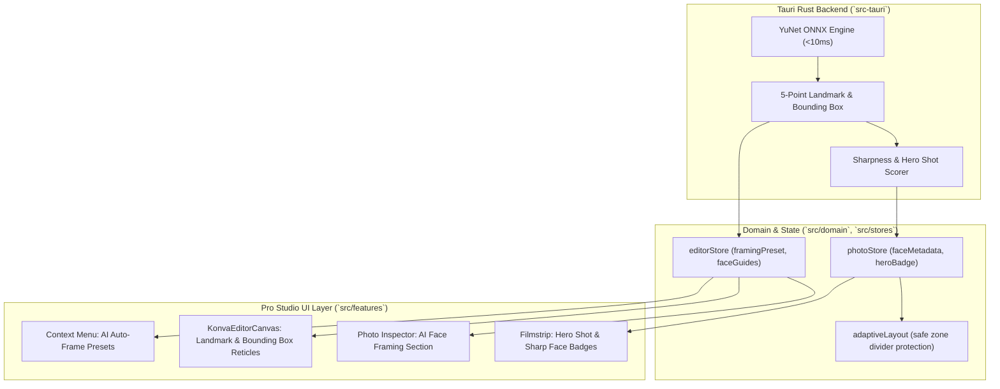

# UI/UX Specification: On-Device AI Face Detection & Studio Framing Engine (YuNet) — Phase 23

**Document Version:** 1.0.0  
**Phase:** 23 — On-Device AI Face Detection & Studio Framing Engine (YuNet)  
**Design Standard:** Apple Human Interface Guidelines (macOS Sequoia / Sonoma Pro App Standards)  
**Target Platform:** macOS Desktop (Tauri v2 + React 19 + Konva + Rust Native ONNX Inference)  
**Theme:** Pro Studio Dark Mode (Zero-Chromatic Charcoal & Graphite Base with Precision Studio Accents)  

---

## 1. Executive Summary & Design Architecture

### 1.1 Purpose & Mental Model
The **On-Device AI Face Detection & Studio Framing Engine** delivers instant, privacy-first facial intelligence to OpenSmartAlbum. Powered by an embedded, ultra-lightweight **YuNet ONNX** model (~400KB) running natively in the Tauri Rust backend (<10ms latency), the system detects human faces and 5 canonical facial landmarks (Left Eye, Right Eye, Nose Tip, Left Mouth Corner, Right Mouth Corner) 100% offline without sending imagery to external cloud servers.

In professional photography studios (e.g., Reflection Photography, graduation portrait studios, passport photo labs, and luxury wedding album publishers), photo framing requires exact geometric discipline:
1. **Pasfoto Formal:** Strict headroom clearance (8–10%), eye-level at 60–65% vertical height, centered nose axis, and symmetrical shoulder clearance.
2. **Wisuda UNY 50% Shoulder Framing:** Preserves graduation cap/toga headroom (12–15%) and exactly 50% bust/shoulder ratio without awkward armpit/toga amputations.
3. **Portrait Rule-of-Thirds:** Automatically places the subject's eye-line on the upper third horizontal harmonic line with gaze-aware lateral offset.
4. **Natural Center:** Balanced optical face center with golden ratio headroom for multi-photo albums and social carousel cards.

```
┌────────────────────────────────────────────────────────────────────────────────────────┐
│                                 CANVAS PHOTO FRAME                                      │
│  ┌──────────────────────────────────────────────────────────────────────────────────┐  │
│  │                                  ▲ Headroom Margin (10%)                         │  │
│  │  · · · · · · · · · · · · · · · · ┼ · · · · · · · · · · · · · · · · · · · · · ·   │  │
│  │                    ┌─────────────┴─────────────┐                                 │  │
│  │                    │ ⌜                         ⌝ │                               │  │
│  │  ══════════════════╪═════ 👁 L ═══════ 👁 R ═════╪═══════════════════════════════ │  │◄── Eye-Line (Top 1/3)
│  │                    │              ▲              │                               │  │
│  │                    │              👃 Nose        │  YuNet Bounding Reticle       │  │
│  │                    │          👄L     👄R        │  (Hairline, Toggleable ⇧F)    │  │
│  │                    │ ⌞                         ⌟ │                               │  │
│  │                    └─────────────┬─────────────┘                                 │  │
│  │                                  │                                               │  │
│  │                       50% Shoulder Clearance Line                                │  │
│  │  · · · · · · · · · · · · · · · · ┴ · · · · · · · · · · · · · · · · · · · · · ·   │  │
│  └──────────────────────────────────────────────────────────────────────────────────┘  │
└────────────────────────────────────────────────────────────────────────────────────────┘
```

### 1.2 System Integration Architecture


---

## 2. Design Tokens & Visual Language

All UI elements adhere strictly to canonical Pro Studio design tokens defined in `src/styles/tokens.css` with zero chromatic bias during color grading.

### 2.1 Color Tokens for AI & Studio Framing
| Token Name | Value | Purpose / Usage |
| :--- | :--- | :--- |
| `--color-bg-primary` | `#18181b` | Canvas background & dark contrast base |
| `--color-bg-secondary` | `#1e1e22` | Inspector container & panel background |
| `--color-bg-tertiary` | `#27272a` | Header bars, input surfaces, dropdown triggers |
| `--color-surface` | `#2d2d32` | Card resting background, segmented control bases |
| `--color-surface-hover` | `#38383f` | Button & preset card hover state |
| `--color-surface-active` | `#44444c` | Selected preset pill & active button state |
| `--color-border` | `#2e2e33` | Panel perimeter & section dividers |
| `--color-border-subtle` | `#242428` | Inset guide borders & table dividers |
| `--color-text-primary` | `#f4f4f5` | Section titles, active preset labels, face counts |
| `--color-text-secondary` | `#a1a1aa` | Confidence percentages, metadata subtitles, shortcut keys |
| `--color-text-muted` | `#71717a` | Helper hints, disabled state, placeholder text |
| `--color-accent` | `#e4e4e7` | Neutral high-contrast focus rings & primary controls |
| `--color-ai-cyan` | `#38bdf8` | AI detection active badge, face reticle corner brackets, landmark dots |
| `--color-ai-cyan-subtle` | `rgba(56, 189, 248, 0.12)` | AI framing card background tint & bounding box fill |
| `--color-ai-cyan-glow` | `rgba(56, 189, 248, 0.25)` | Landmark reticle pulse & face focal target glow |
| `--color-hero-gold` | `#f59e0b` | "Hero Shot" filmstrip culling badge & star icon |
| `--color-hero-gold-subtle` | `rgba(245, 158, 11, 0.15)` | Hero badge background pill |
| `--color-sharp-green` | `#22c55e` | "Sharp Face" focus badge & high confidence readout |
| `--color-sharp-green-subtle`| `rgba(34, 197, 94, 0.15)` | Sharp badge background pill |
| `--color-danger` | `#ef4444` | Face clipping warning & reset triggers |

### 2.2 Typography Specifications (Apple SF Pro Font Stack)
| UI Element | Size | Weight | Tracking | Line Height | Usage |
| :--- | :--- | :--- | :--- | :--- | :--- |
| **Section Title** | `13px` | `600` (Semibold) | `-0.01em` | `1.2` | Accordion section title (`AI Face & Studio Framing`) |
| **Preset Label** | `12px` | `500` (Medium) | `0` | `1.3` | Framing preset dropdown items (`Pasfoto Formal`) |
| **Confidence Badge** | `10.5px` | `700` (Bold) | `+0.02em` | `1.0` | Metric indicator (`98.4% Confidence`, `1 Face Detected`) |
| **Guideline Label** | `10px` | `600` (Semibold) | `+0.04em` | `1.0` | Canvas guideline text overlays (`EYE-LINE`, `HEADROOM 10%`) |
| **Filmstrip Badge** | `9.5px` | `700` (Bold) | `+0.03em` | `1.0` | Filmstrip thumbnail overlays (`✨ HERO`, `🎯 SHARP`) |
| **Mono Metric** | `11px` | `500` (Medium) | `0` | `1.2` | Sliders & numerical offsets (`+12%`, `1.42×`) |

---

## 3. Inspector UI: AI Face Framing Section

### 3.1 Inspector Accordion Integration
The **AI Face & Studio Framing** section lives inside the right-hand Inspector (`InspectorContainer.tsx`) as a first-class accordion section between **Layout & Spacing** and **Shapes & Borders**. When a single photo frame is selected on the canvas, the section dynamically displays real-time YuNet detection telemetry, face thumbnail preview, confidence indicators, and framing preset controls.

```
┌──────────────────────────────────────────────────────────────┐
│ [▼] ✨ AI Face & Studio Framing           [ 👤 1 Face • 98% ]│◄── Section Header + Status Pill
├──────────────────────────────────────────────────────────────┤
│ ┌──────────────────────────────────────────────────────────┐ │
│ │ ┌─────────┐  IMG_8821.JPG                                │ │
│ │ │ 👤 Crop │  Detected: 1 Face (Primary)                  │ │◄── Detected Face Preview Card
│ │ └─────────┘  YuNet ONNX • 6.2ms • High Confidence        │ │
│ └──────────────────────────────────────────────────────────┘ │
│                                                              │
│ Studio Framing Preset:                                       │
│ ┌──────────────────────────────────────────────────────────┐ │
│ │ 🪄 Pasfoto Formal (3x4/4x6)                            ▾ │ │◄── Preset Dropdown
│ └──────────────────────────────────────────────────────────┘ │
│                                                              │
│ Headroom Clearance:                                          │
│ ┌──────────────────────────────────────────────┐ ┌─────────┐ │
│ │ ───○─────────────────────────────────────────│ │   10%   │ │◄── Precision Headroom Slider
│ └──────────────────────────────────────────────┘ └─────────┘ │
│                                                              │
│ Eye-Level Line Placement:                                    │
│ [ Top 1/3 (Rule-of-Thirds) ]  [ Golden (38%) ]  [ Center ]   │◄── Eye-Line Segmented Control
│                                                              │
│ Shoulder / Bust Ratio:                                       │
│ ┌──────────────────────────────────────────────┐ ┌─────────┐ │
│ │ ──────────────○──────────────────────────────│ │   50%   │ │◄── Shoulder Clearance Slider
│ └──────────────────────────────────────────────┘ └─────────┘ │
│                                                              │
│ Visual Guides:                                               │
│ [x] Show Face Reticle & Landmarks (⇧F)                       │◄── Canvas Overlay Toggle
│                                                              │
│ ┌─────────────────────────────┐  ┌─────────────────────────┐ │
│ │ 🔄 Re-Analyze Face (YuNet)  │  │ ↺ Reset to Center Crop  │ │◄── Primary Action Buttons
│ └─────────────────────────────┘  └─────────────────────────┘ │
└──────────────────────────────────────────────────────────────┘
```

### 3.2 Inspector Component Specifications

#### A. Accordion Header & Status Pill
- **Icon:** `Sparkles` (`14px`, stroke `1.5px`, color `var(--color-ai-cyan, #38bdf8)`).
- **Title:** `AI Face & Studio Framing`.
- **Status Pill (Dynamic):**
  - **Single Face:** `👤 1 Face • 98%` (Background: `rgba(56, 189, 248, 0.12)`, text: `#38bdf8`, border: `rgba(56, 189, 248, 0.25)`).
  - **Multi-Face:** `👥 3 Faces Detected` (Background: `rgba(255, 255, 255, 0.08)`, text: `#f4f4f5`).
  - **No Face Detected:** `No Faces` (Background: `rgba(255, 255, 255, 0.04)`, text: `#71717a`).
  - **Analyzing:** `<Loader2>` spinner with `Analyzing...`.

#### B. Detected Face Telemetry Card
- **Thumbnail Inset:** `38px × 38px` circular/squircle crop centered directly on the detected face bounding box with landmark points faintly highlighted.
- **Metrics Readout:**
  - File Name: `photo.fileName` (`11.5px`, semibold, truncated).
  - Model & Latency: `YuNet ONNX • 6.2ms • High Confidence` (`10.5px`, `var(--color-text-secondary)`).
  - Multi-face Switcher: If multiple faces are detected, displays `< [1 of 3] >` segmented arrows to toggle the primary focal anchor.

#### C. Studio Framing Preset Dropdown
The preset dropdown offers standard institutional, graduation, and portrait studio framing algorithms:

| Preset Name | Target Headroom | Eye-Level Target | Shoulder Clearance | Description & Ideal Use Case |
| :--- | :--- | :--- | :--- | :--- |
| **Pasfoto Formal (3x4/4x6)** | `8% – 10%` | `62% from bottom` | Tight (`35% shoulder`) | Indonesian formal ID, passport, civil service & visa photos. Centered facial symmetry. |
| **Wisuda UNY 50% Shoulder** | `12% – 15%` | `58% from bottom` | `50% shoulder width` | Standard university graduation portrait (e.g. UNY/UGM toga cap & sash clearance). |
| **Portrait Rule-of-Thirds** | `10% – 14%` | `66.6% (Top 1/3)` | Dynamic (`45% bust`) | Classical fine-art studio portrait, wedding hero portrait with gaze-direction balance. |
| **Natural Center** | `12%` | `50.0% (Center)` | Dynamic | Natural optical centering for square and wide album frames. |
| **Custom Manual** | User defined | User defined | User defined | Unlocked manual sliders for custom commercial framing. |

#### D. Fine-Tuning Controls
- **Headroom Clearance Slider:** Range `0%` to `30%`, step `1%`, default per preset. Adjusts vertical margin above hair/cap.
- **Eye-Level Line Segmented Control:** 3-state segmented button: `Top 1/3 (33%)`, `Golden (38%)`, `Center (50%)`.
- **Shoulder / Bust Ratio Slider:** Range `20%` to `80%`, step `5%`. Modulates crop scale to ensure shoulder width fits harmoniously within frame boundaries.
- **Canvas Guides Toggle:** Checkbox or switch: `Show Face Reticle & Landmarks (⇧F)`.

---

## 4. Canvas Visual Guides & Konva Reticle Overlays

### 4.1 Reticle Geometry & Visual Hierarchy
When a photo frame is selected and the Face Reticle toggle is active (or during active crop framing adjustment), the `KonvaEditorCanvas` renders a lightweight, non-destructive vector overlay layer.

```
┌────────────────────────────────────────────────────────────────────────┐
│                              KONVA CANVAS LAYER                        │
│                                                                        │
│               Headroom Margin Guide: 10%                               │
│       - - - - ┬ - - - - - - - - - - - - - - - - - - - - ┬ - - - -      │
│               │                                         │              │
│            ┌──▼─────────────────────────────────────────▼──┐           │
│            │ ⌜                                           ⌝ │           │
│            │                                               │           │
│  ──────────┼─────────────── 👁 ─────────────── 👁 ─────────┼────────── │◄── Eye-Line Axis
│  [EYE-LINE]│                                               │           │    (Dashed #38bdf8)
│            │                       👃                      │           │
│            │                                               │           │
│            │                  👄───────👄                  │           │
│            │ ⌞                                           ⌟ │           │
│            └───────────────────────▲───────────────────────┘           │
│                                    │                                   │
│                        YuNet Bounding Reticle                          │
│                        (Hairline 1px, Corner Brackets)                 │
└────────────────────────────────────────────────────────────────────────┘
```

### 4.2 Canvas Guide Visual Specifications
1. **Face Bounding Box:**
   - **Stroke:** `1px` crisp hairline (`rgba(56, 189, 248, 0.75)` or Pro Studio `rgba(228, 228, 231, 0.65)` in neutral mode).
   - **Corner Brackets:** `6px × 6px` L-shaped camera reticle brackets (`⌜ ⌝ ⌞ ⌟`) rendered at the 4 bounding box corners.
   - **Fill:** `rgba(56, 189, 248, 0.04)` subtle hover/selection tint.

2. **5-Point YuNet Landmark Dots:**
   - **Left Eye & Right Eye:** `3.5px` diameter circular reticle with `1.5px` center dot (`#38bdf8`) and outer micro-ring.
   - **Nose Tip:** `2.5px` diamond marker at nose apex.
   - **Mouth Left & Right Corners:** `2.5px` micro-dots connected by a subtle hairline baseline (`0.75px`, `rgba(56, 189, 248, 0.4)`).

3. **Studio Guide Alignment Lines:**
   - **Eye-Line Horizon:** Horizontal dashed line (`dash: [4, 4]`, stroke `1px`, color `#38bdf8`) spanning the full width of the photo frame. Accompanied by a micro tag `[EYE-LINE: 33.3%]`.
   - **Headroom Boundary Line:** Top dotted line (`dash: [2, 3]`, stroke `0.75px`, color `rgba(255, 255, 255, 0.4)`) indicating clearance.
   - **Symmetry Vertical Axis:** Vertical center dotted line running from crown through nose bridge down to chin.

4. **Interactive HUD & Shortcut:**
   - **Toggle Key:** `Shift + F` (`⇧F`) instantly toggles face overlay visibility globally.
   - **Render Optimization:** Reticles are rendered strictly on canvas vector overlay and **never** rasterized into exported PDFs, JPEGs, or print proofs.
   - **Performance:** Rendered via optimized `<Konva.Shape>` or `<Konva.Group>` with `listening={false}` to guarantee 0ms overhead during canvas dragging.

---

## 5. Filmstrip Quality Badges & Smart Photo Culling

### 5.1 Smart Culling Visual Badges
In the bottom photo library filmstrip (`FilmstripTray.tsx`), photos that have undergone background YuNet analysis are decorated with non-intrusive, studio-grade quality badges on their thumbnail cards.

```
┌───────────────────────────────┐
│ ┌─────────┐       ┌─────────┐ │
│ │ ✨ HERO │       │ 👤 1    │ │◄── Top Overlay: Hero Shot Badge & Face Count Pill
│ └─────────┘       └─────────┘ │
│                               │
│         [ THUMBNAIL ]         │
│                               │
│ ┌─────────┐       ┌─────────┐ │
│ │ 🎯 SHARP│       │  USED   │ │◄── Bottom Overlay: Focus Quality & Placed Status
│ └─────────┘       └─────────┘ │
└───────────────────────────────┘
```

### 5.2 Badge Matrix & Visual Styling
| Badge Name | Visual Representation | Trigger Conditions | Background / Stroke Token | Typography |
| :--- | :--- | :--- | :--- | :--- |
| **Hero Shot** | `✨ HERO` or `🌟 HERO` | Face confidence > 92%, eye sharpness > threshold, positive expression, upright head pose. | `rgba(245, 158, 11, 0.22)` / `1px solid rgba(245, 158, 11, 0.5)` | `9.5px`, Bold, `#fbbf24` |
| **Sharp Face** | `🎯 SHARP` | High-frequency gradient score on eye & pupil landmarks (in-focus check). | `rgba(34, 197, 94, 0.20)` / `1px solid rgba(34, 197, 94, 0.45)` | `9.5px`, Bold, `#4ade80` |
| **Face Count** | `👤 1` / `👥 3` | YuNet detected face count (`count >= 1`). | `rgba(0, 0, 0, 0.65)` / `1px solid rgba(255, 255, 255, 0.15)` | `9.5px`, Semibold, `#f4f4f5` |
| **Closed Eyes / Blurry (Warning)** | `⚠️ BLINK` | Landmark ratio indicates closed eyes during portrait burst. | `rgba(239, 68, 68, 0.22)` / `1px solid rgba(239, 68, 68, 0.5)` | `9.5px`, Bold, `#f87171` |

### 5.3 Filmstrip Filter & Sort Extensions
The filmstrip header controls are updated to support AI-driven culling:
1. **Filter Dropdown (`filterSelect`):**
   - `Filter: All ({total})`
   - `Filter: ✨ Hero Shots ({heroCount})` — *New*
   - `Filter: 👤 Faces Detected ({faceCount})` — *New*
   - `Filter: Unused ({unusedCount})`
   - `Filter: Used ({usedCount})`
   - `Filter: Favorites ({favCount})`
2. **Sort Dropdown (`sortSelect`):**
   - `Sort: Name`
   - `Sort: Date`
   - `Sort: Size`
   - `Sort: AI Quality / Hero Score` — *New* (Ranks highest quality portraits first for fast album creation).

---

## 6. Contextual Right-Click Menus

### 6.1 Canvas Element Context Menu (`ContextMenu.tsx`)
Right-clicking a photo frame on the canvas reveals a dedicated **AI Face Auto-Frame** submenu nested above standard transforms:

```
┌──────────────────────────────────────────────────────────────┐
│ Photo Frame (IMG_8821.JPG)                                   │
├──────────────────────────────────────────────────────────────┤
│ 🪄 AI Face Auto-Frame                       ▸ │ ┌──────────────────────────────────────────────┐
│ 👁 Toggle Face Guides (⇧F)                    │ │ 🪄 Pasfoto Formal (3x4/4x6)                  │
├────────────────────────────────────────────────┤ │ 🎓 Wisuda UNY 50% Shoulder                   │
│ 📋 Copy Frame                           ⌘C     │ │ 📐 Portrait Rule-of-Thirds                   │
│ ✂️ Cut Frame                            ⌘X     │ │ 🎯 Natural Center                            │
│ 🔄 Reset Crop to Center                 ⌥⌘R    │ ├──────────────────────────────────────────────┤
│ 🔒 Lock Frame                           ⌘L     │ │ 🔄 Re-Analyze Face (YuNet)                   │
│ 🗑 Delete Frame                         ⌫      │ └──────────────────────────────────────────────┘
└──────────────────────────────────────────────────────────────┘
```

### 6.2 Context Menu Item Hierarchy
```typescript
{
  id: 'ai-face-framing',
  label: 'AI Face Auto-Frame',
  icon: 'Sparkles',
  children: [
    {
      id: 'ai-frame-pasfoto',
      label: 'Pasfoto Formal (3x4/4x6)',
      icon: 'UserCheck',
      onClick: () => applyStudioFramingPreset('pasfoto_formal'),
    },
    {
      id: 'ai-frame-wisuda-uny',
      label: 'Wisuda UNY 50% Shoulder',
      icon: 'GraduationCap',
      onClick: () => applyStudioFramingPreset('wisuda_uny'),
    },
    {
      id: 'ai-frame-rule-of-thirds',
      label: 'Portrait Rule-of-Thirds',
      icon: 'Grid3X3',
      onClick: () => applyStudioFramingPreset('rule_of_thirds'),
    },
    {
      id: 'ai-frame-natural-center',
      label: 'Natural Center',
      icon: 'AlignCenter',
      onClick: () => applyStudioFramingPreset('natural_center'),
    },
    { id: 'ai-sep', label: '-', divider: true },
    {
      id: 'ai-re-analyze',
      label: 'Re-Analyze Face (YuNet)',
      icon: 'RefreshCw',
      onClick: () => triggerYuNetAnalysis(selectedFrame.photoId),
    },
    {
      id: 'ai-reset-crop',
      label: 'Reset Crop to Center',
      icon: 'RotateCcw',
      onClick: () => resetFrameCrop(selectedFrame.id),
    },
  ],
}
```

### 6.3 Filmstrip Tray Context Menu (`PhotoContextMenu.tsx`)
Right-clicking a photo in the filmstrip tray offers batch AI analysis and culling actions:
- **`Analyze Faces (YuNet AI)`:** Forces immediate face and landmark extraction for the selected photo(s).
- **`Mark as Hero Shot (✨)`:** Manually elevates photo to Hero status.
- **`Apply Studio Framing on Place...`:** Configures default framing preset to apply when this photo is dragged or double-clicked onto the canvas.

---

## 7. Drag-to-Frame & Adaptive Layout Auto-Centering Rules

### 7.1 Drag-to-Frame Auto-Centering Formula
When a user drags a photo from the filmstrip into an existing canvas frame or custom vector mask (e.g. Star, Polygon, Oval), the system automatically centers the frame's crop window on the primary detected face:

$$\text{FocalCenter}_X = \text{Face}_X + \frac{\text{Face}_{\text{width}}}{2}$$

$$\text{FocalCenter}_Y = \text{EyeLine}_Y - (\text{Face}_{\text{height}} \times \text{HeadroomRatio})$$

```
Photo Coordinate Space: (0, 0) ───────────────────────────► (ImageWidth)
│
│       ┌──────────────────────────────────────┐
│       │              HEADROOM                │
│       │  ┌────────────────────────────────┐  │
│       │  │       (EyeLine_X, EyeLine_Y)   │  │
│       │  │      👁 L            👁 R      │  │
│       │  │                                │  │
│       │  │            👃 Nose             │  │
│       │  │       👄 L          👄 R       │  │
│       │  └────────────────────────────────┘  │
│       │           SHOULDER REGION            │
│       └──────────────────────────────────────┘
▼ (ImageHeight)
```

1. **Headroom Protection:** If standard geometric center crop would clip the top of the head/hair, `cropY` is shifted downwards to preserve the required headroom margin (default `10%`).
2. **Chin & Neck Clearance:** If the frame aspect ratio is tight, the engine scales the crop (`cropScale`) rather than truncating the chin or mouth landmarks.
3. **Vector Mask Fit:** When dropping into an Oval or Shape Mask (`shapeType !== 'rectangle'`), the bounding circle of the face is inset by an extra 15% safety buffer so facial features never touch the mask's curved perimeter.

### 7.2 Adaptive Layout Safe-Zone Divider Protection (`adaptiveLayout.ts`)
When the user presses `Spacebar` to shuffle album layouts or generates multi-spread storyboards via `autoFlowEngine.ts`:
- **Collision Avoidance:** Partition slicing lines (BSP tree cuts) check the normalized face bounding boxes $[x_{\min}, y_{\min}, x_{\max}, y_{\max}]$ of all photos.
- **No-Cut Rule:** Dividers are strictly prohibited from intersecting any detected face bounding box with a 5mm safety buffer.
- **Hero Photo Promotion:** Photos with the `✨ Hero Shot` badge are automatically routed into the largest hero frame in the generated layout template.

---

## 8. Keyboard Interactions & Accessibility Specification

### 8.1 Keyboard Shortcut Matrix
| Shortcut | Context / Scope | Action Description |
| :--- | :--- | :--- |
| `Shift + F` (`⇧F`) | Canvas / Global | Toggle Face Reticles & Landmark Guides on canvas. |
| `Option + Command + F` (`⌥⌘F`) | Canvas (Photo Selected) | Apply active studio auto-framing preset to selected frame. |
| `Option + 1` (`⌥1`) | Photo Inspector | Select `Pasfoto Formal` preset. |
| `Option + 2` (`⌥2`) | Photo Inspector | Select `Wisuda UNY 50% Shoulder` preset. |
| `Option + 3` (`⌥3`) | Photo Inspector | Select `Portrait Rule-of-Thirds` preset. |
| `Option + 4` (`⌥4`) | Photo Inspector | Select `Natural Center` preset. |
| `Option + Command + R` (`⌥⌘R`) | Canvas (Photo Selected) | Reset crop to default optical center. |
| `Tab` / `Shift + Tab` | Inspector Panel | Navigate between headroom slider, preset dropdown, and action buttons. |

### 8.2 WAI-ARIA Semantics & Screen Reader Contract

```html
<!-- Inspector AI Face Framing Accordion -->
<div class="accordionSection" role="region" aria-labelledby="heading-ai-framing">
  <h3 id="heading-ai-framing">
    <button
      type="button"
      aria-expanded="true"
      aria-controls="panel-ai-framing"
      class="accordionHeaderBtn"
    >
      <span class="headerTitle">AI Face & Studio Framing</span>
      <span class="statusBadge" aria-label="1 face detected with 98 percent confidence">
        👤 1 Face • 98%
      </span>
    </button>
  </h3>

  <div id="panel-ai-framing" role="group" aria-labelledby="heading-ai-framing">
    <!-- Preset Selection -->
    <div class="controlGroup">
      <label id="label-framing-preset" for="select-framing-preset">Studio Framing Preset</label>
      <select
        id="select-framing-preset"
        aria-labelledby="label-framing-preset"
        aria-describedby="desc-framing-preset"
      >
        <option value="pasfoto_formal">Pasfoto Formal (3x4/4x6)</option>
        <option value="wisuda_uny">Wisuda UNY 50% Shoulder</option>
        <option value="rule_of_thirds">Portrait Rule-of-Thirds</option>
        <option value="natural_center">Natural Center</option>
      </select>
      <span id="desc-framing-preset" class="sr-only">
        Adjusts crop scale, headroom, and eye-level alignment based on studio rules.
      </span>
    </div>

    <!-- Headroom Slider -->
    <div class="controlGroup">
      <label id="label-headroom" for="input-headroom">Headroom Clearance</label>
      <input
        type="range"
        id="input-headroom"
        min="0"
        max="30"
        step="1"
        value="10"
        aria-labelledby="label-headroom"
        aria-valuemin="0"
        aria-valuemax="30"
        aria-valuenow="10"
        aria-valuetext="10 percent headroom clearance"
      />
    </div>

    <!-- Live Announcement Region -->
    <div class="sr-only" aria-live="polite" aria-atomic="true">
      Framing preset Wisuda UNY applied. Eye line aligned to 58 percent height.
    </div>
  </div>
</div>
```

---

## 9. Data Contracts & TypeScript Domain Interfaces

```typescript
/**
 * 5-point facial landmark coordinates (normalized 0.0 - 1.0 relative to image dimensions)
 */
export interface FaceLandmarks {
  leftEye: { x: number; y: number };
  rightEye: { x: number; y: number };
  noseTip: { x: number; y: number };
  mouthLeft: { x: number; y: number };
  mouthRight: { x: number; y: number };
}

/**
 * Detected face telemetry produced by YuNet ONNX runtime
 */
export interface DetectedFace {
  id: string;
  box: {
    x: number;      // normalized top-left x [0, 1]
    y: number;      // normalized top-left y [0, 1]
    width: number;  // normalized width [0, 1]
    height: number; // normalized height [0, 1]
  };
  landmarks: FaceLandmarks;
  confidence: number;       // Detection confidence score [0.0 - 1.0] (e.g. 0.984)
  eyeLineAngle: number;     // Head tilt angle in degrees (-180 to 180)
  sharpnessScore: number;   // High-frequency clarity metric for focus check [0 - 100]
  isHeroCandidate: boolean; // Evaluated true if confidence > 0.92 and sharpness > threshold
  isEyesClosed: boolean;    // Evaluated blink detection
}

/**
 * Full photo face metadata payload cached in SQLite / PhotoStore
 */
export interface PhotoFaceMetadata {
  photoId: string;
  analyzedAt: string;
  inferenceDurationMs: number;
  faces: DetectedFace[];
  primaryFaceIndex: number;
  heroScore: number;         // Aggregate composite score [0 - 100]
  recommendedPreset: StudioFramingPreset;
}

/**
 * Studio framing presets supported by the framing engine
 */
export type StudioFramingPreset =
  | 'pasfoto_formal'
  | 'wisuda_uny'
  | 'rule_of_thirds'
  | 'natural_center'
  | 'custom';

/**
 * Framing configuration parameters
 */
export interface FramingConfig {
  preset: StudioFramingPreset;
  headroomRatio: number;      // e.g. 0.10 for 10%
  eyeLineTargetRatio: number; // e.g. 0.333 for Top 1/3, 0.50 for center
  shoulderRatio: number;      // e.g. 0.50 for 50% shoulder clearance
  lockGazeOffset: boolean;    // Adjust lateral X position based on gaze orientation
}

/**
 * Extension to PhotoFrameElement in src/domain/editor.ts
 */
export interface PhotoFrameElementAIExtension {
  faceFramingPreset?: StudioFramingPreset;
  faceHeadroomRatio?: number;
  faceEyeLineRatio?: number;
  faceShoulderRatio?: number;
  activeFaceIndex?: number;
  showFaceReticles?: boolean;
}
```

---

## 10. Edge Cases & Defensive Design

### 10.1 No Face Detected (Landscape / Object / Still Life)
- **UI State:** Inspector displays `No Faces Detected` in muted tone (`var(--color-text-muted)`).
- **Preset Behavior:** Selecting a preset gracefully defaults to optical geometric center crop with a polite tooltip: `"No faces detected in image; standard center crop applied."`
- **Manual Crop:** User retains 100% manual control over crop offset, zoom scale, and rotation without blocking the workflow.

### 10.2 Multi-Face Group Photos (Family / Wedding Party)
- **Primary Face vs Group Bounding Box:** When `faces.length >= 2`, the engine calculates a **Group Super-Bounding Box** encompassing all faces.
- **Headroom Rule:** Headroom is computed from the topmost face's crown; bottom clearance is anchored to the bottommost chin.
- **Face Selector:** In Inspector, user can cycle `[ Face 1 (Bride) ]`, `[ Face 2 (Groom) ]`, or `[ Entire Group Balanced ]`.

### 10.3 Profile / 90° Tilted Faces / Extreme Lighting
- **Low Confidence Handling:** If YuNet confidence is between `0.40` and `0.70`, the confidence pill displays an amber warning `👤 Face (Low Conf: 55%)`.
- **Soft Clamping:** Crop bounds never jump abruptly; if landmark angle exceeds 45° tilt, eye-line guide renders along the tilted chord without warping frame boundaries.

### 10.4 Vector Shape Clipping (Polygon / Star / Heart Mask)
- **Safe Zone Buffer:** When applied inside non-rectangular shape masks, the calculated face bounding box is inset by an additional 15% margin to prevent apex points of stars/diamonds from cutting across eyes or forehead.

---

## 11. Verification Checklist & Acceptance Criteria

- [ ] **Inspector Section:** Dedicated `"AI Face & Studio Framing"` accordion is present in `InspectorContainer.tsx` with dynamic face count badge and telemetry readout.
- [ ] **Preset Dropdown:** Supports `Pasfoto Formal (3x4/4x6)`, `Wisuda UNY 50% Shoulder`, `Portrait Rule-of-Thirds`, and `Natural Center`.
- [ ] **Headroom & Sliders:** Changing headroom, eye-level, or shoulder ratio immediately updates crop framing in real-time.
- [ ] **Canvas Reticles:** Toggleable landmark and bounding box overlay (`Shift + F` / `⇧F`) renders hairline corner brackets, 5 landmark dots, and eye-line horizon on `KonvaEditorCanvas`.
- [ ] **Zero Export Contamination:** Face reticles and guidelines are excluded 100% from print export, PDF rendering, and customer preview output.
- [ ] **Filmstrip Badges:** Filmstrip thumbnails display `"✨ HERO"`, `"🎯 SHARP"`, and face count pills based on background YuNet telemetry.
- [ ] **Filmstrip Filters:** Filmstrip tray includes filters for `"Hero Shots"` and `"Faces Detected"`.
- [ ] **Context Menus:** Right-clicking canvas frames and filmstrip cards provides direct access to `"AI Face Auto-Frame"` preset submenus.
- [ ] **Drag & Drop Auto-Centering:** Dragging a portrait photo onto a canvas frame or vector mask automatically calculates face focal point and applies clean headroom clearance.
- [ ] **Accessibility:** Meets WCAG 2.1 AA contrast standards, supports full keyboard navigation, and provides live region ARIA announcements for screen readers.
