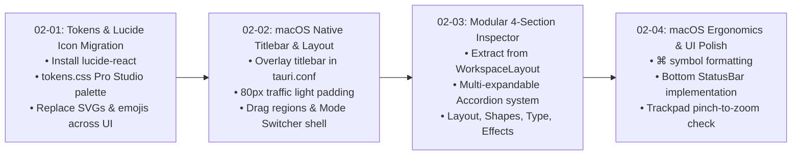

# Phase 2: Lucide Iconography & macOS Pro Studio UI — Research & Architecture

**Phase Target:** `OSAM-02-lucide-iconography-macos-pro-studio-ui`  
**Related Requirements:** `ICON-01`, `ICON-02`, `ICON-03`, `UIUX-01`, `UIUX-02`, `UIUX-03`, `UIUX-04`, `UIUX-05`, `UIUX-06`  
**Date:** 2026-09-22  
**Status:** Completed  

---

## Executive Summary

Phase 2 transitions OpenSmartAlbum from a legacy web-derived UI into a polished **macOS Pro Studio desktop application**. The existing codebase suffers from three major visual and architectural constraints:
1. **Ad-Hoc Iconography & Emojis**: Over 180 hardcoded inline `<svg>` elements and dozens of OS-inconsistent emojis (`💾`, `📂`, `🖼️`, `⚙️`, `🔒`, `✂️`, `🔍`, `📐`, `✏️`, `✕`) are scattered across 22 components without unified sizing, stroke weight, or color inheritance.
2. **Color Cast & Windows Aesthetic**: The current CSS tokens use a vibrant electric cyan (`#38bdf8`) accent against generic dark gray (`#1a1a1e`). When photographers proof and color-grade album spreads, saturated chrome accents introduce visual color contamination.
3. **Monolithic Inspector & Window Frame**: `src/features/workspace/WorkspaceLayout.tsx` is an unwieldy 3,535-line monolith containing over 2,300 lines of inline inspector controls, mixed with a non-native titlebar that lacks macOS traffic-light insets (`titleBarStyle: "Overlay"`), drag management, and mode-switching affordance.

This research establishes the concrete architectural blueprints, migration catalog, design token matrix, and atomic plan breakdown to execute Phase 2 safely with zero regression to existing album domain math and state management.

---

## 1. `lucide-react` Dependency Analysis

### Status
- Inspection of [`package.json`](file:///Users/chiio/VSCode/albumaker/package.json) confirms **`lucide-react` is NOT currently installed**.
- Current runtime dependencies: `@tauri-apps/api: ^2.0.0`, `react: ^18.3.0`, `react-dom: ^18.3.0`, `konva: ^9.3.0`, `react-konva: ^18.2.0`, `zustand: ^5.0.0`.
- React version is `18.3.0`, fully compatible with `lucide-react`.

### Exact Installation Command
```bash
npm install lucide-react
```

### Import & Tree-Shaking Standard
To avoid bundling unneeded icons and maintain sub-millisecond Vite HMR:
```tsx
import { 
  Undo2, Redo2, Save, FolderOpen, Plus, Image as ImageIcon, 
  FolderPlus, Download, Package, Settings, Sliders, Wand2, 
  Lock, Unlock, ChevronDown, ChevronRight, ZoomIn, ZoomOut, 
  Maximize2, Type, Sparkles, Trash2, RotateCw, RotateCcw
} from 'lucide-react';
```

### Icon Sizing & Stroke Design System
In accordance with `ICON-02` and `02-CONTEXT.md`, icons must adhere to strict stroke and size tokens:
- **Default Stroke**: `1.5px` (macOS Pro Studio Apple HIG aesthetic; `1.75px` for micro icons if legibility requires).
- **Size Tokens**:
  - `micro`: `14px` (sub-labels, badge icons, metadata pills)
  - `compact`: `16px` (table rows, inspector property inputs, inline buttons)
  - `standard`: `18px` / `20px` (toolbar buttons, panel headers, tab triggers)
  - `featured`: `24px` (modal headers, empty state graphics, welcome screen cards)
- **Color Inheritance**: All icons set to `color: currentColor` or semantic CSS variables (`var(--color-text-secondary)`, `var(--color-text-primary)`).

---

## 2. Catalog of Components Requiring Icon Replacement

The codebase currently contains 22 files with raw `<svg>` elements and unicode emojis. Below is the mapping catalog for migration to `lucide-react`:

| File Path | Location / Role | Current Legacy Element | Target Lucide Icon | Props (`size`, `strokeWidth`) |
|-----------|-----------------|------------------------|--------------------|--------------------------------|
| [`src/features/workspace/WorkspaceLayout.tsx`](file:///Users/chiio/VSCode/albumaker/src/features/workspace/WorkspaceLayout.tsx#L570-L1020) | Top Bar: History | Inline `<svg>` (Undo/Redo) | `Undo2`, `Redo2` | `size={16}`, `strokeWidth={1.5}` |
| [`src/features/workspace/WorkspaceLayout.tsx`](file:///Users/chiio/VSCode/albumaker/src/features/workspace/WorkspaceLayout.tsx#L857-L875) | Top Bar: Persistence | Inline `<svg>` (Save / Package) | `Save`, `Package` | `size={16}`, `strokeWidth={1.5}` |
| [`src/features/workspace/WorkspaceLayout.tsx`](file:///Users/chiio/VSCode/albumaker/src/features/workspace/WorkspaceLayout.tsx#L895-L930) | Top Bar: Tools & Zoom | Inline `<svg>` & strings (`-`, `+`, `Fit`, `Add Text`) | `Type`, `Minus`, `Plus`, `Maximize2` | `size={15}`, `strokeWidth={1.5}` |
| [`src/features/workspace/WorkspaceLayout.tsx`](file:///Users/chiio/VSCode/albumaker/src/features/workspace/WorkspaceLayout.tsx#L949-L970) | Top Bar: Actions | Inline `<svg>` (Export, Properties) | `Download`, `PanelRightClose` / `PanelRight` | `size={16}`, `strokeWidth={1.5}` |
| [`src/features/workspace/WorkspaceLayout.tsx`](file:///Users/chiio/VSCode/albumaker/src/features/workspace/WorkspaceLayout.tsx#L580-L755) | Top Bar: Menus | Emojis (`📂`, `🖼️`, `📁`, `💾`, `📑`, `📤`, `📦`, `⌨️`, `⚙️`, `ℹ️`) | `FolderOpen`, `ImageIcon`, `FolderPlus`, `Save`, `FileText`, `Share2`, `Package`, `Keyboard`, `Settings`, `Info` | `size={15}`, `strokeWidth={1.5}` |
| [`src/features/workspace/WorkspaceLayout.tsx`](file:///Users/chiio/VSCode/albumaker/src/features/workspace/WorkspaceLayout.tsx#L1060-L1185) | Inspector: Tabs & Collapse | Inline `<svg>` (Sliders, Wand, Lock, Chevron) | `SlidersHorizontal`, `Wand2`, `Lock`, `ChevronRight` | `size={16}`, `strokeWidth={1.5}` |
| [`src/features/workspace/WorkspaceLayout.tsx`](file:///Users/chiio/VSCode/albumaker/src/features/workspace/WorkspaceLayout.tsx#L1300-L1530) | Inspector: Align & Distribute | Inline `<svg>` & emojis (`⇿`, `⇳`, `↺`, `↻`) | `AlignLeft`, `AlignCenter`, `AlignRight`, `AlignTop`, `AlignMiddle`, `AlignBottom`, `DistributeHorizontal`, `DistributeVertical`, `RotateCcw`, `RotateCw` | `size={15}`, `strokeWidth={1.5}` |
| [`src/features/editor/FrameToolbar.tsx`](file:///Users/chiio/VSCode/albumaker/src/features/editor/FrameToolbar.tsx#L70-L300) | Floating Canvas HUD | 14 inline `<svg>` elements (Rotate, Lock, Ratio, Fit, Layers, Delete) | `RotateCcw`, `RotateCw`, `Lock`, `Unlock`, `Crop`, `Layers`, `BringToFront`, `SendToBack`, `Trash2` | `size={15}`, `strokeWidth={1.5}` |
| [`src/features/editor/TypographyPanel.tsx`](file:///Users/chiio/VSCode/albumaker/src/features/editor/TypographyPanel.tsx#L200-L260) | Typography: Actions & Tools | 4 inline `<svg>` (Fit height, Fit frame, Inline edit) | `FoldVertical`, `Maximize2`, `Pencil` | `size={15}`, `strokeWidth={1.5}` |
| [`src/features/photos/FilmstripTray.tsx`](file:///Users/chiio/VSCode/albumaker/src/features/photos/FilmstripTray.tsx#L350-L550) | Tray: Header & Actions | Emojis & inline `<svg>` (Import, Search, Filter, Star, Delete) | `ImagePlus`, `FolderPlus`, `Search`, `SlidersHorizontal`, `Star`, `Trash2`, `ChevronUp`, `ChevronDown` | `size={16}`, `strokeWidth={1.5}` |
| [`src/features/photos/FolderTabs.tsx`](file:///Users/chiio/VSCode/albumaker/src/features/photos/FolderTabs.tsx#L80-L150) | Folder Bar | Inline `<svg>` (Folder, New folder, Rename, Close) | `Folder`, `FolderPlus`, `Edit2`, `X` | `size={14}`, `strokeWidth={1.5}` |
| [`src/features/album/PageNavigator.tsx`](file:///Users/chiio/VSCode/albumaker/src/features/album/PageNavigator.tsx#L200-L400) | Spread Strip | Inline `<svg>` (Add spread, Duplicate, Delete, Navigation arrows) | `Plus`, `Copy`, `Trash2`, `ChevronLeft`, `ChevronRight` | `size={16}`, `strokeWidth={1.5}` |
| [`src/features/templates/TemplatesPanel.tsx`](file:///Users/chiio/VSCode/albumaker/src/features/templates/TemplatesPanel.tsx#L120-L250) | Smart Layout HUD | Inline `<svg>` (Grid layouts, Shuffle, Star, Filter) | `LayoutGrid`, `Shuffle`, `Star`, `Check` | `size={16}`, `strokeWidth={1.5}` |
| [`src/features/editor/LockedPhotosPanel.tsx`](file:///Users/chiio/VSCode/albumaker/src/features/editor/LockedPhotosPanel.tsx#L60-L180) | Lock Management | Inline `<svg>` (Lock, Unlock, Unlock All) | `Lock`, `Unlock`, `Key` | `size={15}`, `strokeWidth={1.5}` |
| [`src/features/editor/LayoutCycleHUD.tsx`](file:///Users/chiio/VSCode/albumaker/src/features/editor/LayoutCycleHUD.tsx#L180-L240) | Floating Shuffle HUD | Inline `<svg>` (Arrows, Refresh) | `Sparkles`, `ArrowLeft`, `ArrowRight` | `size={14}`, `strokeWidth={1.5}` |
| [`src/components/ui/ColorPicker.tsx`](file:///Users/chiio/VSCode/albumaker/src/components/ui/ColorPicker.tsx#L340-L430) | UI: Color Palette | Inline `<svg>` (Eyedropper, Check, Copy) | `Pipette`, `Check`, `Copy`, `RotateCcw` | `size={14}`, `strokeWidth={1.5}` |
| [`src/components/ui/Dialog.tsx`](file:///Users/chiio/VSCode/albumaker/src/components/ui/Dialog.tsx#L75) | UI: Modal Header | Inline `<svg>` (Close X) | `X` | `size={16}`, `strokeWidth={1.5}` |
| [`src/components/ui/ConfirmDialog.tsx`](file:///Users/chiio/VSCode/albumaker/src/components/ui/ConfirmDialog.tsx#L68-L95) | UI: Alert Dialog | 3 inline `<svg>` (AlertTriangle, Info, Trash) | `AlertTriangle`, `Info`, `AlertCircle` | `size={22}`, `strokeWidth={1.5}` |
| [`src/features/project/NewProjectDialog.tsx`](file:///Users/chiio/VSCode/albumaker/src/features/project/NewProjectDialog.tsx#L380-L940) | New Project Modal | 14 inline `<svg>` (Aspect ratios, Book, Dimensions) | `BookOpen`, `Square`, `RectangleHorizontal`, `Check`, `X` | `size={16}`, `strokeWidth={1.5}` |
| [`src/features/workspace/WelcomeScreen.tsx`](file:///Users/chiio/VSCode/albumaker/src/features/workspace/WelcomeScreen.tsx#L120-L185) | Welcome Screen | 4 inline `<svg>` (New, Open, History, Book) | `PlusCircle`, `FolderOpen`, `Clock`, `BookOpen` | `size={20}`, `strokeWidth={1.5}` |
| [`src/features/about/AboutDialog.tsx`](file:///Users/chiio/VSCode/albumaker/src/features/about/AboutDialog.tsx#L60-L90) | About Modal | 2 inline `<svg>` (ExternalLink, Github) | `ExternalLink`, `Github` | `size={14}`, `strokeWidth={1.5}` |
| [`src/features/settings/SettingsDialog.tsx`](file:///Users/chiio/VSCode/albumaker/src/features/settings/SettingsDialog.tsx#L250-L400) | Settings Modal | Inline `<svg>` (Close, Tab indicators) | `Sliders`, `Keyboard`, `Monitor`, `X` | `size={16}`, `strokeWidth={1.5}` |
| [`src/features/export/ExportProgressModal.tsx`](file:///Users/chiio/VSCode/albumaker/src/features/export/ExportProgressModal.tsx#L29) | Export Progress | Large inline `<svg>` photo graphic | `ImageDown`, `Loader2` | `size={48}`, `strokeWidth={1.25}` |
| [`src/features/export/ExportAlbumDialog.tsx`](file:///Users/chiio/VSCode/albumaker/src/features/export/ExportAlbumDialog.tsx#L200-L350) | Export Dialog | Inline `<svg>` (Folder browse, Format options) | `Folder`, `FileDown`, `Check` | `size={16}`, `strokeWidth={1.5}` |

---

## 3. Design Tokens: Current CSS vs macOS Pro Studio Palette & SF Pro Typography

### Color Contrast & Studio Color Grading Analysis
Photographers require an interface with **zero chromatic bias**. The current `--color-accent: #38bdf8` (sky blue) and bright blue focus rings (`#3b82f6`) emit blue light around the canvas periphery, skewing white balance perception during photo layout.

#### Token Comparison Matrix:
| Design Token | Current Value in `tokens.css` | Target Pro Studio Value | Rationale |
|--------------|-------------------------------|-------------------------|-----------|
| `--color-bg-primary` | `#1a1a1e` | `#18181B` | Deep neutral charcoal (Zinc-900), matching Lightroom & Figma desktop |
| `--color-bg-secondary` | `#222226` | `#1E1E22` | Distinct surface elevation for toolbars and panels |
| `--color-bg-tertiary` | `#2a2a2e` | `#27272A` | Elevated input fields, cards, and dropdown menus |
| `--color-surface` | `#303036` | `#2D2D32` | Interactive component background |
| `--color-surface-hover` | `#38383e` | `#38383F` | High-visibility hover feedback |
| `--color-border` | `#3a3a40` | `#2E2E33` | Hairline border definition (1px subtle contrast) |
| `--color-border-subtle` | `#2e2e34` | `#242428` | Inner dividers and grid separations |
| `--color-text-primary` | `#e8e8ec` | `#F4F4F5` | SF Pro high-legibility foreground |
| `--color-text-secondary`| `#a0a0a8` | `#A1A1AA` | Balanced secondary labels |
| `--color-text-muted` | `#6a6a72` | `#71717A` | De-emphasized hotkeys and hints |
| `--color-accent` | `#38bdf8` (electric cyan) | `#E4E4E7` (Graphite / Platinum) | **Neutral Monochrome**: Prevents visual color cast during album design |
| `--color-accent-subtle` | `rgba(56, 189, 248, 0.15)` | `rgba(255, 255, 255, 0.08)` | Subtle neutral tint for active tabs/buttons |
| `--color-accent-border` | N/A | `rgba(255, 255, 255, 0.18)` | Crisp boundary for active selections |
| `--focus-ring` | `0 0 0 1px rgba(255, 255, 255, 0.08)` | `0 0 0 2px rgba(255, 255, 255, 0.2)` | Clean, non-chromatic focus outline |

### Typography Stack Adaptation
- **Current Font**: `'Inter', -apple-system, BlinkMacSystemFont, 'Segoe UI', system-ui, sans-serif;`
- **Target macOS Font Stack**:
  ```css
  --font-family: -apple-system, BlinkMacSystemFont, "SF Pro Text", "SF Pro Display", "SF Pro", "Helvetica Neue", sans-serif;
  --font-family-mono: ui-monospace, "SF Mono", Menlo, Monaco, Consolas, monospace;
  ```
- **Rendering & Smoothing**:
  ```css
  -webkit-font-smoothing: antialiased;
  -moz-osx-font-smoothing: grayscale;
  text-rendering: optimizeLegibility;
  ```
- **Type Scale (Apple HIG Studio standards)**:
  - Micro / Badges: `10px` / `11px`, letter spacing `0.2px`, weight `500` / `600`
  - Compact / Inputs: `12px`, weight `400` / `500`
  - Body / Standard: `13px`, weight `400`
  - Headings / Section titles: `13px` / `14px`, weight `600`
  - Display / Modal titles: `16px` / `18px`, weight `600` / `700`

---

## 4. macOS Native Titlebar & Window Drag Region Architecture

### Tauri 2 Configuration Requirements
To achieve a borderless, integrated titlebar where macOS native traffic lights (close, minimize, zoom) render seamlessly inside the web application header, [`src-tauri/tauri.conf.json`](file:///Users/chiio/VSCode/albumaker/src-tauri/tauri.conf.json) must be updated:

```json
{
  "app": {
    "windows": [
      {
        "label": "main",
        "title": "OpenSmartAlbum",
        "titleBarStyle": "Overlay",
        "hiddenTitle": true,
        "width": 1280,
        "height": 800,
        "minWidth": 1024,
        "minHeight": 768,
        "resizable": true,
        "fullscreen": false,
        "center": true,
        "backgroundColor": "#18181b",
        "dragDropEnabled": false
      }
    ]
  }
}
```

### Traffic Light Clearance & Drag Region Physics
1. **Left Inset**: On macOS, native traffic lights occupy ~70px horizontally in the top-left corner. The titlebar container must have:
   ```css
   padding-left: var(--mac-traffic-light-inset, 80px);
   ```
2. **Height**: Standard macOS Pro window titlebar height is `44px` (previously `42px`).
3. **Drag Interactivity**:
   - The top header container receives `data-tauri-drag-region`.
   - **Critical WebKit Caveat**: In Tauri macOS (WKWebView), elements with `data-tauri-drag-region` intercept mouse clicks if children do not properly opt out. Every interactive child (buttons, dropdowns, inputs, zoom controls) MUST be marked with:
     ```css
     -webkit-app-region: no-drag;
     ```
     or wrapped in non-drag subcontainers.
4. **Three-Column Titlebar Layout**:
   - **Column 1 (Left)**: Traffic light clearance spacer (`80px`), followed by `File` and `Help` dropdown menus with clean Lucide chevrons.
   - **Column 2 (Center)**: Centered project title with inline rename support and uncommitted change dot indicator (`•` in amber when `saveStatus === 'unsaved'`). The entire center background is a native drag region.
   - **Column 3 (Right)**:
     - **Mode Switcher** (Dual segmented control: `Print Album` ↔ `Social Carousel` preparing for Phase 3).
     - **Actions**: Export button (`Download`), Properties toggle (`PanelRight`), Settings (`Settings`).

---

## 5. Modular Inspector Panel Architecture (4 Multi-Expandable Accordions)

### Current Architecture Flaw
Currently, the right sidebar in [`WorkspaceLayout.tsx`](file:///Users/chiio/VSCode/albumaker/src/features/workspace/WorkspaceLayout.tsx#L1045-L3365) is a continuous monolithic block over 2,300 lines long. Properties, multi-selection, alignment grids, crop controls, text styling, and spread canvas dimensions are tangled in nested ternary expressions.

### New Modular Design: `src/features/inspector/`
We refactor this into an isolated, multi-expandable accordion system where photographers can keep multiple sections expanded at will (e.g. Spacing + Borders + Shadows simultaneously).

```
src/features/inspector/
├── InspectorContainer.tsx           # Panel wrapper, tab switching, and scroll management
├── AccordionSection.tsx             # Reusable expandable card with ChevronDown animation
├── sections/
│   ├── LayoutSpacingSection.tsx     # Section 1: Dimensions, Align, Distribute, Gap, 2D Neighbor Graph
│   ├── ShapesBordersSection.tsx     # Section 2: Corner radii, Stroke width/color/style, Shape presets
│   ├── TypographySection.tsx        # Section 3: Font picker, Weights, Align, Line height, Presets
│   └── EffectsShadowsSection.tsx    # Section 4: Opacity slider, Drop shadow X/Y/Blur/Color
└── hooks/
    └── useAccordionState.ts         # Persistent set of open section IDs in localStorage/Zustand
```

### Component Breakdown & State Handling:
1. **`AccordionSection.tsx`**:
   - Props: `id: string`, `title: string`, `icon: LucideIcon`, `isOpen: boolean`, `onToggle: () => void`, `badge?: ReactNode`, `children: ReactNode`.
   - Animated chevron indicator (`transform: rotate(180deg)` with `transition: transform 180ms cubic-bezier(0.4, 0, 0.2, 1)`).
   - Content container with smooth height transitions (`grid-template-rows: 0fr` to `1fr` CSS technique for zero-JS height calculation).
2. **Section 1: Layout & Spacing**:
   - Single Frame: X, Y, Width, Height inputs, Aspect Ratio link toggle, Rotation input + 90° CCW/CW buttons.
   - Multi-Selection: Batch Align (Page Edge / Selection Bounds), Distribute Spacing (H/V), Custom Gap Input with dynamic unit bounds.
   - Canvas Spread (No selection): Page width, page height, unit selector, spine gutter width, bleed margin, safe margin guides.
3. **Section 2: Shapes & Borders**:
   - Corner Radius: 4-corner unlinked controls (TL, TR, BR, BL) + linked master slider.
   - Stroke/Border: Border toggle switch, border color swatch (`ColorPicker`), stroke width number input, stroke style (Solid, Dashed).
   - Shape Presets (Prepared for Phase 4): Shape selector grid (Rect, Rounded, Oval/Circle).
4. **Section 3: Typography**:
   - Integrates existing font enumeration logic from `TypographyPanel.tsx`.
   - Searchable system font & curated album font selector.
   - Size slider + pt input, Bold/Italic/Underline toggles, Alignment group, Line height & letter spacing.
   - Direct text content editor + styled range chips.
5. **Section 4: Effects & Shadows**:
   - Opacity slider (0% to 100%) with numerical percentage pill.
   - Drop Shadow: Toggle switch, Shadow Color swatch, Blur radius slider, Offset X & Y sliders.
   - Reset effects action button.

---

## 6. macOS Keyboard Shortcuts Adaptation (`⌘` vs `Ctrl`)

### Platform Detection & Formatting Utility
Add a unified shortcut formatting helper in `src/utils/shortcuts.ts` to replace hardcoded `"Ctrl+"` strings across all components:

```ts
import { isMac } from './platform';

export interface ShortcutKeyMap {
  ctrlOrCmd?: boolean;
  altOrOption?: boolean;
  shift?: boolean;
  key: string;
}

export function formatShortcut(shortcut: ShortcutKeyMap): string {
  const mac = isMac();
  const parts: string[] = [];

  if (shortcut.ctrlOrCmd) parts.push(mac ? '⌘' : 'Ctrl+');
  if (shortcut.altOrOption) parts.push(mac ? '⌥' : 'Alt+');
  if (shortcut.shift) parts.push(mac ? '⇧' : 'Shift+');
  parts.push(shortcut.key.toUpperCase());

  return mac ? parts.join('') : parts.join('');
}
```

### Global Shortcut Keydown Normalization
In `src/features/workspace/WorkspaceLayout.tsx` and modal listeners:
- `e.metaKey` (Command on Mac) is treated as the primary modifier.
- Keyboard shortcuts dialog in [`SettingsDialog.tsx`](file:///Users/chiio/VSCode/albumaker/src/features/settings/SettingsDialog.tsx) dynamically displays Apple symbols (`⌘`, `⌥`, `⇧`, `⌫`, `↵`) on macOS while displaying `Ctrl`, `Alt`, `Shift` on other platforms.

### Trackpad Gestures & Smooth Canvas Navigation
In `KonvaEditorCanvas.tsx`:
- macOS trackpads fire `wheel` events with `e.ctrlKey === true` during **pinch-to-zoom**.
- When `e.ctrlKey` is true, map pinch delta directly to canvas zoom centered at the cursor focal point.
- When `e.ctrlKey` is false, two-finger swipe naturally scrolls the canvas scrollport horizontally and vertically (`e.deltaX`, `e.deltaY`), providing standard Apple Pro trackpad fluidity.

---

## 7. Recommended Atomic Implementation Plan for Phase 2

To maintain zero downtime, guarantee test suite passing at every step, and avoid merge risk across large files, Phase 2 should be executed in **4 atomic, sequential plans**:



### Plan 02-01: Pro Studio Design Tokens & Complete Lucide Iconography Migration
- **Tasks**:
  1. Install `lucide-react` via `npm install lucide-react`.
  2. Update `src/styles/tokens.css` with Figma/Lightroom Deep Charcoal (`#18181B`), elevated surfaces, hairline borders (`#2E2E33`), neutral graphite accent, and SF Pro typography stack.
  3. Replace all 180+ inline SVGs and emojis in `ColorPicker`, `Dialog`, `ConfirmDialog`, `FrameToolbar`, `PageNavigator`, `FilmstripTray`, `FolderTabs`, `TemplatesPanel`, `LockedPhotosPanel`, `NewProjectDialog`, `WelcomeScreen`, `SettingsDialog`, `AboutDialog`, `ExportAlbumDialog`, and `ExportProgressModal` with standard `lucide-react` components (`strokeWidth={1.5}`).
  4. Verify test suite passes (`npm test`).

### Plan 02-02: macOS Integrated Titlebar, Window Drag Regions & Mode Switcher Shell
- **Tasks**:
  1. Configure `src-tauri/tauri.conf.json` with `"titleBarStyle": "Overlay"` and `"hiddenTitle": true`.
  2. Create `src/features/workspace/AppTitleBar.tsx` and `AppTitleBar.module.css`:
     - 80px left padding for macOS traffic lights (`pl-20`).
     - Window drag region (`data-tauri-drag-region`) across non-interactive areas.
     - Centered project title with uncommitted change indicator dot (`•`).
     - Right-aligned Mode Switcher segmented pill (`Print Album` ↔ `Instagram Carousel`) and quick action buttons (`Export`, `Settings`, `Properties`).
     - Explicit `-webkit-app-region: no-drag` on all interactive controls.
  3. Integrate `AppTitleBar` into `WorkspaceLayout.tsx`, replacing the legacy toolbar header.
  4. Verify test suite passes (`npm test`).

### Plan 02-03: Modular 4-Section Multi-Expandable Inspector Panel
- **Tasks**:
  1. Create `src/features/inspector/` folder with `AccordionSection.tsx` and `InspectorContainer.tsx`.
  2. Implement the 4 modular sections:
     - `LayoutSpacingSection.tsx` (Single frame, multi-selection align/distribute, spread geometry).
     - `ShapesBordersSection.tsx` (Corner radius sliders, border stroke styles, shape preset grid).
     - `TypographySection.tsx` (Integrates system font selector, text styles, styled ranges, presets).
     - `EffectsShadowsSection.tsx` (Opacity, drop shadow controls).
  3. Refactor `src/features/workspace/WorkspaceLayout.tsx` by replacing the 2,300 lines of inline inspector code with `<InspectorContainer />`.
  4. Verify all selection and property editing behaviors operate identically.
  5. Verify test suite passes (`npm test`).

### Plan 02-04: macOS Shortcuts Adaptation, Status Bar & Trackpad Polish
- **Tasks**:
  1. Create `src/utils/shortcuts.ts` for dynamic macOS modifier formatting (`⌘`, `⌥`, `⇧`).
  2. Update all tooltip labels, menu items, and HUD shortcut descriptions from `Ctrl` to `⌘` on macOS.
  3. Update `SettingsDialog.tsx` keyboard shortcuts table with Apple glyphs.
  4. Wire up the bottom `StatusBar.tsx` component in `WorkspaceLayout.tsx`:
     - Active spread dimensions & unit readout (`16.0 × 8.0 in @ 300 DPI`).
     - Zoom slider with % badge and `Fit` button.
     - Snapping indicator toggle (`Snap: On/Off`).
  5. Verify trackpad pinch-to-zoom and two-finger pan responsiveness in `KonvaEditorCanvas.tsx`.
  6. Run complete test suite (`npm test`) and type check.

---

## 8. Architectural Risk Assessment & Mitigations

| Risk | Impact | Mitigation Strategy |
|------|--------|---------------------|
| **WebKit Click Interception in Drag Region** | Buttons in titlebar fail to trigger clicks when `data-tauri-drag-region` is on parent | Enforce CSS `app-region: no-drag` / `-webkit-app-region: no-drag` on all interactive child elements (`button`, `input`, `select`). Split titlebar into distinct draggable backdrop divs and non-draggable control containers. |
| **Traffic Light Collision on Non-Mac Platforms** | 80px left padding creates unnecessary empty whitespace if compiled for Windows/Linux | Use platform detection utility (`isMac()`) to apply `padding-left: 80px` on macOS and `padding-left: 12px` on Windows/Linux. |
| **Inspector State Desynchronization during Refactor** | Extracting 2,300 lines from `WorkspaceLayout.tsx` could disconnect active spread / selection Zustand bindings | Use existing `useEditorStore` and `useAlbumStore` hooks directly inside the modular sections. Keep domain math (`domain/editor.ts`, `domain/text.ts`) completely untouched. |
| **Monochrome Accent Visibility** | Graphite accent might have low contrast on dark backgrounds | Use high-contrast border definition (`rgba(255, 255, 255, 0.2)`) and elevated surface lightness (`#2D2D32`) to ensure selection states remain immediately obvious to photographers. |
| **Tree-Shaking Blowup** | Importing from `lucide-react` might bloat bundle size if wildcards are used | Enforce named member imports only (`import { IconName } from 'lucide-react'`). |

---

## 9. Verification Strategy

1. **Automated Unit & Regression Tests**:
   - Run `npm test` (`tsc --noEmit && tsx tests/*.test.ts`) before and after each plan to guarantee zero domain regressions.
2. **Visual & UI Verification**:
   - Confirm macOS traffic lights do not overlap `File` / `Help` menus.
   - Confirm titlebar dragging moves the window smoothly without blocking button clicks.
   - Confirm all 4 inspector accordion sections expand and collapse smoothly with rotating chevrons.
   - Confirm keyboard shortcuts display `⌘` instead of `Ctrl` on macOS.
3. **Color Neutrality**:
   - Verify that UI chrome and panel borders do not emit colored light onto canvas image previews.
