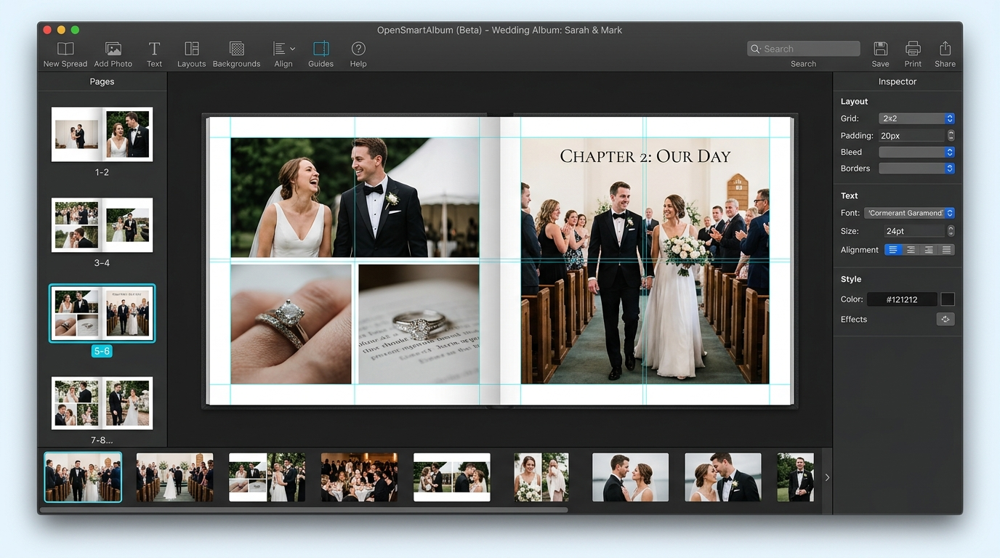

# OpenSmartAlbum — macOS

<div align="center">


# OpenSmartAlbum for macOS
### Professional, Offline-First Photo Album & Instagram Panorama Suite

[](https://github.com/ryandxter/OpenSmartAlbum-MacOS/releases)
[](https://github.com/ryandxter/OpenSmartAlbum-MacOS/releases)
[](https://tauri.app/)
[](https://www.rust-lang.org/)
[](https://reactjs.org/)
[](https://github.com/ryandxter/OpenSmartAlbum-MacOS)

<p align="center">
  <b>Tailor-made for wedding photographers, print labs, and visual creators.</b><br/>
  Aspect-ratio preserving bin-packing layouts, sub-millimeter magnetic snapping, native Apple Silicon acceleration, and seamless Instagram carousel slicing — 100% offline.
</p>

<p align="center">
  <a href="https://github.com/ryandxter/OpenSmartAlbum-MacOS/releases"></a>
</p>

<!-- Interactive Jump Navigation -->
<p align="center">
  <a href="#-overview">Overview</a> •
  <a href="#-interactive-feature-tour">Features</a> •
  <a href="#-new-in-v124-marquee-selection--batch-drag">v1.2.4 Update</a> •
  <a href="#-album-presets--carousel-formats">Presets</a> •
  <a href="#-macos-keyboard-shortcuts">Shortcuts</a> •
  <a href="#-faq--troubleshooting">FAQ</a> •
  <a href="#-building-from-source">Build Guide</a>
</p>

<br/>

<a href="#-interactive-feature-tour">
  
</a>

<p align="center"><i>Interactive Dark Mode workspace on macOS: 2-page wedding spread, cyan magnetic HUD guides, spread thumbnails, inspector controls, and RAW filmstrip tray.</i></p>

</div>

---

<a name="-overview"></a>
## 🎯 Overview

Most photo album software forces studios into costly monthly subscriptions, lags when handling 50MP RAW libraries, or requires running emulated Windows software on macOS.

**OpenSmartAlbum macOS** is a high-performance native desktop application engineered for speed, absolute client data privacy, and modern Apple hardware integration:

* 🛡️ **100% Offline & Private** — Client high-res photos and RAW files never leave your local SSD. No cloud telemetry, no account required.
* ⚡ **Pure Rust Image Pipeline** — Multi-core image decoding, sharpening, and export via `rayon` & `image-rs`. Zero external C/C++ runtime bloat.
* 🖥️ **Native macOS Chrome** — Overlay titlebar, native traffic light controls, smooth trackpad pinch gestures, and standard `⌘` shortcuts.
* 📱 **Seamless Instagram Carousel Slicer** — Multi-slide seamless panorama creator (1:1, 4:5, 9:16) with built-in swipe simulator.
* 📦 **Zero-Setup DMG** — Standard drag-and-drop macOS `.dmg` installer built natively for Apple Silicon (M1/M2/M3/M4) and Intel Macs.

> [!TIP]
> **Performance on Apple Silicon:** Memory usage stays under 180 MB during typical 30-spread album workflows thanks to Tauri 2's lightweight webview host and Rust's zero-copy image slicing.

---

<a name="-interactive-feature-tour"></a>
## ✨ Interactive Feature Tour

Click on any feature below to expand its technical highlights and interactive details:

<details open>
<summary><h3>📐 1. Smart Mathematical Layout Engine</h3></summary>

Drop 1 to 12 photos onto any spread. Rather than rigid, unchangeable templates, our **2D bin-packing layout algorithm** calculates dozens of mathematically balanced compositions dynamically:
- **Aspect-Ratio Preservation:** Preserves each photo's native sensor ratio (3:2, 4:3, 16:9, 1:1) to prevent unwanted face or detail cropping.
- **Crop Penalty Scoring:** Variations rank themselves automatically by minimal crop loss.
- **One-Click Shuffle:** Cycle through balanced arrangements with instant keyboard triggers.
</details>

<details>
<summary><h3>🧲 2. Magnetic Snapping HUD & Live Spine Alignment</h3></summary>

Pixel-perfect alignment with zero guesswork:
- **Sub-Millimeter Snap:** Magnetically snaps frames to the center book spine, safe printable margins, and bleed trim boundaries.
- **Live HUD Distance Guides:** Cyan alignment guides display live distance measurements (in millimeters or pixels) as you drag.
- **Inter-Frame Equal Spacing:** Automatically detects equal spacing between 3 or more neighboring frames.
</details>

<details>
<summary><h3>🖱️ 3. Rubberband Marquee Selection & Drag Handle (New in v1.2.4)</h3></summary>

Managing hundreds of imported wedding shots is now ultra-fast:
- **Canvas & Filmstrip Marquee:** Click and drag across thumbnails to draw a translucent cyan selection box (`AABB` collision detection).
- **Shift-to-Append:** Hold `Shift` to add or remove individual photos from your batch selection.
- **Draggable Batch Handle:** Grab the floating `[::: Drag All (X)]` button on the batch action bar and drop an entire group onto any slide in one fluid motion.
- **WebKit Drag Resilience:** DOM-attached ghost badges eliminate macOS WebKit drag cancellation glitches.
</details>

<details>
<summary><h3>📱 4. Seamless Instagram Carousel Mode & Phone Simulator</h3></summary>

Turn panoramic landscape photos and multi-image storytelling into seamless swipeable Instagram posts:
- **Supported Formats:** 1:1 Square, 4:5 Portrait (optimal Instagram feed ratio), and 9:16 Story/Reel.
- **Multi-Slide Spans:** Split wide photos across 2 to 10 consecutive slides without visible seams or alignment jumps.
- **Built-in Phone Simulator:** Interactive touch/swipe preview directly inside the app to check how your post feels before exporting.
- **Automated Slicing & Numbering:** Exports numbered files (`slide_01.jpg`, `slide_02.jpg`, ...) ready for AirDrop to your iPhone.
</details>

<details>
<summary><h3>🔄 5. Multi-Frame Spatial Resize (Zero Gap Distortion)</h3></summary>

Most software scales frame positions indiscriminately, blowing out margin spacing when resizing multiple frames together:
- **2D Spatial Neighbor Graph:** Analyzes adjacent edges and keeps all gutter gaps uniform during group scaling.
- **Dual Reset Controls:**
  - `↺ Reset Ratio`: Restores frame aspect ratio to match photo sensor dimensions.
  - `↺ Reset Crop`: Re-centers the photo and resets scale to 1.0× while keeping the frame untouched.
</details>

<details>
<summary><h3>🖨️ 6. Studio Print & Digital Export Suite</h3></summary>

Export formats ready for professional lab printing or digital client delivery:
- **Layered Photoshop (.PSD):** Discrete photo layers with vector channel clipping masks for all 8 frame shapes.
- **Print-Ready PDF/X:** Configurable trim marks, bleed box padding (typically 3mm–5mm), and slug metadata.
- **Ultra High-Res Raster:** JPEG (sRGB), Lossless PNG, and 1200 DPI TIFF for museum-grade fine art prints.
</details>

---

<a name="-new-in-v124-marquee-selection--batch-drag"></a>
## 🚀 What's New in v1.2.4

> [!NOTE]
> OpenSmartAlbum v1.2.4 brings complete end-to-end stability to the macOS WebKit layer and adds marquee selection.

| Feature / Fix | Description | Status |
| :--- | :--- | :---: |
| **Rubberband Marquee** | Real-time 2D AABB bounding-box selection in filmstrip library | ✅ Complete |
| **WebKit Drag Fix** | Replaced in-memory canvas with DOM ghost badge to prevent drag drops dropping out | ✅ Complete |
| **Draggable Batch Handle** | `[::: Drag All]` bar directly drops multi-photo batches onto spreads | ✅ Complete |
| **Format Safety** | Eliminated `toUpperCase` crash when importing photos missing MIME headers | ✅ Complete |
| **Automated E2E Suite** | 42/42 Playwright headless tests verified across all 11 presets & shapes | ✅ Verified |

---

<a name="-album-presets--carousel-formats"></a>
## 📐 Presets & Dimensions Matrix

<details>
<summary><b>Click to view supported print album sizes and digital carousel formats</b></summary>

<br/>

### 📖 Physical Print Spreads
| Preset | Dimensions (Open Spread) | Best For |
| :--- | :--- | :--- |
| **Square 20×20** | 400 × 200 mm | Contemporary portrait & family albums |
| **Square 30×30** | 600 × 300 mm | Premium wedding & fine-art albums |
| **Landscape 30×20** | 600 × 200 mm | Panoramic destination weddings |
| **Portrait 20×30** | 400 × 300 mm | Editorial & fashion photobooks |
| **A4 Landscape** | 594 × 210 mm | Standard commercial photo catalogs |
| **A4 Portrait** | 420 × 297 mm | Vertical lookbooks |
| **Standard 8×8" / 10×8" / 12×12"** | Imperial inch equivalents | US Print lab standards (Millers, WHCC, BayPhoto) |

### 📱 Digital Social Formats
| Format | Aspect Ratio | Slices | Output Resolution |
| :--- | :---: | :---: | :--- |
| **Square Carousel** | 1:1 | 2 – 10 Slides | 1080 × 1080 px per slide |
| **Portrait Carousel** | 4:5 | 2 – 10 Slides | 1080 × 1350 px per slide |
| **Story / Reel Spread** | 9:16 | 2 – 10 Slides | 1080 × 1920 px per slide |

</details>

---

<a name="-macos-keyboard-shortcuts"></a>
## ⌨️ macOS Keyboard Shortcuts

<details open>
<summary><b>Click to expand / collapse shortcuts cheatsheet</b></summary>

<br/>

### Canvas Navigation
| Shortcut | Action |
| :--- | :--- |
| <kbd>Space</kbd> + Drag | Pan canvas freely |
| <kbd>⌘</kbd> + Scroll | Zoom in / out smoothly |
| <kbd>⌘</kbd> + <kbd>0</kbd> | Fit active spread to window |
| <kbd>←</kbd> / <kbd>→</kbd> | Jump to previous / next spread |
| `Pinch Gesture` | Fluid Apple Trackpad continuous zoom |

### Frame & Layout Manipulation
| Shortcut | Action |
| :--- | :--- |
| `Click` / <kbd>⇧</kbd> + `Click` | Select single frame / Add to selection |
| <kbd>⌘</kbd> + <kbd>A</kbd> | Select all frames on active spread |
| <kbd>⇧</kbd> + Drag | Constrain drag along horizontal/vertical axis |
| `Arrow Keys` | Nudge selected frame by 1 mm |
| <kbd>⇧</kbd> + `Arrow Keys` | Nudge selected frame by 10 mm |
| <kbd>⌘</kbd> + <kbd>C</kbd> / <kbd>⌘</kbd> + <kbd>V</kbd> | Copy / Paste frame |
| <kbd>⌘</kbd> + <kbd>⇧</kbd> + <kbd>V</kbd> | Paste in exact position (*Paste in Place*) |
| <kbd>⌘</kbd> + <kbd>⌥</kbd> + <kbd>V</kbd> | Duplicate frame across all spreads |
| <kbd>⌘</kbd> + <kbd>D</kbd> | Quick duplicate |
| <kbd>⌫</kbd> (Backspace) | Delete frame |
| <kbd>⌘</kbd> + <kbd>L</kbd> / <kbd>⌥</kbd> + <kbd>L</kbd> | Lock / Unlock frame geometry |
| <kbd>⌘</kbd> + <kbd>G</kbd> / <kbd>⌘</kbd> + <kbd>⇧</kbd> + <kbd>G</kbd> | Group / Ungroup selected frames |
| <kbd>R</kbd> / <kbd>⇧</kbd> + <kbd>R</kbd> | Rotate 90° Clockwise / Counter-Clockwise |
| <kbd>S</kbd> | Instantly swap photos between two selected frames |
| <kbd>T</kbd> | Add new typography text frame |

### In-Frame Crop Mode *(Double-click any photo frame)*
| Action | Description |
| :--- | :--- |
| `Drag inside frame` | Reposition/pan photo within the viewport |
| `Mousewheel / Scroll` | Adjust photo zoom level |
| `↺ Reset Ratio` | Restore frame boundary to native photo aspect ratio |
| `↺ Reset Crop` | Re-center image and reset scale to 1.0× |
| <kbd>Enter</kbd> / <kbd>Esc</kbd> | Commit changes and exit crop mode |

</details>

---

<a name="-faq--troubleshooting"></a>
## ❓ FAQ & Troubleshooting

<details>
<summary><b>1. macOS reports "OpenSmartAlbum is damaged and can't be opened"?</b></summary>
<br/>
Because community builds are distributed outside the Mac App Store without an Apple Developer ID notarization certificate, macOS Gatekeeper may quarantine the binary. To resolve this, run the following in Terminal:

```bash
xattr -cr /Applications/OpenSmartAlbum.app
```
Then right-click the app and choose **Open**.
</details>

<details>
<summary><b>2. What camera RAW formats are supported?</b></summary>
<br/>
OpenSmartAlbum decodes standard high-resolution camera RAW files including `.cr2`, `.nef`, `.arw`, `.dng`, `.raf`, `.orf`, `.rw2`, alongside standard `.jpg`, `.png`, `.tiff`, and `.webp`.
</details>

<details>
<summary><b>3. Where are project files saved?</b></summary>
<br/>
Projects are saved as self-contained `.afsn` files. They contain an embedded SQLite database with layout coordinates, element hierarchies, crop bounds, and cached thumbnails for offline editing.
</details>

---

<a name="-building-from-source"></a>
## 🛠️ Building from Source

### Prerequisites
- macOS 13+ (Ventura, Sonoma, or Sequoia)
- Apple Silicon (arm64) or Intel (x86_64) Mac
- [Node.js](https://nodejs.org/) 20+ & npm
- [Rust](https://www.rust-lang.org/) 1.77+ (`rustup default stable`)
- Apple Command Line Tools (`xcode-select --install`)

### 1. Clone & Install
```bash
git clone https://github.com/ryandxter/OpenSmartAlbum-MacOS.git
cd OpenSmartAlbum-MacOS
npm install
```

### 2. Development Server
```bash
npm run tauri dev
```

### 3. Production DMG Bundle
```bash
# Build Apple Silicon installer:
npm run tauri build -- --target aarch64-apple-darwin

# Build Intel installer (if needed):
npm run tauri build -- --target x86_64-apple-darwin
```
The output `.dmg` package will be placed in `src-tauri/target/release/bundle/dmg/`.

---

## 💻 Tech Architecture

```
┌────────────────────────────────────────────────────────┐
│               macOS Native Chrome & UI                 │
│  React 18  •  TypeScript  •  Zustand  •  Konva Canvas  │
└───────────────────────────┬────────────────────────────┘
                            │ IPC (Tauri v2)
┌───────────────────────────▼────────────────────────────┐
│                  Rust Core Engine                      │
│  Rayon Multi-Threading  •  image-rs  •  SQLite (.afsn) │
└────────────────────────────────────────────────────────┘
```

- **Frontend Canvas:** Hardware-accelerated 60fps rendering via [Konva.js](https://konvajs.org/) and React 18.
- **App Shell:** [Tauri 2](https://tauri.app/) — Native macOS webview host with minimal RAM overhead.
- **Image Engine:** Pure Rust multithreaded processing with [Rayon](https://github.com/rayon-rs/rayon) and [image-rs](https://github.com/image-rs/image).
- **Storage:** Embedded SQLite engine via `rusqlite`.

---

## 🤝 Credits & Acknowledgements

* **Original Creator:** [Asrofims](https://github.com/asrofims) / Afsunmedia — Creator of the original *AFSNSmartAlbum* engine, mathematics, and album domain models.
* **macOS Port & Enhancements:** [@ryandxter](https://github.com/ryandxter) — Complete Win32 extraction, macOS platform wiring, Instagram Carousel system, Layered PSD generator, and DMG bundling.

### Open Source Foundations
- [Tauri](https://tauri.app/) (MIT / Apache-2.0) • [React](https://reactjs.org/) (MIT) • [Konva](https://konvajs.org/) (MIT) • [SQLite](https://www.sqlite.org/) (Public Domain) • [Rayon](https://github.com/rayon-rs/rayon) (MIT / Apache-2.0) • [image crate](https://github.com/image-rs/image) (MIT)

---

<div align="center">
  <sub>OpenSmartAlbum macOS is built with ❤️ for photographers and creators worldwide.</sub>
</div>
