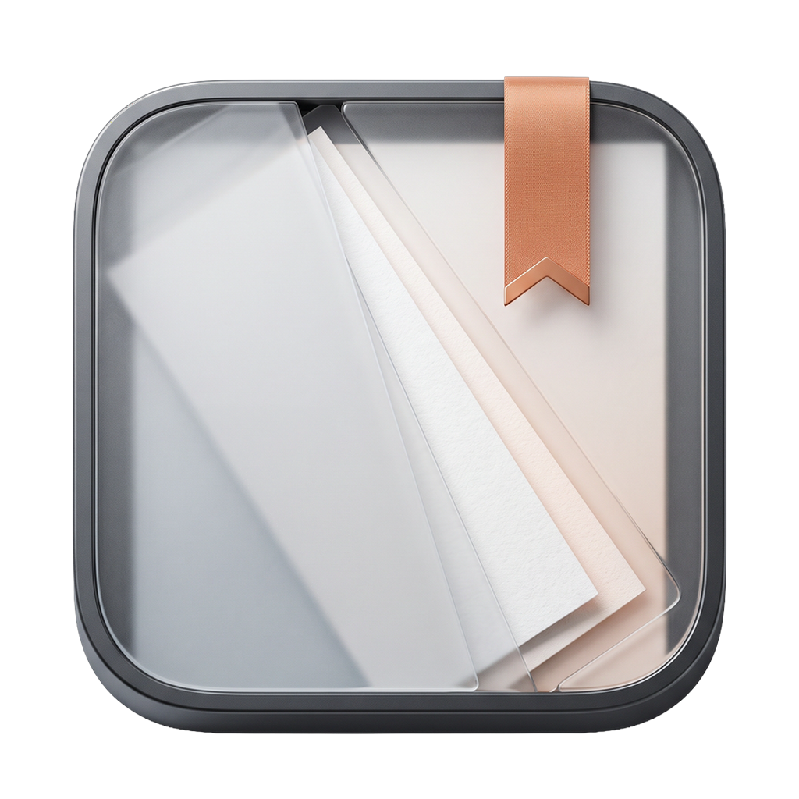
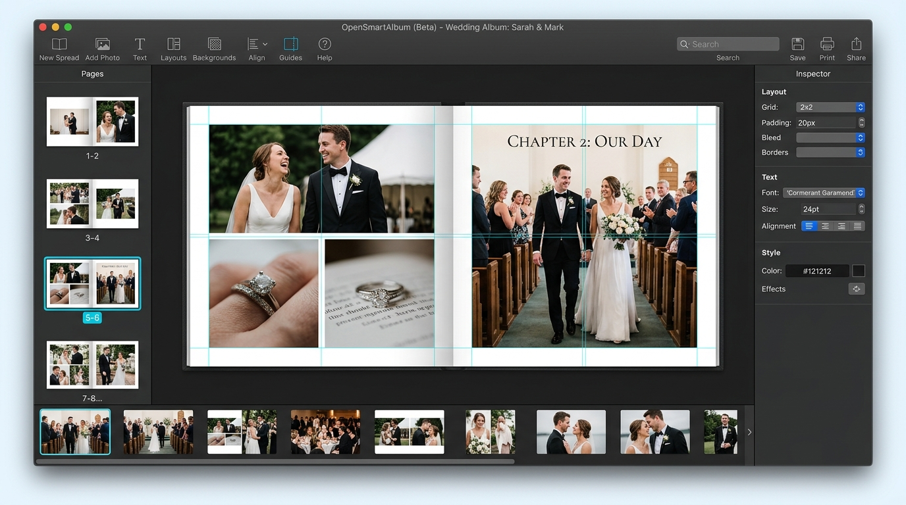

# OpenSmartAlbum — macOS

<div align="center">



# OpenSmartAlbum for macOS
### Professional, Offline-First Photo Album & Instagram Panorama Suite

[](https://github.com/ryandxter/OpenSmartAlbum-MacOS/releases)
[](https://github.com/ryandxter/OpenSmartAlbum-MacOS/releases)
[](https://tauri.app/)
[](https://www.rust-lang.org/)
[](https://github.com/ryandxter/OpenSmartAlbum-MacOS)
[](https://reactjs.org/)

<p align="center">
  <b>Pilih Bahasa / Select Language:</b><br/>
  <a href="#-english"><b>🇬🇧 English</b></a> • <a href="#-bahasa-indonesia"><b>🇮🇩 Bahasa Indonesia</b></a>
</p>

<p align="center">
  <a href="https://github.com/ryandxter/OpenSmartAlbum-MacOS/releases"></a>
</p>

> [!IMPORTANT]
> **macOS Gatekeeper Setup (First Launch):**  
> Since community releases are distributed without an Apple Developer ID paid certificate ($99/yr), macOS will quarantine the file and display *"OpenSmartAlbum is damaged and can't be opened"*.  
> **To start using the app:** Drag `OpenSmartAlbum.app` to `/Applications`, open Terminal, and run:
> ```bash
> xattr -cr /Applications/OpenSmartAlbum.app
> ```
> *(Or use `sudo xattr -rd com.apple.quarantine /Applications/OpenSmartAlbum.app` if prompted for admin permissions).*

<br/>

<a href="#-interactive-feature-tour">
  
</a>

<p align="center"><i>Authentic OpenSmartAlbum macOS workspace: 2-page fine-art wedding spread, cyan magnetic HUD guides, inspector controls, and RAW filmstrip library.</i></p>

</div>

---

<a name="-english"></a>
# 🇬🇧 English

<p align="center">
  <a href="#en-overview">Overview</a> •
  <a href="#en-install">Installation</a> •
  <a href="#en-features">Features</a> •
  <a href="#en-v140">v1.4.0 Update</a> •
  <a href="#en-presets">Presets</a> •
  <a href="#en-shortcuts">Shortcuts</a> •
  <a href="#en-faq">FAQ</a> •
  <a href="#en-build">Build</a>
</p>

<a name="en-overview"></a>
## 🎯 Overview

Most photo album software forces studios into costly monthly cloud subscriptions, lags heavily when handling 50MP RAW libraries, or requires running emulated Windows apps.

**OpenSmartAlbum macOS** is a high-performance native desktop application engineered for speed, absolute client data privacy, and modern Apple hardware integration:

* 🛡️ **100% Offline & Private** — Client high-res photos and RAW files never leave your local SSD. No cloud telemetry, no account required.
* ⚡ **Pure Rust Image Pipeline** — Multi-core image decoding, sharpening, and export via `rayon` & `image-rs`. Zero external C/C++ runtime bloat.
* 🖥️ **Native macOS Polish** — Seamless overlay titlebar, macOS traffic lights, trackpad gestures (pinch-to-zoom), and native `⌘` keybindings.
* 📱 **Seamless Instagram Carousel Slicer** — Multi-slide seamless panorama creator (1:1, 4:5, 9:16) with built-in swipe simulator.
* 📦 **Zero-Setup DMG** — Standard drag-and-drop macOS `.dmg` installer built natively for Apple Silicon (M1/M2/M3/M4) and Intel Macs.

> [!TIP]
> **Performance on Apple Silicon:** Memory usage stays under 180 MB during typical 30-spread album workflows thanks to Tauri 2's lightweight webview host and Rust's zero-copy image slicing.

---

<a name="en-install"></a>
## 📥 Installation & Gatekeeper Bypass

OpenSmartAlbum is distributed as a pre-packaged disk image (`.dmg`). Because this is a free community open-source binary distributed outside Apple's paid Mac App Store notarization program ($99/year), macOS Gatekeeper will flag the downloaded application as unverified and may show:  
> *"OpenSmartAlbum is damaged and can't be opened. You should move it to the Trash."*

### ⚡ Quick 3-Step Setup:
1. **Download:** Download the latest `OpenSmartAlbum_*.dmg` from [GitHub Releases](https://github.com/ryandxter/OpenSmartAlbum-MacOS/releases).
2. **Move to Applications:** Double-click the DMG and drag **`OpenSmartAlbum.app`** into your **`Applications`** folder.
3. **Bypass Gatekeeper:** Open **Terminal** (`⌘ Space` → type `Terminal` → press `Enter`) and run:
   ```bash
   xattr -cr /Applications/OpenSmartAlbum.app
   ```
   *(If your Mac asks for administrator credentials, run: `sudo xattr -rd com.apple.quarantine /Applications/OpenSmartAlbum.app`)*
4. **Launch:** Open `OpenSmartAlbum` from Launchpad or Spotlight. You are ready to start designing!

---

<a name="en-features"></a>
## ✨ Interactive Feature Tour

<details open>
<summary><h3>📐 1. Smart Mathematical Layout Engine</h3></summary>

Drop 1 to 12 photos onto any spread. Rather than rigid, unchangeable templates, our **2D bin-packing layout algorithm** calculates dozens of mathematically balanced compositions dynamically:
- **Aspect-Ratio Preservation:** Preserves each photo's native sensor ratio (3:2, 4:3, 16:9, 1:1) to prevent unwanted face or detail cropping.
- **Crop Penalty Scoring:** Variations rank themselves automatically by minimal crop loss.
- **One-Click Shuffle:** Cycle through balanced arrangements with instant keyboard triggers.
</details>

<details>
<summary><h3>🧲 2. Magnetic Snapping HUD & Live Spine Alignment</h3></summary>

Pixel-perfect alignment with zero guesswork:
- **Sub-Millimeter Snap:** Magnetically snaps frames to the center book spine, safe printable margins, and bleed trim boundaries.
- **Live HUD Distance Guides:** Cyan alignment guides display live distance measurements (in millimeters or pixels) as you drag.
- **Inter-Frame Equal Spacing:** Automatically detects equal spacing between 3 or more neighboring frames.
</details>

<details>
<summary><h3>🖱️ 3. Rubberband Marquee Selection & Drag Handle (New in v1.2.4)</h3></summary>

Managing hundreds of imported wedding shots is now ultra-fast:
- **Canvas & Filmstrip Marquee:** Click and drag across thumbnails to draw a translucent cyan selection box (`AABB` collision detection).
- **Shift-to-Append:** Hold `Shift` to add or remove individual photos from your batch selection.
- **Draggable Batch Handle:** Grab the floating `[::: Drag All (X)]` button on the batch action bar and drop an entire group onto any slide in one fluid motion.
- **WebKit Drag Resilience:** DOM-attached ghost badges eliminate macOS WebKit drag cancellation glitches.
</details>

<details>
<summary><h3>📱 4. Seamless Instagram Carousel Mode & Phone Simulator</h3></summary>

Turn panoramic landscape photos and multi-image storytelling into seamless swipeable Instagram posts:
- **Supported Formats:** 1:1 Square, 4:5 Portrait (optimal Instagram feed ratio), and 9:16 Story/Reel.
- **Multi-Slide Spans:** Split wide photos across 2 to 10 consecutive slides without visible seams or alignment jumps.
- **Built-in Phone Simulator:** Interactive touch/swipe preview directly inside the app to check how your post feels before exporting.
- **Automated Slicing & Numbering:** Exports numbered files (`slide_01.jpg`, `slide_02.jpg`, ...) ready for AirDrop to your iPhone.
</details>

<details>
<summary><h3>🔄 5. Multi-Frame Spatial Resize (Zero Gap Distortion)</h3></summary>

Most software scales frame positions indiscriminately, blowing out margin spacing when resizing multiple frames together:
- **2D Spatial Neighbor Graph:** Analyzes adjacent edges and keeps all gutter gaps uniform during group scaling.
- **Dual Reset Controls:**
  - `↺ Reset Ratio`: Restores frame aspect ratio to match photo sensor dimensions.
  - `↺ Reset Crop`: Re-centers the photo and resets scale to 1.0× while keeping the frame untouched.
</details>

<details>
<summary><h3>🖨️ 6. Studio Print & Digital Export Suite</h3></summary>

Export formats ready for professional lab printing or digital client delivery:
- **Layered Photoshop (.PSD):** Discrete photo layers with vector channel clipping masks for all 8 frame shapes.
- **Print-Ready PDF/X:** Configurable trim marks, bleed box padding (typically 3mm–5mm), and slug metadata.
- **Ultra High-Res Raster:** JPEG (sRGB), Lossless PNG, and 1200 DPI TIFF for museum-grade fine art prints.
</details>

<details>
<summary><h3>📐 7. Vector Shape Masking & Figma-Grade Vertex Tangent Fillets (New in v1.3.0)</h3></summary>

Elevate standard rectilinear photo albums into high-end editorial designs with advanced geometric clipping:
- **10 Shape Presets:** Rectangle, Rounded, Circle, Oval, Hexagon, Octagon, Star, Scallop, Heart, and Custom SVG.
- **Mathematical Vertex Tangent Fillets:** Calculates circular arcs ($\theta = \arccos(\hat{u} \cdot \hat{v})$, $t = r / \tan(\theta/2)$) with dynamic self-intersection clamping ($d_{\max} = \min(L_{in}, L_{out})/2$) in `src/domain/shapes.ts`.
- **Independent Tip & Valley Star Controls:** Dial in outer point softness and inner valley curves independently.
- **Compound SVG Mask Normalizer:** Automatically parses nested `<path>`, `<circle>`, `<rect>`, `<ellipse>`, and `<polygon>` elements, enforcing aspect-fit containment and centering on asymmetrical frames.
- **Rust Export Parity:** Exports vector fillets with pixel-perfect accuracy to 300 DPI layered PSD and high-res print files.
</details>

<details>
<summary><h3>🛡️ 8. Workspace Isolation & Full Carousel Persistence (New in v1.3.0)</h3></summary>

Seamlessly switch between fine-art print albums and modern digital social storytelling:
- **Global `activeMode` Hoisting:** App title bar, shortcuts, and dialogs dynamically adapt between Print Album and Social Carousel modes.
- **Independent Viewport Zooms:** Preserves `printZoom` and `carouselZoom` independently with zero scaling jumps or pan drift.
- **Full SQLite v16 & `.afsn` Package Persistence:** All carousel slides, photo frames, aspect ratios, and custom backgrounds are fully serialized to SQLite and `.afsn` archives.
- **Real-Time Dirty Tracking & Close Guard:** Dynamic title bar save status (green "Saved" vs amber "Unsaved Changes") with a native macOS close safeguard sheet.
<details>
<summary><h3>🧠 9. On-Device AI Face Detection & Studio Framing Engine (New in v1.4.0)</h3></summary>

High-speed, 100% offline facial detection and institutional portrait framing powered by YuNet in pure Rust:
- **Embedded YuNet ONNX in Rust Backend:** Sub-10ms neural inference via `tract-onnx` with multi-threaded batch scanning and zero cloud dependencies.
- **5-Landmark Facial Geometry:** Extracts bounding box, eyes, nose, and mouth corner coordinates with roll angle and symmetry telemetry.
- **Institutional Studio Presets:**
  - `Pasfoto Formal (3x4 / 4x6)`: Strict 10% headroom clearance and centered optical alignment.
  - `Wisuda UNY 50% Shoulder`: Eye line anchored at upper third with a 50% shoulder-to-frame ratio.
  - `Portrait Rule of Thirds`: Golden third line positioning with dynamic gaze-direction bias.
  - `Natural Center`: Balanced optical centering for candid photography.
- **Canvas Reticles & Culling Badges:** Press `Shift+F` for live facial reticle overlays on canvas; filmstrip auto-tags `✨ HERO` and `👤` face badges.
- **Face-Aware Adaptive Layout:** Spacebar layout shuffling protects detected face regions from accidental crop clipping.
</details>

<details>
<summary><h3>📑 10. Visual Studio Layers Management & Reordering Panel (New in v1.4.0)</h3></summary>

Figma-grade layer management directly inside the Inspector sidebar:
- **Dedicated Layers Tab:** Live element count badge with tab switching between Properties and Layers.
- **Polymorphic Thumbnail Cards:** 8 interactive visual states with thumbnail previews for photo frames, typography text glyphs, and vector shapes.
- **Midpoint Crossing Drag & Drop:** Fluid z-index reordering with midpoint calculation ($Y_{\text{mid}} = \text{top} + \text{height} / 2$) and a 4px deadband hysteresis buffer.
- **Multi-Selection Block Drag:** Select multiple layers with `⌘`/`Shift` and drag them as a contiguous block to any target slot.
- **Per-Layer & Batch Controls:** Instant visibility toggle (Eye), lock toggle, inline double-click rename, delete, plus master Lock-All / Unlock-All and Hide-All / Show-All batch actions.
</details>

<details>
<summary><h3>🎨 11. Direct-Canvas Rich Text Color Bar & Inline Hex Editor (New in v1.4.0)</h3></summary>

Precise typography styling without leaving the canvas:
- **Floating Format Bar:** Contextual formatting toolbar anchored directly above the active inline text box.
- **Inline Hex Editor:** Type `#RGB` or `#RRGGBB` values directly with instant canvas updates on Enter.
- **Text Background Highlights:** Apply custom background highlight colors behind text blocks.
- **Mixed-Color Detection:** Clear "Mixed" indicators for multi-color selections, preserving existing spans during edits.
- **Zero-Blur Focus Retention:** Color picker interactions maintain caret position and text selection.
</details>

<details>
<summary><h3>🧭 12. Quick Guides & Snapping Popover + Direct Drawer Wheel Scroll (New in v1.4.0)</h3></summary>

Effortless alignment and fluid navigation across large album spreads:
- **Quick Guides Popover:** One-click settings button beside the spread counter in the bottom navigator bar.
- **On-the-Fly Snapping Controls:** Toggle magnetic snap sensitivity (1–10mm), spine centerlines, rule of thirds, safe margins, and bleed trim lines.
- **Direct Wheel Drawer Scroll:** Vertical mouse-wheel scrolling (`deltaY`) automatically scrolls the thumbnail drawer horizontally (`scrollLeft`) without holding `Shift`.
</details>

<details>
<summary><h3>🛡️ 13. Adaptive Layout Decorative Exclusion & Photo Swap Shortcut (New in v1.4.0)</h3></summary>

Seamless coexistence of static design elements and dynamic photo arrangements:
- **Decorative Exclusion:** Flag logos, stamps, and watermarks as `excludeFromAdaptiveLayout` to keep them anchored during Spacebar layout variations.
- **Obstacle Subtraction Engine:** 2D bin-packing algorithm packs photos dynamically around static excluded frames.
- **Photo Swap Shortcut (`S`):** Press `S` with 1 frame selected to activate swap handles; press `S` with 2 frames selected for instant atomic swap.
</details>

<details>
<summary><h3>🔬 14. Sub-Pixel Hairline Border Scaling Parity (New in v1.4.0)</h3></summary>

Museum-grade print fidelity for ultra-thin photo borders:
- **Removed 2px Floor:** Micro-borders (0.01 – 0.1 mm) render proportionally across Editor Canvas, Page Navigator, and Export Preview.
- **Dynamic Decimal Steps:** Unit-aware inputs (0.05 mm, 0.01 in/cm, 1 px) for ultra-fine adjustments.
- **Continuous Sub-Pixel Anti-Aliasing:** Rust export engine computes exact sub-pixel geometric alpha coverage (`compute_rect_border_alpha`) for smooth 300 DPI exports.
</details>

---

<a name="en-v140"></a>
## 🚀 What's New in v1.4.0: Workflow & Canvas Precision Suite

| Feature / Fix | Description | Status |
| :--- | :--- | :---: |
| **On-Device AI Face Framing** | YuNet ONNX embedded in Rust backend (<10ms), 5-landmark face detection, studio presets (`Pasfoto`, `Wisuda UNY`, `Rule of Thirds`), reticle overlay (`Shift+F`), Hero shot badges | ✅ Complete |
| **Studio Layers Panel** | Inspector Layers tab with live counter, 8-state polymorphic cards, midpoint crossing drag & drop, multi-selection block drag, lock/hide controls | ✅ Complete |
| **Direct-Canvas Text Bar** | Floating text toolbar, inline `#RGB`/`#RRGGBB` hex editor, background highlight, zero-blur focus preservation | ✅ Complete |
| **Quick Guides & Wheel Scroll** | Bottom bar Quick Guides & Snapping popover, dynamic snap thresholds, direct vertical wheel to horizontal thumbnail drawer scrolling | ✅ Complete |
| **Decorative Exclusion & Swap** | `excludeFromAdaptiveLayout` keeps overlays fixed during Spacebar shuffle, obstacle subtraction algorithm, `S` key swap handle & instant swap | ✅ Complete |
| **Sub-Pixel Hairline Borders** | Removed 2px floor, micro-borders (0.01 - 0.1 mm) with dynamic steps, continuous sub-pixel coverage alpha anti-aliasing in Rust export engine | ✅ Complete |

---

<a name="en-presets"></a>
## 📐 Presets & Dimensions Matrix

<details>
<summary><b>Click to view supported print album sizes and digital carousel formats</b></summary>

<br/>

### 📖 Physical Print Spreads
| Preset | Dimensions (Open Spread) | Best For |
| :--- | :--- | :--- |
| **Square 20×20** | 400 × 200 mm | Contemporary portrait & family albums |
| **Square 30×30** | 600 × 300 mm | Premium wedding & fine-art albums |
| **Landscape 30×20** | 600 × 200 mm | Panoramic destination weddings |
| **Portrait 20×30** | 400 × 300 mm | Editorial & fashion photobooks |
| **A4 Landscape** | 594 × 210 mm | Standard commercial photo catalogs |
| **A4 Portrait** | 420 × 297 mm | Vertical lookbooks |
| **Standard 8×8" / 10×8" / 12×12"** | Imperial inch equivalents | US Print lab standards (Millers, WHCC, BayPhoto) |

### 📱 Digital Social Formats
| Format | Aspect Ratio | Slices | Output Resolution |
| :--- | :---: | :---: | :--- |
| **Square Carousel** | 1:1 | 2 – 10 Slides | 1080 × 1080 px per slide |
| **Portrait Carousel** | 4:5 | 2 – 10 Slides | 1080 × 1350 px per slide |
| **Story / Reel Spread** | 9:16 | 2 – 10 Slides | 1080 × 1920 px per slide |

</details>

---

<a name="en-shortcuts"></a>
## ⌨️ macOS Keyboard Shortcuts

<details open>
<summary><b>Click to expand / collapse shortcuts cheatsheet</b></summary>

<br/>

### Canvas Navigation
| Shortcut | Action |
| :--- | :--- |
| <kbd>Space</kbd> + Drag | Pan canvas freely |
| <kbd>⌘</kbd> + Scroll | Zoom in / out smoothly |
| <kbd>⌘</kbd> + <kbd>0</kbd> | Fit active spread to window |
| <kbd>←</kbd> / <kbd>→</kbd> | Jump to previous / next spread |
| `Pinch Gesture` | Fluid Apple Trackpad continuous zoom |

### Frame & Layout Manipulation
| Shortcut | Action |
| :--- | :--- |
| `Click` / <kbd>⇧</kbd> + `Click` | Select single frame / Add to selection |
| <kbd>⌘</kbd> + <kbd>A</kbd> | Select all frames on active spread |
| <kbd>⇧</kbd> + Drag | Constrain drag along horizontal/vertical axis |
| `Arrow Keys` | Nudge selected frame by 1 mm |
| <kbd>⇧</kbd> + `Arrow Keys` | Nudge selected frame by 10 mm |
| <kbd>⌘</kbd> + <kbd>C</kbd> / <kbd>⌘</kbd> + <kbd>V</kbd> | Copy / Paste frame |
| <kbd>⌘</kbd> + <kbd>⇧</kbd> + <kbd>V</kbd> | Paste in exact position (*Paste in Place*) |
| <kbd>⌘</kbd> + <kbd>⌥</kbd> + <kbd>V</kbd> | Duplicate frame across all spreads |
| <kbd>⌘</kbd> + <kbd>D</kbd> | Quick duplicate |
| <kbd>⌫</kbd> (Backspace) | Delete frame |
| <kbd>⌘</kbd> + <kbd>L</kbd> / <kbd>⌥</kbd> + <kbd>L</kbd> | Lock / Unlock frame geometry |
| <kbd>⌘</kbd> + <kbd>G</kbd> / <kbd>⌘</kbd> + <kbd>⇧</kbd> + <kbd>G</kbd> | Group / Ungroup selected frames |
| <kbd>R</kbd> / <kbd>⇧</kbd> + <kbd>R</kbd> | Rotate 90° Clockwise / Counter-Clockwise |
| <kbd>S</kbd> | Toggle Photo Swap Handle (1 selected) / Instant Swap (2 selected) |
| <kbd>⇧</kbd> + <kbd>F</kbd> | Toggle AI Face Reticles & Landmark Overlay on canvas |
| <kbd>T</kbd> | Add new typography text frame |

### In-Frame Crop Mode *(Double-click any photo frame)*
| Action | Description |
| :--- | :--- |
| `Drag inside frame` | Reposition/pan photo within the viewport |
| `Mousewheel / Scroll` | Adjust photo zoom level |
| `↺ Reset Ratio` | Restore frame boundary to native photo aspect ratio |
| `↺ Reset Crop` | Re-center image and reset scale to 1.0× |
| <kbd>Enter</kbd> / <kbd>Esc</kbd> | Commit changes and exit crop mode |

</details>

---

<a name="en-faq"></a>
## ❓ FAQ & Troubleshooting

<details>
<summary><b>1. macOS reports "OpenSmartAlbum is damaged and can't be opened"?</b></summary>
<br/>
Because community builds are distributed outside the Mac App Store without an Apple Developer ID notarization certificate, macOS Gatekeeper may quarantine the binary. To resolve this, run the following in Terminal:

```bash
xattr -cr /Applications/OpenSmartAlbum.app
```
Then right-click the app and choose **Open**.
</details>

<details>
<summary><b>2. What camera RAW formats are supported?</b></summary>
<br/>
OpenSmartAlbum decodes standard high-resolution camera RAW files including `.cr2`, `.nef`, `.arw`, `.dng`, `.raf`, `.orf`, `.rw2`, alongside standard `.jpg`, `.png`, `.tiff`, and `.webp`.
</details>

<details>
<summary><b>3. Where are project files saved?</b></summary>
<br/>
Projects are saved as self-contained `.afsn` files. They contain an embedded SQLite database with layout coordinates, element hierarchies, crop bounds, and cached thumbnails for offline editing.
</details>

---

<a name="en-build"></a>
## 🛠️ Building from Source

```bash
# Prerequisites: Node 20+, Rust 1.77+, Xcode CLI Tools
git clone https://github.com/ryandxter/OpenSmartAlbum-MacOS.git
cd OpenSmartAlbum-MacOS
npm install

# Run development mode:
npm run tauri dev

# Package macOS DMG installer:
npm run tauri build -- --target aarch64-apple-darwin
```

---

<br/>

<a name="-bahasa-indonesia"></a>
# 🇮🇩 Bahasa Indonesia

<p align="center">
  <a href="#id-ringkasan">Ringkasan</a> •
  <a href="#id-instalasi">Instalasi</a> •
  <a href="#id-fitur">Fitur Unggulan</a> •
  <a href="#id-v140">Pembaruan v1.4.0</a> •
  <a href="#id-format">Format & Preset</a> •
  <a href="#id-pintasan">Pintasan Keyboard</a> •
  <a href="#id-faq">Tanya Jawab</a> •
  <a href="#id-build">Panduan Build</a>
</p>

<a name="id-ringkasan"></a>
## 🎯 Ringkasan Aplikasi

Banyak perangkat lunak desain album foto mengharuskan biaya langganan bulanan mahal, lemot saat mengolah ratusan file RAW 50MP, atau hanya tersedia di Windows.

**OpenSmartAlbum macOS** adalah aplikasi desktop native berkecepatan tinggi yang dirancang untuk kecepatan, privasi data klien 100%, dan integrasi mendalam dengan perangkat keras Mac:

* 🛡️ **100% Offline & Privat** — Foto RAW dan resolusi penuh tidak pernah keluar dari SSD lokal Anda. Tanpa telemetri cloud, tanpa perlu registrasi akun.
* ⚡ **Pipeline Gambar Pure Rust** — Pemrosesan multithread paralel via `rayon` & `image-rs`. Sangat hemat memori tanpa dependensi eksternal C/C++ yang berat.
* 🖥️ **Tampilan Native macOS** — Overlay titlebar elegan, tombol traffic light macOS, gesture pinch-to-zoom trackpad, dan pintasan keyboard standar `⌘`.
* 📱 **Instagram Carousel Mode** — Pemotong panorama multislide mulus (1:1, 4:5, 9:16) dilengkapi simulasi geser layar ponsel langsung di aplikasi.
* 📦 **Installer .DMG Praktis** — Cukup unduh dan geser ke folder Aplikasi, mendukung penuh Apple Silicon (M1/M2/M3/M4) dan Intel Mac.

---

<a name="id-instalasi"></a>
## 📥 Panduan Instalasi & Bypass Gatekeeper macOS

OpenSmartAlbum didistribusikan dalam bentuk berkas citra disk macOS standar (`.dmg`). Karena aplikasi ini merupakan rilis komunitas open-source tanpa sertifikat berbayar Apple Developer ID tahunan ($99/tahun), fitur keamanan bawaan macOS (Gatekeeper) akan mengkarantina aplikasi dan menampilkan peringatan:  
> *"OpenSmartAlbum is damaged and can't be opened. You should move it to the Trash."* atau *"Aplikasi berasal dari pengembang yang tidak teridentifikasi"*.

### ⚡ Langkah Pemasangan Cepat:
1. **Unduh:** Unduh berkas `OpenSmartAlbum_*.dmg` terbaru dari menu [GitHub Releases](https://github.com/ryandxter/OpenSmartAlbum-MacOS/releases).
2. **Pasang:** Klik dua kali berkas DMG, lalu seret ikon **`OpenSmartAlbum.app`** ke dalam folder **`Applications`** (Aplikasi).
3. **Buka Blokir Gatekeeper:** Buka aplikasi **Terminal** (`⌘ Spasi` → ketik `Terminal` → tekan `Enter`) dan jalankan perintah:
   ```bash
   xattr -cr /Applications/OpenSmartAlbum.app
   ```
   *(Jika sistem meminta kata sandi administrator Anda, gunakan perintah: `sudo xattr -rd com.apple.quarantine /Applications/OpenSmartAlbum.app`)*
4. **Jalankan Aplikasi:** Buka `OpenSmartAlbum` langsung dari Launchpad atau Spotlight. Aplikasi 100% siap digunakan!

---

<a name="id-fitur"></a>
## ✨ Tur Fitur Unggulan

<details open>
<summary><h3>📐 1. Engine Tata Letak Cerdas Berbasis Matematika</h3></summary>

Tarik 1 hingga 12 foto ke spread mana saja. Bukan template kaku — algoritma **2D bin-packing** secara dinamis menghitung variasi komposisi yang proporsional:
- **Perlindungan Aspek Rasio:** Mempertahankan proporsi sensor foto asli (3:2, 4:3, 16:9, 1:1) agar komposisi wajah atau detail penting tidak terpotong.
- **Skor Crop Otomatis:** Variasi tata letak diurutkan otomatis berdasarkan nilai crop terendah.
- **Acak Cepat (Shuffle):** Ganti variasi tata letak dalam sekejap dengan tombol pintas.
</details>

<details>
<summary><h3>🧲 2. Magnetic Snapping HUD & Garis Lipatan Spine Presisi</h3></summary>

Perataan sub-milimeter tanpa tebak-tebakan:
- **Snap Magnetik:** Menempel otomatis ke garis tengah buku (spine), batas area cetak aman (safe margin), dan garis potong bleed.
- **Pemandu HUD Real-Time:** Garis panduan cyan menampilkan jarak presisi dalam milimeter saat bingkai digeser.
- **Jarak Antar-Bingkai Otomatis:** Mendeteksi dan mengunci jarak yang identik antara 3 atau lebih foto bersebelahan.
</details>

<details>
<summary><h3>🖱️ 3. Seleksi Marquee Karet & Handle Geser Batch (Fitur Baru v1.2.4)</h3></summary>

Mengatur ratusan foto wedding kini jauh lebih gesit:
- **Seleksi Kotak Marquee:** Klik dan seret di tray foto untuk membuat kotak seleksi cyan instan (deteksi tabrakan 2D AABB).
- **Shift Tambah Pilihan:** Tahan `Shift` untuk menambah atau mengurangi foto dalam seleksi.
- **Handle Tarik Batch:** Cukup seret tombol `[::: Drag All (X)]` pada bar batch mengambang dan letakkan seluruh foto sekaligus ke spread target.
- **Stabilitas Drag WebKit:** Memperbaiki bug pembatalan seret file pada WebKit bawaan macOS.
</details>

<details>
<summary><h3>📱 4. Mode Instagram Carousel Mulus & Simulator Ponsel</h3></summary>

Ubah foto lanskap lebar dan cerita beruntun menjadi postingan Instagram bersambung tanpa garis putus:
- **Format Didukung:** 1:1 Persegi, 4:5 Potret (format optimal feed IG), dan 9:16 Story/Reels.
- **Bentangan Multislide:** Membentangkan foto panorama melintasi 2 hingga 10 slide tanpa jeda visual.
- **Simulator Ponsel:** Rasakan pengalaman geser layar smartphone langsung di dalam aplikasi sebelum diekspor.
- **Penomoran Otomatis:** Diekspor sebagai file terurut rapi (`slide_01.jpg`, `slide_02.jpg`, ...) siap dikirim via AirDrop.
</details>

<details>
<summary><h3>🔄 5. Ubah Ukuran Banyak Bingkai Tanpa Merusak Jarak (Spatial Resize)</h3></summary>

Ubah ukuran beberapa bingkai foto sekaligus tanpa merusak jarak margin:
- **2D Spatial Neighbor Graph:** Menjaga jarak celah antar bingkai tetap konsisten saat diperbesar atau diperkecil.
- **Kontrol Reset Ganda:**
  - `↺ Reset Ratio`: Mengembalikan ukuran bingkai ke aspek rasio asli sensor foto.
  - `↺ Reset Crop`: Menormalkan posisi tengah dan zoom foto ke 1.0× tanpa mengubah batas bingkai.
</details>

<details>
<summary><h3>🖨️ 6. Paket Ekspor Standar Percetakan & Digital</h3></summary>

Format hasil akhir siap kirim ke lab percetakan profesional:
- **Layered Photoshop (.PSD):** Layer foto terpisah lengkap dengan vector clipping mask untuk 8 bentuk bingkai.
- **PDF/X Siap Cetak:** Dilengkapi tanda potong (*crop marks*), area bleed (3mm–5mm), dan informasi slug.
- **Raster Kualitas Ultra:** JPEG (sRGB), Lossless PNG, dan 1200 DPI TIFF untuk cetakan pameran museum.
</details>

<details>
<summary><h3>📐 7. Masking Bentuk Vektor & Fillet Tangen Sudut Poligon (Fitur Baru v1.3.0)</h3></summary>

Tingkatkan desain album foto standar menjadi layout editorial fine-art dengan kliping geometris mutakhir:
- **10 Preset Bentuk:** Persegi Panjang, Sudut Tumpul (Rounded), Lingkaran, Oval, Hexagon, Octagon, Bintang, Scallop, Hati, dan Custom SVG.
- **Engine Fillet Tangen Matematis:** Menghitung busur melengkung circular ($\theta = \arccos(\hat{u} \cdot \hat{v})$, $t = r / \tan(\theta/2)$) dengan self-intersection clamp dinamis ($d_{\max} = \min(L_{in}, L_{out})/2$) di `src/domain/shapes.ts`.
- **Kontrol Ujung & Lembah Terpisah untuk Bintang:** Atur kehalusan sudut ujung luar dan lekukan lembah dalam bintang secara mandiri.
- **Normalizer Masker SVG Compound:** Otomatis menggabungkan elemen `<path>`, `<circle>`, `<rect>`, `<ellipse>`, dan `<polygon>`, dengan fit aspek rasio dan centering tanpa distorsi.
- **Parity Ekspor Rust:** Mengekspor fillet vektor dengan presisi 1:1 ke file PSD berlapis 300 DPI dan format cetak resolusi tinggi.
</details>

<details>
<summary><h3>🛡️ 8. Isolasi Workspace & Persistensi Penuh Carousel (Fitur Baru v1.3.0)</h3></summary>

Beralih mulus antara album cetak fine-art dan storytelling media sosial digital:
- **Hoisting `activeMode` Global:** Title bar aplikasi, pintasan keyboard, dan dialog beradaptasi dinamis antara mode Print Album dan Social Carousel.
- **Zoom Kanvas Independen:** Mempertahankan level zoom `printZoom` dan `carouselZoom` secara terpisah tanpa lompatan skala kanvas.
- **Persistensi Penuh SQLite v16 & Arsip `.afsn`:** Seluruh slide carousel, bingkai foto, aspek rasio, dan background kustom tersimpan utuh ke SQLite dan arsip `.afsn`.
- **Pelacak Perubahan Real-Time & Pengaman Tutup Jendela:** Status simpan dinamis pada title bar (hijau "Saved" vs amber "Unsaved Changes") dengan sheet konfirmasi native macOS saat keluar.
</details>

<details>
<summary><h3>🧠 9. Engine Deteksi Wajah AI On-Device & Framing Studio (Fitur Baru v1.4.0)</h3></summary>

Deteksi wajah dan perataan potret standar studio 100% offline berkecepatan tinggi via YuNet dalam pure Rust:
- **Model YuNet ONNX Tertanam di Rust Backend:** Inferensi neural secepat <10ms via `tract-onnx` dengan pemindaian multithread batch paralel tanpa perlu koneksi internet.
- **Geometri 5-Landmark Wajah:** Mendeteksi kotak pembatas, kedua mata, hidung, dan sudut bibir lengkap dengan sudut kemiringan (roll) serta rasio simetri.
- **Preset Framing Standar Studio:**
  - `Pasfoto Formal (3x4 / 4x6)`: Batas headroom presisi 10% dan perataan optik tengah.
  - `Wisuda UNY 50% Shoulder`: Garis mata di sepertiga atas dengan proporsi bahu 50% terhadap bingkai.
  - `Portrait Rule of Thirds`: Penempatan garis sepertiga dengan bias arah pandangan dinamis.
  - `Natural Center`: Perataan tengah optik seimbang untuk potret candid.
- **Reticle Kanvas & Badge Seleksi:** Tekan `Shift+F` untuk melihat overlay reticle wajah di kanvas; filmstrip otomatis menandai foto `✨ HERO` dan ikon wajah `👤`.
- **Proteksi Layout Adaptif:** Pengacakan layout via tombol Spasi otomatis melindungi area wajah agar tidak terpotong.
</details>

<details>
<summary><h3>📑 10. Panel Visual Studio Layers & Manajemen Urutan Z-Index (Fitur Baru v1.4.0)</h3></summary>

Manajemen layer sekelas Figma langsung di sidebar Inspector:
- **Tab Layers Mandiri:** Dilengkapi penghitung elemen live dan tombol navigasi Properties / Layers.
- **Kartu Thumbnail Polimorfik:** 8 status interaktif dengan pratinjau thumbnail untuk bingkai foto, cuplikan tipografi, dan bentuk vektor.
- **Drag & Drop Midpoint Crossing:** Pengaturan urutan z-index yang mulus dengan kalkulasi titik tengah ($Y_{\text{mid}} = \text{top} + \text{height} / 2$) dan zona toleransi 4px.
- **Drag Blok Multi-Seleksi:** Pilih beberapa layer sekaligus (`⌘`/`Shift`) dan seret sebagai satu kesatuan blok ke urutan baru.
- **Kontrol Cepat & Batch:** Tombol sembunyikan/tampilkan (Mata), kunci posisi, ganti nama via klik ganda, hapus, serta aksi serentak Kunci Semua / Buka Semua dan Sembunyikan Semua / Tampilkan Semua.
</details>

<details>
<summary><h3>🎨 11. Toolbar Warna Teks Direct-Canvas & Editor Hex Inline (Fitur Baru v1.4.0)</h3></summary>

Penataan gaya tipografi presisi langsung di atas kanvas:
- **Toolbar Terapung:** Toolbar pemformatan kontekstual yang mengambang tepat di atas kotak teks aktif.
- **Editor Hex Inline:** Ketik langsung kode warna `#RGB` atau `#RRGGBB` dengan pembaruan instan saat menekan Enter.
- **Warna Latar Belakang Teks:** Memberi highlight warna di belakang teks secara presisi.
- **Deteksi Warna Campuran (Mixed):** Indikator visual "Mixed" cerdas untuk pilihan teks beragam warna tanpa merusak format kata.
- **Fokus Tanpa Blur:** Memilih warna tidak menghilangkan seleksi maupun kursor teks aktif.
</details>

<details>
<summary><h3>🧭 12. Popover Pemandu Cepat & Snap + Scroll Roda Mouse Drawer (Fitur Baru v1.4.0)</h3></summary>

Perataan instan dan navigasi cepat melintasi spread album:
- **Popover Pemandu Cepat:** Tombol pengaturan cepat di samping penghitung spread pada bar navigasi bawah.
- **Kontrol Snap Fleksibel:** Atur toleransi magnetik (1–10mm), garis tengah spine, rule of thirds, batas aman cetak, dan garis potong bleed.
- **Scroll Roda Mouse Otomatis:** Gerakan roda mouse vertikal (`deltaY`) otomatis menggeser drawer thumbnail secara horizontal (`scrollLeft`) tanpa perlu menahan `Shift`.
</details>

<details>
<summary><h3>🛡️ 13. Pengecualian Elemen Dekoratif Layout & Pintasan Tukar Foto (Fitur Baru v1.4.0)</h3></summary>

Kombinasi harmonis antara elemen desain statis dan penataan foto dinamis:
- **Pengecualian Dekoratif:** Tandai logo, stempel, atau watermark sebagai `excludeFromAdaptiveLayout` agar posisinya tetap terkunci saat pengacakan layout Spasi.
- **Algoritma Pengurangan Rintangan:** Algoritma bin-packing 2D mengalirkan foto di sekitar bingkai yang dikecualikan.
- **Pintasan Tukar Foto (`S`):** Tekan `S` saat memilih 1 bingkai untuk memunculkan handle penukar; tekan `S` saat memilih 2 bingkai untuk pertukaran instan.
</details>

<details>
<summary><h3>🔬 14. Skala Border Hairline Sub-Piksel & Anti-Aliasing Rust (Fitur Baru v1.4.0)</h3></summary>

Fidelitas cetak standar museum untuk garis tepi ultra-tipis:
- **Penghapusan Batas Minimum 2px:** Border mikro (0.01 – 0.1 mm) tampil proporsional di Kanvas, Navigator Halaman, dan Preview Ekspor.
- **Step Desimal Fleksibel:** Input desimal cerdas (0.05 mm, 0.01 in/cm, 1 px) untuk penyesuaian sangat halus.
- **Anti-Aliasing Sub-Piksel Kontinu:** Engine ekspor Rust menghitung nilai alpha geometri sub-piksel (`compute_rect_border_alpha`) untuk hasil cetak 300 DPI tanpa jagged edge.
</details>

---

<a name="id-v140"></a>
## 🚀 Pembaruan v1.4.0: Presisi Kanvas, AI Studio Framing & Manajemen Layer

| Fitur / Perbaikan | Keterangan | Status |
| :--- | :--- | :---: |
| **Deteksi Wajah AI On-Device** | Model YuNet ONNX tertanam di backend Rust (<10ms), deteksi 5 landmark wajah, preset studio (`Pasfoto`, `Wisuda UNY`, `Rule of Thirds`), overlay reticle (`Shift+F`), badge Hero shot | ✅ Selesai |
| **Panel Studio Layers** | Tab Layers di Inspector dengan counter live, kartu 8 status polimorfik, drag & drop midpoint crossing, drag blok multi-seleksi, kontrol lock/hide | ✅ Selesai |
| **Toolbar Teks Direct-Canvas** | Toolbar terapung di atas teks, editor Hex `#RGB`/`#RRGGBB` inline, highlight background, preservasi fokus tanpa blur | ✅ Selesai |
| **Popover Pemandu & Snap Cepat** | Tombol popover pemandu di bar bawah, sensitivitas snap dinamis, scroll roda mouse vertikal ke horizontal di drawer thumbnail | ✅ Selesai |
| **Eksklusi Dekoratif & Tukar Foto** | `excludeFromAdaptiveLayout` mengunci logo/watermark saat acak Spacebar, pengurangan rintangan 2D, pintasan `S` untuk handle & tukar instan | ✅ Selesai |
| **Border Hairline Sub-Piksel** | Penghapusan batas 2px, border mikro (0.01 - 0.1 mm) dengan step desimal, anti-aliasing cakupan sub-piksel kontinu di engine ekspor Rust | ✅ Selesai |

---

<a name="id-format"></a>
## 📐 Matriks Format Cetak & Carousel

<details>
<summary><b>Klik untuk melihat daftar lengkap ukuran album cetak & rasio carousel</b></summary>

<br/>

### 📖 Ukuran Album Fisik (Spreads Terbuka)
| Preset | Dimensi Terbuka | Rekomendasi Penggunaan |
| :--- | :--- | :--- |
| **Persegi 20×20** | 400 × 200 mm | Album potret keluarga & prewedding modern |
| **Persegi 30×30** | 600 × 300 mm | Album pernikahan premium & fine-art |
| **Lanskap 30×20** | 600 × 200 mm | Dokumentasi pernikahan alam terbuka / panorama |
| **Potret 20×30** | 400 × 300 mm | Buku foto vertikal editorial & fashion |
| **A4 Lanskap** | 594 × 210 mm | Katalog fotografi komersial standar |
| **A4 Potret** | 420 × 297 mm | Lookbook vertikal |
| **Standar 8×8" / 10×8" / 12×12"** | Ekuivalen Inci Imperial | Standar percetakan foto internasional |

### 📱 Format Media Sosial Digital
| Format | Aspek Rasio | Jumlah Slide | Resolusi Ekspor |
| :--- | :---: | :---: | :--- |
| **Carousel Persegi** | 1:1 | 2 – 10 Slide | 1080 × 1080 px per slide |
| **Carousel Potret** | 4:5 | 2 – 10 Slide | 1080 × 1350 px per slide |
| **Bentangan Story/Reels** | 9:16 | 2 – 10 Slide | 1080 × 1920 px per slide |

</details>

---

<a name="id-pintasan"></a>
## ⌨️ Pintasan Keyboard macOS

<details open>
<summary><b>Klik untuk menyembunyikan / menampilkan daftar pintasan keyboard</b></summary>

<br/>

### Navigasi Kanvas
| Tombol Pintas | Aksi |
| :--- | :--- |
| <kbd>Spasi</kbd> + Geser Mouse | Menggeser kanvas (*Pan*) |
| <kbd>⌘</kbd> + Gulir Roda Mouse | Zoom in / out kanvas |
| <kbd>⌘</kbd> + <kbd>0</kbd> | Sesuaikan spread penuh ke jendela (*Fit*) |
| <kbd>←</kbd> / <kbd>→</kbd> | Berpindah ke spread sebelumnya / berikutnya |
| `Gesture Cubit (Pinch)` | Zoom halus dengan trackpad Mac |

### Manipulasi Bingkai & Layout
| Tombol Pintas | Aksi |
| :--- | :--- |
| `Klik` / <kbd>⇧</kbd> + `Klik` | Pilih satu bingkai / Tambah ke seleksi |
| <kbd>⌘</kbd> + <kbd>A</kbd> | Pilih seluruh bingkai di spread aktif |
| <kbd>⇧</kbd> + Geser | Kunci pergeseran searah sumbu horizontal/vertikal |
| `Tombol Panah` | Geser presisi sejauh 1 mm |
| <kbd>⇧</kbd> + `Tombol Panah` | Geser presisi sejauh 10 mm |
| <kbd>⌘</kbd> + <kbd>C</kbd> / <kbd>⌘</kbd> + <kbd>V</kbd> | Salin / Tempel bingkai |
| <kbd>⌘</kbd> + <kbd>⇧</kbd> + <kbd>V</kbd> | Tempel tepat di posisi koordinat yang sama (*Paste in Place*) |
| <kbd>⌘</kbd> + <kbd>⌥</kbd> + <kbd>V</kbd> | Tempel bingkai ke seluruh spread dalam proyek |
| <kbd>⌘</kbd> + <kbd>D</kbd> | Duplikasi cepat |
| <kbd>⌫</kbd> (Delete) | Hapus bingkai |
| <kbd>⌘</kbd> + <kbd>L</kbd> / <kbd>⌥</kbd> + <kbd>L</kbd> | Kunci / Buka kunci posisi bingkai |
| <kbd>⌘</kbd> + <kbd>G</kbd> / <kbd>⌘</kbd> + <kbd>⇧</kbd> + <kbd>G</kbd> | Gabung (*Group*) / Pisah grup (*Ungroup*) |
| <kbd>R</kbd> / <kbd>⇧</kbd> + <kbd>R</kbd> | Putar 90° Searah / Berlawanan jarum jam |
| <kbd>S</kbd> | Aktifkan handle tukar foto (1 foto) / Tukar posisi instan (2 foto) |
| <kbd>⇧</kbd> + <kbd>F</kbd> | Tampilkan / sembunyikan reticle deteksi wajah AI pada kanvas |
| <kbd>T</kbd> | Tambahkan bingkai teks tipografi baru |

### Mode Potong / Crop Internal *(Klik ganda bingkai apa saja)*
| Tindakan | Keterangan |
| :--- | :--- |
| `Geser mouse di dalam bingkai` | Geser posisi fokus foto di dalam bingkai |
| `Gulir roda mouse` | Atur tingkat pembesaran / zoom foto di bingkai |
| `↺ Reset Ratio` | Kembalikan bingkai ke aspek rasio foto asli |
| `↺ Reset Crop` | Atur ulang posisi tengah dan zoom ke 1.0× |
| <kbd>Enter</kbd> / <kbd>Esc</kbd> | Simpan posisi dan keluar dari mode crop |

</details>

---

<a name="id-faq"></a>
## ❓ Tanya Jawab & Pemecahan Masalah (FAQ)

<details>
<summary><b>1. Muncul pesan "OpenSmartAlbum is damaged and can't be opened"?</b></summary>
<br/>
Karena versi rilis komunitas dibagikan di luar Mac App Store tanpa sertifikat berbayar Apple Developer ID, fitur Gatekeeper macOS dapat mengkarantina aplikasi. Untuk membukanya, jalankan satu baris perintah ini di aplikasi Terminal:

```bash
xattr -cr /Applications/OpenSmartAlbum.app
```
Setelah itu, klik kanan aplikasi dan pilih **Open**.
</details>

<details>
<summary><b>2. Format file RAW kamera apa saja yang didukung?</b></summary>
<br/>
OpenSmartAlbum mendukung langsung format RAW kamera populer mencakup `.cr2`, `.nef`, `.arw`, `.dng`, `.raf`, `.orf`, `.rw2`, serta format standar `.jpg`, `.png`, `.tiff`, dan `.webp`.
</details>

<details>
<summary><b>3. Di mana file proyek disimpan?</b></summary>
<br/>
Proyek disimpan sebagai file mandiri berformat `.afsn`. Di dalamnya terdapat database SQLite lokal yang menyimpan koordinat presisi, riwayat tata letak, crop, dan thumbnail cache untuk penyuntingan cepat tanpa koneksi internet.
</details>

---

<a name="id-build"></a>
## 🛠️ Panduan Build dari Source Code

```bash
# Prasyarat: Node 20+, Rust 1.77+, Xcode CLI Tools
git clone https://github.com/ryandxter/OpenSmartAlbum-MacOS.git
cd OpenSmartAlbum-MacOS
npm install

# Jalankan mode pengembangan lokal:
npm run tauri dev

# Paketkan ke format installer .DMG:
npm run tauri build -- --target aarch64-apple-darwin
```

---

## 💻 Tech Architecture

```
┌────────────────────────────────────────────────────────┐
│               macOS Native Chrome & UI                 │
│  React 18  •  TypeScript  •  Zustand  •  Konva Canvas  │
└───────────────────────────┬────────────────────────────┘
                            │ IPC (Tauri v2)
┌───────────────────────────▼────────────────────────────┐
│                  Rust Core Engine                      │
│   tract-onnx (YuNet AI)  •  Rayon  •  image-rs  • .afsn│
└────────────────────────────────────────────────────────┘
```

- **Frontend Canvas:** Hardware-accelerated 60fps rendering via [Konva.js](https://konvajs.org/) & React 18.
- **App Shell:** [Tauri 2](https://tauri.app/) — Native macOS webview host dengan konsumsi memori minimal.
- **Image & AI Engine:** Pure Rust multithreaded processing dengan [Rayon](https://github.com/rayon-rs/rayon), [image-rs](https://github.com/image-rs/image), dan [tract-onnx](https://github.com/sonos/tract) (YuNet On-Device Face AI).
- **Penyimpanan:** Embedded SQLite database melalui `rusqlite`.

---

## 🤝 Credits & Acknowledgements

* **Original Creator:** [Asrofims](https://github.com/asrofims) / Afsunmedia — Pencipta arsitektur awal AFSNSmartAlbum, sistem kalkulasi matematika tata letak, dan domain album.
* **macOS Port & Enhancements:** [@ryandxter](https://github.com/ryandxter) — Porting penuh ke ekosistem native macOS, ekstraksi Win32, Instagram Carousel slicer, eksportir Layered PSD, dan installer DMG.

### Fondasi Open Source
- [Tauri](https://tauri.app/) (MIT / Apache-2.0) • [React](https://reactjs.org/) (MIT) • [Konva](https://konvajs.org/) (MIT) • [SQLite](https://www.sqlite.org/) (Public Domain) • [Rayon](https://github.com/rayon-rs/rayon) (MIT / Apache-2.0) • [image crate](https://github.com/image-rs/image) (MIT) • [tract](https://github.com/sonos/tract) (MIT / Apache-2.0)

---

<div align="center">
  <sub>OpenSmartAlbum macOS is built with ❤️ for photographers and creators worldwide.</sub>
</div>
